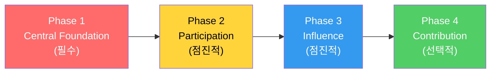
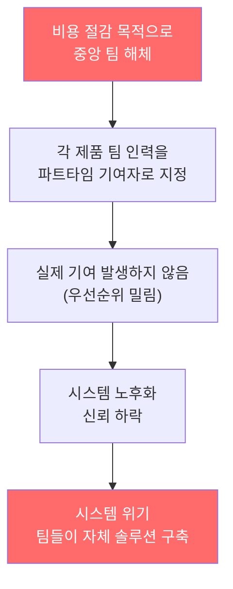

# The Fallacy of Federated Model

import DevQuickStart from '@site/src/components/DevQuickStart';

<DevQuickStart
  what="연합형(Federated) 디자인 시스템은 단독으로 성공한 사례가 0%이며, 중앙 팀이 반드시 선행되어야 합니다"
  learn="연합형의 6가지 치명적 신화, 올바른 4단계 접근법, CONTRIBUTING.md 작성법, PR 리뷰 체크리스트"
  able="디자인 시스템 기여 프로세스를 설계하고 CONTRIBUTING.md를 작성할 수 있습니다"
/>

## 핵심 메시지

> **"Zero. Zero. Zero percent [of design systems thrived without centrally allocated people]."**
> -- Nathan Curtis, 80개 이상 조직 컨설팅 결과

- **연합형은 선택지가 아니라 중앙형의 보완 요소** - 단독으로는 성공 사례 0%
- **올바른 접근**: Central Team 먼저 → Federated Layer 점진적 추가

## 연합형의 6가지 치명적 신화

### Myth 1: "모든 사람이 기여할 수 있고, 해야 하고, 할 것이다"

**현실**: 거의 아무도 의미 있는 기여를 하지 않습니다. 제품 팀 우선순위에 밀려 시스템 기여는 뒷전입니다.

### Myth 2: "만들어진 모든 컴포넌트는 시스템에 들어간다"

**현실**: 시스템은 **널리 공유된 니즈**만 다룹니다. 대부분의 UI는 특정 제품용입니다.

### Myth 3: "UI를 만드는 사람은 누구나 기여 역량이 있다"

**현실**: 시스템 작업은 일반 제품 디자인과 다른 스킬셋을 요구합니다(공유 니즈 분석, API 설계, 고품질 에셋).

### Myth 4: "모든 구성 수준의 컴포넌트가 환영받는다"

**현실**: 시스템은 주로 저수준 UI 컴포넌트 라이브러리입니다. 고수준 합성은 제품 팀이 자체 제작합니다.

### Myth 5: "연합형 기여가 주요 성공 지표다"

**현실**: 핵심 목표는 라이브러리 제작 및 사용 활성화입니다. 기여는 부차적입니다.

### Myth 6: "연합형은 디자인 시스템을 공짜로 준다"

**현실**: 플랫폼 구축, 큐레이션, 품질 관리에 상당한 투자가 필요합니다.

## 올바른 4단계 접근법



**Phase 1**: 전담 인력 배치, 핵심 인프라 구축, 기본 컴포넌트 라이브러리 완성

**Phase 2**: 사용자 피드백 수집, 커뮤니티 채널 구축

**Phase 3**: 거버넌스 프로세스 수립, 우선순위 협의 구조 마련

**Phase 4**: 기여 플랫폼 구축, 큐레이션 리소스 배정, ROI 검증

## CONTRIBUTING.md 예시

Phase 4에 도달했을 때 사용할 기여 가이드입니다:

```markdown
# Contributing to @company/design-system

We welcome contributions! Please read this guide before submitting.

## What We Accept

| Type | Status | Notes |
|------|--------|-------|
| Bug fixes | Accepted | Include test + screenshot |
| Documentation | Accepted | Typos, examples, translations |
| New variants | Review required | Must serve 3+ products |
| New components | Review required | RFC process required |
| Major refactors | Not accepted | Core team only |

## Getting Started

1. Fork and clone the repository
2. Install dependencies:
   ```bash
   git clone https://github.com/company/design-system.git
   cd design-system
   npm install
   ```

3. Create a feature branch:
   ```bash
   git checkout -b feat/button-icon-variant
   ```

4. Make your changes following our coding standards
5. Run the quality checks:
   ```bash
   npm run lint          # ESLint + Prettier
   npm run typecheck     # TypeScript checks
   npm test              # Unit tests
   npm run test:a11y     # Accessibility tests
   npm run build         # Build verification
   ```

6. Add a changeset:
   ```bash
   npx changeset
   ```

7. Submit a Pull Request

## Component Contribution Checklist

Before submitting a new component or variant:

- [ ] **Shared need**: 3+ products need this (list them in PR description)
- [ ] **API alignment**: Props follow existing naming conventions
- [ ] **TypeScript**: Full type definitions with JSDoc comments
- [ ] **Tests**: Unit tests with >80% coverage
- [ ] **Accessibility**: WCAG 2.1 AA compliant, tested with axe
- [ ] **Storybook**: Stories for all variants and states
- [ ] **Responsive**: Works at all breakpoints (375px - 1440px)
- [ ] **Changeset**: Added via `npx changeset`

## Coding Standards

- Use `kebab-case` for CSS class names: `.ds-button--primary`
- Use `PascalCase` for component names: `ButtonGroup`
- Use `camelCase` for props: `isDisabled`, `onClick`
- Prefix internal utilities with underscore: `_calculatePosition`

## RFC Process (New Components)

For new components, open an RFC issue first:

1. **Problem**: What user need does this solve?
2. **Proposal**: Proposed API with code examples
3. **Alternatives**: What other approaches were considered?
4. **Adoption**: Which products will use this? (minimum 3)

RFCs are discussed for 2 weeks before approval.
```

## PR Review Checklist

PR 리뷰어가 확인해야 할 항목을 코드 형식으로 정리합니다:

```markdown
## Design System PR Review Checklist

### API Design
- [ ] Props naming follows existing conventions (`is*` for boolean, `on*` for handlers)
- [ ] No breaking changes to existing props
- [ ] Default values are sensible and documented
- [ ] TypeScript types are exported and complete

### Code Quality
- [ ] No `any` types
- [ ] No inline styles (use CSS custom properties or CSS modules)
- [ ] No hardcoded colors/spacing (use design tokens)
- [ ] Error handling for edge cases (null, undefined, empty)

### Accessibility
- [ ] Semantic HTML elements used
- [ ] ARIA attributes correct and complete
- [ ] Keyboard navigation works (Tab, Enter, Escape, Arrow keys)
- [ ] Screen reader tested (or test plan documented)
- [ ] Color contrast meets WCAG AA (4.5:1 text, 3:1 UI)

### Testing
- [ ] Unit tests cover happy path and edge cases
- [ ] Visual regression snapshot updated (if applicable)
- [ ] No skipped or `.only` tests

### Documentation
- [ ] Storybook stories added/updated
- [ ] JSDoc comments on public API
- [ ] Changeset included with appropriate version bump
```

## 개발자가 주의해야 할 Red Flags

디자인 시스템이 실패하고 있을 때 나타나는 경고 신호입니다:

```typescript
// Red Flag 1: 시스템 버전이 6개월째 업데이트 없음
// package.json
{
  "@company/design-system": "^1.2.0"  // published 8 months ago
}

// Red Flag 2: 동일 컴포넌트의 로컬 복사본이 존재
// src/components/Button.tsx  ← 로컬 복사본
// node_modules/@company/design-system/Button  ← 시스템 원본

// Red Flag 3: 시스템 컴포넌트를 감싸는 래퍼가 점점 비대해짐
function WrappedButton(props) {
  // 200줄의 래퍼 코드 = 시스템이 니즈를 충족하지 못하는 신호
  return <DSButton {...hackedProps} className={overrideStyles} />;
}

// Red Flag 4: !important로 시스템 스타일 덮어쓰기
.my-page .ds-button {
  background-color: #333 !important; /* 시스템과 전쟁 중 */
  padding: 20px !important;
}
```

### Red Flag 발견 시 행동 가이드

| Red Flag | 원인 | 행동 |
|----------|------|------|
| 6개월+ 미업데이트 | 메인테이너 부재 | 시스템 팀에 상태 문의 |
| 로컬 복사본 | 시스템 부족한 기능 | Feature Request 제출 |
| 비대한 래퍼 | API 미스매치 | RFC로 API 개선 제안 |
| `!important` 남발 | 스타일 충돌 | CSS 커스텀 프로퍼티 논의 |

## 전형적인 실패 경로



## 성공 사례: Atlassian

- **Atlaskit Editor**: 커뮤니티 주도로 major v197까지 발전
- **핵심 전략**: Editor는 별도 관심사로 분리, 핵심 시스템은 기여 제한
  - "We are currently accepting ... **fixes** ..."
  - "At this time, we are unable to take [enhancement and new component] contributions."
- **이유**: 널리 공유된 니즈 우선, 품질 보장, 병목 방지

## 실무 체크리스트

**중앙 팀 역할 (필수)**:
- [ ] 전담 디자이너/개발자 배치
- [ ] 아키텍처 소유권 확보
- [ ] 핵심 컴포넌트 100% 제작 및 유지보수
- [ ] CONTRIBUTING.md 작성 및 유지
- [ ] 릴리스 및 버전 관리

**위험 신호 모니터링**:
- [ ] 중앙 팀 해체 계획이 있으면 즉시 경고
- [ ] 파트타임 기여자에게 시스템 책임 할당 중이면 위험
- [ ] "모든 사람이 기여할 것"이라는 가정이 있으면 반박
- [ ] 플랫폼 구축/유지 비용 과소평가 시 실제 데이터 제시

---

import CrossRef from '@site/src/components/CrossRef';

<CrossRef related={[
  { path: "/07-governance-operations/01-core-principles-governance", label: "07-01. 핵심 원칙 & 거버넌스" },
  { path: "/07-governance-operations/03-디자인-시스템-지원-워크플로우", label: "07-03. 지원 워크플로우" },
  { path: "/08-scaling-architecture/03-managing-multiple-core-libraries", label: "08-03. 다중 코어 라이브러리 관리" },
]} />

*출처: Nathan Curtis (EightShapes) - The Fallacy of Federated Design Systems*
