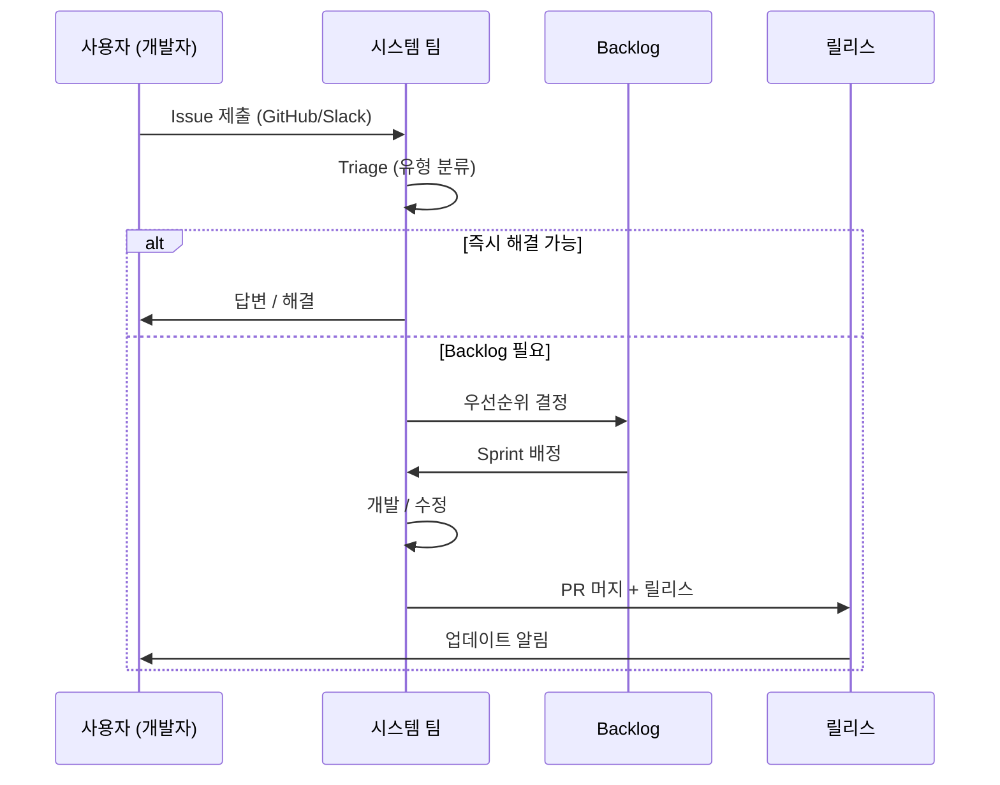

# 디자인 시스템 지원 워크플로우

import DevQuickStart from '@site/src/components/DevQuickStart';

<DevQuickStart
  what="디자인 시스템 팀은 사용자 요청을 체계적으로 접수, 분류, 해결하는 지원 워크플로우가 필요합니다"
  learn="GitHub Issue 템플릿 작성법, 지원 워크플로우 설계, SLA 설정, 케이스 분류 체계"
  able="GitHub Issue 템플릿과 지원 워크플로우를 구축하여 디자인 시스템 사용자 지원을 체계화할 수 있습니다"
/>

## Support의 정의

디자인 시스템이 고객의 요청과 문제를 건별로 **접수(intake) → 분류(triage) → 라우팅(route) → 할당(assign) → 해결(resolve)** 하는 방식입니다.



## GitHub Issue 템플릿

### Bug Report 템플릿

```yaml
# .github/ISSUE_TEMPLATE/bug-report.yml
name: Bug Report
description: Report a bug in a design system component
title: "[Bug]: "
labels: ["bug", "triage"]
assignees: []
body:
  - type: markdown
    attributes:
      value: |
        Thanks for reporting a bug! Please fill out the information below.

  - type: dropdown
    id: component
    attributes:
      label: Component
      description: Which component is affected?
      options:
        - Button
        - Card
        - Checkbox
        - Input
        - Modal
        - Select
        - Tooltip
        - Other
    validations:
      required: true

  - type: input
    id: version
    attributes:
      label: Package Version
      description: "Run `npm ls @company/design-system` to find this"
      placeholder: "e.g., 3.2.1"
    validations:
      required: true

  - type: textarea
    id: description
    attributes:
      label: Bug Description
      description: A clear description of what the bug is
      placeholder: "When I click the Button with variant='ghost', the hover state..."
    validations:
      required: true

  - type: textarea
    id: reproduction
    attributes:
      label: Steps to Reproduce
      description: Steps to reproduce the behavior
      value: |
        1. Import `<Button>` from '@company/design-system'
        2. Set `variant="ghost"`
        3. Click on '...'
        4. See error
    validations:
      required: true

  - type: textarea
    id: expected
    attributes:
      label: Expected Behavior
      description: What did you expect to happen?
    validations:
      required: true

  - type: textarea
    id: screenshots
    attributes:
      label: Screenshots
      description: If applicable, add screenshots

  - type: dropdown
    id: browsers
    attributes:
      label: Browser(s)
      description: In which browsers did you see this?
      multiple: true
      options:
        - Chrome
        - Firefox
        - Safari
        - Edge
        - Mobile Safari
        - Mobile Chrome

  - type: dropdown
    id: severity
    attributes:
      label: Severity
      description: How critical is this bug?
      options:
        - "Critical: Blocks production"
        - "High: Major feature broken"
        - "Medium: Workaround available"
        - "Low: Minor visual issue"
    validations:
      required: true
```

### Feature Request 템플릿

```yaml
# .github/ISSUE_TEMPLATE/feature-request.yml
name: Feature Request
description: Suggest a new feature or enhancement
title: "[Feature]: "
labels: ["enhancement", "triage"]
body:
  - type: dropdown
    id: type
    attributes:
      label: Request Type
      options:
        - New component
        - New variant/prop for existing component
        - New design token
        - Documentation improvement
        - Developer experience improvement
    validations:
      required: true

  - type: textarea
    id: problem
    attributes:
      label: Problem Statement
      description: What problem does this solve?
      placeholder: "Currently there is no way to..."
    validations:
      required: true

  - type: textarea
    id: proposal
    attributes:
      label: Proposed Solution
      description: How should this work? Include code examples if possible.
      value: |
        ```tsx
        // Proposed API
        <Component newProp="value">
          Content
        </Component>
        ```
    validations:
      required: true

  - type: textarea
    id: shared-need
    attributes:
      label: Shared Need
      description: Which products/teams need this? (minimum 2 for consideration)
      placeholder: |
        - Product A: needs this for checkout flow
        - Product B: needs this for settings page

  - type: dropdown
    id: urgency
    attributes:
      label: Timeline
      options:
        - "This week (blocking)"
        - "This month"
        - "This quarter"
        - "No rush"
    validations:
      required: true
```

## 케이스 유형별 대응 전략

### 즉시 대응 필요 (Immediate Response)

| 케이스 유형 | 설명 | 대응 시간 | 이유 |
|------------|------|----------|------|
| **Get Help** | 시스템 기능 사용법 질문 | 즉시 | 작업 차단 가능 |
| **Defect** | 버그, 예상치 못한 동작 | 즉시 | 프로덕션 영향 |
| **Review Request** | 규정 준수 검토 요청 | 즉시 | 릴리스 차단 가능 |

### 숙고 필요 (Requires Deliberation)

| 케이스 유형 | 설명 | 핵심 질문 |
|------------|------|----------|
| **Feature Request** | 시스템에 없는 기능 요청 | "언제까지 필요한가?" |
| **Contribution** | 외부 기여 제안 | "다른 팀도 필요한가?" |
| **Training** | 교육/온보딩 요청 | "개인? 팀? 대규모?" |

## 채널 전략

| 채널 | 장점 | 단점 | 최적 용도 |
|------|------|------|----------|
| **Slack/Teams** | 가장 빠른 응답 | 추적 어려움 | Help, 간단한 질문 |
| **GitHub Issues** | 추적 용이, 코드 참조 가능 | 진입장벽 있음 | Bug, Feature |
| **Email** | 공식적, 기록 남음 | 느림 | 공식 요청 |

### Slack 메시지 포맷

디자인 시스템 Slack 채널에서 이슈를 보고할 때 사용하는 표준 포맷입니다:

```markdown
**[Bug/Feature/Help]** Component Name - 한줄 요약

**버전**: @company/design-system@3.2.1
**환경**: Chrome 120, macOS
**재현 단계**:
1. ...
2. ...

**스크린샷**: (있으면 첨부)

**긴급도**: [Blocking / 이번 Sprint / 급하지 않음]
```

## SLA (Service Level Agreement) 설정

| 우선순위 | 첫 응답 | 해결 목표 | 예시 |
|---------|---------|----------|------|
| **P0: Critical** | 1시간 | 24시간 | 프로덕션 장애, 보안 취약점 |
| **P1: High** | 4시간 | 1주 | 주요 기능 결함 |
| **P2: Medium** | 1일 | 2주 | 개선 사항, 시각적 결함 |
| **P3: Low** | 3일 | 다음 릴리스 | 문서 수정, 사소한 요청 |

## 기대치 관리

**잘못된 기대**: "다음 주까지 프로덕션에 배포"

**올바른 응답**: "긴급성을 고려하면, 제품 내에서 로컬로 만드는 게 최선입니다."

> 디자인 시스템은 장기적 관점에서 운영됩니다. 빠른 응답 워크플로우는 복잡한 기능을 하루 만에 출시하는 것이 아닙니다.

## 역할 분담

| 옵션 | 장점 | 단점 | 추천 |
|------|------|------|------|
| **한 사람** | 효율적, 일관된 응답 | 단일 장애점, 번아웃 | 소규모 팀 |
| **서브셋 (2-3명)** | 백업 가능, 전문성 분배 | 조율 필요 | 권장 |
| **팀 전원** | 가장 빠른 응답 | 혼돈, crosstalk 위험 | 비추천 |

**"The Swarm" 방지**: 2명 이상이 동시 응답하면 상충되는 조언이 발생합니다. 비공개 백채널에서 팀원들이 조율 후 한 명이 대표 응답합니다.

## 실무 체크리스트

### 지원 시작 전 준비
- [ ] GitHub Issue 템플릿 설정 (Bug, Feature)
- [ ] 공식 채널 선택 (Slack + GitHub Issues 권장)
- [ ] SLA 결정 및 공개
- [ ] Triage 시간/장소 결정 (Daily standup 권장)
- [ ] 역할 분담 (서브셋 2-3명 권장)
- [ ] Slack 메시지 포맷 공유

### 지원 운영 중 점검
- [ ] 응답 시간 SLA 준수 확인
- [ ] 채널별 모니터링
- [ ] "The Swarm" 방지 (백채널 조율)
- [ ] 즉시 해결 케이스 인정 (시간 소요 계획)
- [ ] 팀원 번아웃 방지 (순환 근무 고려)

---

import CrossRef from '@site/src/components/CrossRef';

<CrossRef related={[
  { path: "/07-governance-operations/01-core-principles-governance", label: "07-01. 핵심 원칙 & 거버넌스" },
  { path: "/07-governance-operations/02-the-fallacy-of-federated-model", label: "07-02. 연합형의 오류" },
  { path: "/07-governance-operations/04-서브태스크-분해-방법론", label: "07-04. 서브태스크 분해 방법론" },
]} />

*출처: Nathan Curtis (EightShapes)*
