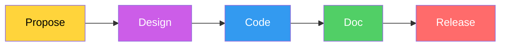

# 서브태스크 분해 방법론

import DevQuickStart from '@site/src/components/DevQuickStart';

<DevQuickStart
  what="디자인 시스템 컴포넌트 개발을 Propose → Design → Code → Doc 단계로 분해하여 품질을 보장합니다"
  learn="Phase별 서브태스크 체크리스트, TypeScript API 초안 작성법, Git 워크플로우, 컴포넌트 구축 실전 예시"
  able="새 컴포넌트를 체계적으로 개발하고 각 단계에서 필요한 명령어와 산출물을 알 수 있습니다"
/>

## 문제 정의

디자인 시스템 개발 시 상위 단계(Propose, Design, Code, Doc)는 정의되어 있지만, 팀원들마다 "완료" 기준이 달라 결과물의 품질이 불안정합니다.

**해결책**: 각 단계를 **Phase(단계)**로 분해하고, Phase별 **Subtask(서브태스크)** 체크리스트를 제공합니다.

## Step → Phase → Subtask 구조



### 6가지 공통 Phase

| Phase | 설명 | 비중 |
|-------|------|------|
| **START** | 파일 설정, 재사용 가능한 것들 감사 | ~10% |
| **COMPOSE** | 실제 "작업"을 수행하는 핵심 단계 | ~40% |
| **TEST** | 품질 기준에 따라 검증 | ~15% |
| **PRESENT** | 커뮤니티와 대면 논의 | ~10% |
| **REVIEW** | 동료 검토, 피드백 및 수정 | ~15% |
| **DELIVER** | 최종 편집, 다음 단계 준비 | ~10% |

## 실전 워크스루: Checkbox 컴포넌트 구축

### Step 1: Propose

#### START - 요구사항 발견

```bash
# 기존 코드에서 checkbox 패턴 감사
grep -r "checkbox\|check-box\|Checkbox" --include="*.tsx" src/ | wc -l
# → 47 occurrences across 12 products

# 기존 구현 방식 확인
grep -rn "type=\"checkbox\"" --include="*.tsx" src/ | head -10
```

#### COMPOSE - 범위 작성 (RFC)

```markdown
## RFC: Checkbox Component

### Problem
47 instances of ad-hoc checkbox implementations across 12 products.
No shared keyboard navigation, inconsistent label placement,
3 different indeterminate state implementations.

### Scope (MoSCoW)
- **Must**: checked, unchecked, indeterminate states
- **Must**: label text, disabled state
- **Should**: error state with message
- **Could**: group component (CheckboxGroup)
- **Won't**: toggle switch behavior (separate component)

### Dependencies
- @company/tokens (color, spacing)
- @company/icons (check mark, minus)
```

### Step 2: Design

*(디자이너 주도 - 개발자는 API 리뷰에 참여)*

### Step 3: Code

#### START - 프로젝트 세팅

```bash
# 1. 브랜치 생성
git checkout -b feat/checkbox-component

# 2. 파일 구조 생성
mkdir -p packages/core-ui/src/Checkbox
touch packages/core-ui/src/Checkbox/index.ts
touch packages/core-ui/src/Checkbox/Checkbox.tsx
touch packages/core-ui/src/Checkbox/Checkbox.test.tsx
touch packages/core-ui/src/Checkbox/Checkbox.stories.tsx
touch packages/core-ui/src/Checkbox/Checkbox.module.css
```

#### COMPOSE - API 초안 작성 및 리뷰

```typescript
// packages/core-ui/src/Checkbox/Checkbox.tsx

import { forwardRef, useId } from 'react';
import type { InputHTMLAttributes } from 'react';
import styles from './Checkbox.module.css';

export interface CheckboxProps
  extends Omit<InputHTMLAttributes<HTMLInputElement>, 'type' | 'size'> {
  /** Checkbox label text */
  label: string;

  /** Visual checked state (controlled) */
  checked?: boolean;

  /** Indeterminate state (partially selected group) */
  indeterminate?: boolean;

  /** Error message to display below checkbox */
  error?: string;

  /** Size variant */
  size?: 'sm' | 'md' | 'lg';

  /** Called when checked state changes */
  onCheckedChange?: (checked: boolean) => void;
}

export const Checkbox = forwardRef<HTMLInputElement, CheckboxProps>(
  (
    {
      label,
      checked,
      indeterminate = false,
      error,
      size = 'md',
      disabled = false,
      onCheckedChange,
      className,
      id: providedId,
      ...props
    },
    ref
  ) => {
    const generatedId = useId();
    const id = providedId ?? generatedId;
    const errorId = error ? `${id}-error` : undefined;

    return (
      <div
        className={`${styles.wrapper} ${styles[size]} ${className ?? ''}`}
        data-disabled={disabled || undefined}
        data-error={!!error || undefined}
      >
        <input
          ref={ref}
          type="checkbox"
          id={id}
          checked={checked}
          disabled={disabled}
          aria-invalid={!!error}
          aria-describedby={errorId}
          className={styles.input}
          onChange={(e) => onCheckedChange?.(e.target.checked)}
          {...props}
        />
        <label htmlFor={id} className={styles.label}>
          {label}
        </label>
        {error && (
          <p id={errorId} className={styles.error} role="alert">
            {error}
          </p>
        )}
      </div>
    );
  }
);

Checkbox.displayName = 'Checkbox';
```

```css
/* packages/core-ui/src/Checkbox/Checkbox.module.css */
.wrapper {
  display: flex;
  align-items: flex-start;
  gap: var(--space-2);
}

.input {
  appearance: none;
  width: var(--checkbox-size, 20px);
  height: var(--checkbox-size, 20px);
  border: 2px solid var(--color-border);
  border-radius: var(--radius-sm);
  cursor: pointer;
  flex-shrink: 0;
  margin-top: 2px;
}

.input:checked {
  background-color: var(--color-primary);
  border-color: var(--color-primary);
}

.input:focus-visible {
  outline: 2px solid var(--color-focus-ring);
  outline-offset: 2px;
}

.input:disabled {
  opacity: 0.5;
  cursor: not-allowed;
}

.label {
  font-size: var(--font-size-body);
  color: var(--color-text);
  cursor: pointer;
}

[data-disabled] .label {
  cursor: not-allowed;
  color: var(--color-text-muted);
}

.error {
  color: var(--color-error);
  font-size: var(--font-size-sm);
  margin: var(--space-1) 0 0;
  grid-column: 2;
}

/* Size variants */
.sm { --checkbox-size: 16px; }
.md { --checkbox-size: 20px; }
.lg { --checkbox-size: 24px; }
```

#### TEST - 검증

```bash
# 단위 테스트 실행
npm test -- --filter Checkbox

# 접근성 테스트
npm run test:a11y -- --filter Checkbox

# 시각적 회귀 테스트
npm run test:visual -- --filter Checkbox

# 브라우저 테스트
npx playwright test --grep Checkbox

# TypeScript 타입 검증
npx tsc --noEmit
```

```typescript
// packages/core-ui/src/Checkbox/Checkbox.test.tsx
import { render, screen } from '@testing-library/react';
import userEvent from '@testing-library/user-event';
import { axe, toHaveNoViolations } from 'jest-axe';
import { Checkbox } from './Checkbox';

expect.extend(toHaveNoViolations);

describe('Checkbox', () => {
  it('renders with label', () => {
    render(<Checkbox label="Accept terms" />);
    expect(screen.getByLabelText('Accept terms')).toBeInTheDocument();
  });

  it('calls onCheckedChange when clicked', async () => {
    const onChange = vi.fn();
    render(<Checkbox label="Test" onCheckedChange={onChange} />);
    await userEvent.click(screen.getByLabelText('Test'));
    expect(onChange).toHaveBeenCalledWith(true);
  });

  it('shows error message with correct ARIA', () => {
    render(<Checkbox label="Test" error="Required field" />);
    const input = screen.getByLabelText('Test');
    expect(input).toHaveAttribute('aria-invalid', 'true');
    expect(screen.getByRole('alert')).toHaveTextContent('Required field');
  });

  it('is disabled when disabled prop is true', () => {
    render(<Checkbox label="Test" disabled />);
    expect(screen.getByLabelText('Test')).toBeDisabled();
  });

  it('has no accessibility violations', async () => {
    const { container } = render(<Checkbox label="Test" />);
    expect(await axe(container)).toHaveNoViolations();
  });
});
```

#### PRESENT / REVIEW

```bash
# Storybook에서 모든 상태 확인 후 팀 발표
npm run storybook

# PR 생성
git add .
git commit -m "feat(checkbox): implement Checkbox component

- checked, unchecked, indeterminate states
- error state with accessible error message
- sm/md/lg size variants
- full keyboard navigation
- WCAG 2.1 AA compliant"

# changeset 추가
npx changeset
# → @company/core-ui: minor
# → Add Checkbox component with accessible states and size variants

git push origin feat/checkbox-component
gh pr create --title "feat(core-ui): add Checkbox component" \
  --body "Closes #123. RFC: #100."
```

#### DELIVER

```bash
# PR 머지 후 릴리스
git checkout main
git pull origin main

# 자동 릴리스 (CI에서)
npx changeset version
npx changeset publish

# 또는 수동 태그
git tag @company/core-ui@3.3.0
git push --tags
```

### Step 4: Doc

```bash
# 문서 파일 생성
touch apps/docs/content/components/checkbox.mdx
```

```tsx
// Storybook 스토리 (문서 겸용)
// packages/core-ui/src/Checkbox/Checkbox.stories.tsx
import type { Meta, StoryObj } from '@storybook/react';
import { Checkbox } from './Checkbox';

const meta: Meta<typeof Checkbox> = {
  title: 'Components/Checkbox',
  component: Checkbox,
  tags: ['autodocs'],
  argTypes: {
    size: { control: 'select', options: ['sm', 'md', 'lg'] },
  },
};
export default meta;

type Story = StoryObj<typeof Checkbox>;

export const Default: Story = {
  args: { label: 'Accept terms and conditions' },
};

export const WithError: Story = {
  args: { label: 'Accept terms', error: 'You must accept the terms' },
};

export const Sizes: Story = {
  render: () => (
    <div style={{ display: 'flex', flexDirection: 'column', gap: 12 }}>
      <Checkbox label="Small checkbox" size="sm" />
      <Checkbox label="Medium checkbox (default)" size="md" />
      <Checkbox label="Large checkbox" size="lg" />
    </div>
  ),
};

export const Disabled: Story = {
  args: { label: 'Disabled checkbox', disabled: true, checked: true },
};
```

## 담당자 배정 가이드

| 상황 | 담당 범위 |
|------|----------|
| **시스템 팀 개발자** | 모든 단계 직접 수행 (REVIEW만 타인) |
| **외부 기여 개발자** | START, COMPOSE는 본인. TEST/PRESENT는 파트너. REVIEW/DELIVER는 시스템 팀 |

## 핵심 인사이트

1. **체크리스트가 주는 가치**: 견고성, 품질, 신뢰 획득
2. **균형의 중요성**: 처음에는 Phase 1-2개만 추가하고 점진적으로 성장
3. **Phase별 시간 분배**: COMPOSE (40%), TEST/REVIEW (각 15%), 나머지 (각 10%)
4. **성공 지표**: 모든 팀원이 "완료" 정의를 동일하게 이해, 외부 기여자가 가이드 없이 작업 가능

## 실무 체크리스트

- [ ] Step별 Phase 정의 (최소 START + COMPOSE + TEST)
- [ ] Phase별 서브태스크 체크리스트 작성
- [ ] 담당자 배정 모델 결정
- [ ] 도구에 서브태스크 통합 (Jira/GitHub Issues 체크리스트)
- [ ] 작은 작업(버그 수정)에는 축소된 체크리스트 사용
- [ ] 외부 기여자용 가이드 작성

---

import CrossRef from '@site/src/components/CrossRef';

<CrossRef related={[
  { path: "/07-governance-operations/01-core-principles-governance", label: "07-01. 핵심 원칙 & 거버넌스" },
  { path: "/07-governance-operations/02-the-fallacy-of-federated-model", label: "07-02. CONTRIBUTING.md 예시" },
  { path: "/09-versioning-releases/01-versioning-design-systems---communicating-change", label: "09-01. 버전 관리" },
]} />

*출처: Nathan Curtis (EightShapes)*
