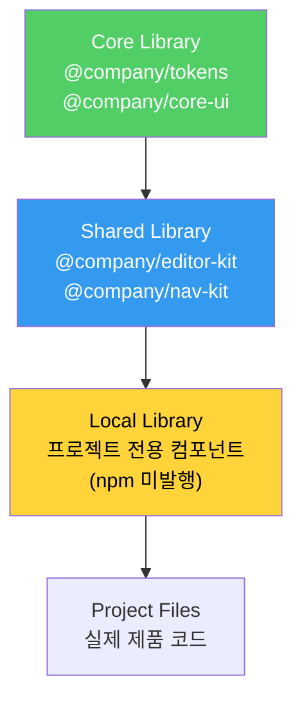
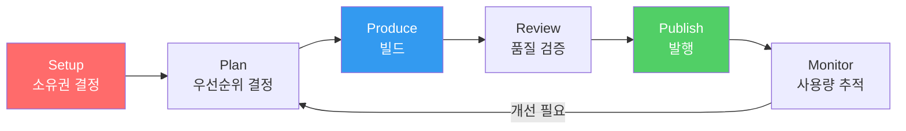

# Figma Shared Libraries - 확장 전략

import DevQuickStart from '@site/src/components/DevQuickStart';

<DevQuickStart
  what="Figma 라이브러리는 Core → Shared → Local 계층으로 확장되며, 개발자에게는 npm 패키지 구조와 매핑됩니다"
  learn="Figma 라이브러리 생명주기, Figma Variables → CSS 변환, Style Dictionary 설정, 패키지 구조 매핑"
  able="Figma Variables를 CSS custom properties로 자동 변환하는 파이프라인을 구축할 수 있습니다"
/>

## 라이브러리 계층 구조



### Figma ↔ npm 패키지 매핑

| Figma 라이브러리 | npm 패키지 | 설명 |
|-----------------|-----------|------|
| ESDS Core | `@company/core-ui` | 핵심 컴포넌트 |
| ESDS Tokens | `@company/tokens` | 디자인 토큰 |
| ESDS Editor | `@company/editor-kit` | 에디터 컴포넌트 |
| ESDS Navigation | `@company/nav-kit` | 내비게이션 |
| MyTeam Local | (미발행) | 팀 내부 전용 |

## Developer Bridge: Figma → Code 파이프라인

### Figma Variables → CSS Custom Properties

Figma의 Variables 기능은 디자인 토큰과 직접 매핑됩니다:

```json
// figma-variables-export.json (Figma Variables API에서 추출)
{
  "colors": {
    "primary": { "light": "#6B47DC", "dark": "#9B7DEF" },
    "secondary": { "light": "#339AF0", "dark": "#74C0FC" },
    "background": { "light": "#FFFFFF", "dark": "#1A1A2E" },
    "text": { "light": "#1A1A2E", "dark": "#F8F9FA" }
  },
  "spacing": {
    "xs": "4px",
    "sm": "8px",
    "md": "16px",
    "lg": "24px",
    "xl": "32px"
  },
  "radius": {
    "sm": "4px",
    "md": "8px",
    "lg": "16px",
    "full": "9999px"
  }
}
```

### Style Dictionary 설정 (Figma Token Sync)

```javascript
// style-dictionary.config.js
const StyleDictionary = require('style-dictionary');

module.exports = {
  source: ['tokens/**/*.json'],
  platforms: {
    // CSS Custom Properties
    css: {
      transformGroup: 'css',
      buildPath: 'dist/css/',
      files: [
        {
          destination: 'variables.css',
          format: 'css/variables',
          options: { outputReferences: true },
        },
        {
          destination: 'variables-dark.css',
          format: 'css/variables',
          filter: (token) => token.filePath.includes('dark'),
          options: {
            selector: '[data-theme="dark"]',
          },
        },
      ],
    },
    // JavaScript/TypeScript
    js: {
      transformGroup: 'js',
      buildPath: 'dist/js/',
      files: [
        {
          destination: 'tokens.ts',
          format: 'javascript/es6',
        },
      ],
    },
    // iOS (Swift)
    ios: {
      transformGroup: 'ios-swift',
      buildPath: 'dist/ios/',
      files: [
        {
          destination: 'Tokens.swift',
          format: 'ios-swift/class.swift',
          className: 'DesignTokens',
        },
      ],
    },
  },
};
```

### 생성된 CSS 출력

```css
/* dist/css/variables.css - 자동 생성 */
:root {
  /* Colors */
  --color-primary: #6B47DC;
  --color-secondary: #339AF0;
  --color-background: #FFFFFF;
  --color-text: #1A1A2E;

  /* Spacing */
  --space-xs: 4px;
  --space-sm: 8px;
  --space-md: 16px;
  --space-lg: 24px;
  --space-xl: 32px;

  /* Radius */
  --radius-sm: 4px;
  --radius-md: 8px;
  --radius-lg: 16px;
  --radius-full: 9999px;
}

/* dist/css/variables-dark.css */
[data-theme="dark"] {
  --color-primary: #9B7DEF;
  --color-secondary: #74C0FC;
  --color-background: #1A1A2E;
  --color-text: #F8F9FA;
}
```

### 자동화 파이프라인

```yaml
# .github/workflows/sync-tokens.yml
name: Sync Figma Tokens

on:
  # Figma webhook 또는 수동 실행
  workflow_dispatch:
  schedule:
    - cron: '0 9 * * 1' # 매주 월요일

jobs:
  sync:
    runs-on: ubuntu-latest
    steps:
      - uses: actions/checkout@v4

      - name: Extract Figma Variables
        run: |
          npx figma-variables-export \
            --file-key ${{ secrets.FIGMA_FILE_KEY }} \
            --token ${{ secrets.FIGMA_TOKEN }} \
            --output tokens/

      - name: Build tokens
        run: npx style-dictionary build

      - name: Create PR if changed
        uses: peter-evans/create-pull-request@v6
        with:
          title: 'chore(tokens): sync from Figma Variables'
          body: 'Automated token sync from Figma Variables API'
          branch: chore/sync-figma-tokens
```

## 라이브러리 생명주기



### 역할 및 책임

| 역할 | 수행 가능 작업 |
|------|---------------|
| **Any Contributor** | 디자인, 빌드, 스펙, 문서화 |
| **Library Maintainer** | 승인, 발행, 우선순위 결정 |
| **Core Team** | 명명, 범위 결정, 코어 승격 |

### 네임스페이스 규칙

```
@company/core-ui / Button       → Core 라이브러리
@company/editor-kit / Button    → Shared 라이브러리 (Editor)
@company/sales-ui / Button      → Local 라이브러리 (Sales)
```

## 공유 라이브러리 유형

| 유형 | 예시 | npm 패키지 |
|------|------|-----------|
| **복잡한 기능** | Editor, Navigation | `@company/editor-kit` |
| **플랫폼별** | iOS Nav, Android Components | `@company/ios-nav` |
| **프레임워크별** | React, Vue, Web Components | `@company/react-ui` |

## 실무 체크리스트

- [ ] Figma Variables → JSON 추출 도구 설정
- [ ] Style Dictionary 설정 (CSS + JS + iOS/Android)
- [ ] CI에서 토큰 sync 자동화 (weekly 또는 webhook)
- [ ] Figma 라이브러리와 npm 패키지 1:1 매핑 문서화
- [ ] 네임스페이스 규칙 수립 및 중앙 관리
- [ ] 라이브러리 Maintainer 지정

---

import CrossRef from '@site/src/components/CrossRef';

<CrossRef related={[
  { path: "/08-scaling-architecture/01-design-system-tiers---maturity-levels-for-scalable-systems", label: "08-01. Tier 아키텍처" },
  { path: "/08-scaling-architecture/03-managing-multiple-core-libraries", label: "08-03. 다중 코어 라이브러리" },
  { path: "/01-design-tokens/01-디자인-토큰-10가지-핵심-팁", label: "01-01. 디자인 토큰 핵심 팁" },
]} />

*출처: Nathan Curtis (EightShapes), 2022-05*
