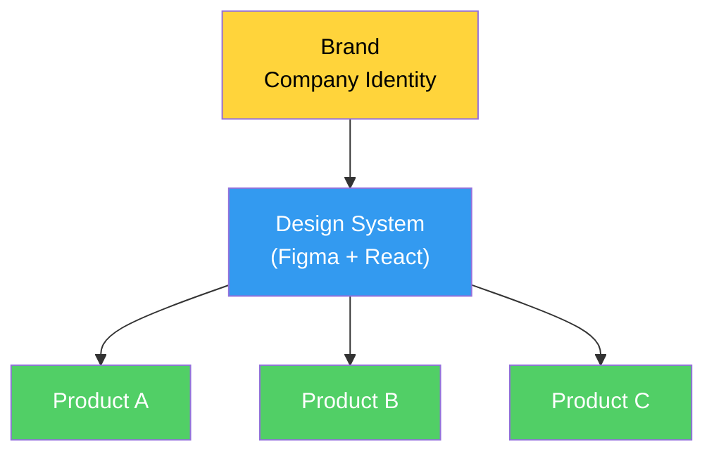
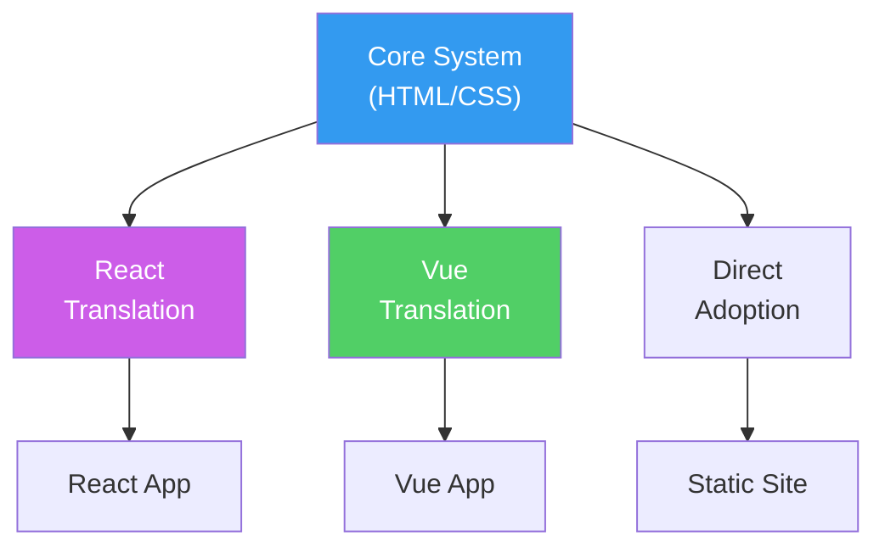
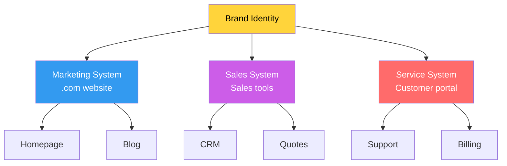
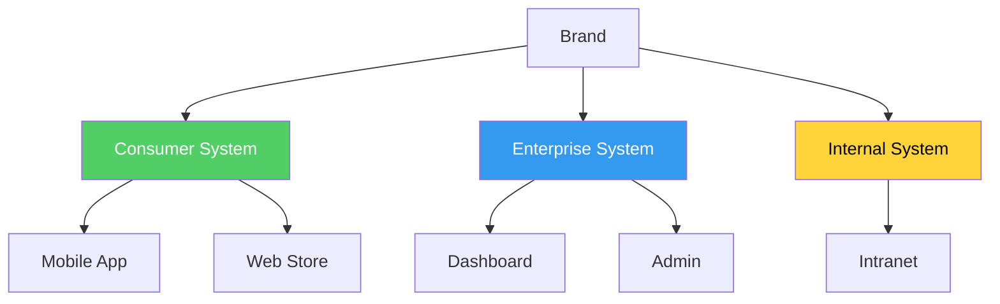
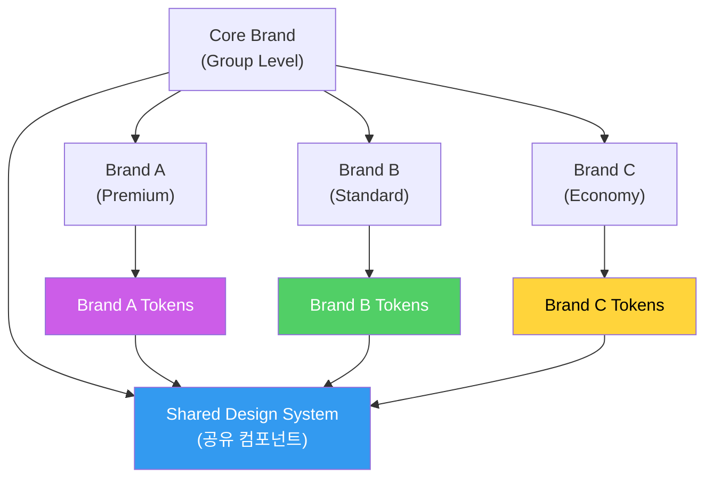
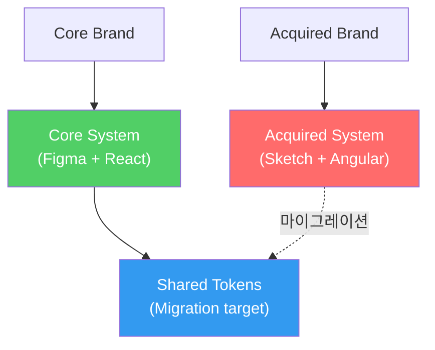

# 아키텍처 다이어그램 - 시각적 어휘

import DevQuickStart from '@site/src/components/DevQuickStart';

<DevQuickStart
  what="디자인 시스템 생태계를 시각적 심볼로 매핑하여 이해관계자에게 빠르게 전달합니다"
  learn="6가지 아키텍처 다이어그램 유형, Mermaid 다이어그램 작성법, npm 의존성 트리 시각화"
  able="조직의 디자인 시스템 생태계를 Mermaid 다이어그램으로 시각화할 수 있습니다"
/>

## 시각적 심볼 체계

| 심볼 | 의미 | 설명 |
|------|------|------|
| ◆ (다이아몬드) | 디자인 시스템 | 비주얼 스타일, UI 컴포넌트, 코드 자산 |
| ● (원형) | 제품/경험 | 디지털 경험 또는 그 일부 |
| ■ (정사각형) | 브랜드 | 색상, 타이포그래피, 일러스트레이션 |
| D (빨강) | 디자인 에셋 | Figma 라이브러리 |
| C (파랑) | 코드 라이브러리 | React, HTML 패키지 |

## 아키텍처 다이어그램 유형

### 1. 단순형 (Simple) - 스타트업, 단일 제품



**npm 의존성 트리:**

```
@company/product-a
  └── @company/design-system@3.2.1

@company/product-b
  └── @company/design-system@3.2.1

@company/product-c
  └── @company/design-system@3.1.0  ← 아직 이전 버전
```

### 2. 중개형 (Intermediary) - 프레임워크 번역 레이어



**npm 의존성 트리:**

```
@company/react-app
  └── @company/react-ui@2.0.0
       └── @company/core-css@3.2.1

@company/vue-app
  └── @company/vue-ui@1.5.0
       └── @company/core-css@3.2.1
```

### 3. 다중 시스템 - 수평형 (고객 여정별)



### 4. 다중 시스템 - 수직형 (고객 유형별)



### 5. 다중 브랜드형 (호텔, 리테일 그룹)



**npm 의존성 트리 (Multi-brand theming):**

```
@group/brand-a-app
  ├── @group/design-system@3.0.0
  └── @group/brand-a-tokens@1.2.0

@group/brand-b-app
  ├── @group/design-system@3.0.0
  └── @group/brand-b-tokens@1.1.0

@group/brand-c-app
  ├── @group/design-system@3.0.0
  └── @group/brand-c-tokens@1.0.0
```

### 6. 확장/인수형 (M&A)



## 다이어그램 작성 가이드

### 작성 전 질문

- [ ] 우리 조직에는 몇 개의 디자인 시스템이 있는가?
- [ ] 각 시스템은 어떤 제품을 지원하는가?
- [ ] 브랜드 아이덴티티는 어디서 관리되는가?
- [ ] 디자인 자산(D)과 코드(C) 중 무엇을 제공하는가?
- [ ] 제품별 시스템 도입 상태는?
- [ ] 조직 경계는 어떻게 나뉘는가?

### 유지보수 주기

| 주기 | 업데이트 내용 |
|------|------------|
| **분기별** | 제품 도입 상태 업데이트 |
| **반기별** | 시스템 기능 검토 |
| **연간** | 조직 구조 변경 반영 |

### 흔한 실수

- 디자인 시스템을 피라미드 꼭대기로 착각 (브랜드가 위)
- 모든 제품을 하나의 원으로 통합 (도입 상태 차이 무시)
- 화살표 남발 (수직 배치로 방향성 충분)
- 다이어그램을 한 번만 그리고 방치 (Living Document 필요)

## 실무 체크리스트

- [ ] 현재 시스템 생태계 Mermaid 다이어그램 작성
- [ ] 제품별 도입 상태 색상으로 표시
- [ ] npm 의존성 트리로 실제 관계 검증
- [ ] 분기별 업데이트 일정 설정
- [ ] 이해관계자 보고에 다이어그램 활용

---

import CrossRef from '@site/src/components/CrossRef';

<CrossRef related={[
  { path: "/08-scaling-architecture/01-design-system-tiers---maturity-levels-for-scalable-systems", label: "08-01. Tier 아키텍처" },
  { path: "/08-scaling-architecture/02-a-design-systems-reach---4-levels-of-system-scope", label: "08-02. 시스템 범위" },
  { path: "/07-governance-operations/01-core-principles-governance", label: "07-01. 핵심 원칙" },
]} />

*출처: Nathan Curtis (EightShapes, 2019)*
