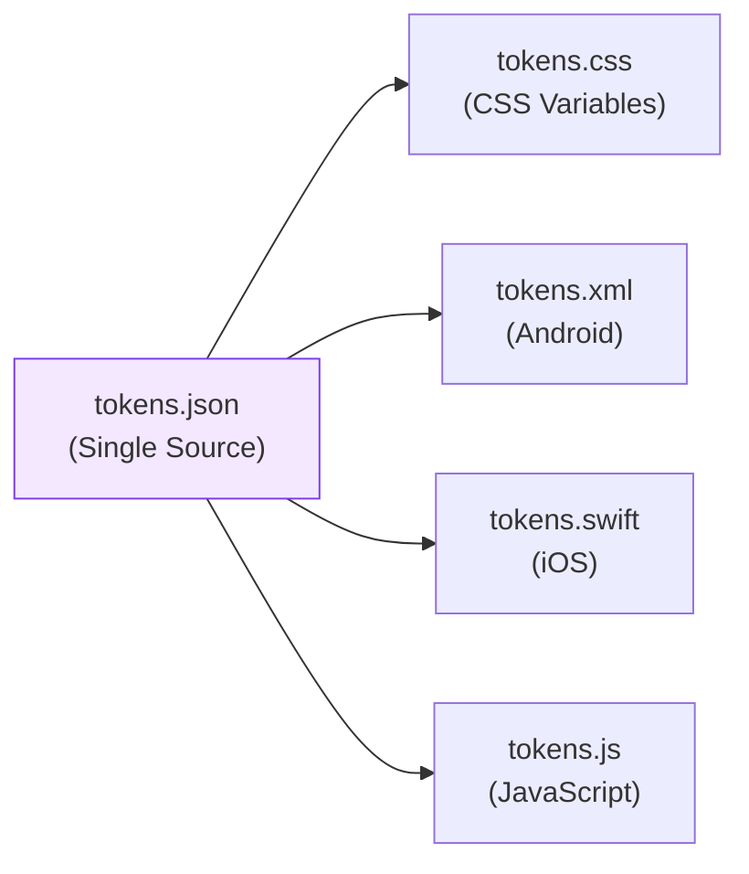

import DevQuickStart from '@site/src/components/DevQuickStart';

<DevQuickStart
  what="Design tokens are the single source of truth for design decisions, stored as platform-agnostic key-value pairs"
  learn="10 practical tips for structuring, naming, and governing design tokens using JSON/YAML and Style Dictionary"
  able="Set up a token architecture that separates options from decisions and generates CSS variables automatically"
/>

## 디자인 토큰 10가지 핵심 팁

### 핵심 개념

**디자인 토큰 = 옵션(Option) + 컨텍스트(Context) → 디자인 결정(Design Decision)**

#### 변수 vs 토큰
```
변수: "어떤 옵션이 있는가?" → $color-neutral-20
토큰: "어떤 선택을 해야 하는가?" → $background-color-dark
```

## 🎯 10가지 토큰 팁

### 아키텍처 (Architecture)

#### #1. 옵션 먼저, 결정은 나중에
```yaml
# 올바른 구조
color:
  neutral-10: "#F7F9FA"
  neutral-20: "#2B303B"

background-color:
  default: "#FFFFFF"
  dark: neutral-20
  disabled: neutral-90
```

#### #2. 색상/폰트로 시작하되, 거기서 멈추지 마라
```yaml
# 확장 가능한 토큰 카테고리
color: {...}
typography: {...}
space: {inset, stack, inline}
size: {icon, input}
border: {radius, width}
duration: {quickly, promptly, slowly}
```

#### #3. 의미 있는 스케일을 사용하라
| 방식 | 예시 | 장점 | 단점 |
|------|------|------|------|
| T-shirt | xs, s, m, l, xl | 직관적 | 중간값 추가 어려움 |
| Geometric | 2, 4, 8, 16, 32 | 수학적 일관성 | 비개발자 이해 어려움 |
| Numeric | 10, 20, 30, 40 | 중간값 쉬움 | 의미 불명확 |

### 거버넌스 (Governance)

#### #4. 기여는 환영하되, 큐레이션하라
- **누구나**: 토큰 제안 가능
- **큐레이터**: 이름 다듬기, 분류 정리, 과도한 확장 방지

#### #5. 컴포넌트에서 토큰으로 승급시켜라
```
1단계: 컴포넌트 개발 시 파일 상단에 로컬 변수
2단계: 코드 리뷰 시 토큰 큐레이터 검토
3단계: tokens.yaml로 승급
```

#### #6. 시스템 변경을 예측 가능하게 관리하라
| 시나리오 | 변수 시대 | 토큰 시대 |
|----------|-----------|-----------|
| 배경색 변경 | `$color-neutral-90` 검색 → 193곳 | `$background-color-disabled` 검색 → 9곳 |

### 구현 (Implementation)

#### #7. JSON으로 재사용 가능하게 만들어라



#### #8. YAML로 쉽게 관리/읽기
```yaml
# YAML의 장점
color:
  neutral-20: "#2B303B"  # 주석 가능

background-color:
  dark: &bg-dark color.neutral-20  # 앵커 사용
```

#### #9. 토큰 데이터로 문서 자동화
```nunjucks

  <div class="color-swatch">
    <div style="background: {{ color.hex }}"></div>
    <p>{{ color.name }}</p>
    <p>AAA 대비: {{ color.contrastScore }}</p>
  </div>

```

#### #10. 디자인 툴에도 토큰 데이터 임베드
| 도구 | 방법 | 예시 |
|------|------|------|
| Figma | Plugin API | Design token importer |
| Sketch | JSON 플러그인 | Color palette sync |

## Style Dictionary 연동 예시

토큰을 JSON으로 정의하고 CSS 변수로 자동 변환하는 워크플로우입니다.

```json title="tokens.json"
{
  "color": {
    "neutral": {
      "10": { "value": "#F7F9FA" },
      "20": { "value": "#2B303B" }
    },
    "background": {
      "default": { "value": "{color.neutral.10}" },
      "dark": { "value": "{color.neutral.20}" }
    }
  },
  "space": {
    "inset": {
      "default": { "value": "16px" },
      "compact": { "value": "8px" }
    }
  }
}
```

```css title="Generated output: tokens.css"
:root {
  --color-neutral-10: #F7F9FA;
  --color-neutral-20: #2B303B;
  --color-background-default: var(--color-neutral-10);
  --color-background-dark: var(--color-neutral-20);
  --space-inset-default: 16px;
  --space-inset-compact: 8px;
}
```

## 실무 적용 단계

### Phase 1: 파운데이션 (1-2주)
- [ ] 색상 팔레트 정의
- [ ] 타이포그래피 스케일
- [ ] JSON 파일 구조 결정
- [ ] Style Dictionary 변환 스크립트 작성

### Phase 2: 시맨틱 레이어 (2-4주)
- [ ] background-color 토큰 정의
- [ ] text-color 토큰 정의
- [ ] space 토큰 정의

### Phase 3: 컴포넌트 적용 (4-8주)
- [ ] Button에 토큰 적용
- [ ] 컴포넌트별 로컬 변수 → 토큰 승급 검토

## 🚨 흔한 안티패턴

### ❌ 안티패턴 1: 토큰 과다 생성
```yaml
# 나쁜 예
button-primary-background-color-hover-focus-active: "#1a5490"
```

### ❌ 안티패턴 2: 변수를 토큰이라 부르기
```scss
// 이건 여전히 변수일 뿐
$blue-500: #2563a8;

// 진짜 토큰
$color-primary: $blue-500;  // 결정!
```

## 참고 자료

- [W3C Design Tokens Community Group Format](https://tr.designtokens.org/format/) — 디자인 토큰 표준 스펙 (W3C 공식)
- [Style Dictionary Documentation](https://amzn.github.io/style-dictionary/) — Amazon의 토큰 변환 도구
- Nathan Curtis, "Tokens in Design Systems" (EightShapes, 2016)
- [Salesforce Lightning Design System - Design Tokens](https://www.lightningdesignsystem.com/design-tokens/) — 엔터프라이즈급 토큰 시스템 사례
- Jina Anne, "Living Design System" (Clarity Conference, 2017) — 토큰 거버넌스 전략
- [Theo by Salesforce](https://github.com/salesforce-ux/theo) — 초기 토큰 변환 도구 (Style Dictionary의 전신)

> **실제 사례**: Shopify Polaris는 토큰 기반 아키텍처를 통해 iOS/Android/Web 3개 플랫폼의 일관성을 유지하며, 리브랜딩 시 Core 토큰 파일 하나만 수정하여 전체 시스템을 업데이트합니다.

---
*출처: Nathan Curtis (EightShapes, 2016)*

---

## 📎 Related Articles

import CrossRef from '@site/src/components/CrossRef';

<CrossRef
  related={[
    { path: "/docs/visual-foundations/color-system", label: "컬러 시스템 16가지 팁" },
    { path: "/docs/component-design/buttons", label: "버튼 컴포넌트 12가지 팁" },
    { path: "/docs/component-documentation/spec-guide", label: "컴포넌트 명세서 작성 가이드" },
  ]}
/>
