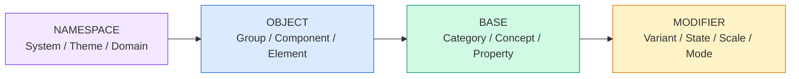

> Original issue: shaun0927/stocktitan-crawler#547

import DevQuickStart from '@site/src/components/DevQuickStart';

<DevQuickStart
  what="Token naming conventions determine how discoverable, predictable, and maintainable your design system variables are"
  learn="A 4-group, 13-level naming taxonomy (Namespace, Object, Base, Modifier) for structuring token names"
  able="Define a naming convention that scales from primitive palette tokens to component-specific tokens"
/>

## 네이밍 레벨 구조

디자인 토큰의 이름은 4개 그룹, 13개 레벨로 구성됩니다.



### 핵심 원칙
1. **로컬에서 시작, 패턴 발견 시 글로벌로 승격** (Start Within, Then Promote)
2. **동음이의어 회피** (Avoid Homonyms) - `type` 대신 `font` 사용
3. **필요한 레벨만 포함** (Completeness) - 중복 방지
4. **일관된 순서 유지** - `[Namespace] [Object] [Base] [Modifier]`

### 토큰 네이밍 예시

```css
/* BASE 레벨: Category + Variant + Scale */
--color-neutral-42: #6B6B6B;

/* BASE + MODIFIER: Category + Concept + Property + Variant */
--color-feedback-background-error: var(--color-red-500);

/* NAMESPACE + OBJECT + BASE + MODIFIER */
/* System + Group + Category + Property + State + Mode */
--esds-forms-color-border-hover-on-dark: var(--color-neutral-70);
```

## 📊 토큰 레벨 매트릭스

| 그룹 | 레벨 | 필수? | 예시 |
|------|------|-------|------|
| **Namespace** | System | 권장 | `esds` |
| | Theme | 선택 | `ocean`, `courtyard` |
| | Domain | 선택 | `consumer`, `retail` |
| **Object** | Group | 선택 | `forms` |
| | Component | 선택 | `button`, `input` |
| | Element | 선택 | `left-icon` |
| **Base** | Category | 필수 | `color`, `font`, `space` |
| | Concept | 권장 | `feedback`, `action` |
| | Property | 권장 | `background`, `text`, `size` |
| **Modifier** | Variant | 자주 | `primary`, `error` |
| | State | 자주 | `hover`, `focus`, `disabled` |
| | Scale | 자주 | `1`, `2-x`, `medium` |
| | Mode | 가끔 | `on-light`, `on-dark` |

## 💡 실전 적용 체크리스트

### 토큰 추가 전 자문
- [ ] 이 토큰의 목적은 명확한가?
- [ ] 어디에 사용될지 3군데 이상 말할 수 있는가?
- [ ] 기존 토큰으로 대체 가능한가?
- [ ] 이름이 동음이의어가 아닌가?
- [ ] 레벨 순서가 시스템 규칙과 일치하는가?

### 토큰 워크플로우

```css
/* 1단계: 기본 제네릭 토큰 정의 */
:root {
  --color-neutral-42: #6B6B6B;
}

/* 2단계: 목적성 있는 토큰으로 별칭 */
:root {
  --color-text-primary: var(--color-neutral-42);
}

/* 3단계: 컴포넌트별 필요에 따라 로컬 토큰 */
.input {
  --input-color-border: var(--color-neutral-70); /* 로컬 */
}

/* 4단계: 재사용 발견 시 글로벌 승격 (3회 규칙) */
:root {
  --forms-color-border: var(--color-neutral-70); /* 글로벌 */
}
```

---
*출처: Nathan Curtis (EightShapes)*

---

## 📎 Related Articles

import CrossRef from '@site/src/components/CrossRef';

<CrossRef
  related={[
    { path: "/docs/design-tokens/naming-automation", label: "디자인 토큰 네이밍 자동화 노하우" },
    { path: "/docs/design-tokens/semantic-naming", label: "Purposeful vs Aesthetic Naming" },
    { path: "/docs/component-documentation/documenting-components", label: "Component Documentation - 문서화 가이드" },
  ]}
/>
