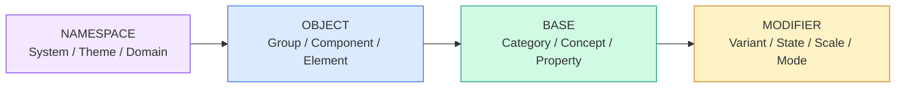
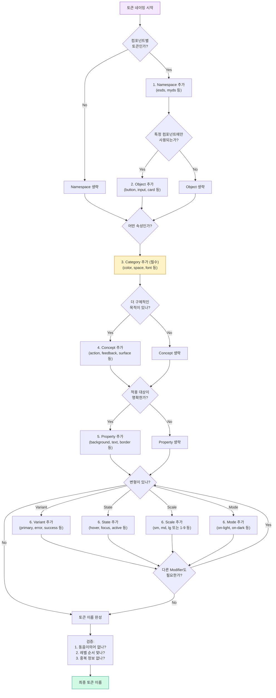

import DevQuickStart from '@site/src/components/DevQuickStart';

<DevQuickStart
  what="Token naming conventions determine how discoverable, predictable, and maintainable your design system variables are"
  learn="A 4-group, 13-level naming taxonomy (Namespace, Object, Base, Modifier) for structuring token names"
  able="Define a naming convention that scales from primitive palette tokens to component-specific tokens"
/>

## 네이밍 레벨 구조

디자인 토큰의 이름은 4개 그룹, 13개 레벨로 구성됩니다.



### 핵심 원칙
1. **로컬에서 시작, 패턴 발견 시 글로벌로 승격** (Start Within, Then Promote)
2. **동음이의어 회피** (Avoid Homonyms) - `type` 대신 `font` 사용
3. **필요한 레벨만 포함** (Completeness) - 중복 방지
4. **일관된 순서 유지** - `[Namespace] [Object] [Base] [Modifier]`

### 토큰 네이밍 예시

```css
/* BASE 레벨: Category + Variant + Scale */
--color-neutral-42: #6B6B6B;

/* BASE + MODIFIER: Category + Concept + Property + Variant */
--color-feedback-background-error: var(--color-red-500);

/* NAMESPACE + OBJECT + BASE + MODIFIER */
/* System + Group + Category + Property + State + Mode */
--esds-forms-color-border-hover-on-dark: var(--color-neutral-70);
```

## 📊 토큰 레벨 매트릭스

| 그룹 | 레벨 | 필수? | 예시 |
|------|------|-------|------|
| **Namespace** | System | 권장 | `esds` |
| | Theme | 선택 | `ocean`, `courtyard` |
| | Domain | 선택 | `consumer`, `retail` |
| **Object** | Group | 선택 | `forms` |
| | Component | 선택 | `button`, `input` |
| | Element | 선택 | `left-icon` |
| **Base** | Category | 필수 | `color`, `font`, `space` |
| | Concept | 권장 | `feedback`, `action` |
| | Property | 권장 | `background`, `text`, `size` |
| **Modifier** | Variant | 자주 | `primary`, `error` |
| | State | 자주 | `hover`, `focus`, `disabled` |
| | Scale | 자주 | `1`, `2-x`, `medium` |
| | Mode | 가끔 | `on-light`, `on-dark` |

## 💡 실전 적용 체크리스트

### 토큰 추가 전 자문
- [ ] 이 토큰의 목적은 명확한가?
- [ ] 어디에 사용될지 3군데 이상 말할 수 있는가?
- [ ] 기존 토큰으로 대체 가능한가?
- [ ] 이름이 동음이의어가 아닌가?
- [ ] 레벨 순서가 시스템 규칙과 일치하는가?

### 토큰 워크플로우

```css
/* 1단계: 기본 제네릭 토큰 정의 */
:root {
  --color-neutral-42: #6B6B6B;
}

/* 2단계: 목적성 있는 토큰으로 별칭 */
:root {
  --color-text-primary: var(--color-neutral-42);
}

/* 3단계: 컴포넌트별 필요에 따라 로컬 토큰 */
.input {
  --input-color-border: var(--color-neutral-70); /* 로컬 */
}

/* 4단계: 재사용 발견 시 글로벌 승격 (3회 규칙) */
:root {
  --forms-color-border: var(--color-neutral-70); /* 글로벌 */
}
```

---

## 🎯 완전한 실전 예시: Button 컴포넌트 토큰 네이밍

이 섹션에서는 Button 컴포넌트를 위한 모든 토큰을 4-group/13-level 시스템으로 명명하는 과정을 단계별로 보여줍니다.

### Step 1: Base 레벨 - Primitive Palette 정의

```css
:root {
  /* Category: color, Scale: 500, 600, 700 */
  --color-purple-500: #8B5CF6;
  --color-purple-600: #7C3AED;
  --color-purple-700: #6D28D9;

  /* Category: color, Variant: neutral, Scale */
  --color-neutral-100: #F3F4F6;
  --color-neutral-700: #374151;
  --color-neutral-900: #111827;
}
```

**네이밍 결정:**
- Category (필수): `color` - 속성 유형
- Variant (자주): `purple`, `neutral` - 색상 패밀리
- Scale (자주): `500`, `600`, `700` - 명도 단계

### Step 2: Base + Modifier - Semantic Tokens

```css
:root {
  /* Category + Concept + Property */
  --color-action-background: var(--color-purple-600);
  --color-action-background-hover: var(--color-purple-700);

  /* Category + Concept + Property + Variant */
  --color-feedback-background-error: var(--color-red-500);
  --color-text-primary: var(--color-neutral-900);
  --color-text-secondary: var(--color-neutral-700);
}
```

**네이밍 결정:**
- Category (필수): `color`
- Concept (권장): `action`, `feedback`, `text` - 사용 목적
- Property (권장): `background`, `text` - 적용 대상
- Variant (자주): `error`, `primary`, `secondary` - 역할

### Step 3: Namespace + Object + Base - Component Tokens

```css
:root {
  /* System + Component + Category + Property + State */
  --esds-button-color-background: var(--color-action-background);
  --esds-button-color-background-hover: var(--color-action-background-hover);
  --esds-button-color-text: white;

  /* System + Component + Category + Property + State + Mode */
  --esds-button-color-border-focus-on-dark: var(--color-neutral-100);

  /* System + Component + Category + Variant + Scale */
  --esds-button-space-padding-x-small: var(--space-2);
  --esds-button-space-padding-x-medium: var(--space-4);
  --esds-button-space-padding-x-large: var(--space-6);
}
```

**네이밍 결정:**
- Namespace > System (권장): `esds` - EightShapes Design System
- Object > Component (선택): `button` - 컴포넌트 이름
- Base > Category (필수): `color`, `space`
- Base > Property (권장): `background`, `text`, `border`, `padding-x`
- Modifier > State (자주): `hover`, `focus`
- Modifier > Variant (자주): `small`, `medium`, `large`
- Modifier > Mode (가끔): `on-dark` - 다크 배경용

### Step 4: 전체 토큰 맵 (Button 컴포넌트)

```css
:root {
  /* ============================================
     BUTTON COMPONENT TOKENS
     ============================================ */

  /* Colors - Background */
  --esds-button-color-background-primary: var(--color-purple-600);
  --esds-button-color-background-primary-hover: var(--color-purple-700);
  --esds-button-color-background-primary-active: var(--color-purple-800);
  --esds-button-color-background-secondary: transparent;
  --esds-button-color-background-disabled: var(--color-neutral-200);

  /* Colors - Text */
  --esds-button-color-text-primary: white;
  --esds-button-color-text-secondary: var(--color-purple-600);
  --esds-button-color-text-disabled: var(--color-neutral-400);

  /* Colors - Border */
  --esds-button-color-border-secondary: var(--color-purple-600);
  --esds-button-color-border-focus: var(--color-purple-300);

  /* Spacing */
  --esds-button-space-padding-x-sm: var(--space-3);  /* 12px */
  --esds-button-space-padding-x-md: var(--space-4);  /* 16px */
  --esds-button-space-padding-x-lg: var(--space-6);  /* 24px */
  --esds-button-space-padding-y-sm: var(--space-2);  /* 8px */
  --esds-button-space-padding-y-md: var(--space-3);  /* 12px */
  --esds-button-space-padding-y-lg: var(--space-4);  /* 16px */

  /* Typography */
  --esds-button-font-size-sm: var(--font-size-sm);   /* 14px */
  --esds-button-font-size-md: var(--font-size-base); /* 16px */
  --esds-button-font-size-lg: var(--font-size-lg);   /* 18px */
  --esds-button-font-weight: var(--weight-semibold); /* 600 */

  /* Border Radius */
  --esds-button-border-radius-sm: 4px;
  --esds-button-border-radius-md: 6px;
  --esds-button-border-radius-lg: 8px;

  /* Heights */
  --esds-button-size-height-sm: 32px;
  --esds-button-size-height-md: 40px;
  --esds-button-size-height-lg: 48px;
}
```

---

## 🗺️ 네이밍 의사결정 플로우차트

이 플로우차트를 따라 토큰 이름을 체계적으로 결정하세요.



---

## ❌ 흔한 네이밍 실수와 해결법

### 실수 1: 동음이의어 사용

```css
/* ❌ 잘못된 예 - "type"은 너무 범용적 */
--button-type-size-large: 18px;
--input-type: text;

/* ✅ 올바른 예 - 명확한 용어 사용 */
--button-font-size-large: 18px;
--input-variant: text;
```

**왜 문제인가?** `type`은 "타입스크립트 타입", "폰트 타입", "입력 타입" 등 여러 의미로 해석될 수 있습니다.

### 실수 2: 레벨 순서 뒤바뀜

```css
/* ❌ 잘못된 예 - Property가 Concept보다 먼저 */
--color-background-action: #8B5CF6;

/* ✅ 올바른 예 - Concept → Property 순서 */
--color-action-background: #8B5CF6;
```

**규칙:** `[Namespace] [Object] [Category] [Concept] [Property] [Modifier]` 순서 엄수

### 실수 3: 중복 정보 포함

```css
/* ❌ 잘못된 예 - "color" 정보 중복 */
--color-purple-color-500: #8B5CF6;
--button-color-background-color: var(--color-purple-500);

/* ✅ 올바른 예 - 중복 제거 */
--color-purple-500: #8B5CF6;
--button-color-background: var(--color-purple-500);
```

### 실수 4: 너무 짧거나 너무 긴 이름

```css
/* ❌ 너무 짧음 - 의미 불명확 */
--btn-bg: #8B5CF6;
--btn-bg-h: #7C3AED;

/* ❌ 너무 김 - 불필요한 레벨 */
--esds-consumer-theme-button-component-color-background-primary-state-hover-mode-on-light: #7C3AED;

/* ✅ 적절한 길이 - 필요한 레벨만 */
--esds-button-color-background-hover: var(--color-purple-700);
```

**3회 규칙 (Rule of Three):** 같은 패턴이 3번 반복되면 토큰으로 승격하되, 토큰 이름은 실제 필요한 레벨만 포함.

### 실수 5: 값 기반 네이밍 (Anti-pattern)

```css
/* ❌ 잘못된 예 - 값을 이름에 포함 */
--color-purple-8b5cf6: #8B5CF6;
--space-16px: 1rem;
--font-size-18: 1.125rem;

/* ✅ 올바른 예 - 목적/의미 기반 네이밍 */
--color-purple-600: #8B5CF6;
--space-4: 1rem;
--font-size-lg: 1.125rem;
```

**왜 문제인가?** 값이 변경되면 이름도 바꿔야 하고, 모든 참조를 업데이트해야 합니다.

### 실수 6: Namespace 없이 컴포넌트 토큰 정의

```css
/* ❌ 잘못된 예 - 여러 라이브러리 충돌 위험 */
--button-color-background: #8B5CF6;

/* ✅ 올바른 예 - Namespace로 스코프 명확화 */
--myds-button-color-background: #8B5CF6;
```

**언제 필요한가?** 퍼블릭 라이브러리, 멀티 테마 시스템, 여러 디자인 시스템 병존 환경.

---

## 🧪 네이밍 자가진단 체크리스트

토큰 이름을 만든 후 이 체크리스트로 검증하세요:

- [ ] **유일성**: 이 토큰 이름이 다른 용도로 오해될 가능성이 없는가?
- [ ] **순서**: 레벨 순서가 `[NS] [Obj] [Cat] [Con] [Prop] [Mod]`를 따르는가?
- [ ] **완전성**: 이름만 보고 토큰의 용도를 알 수 있는가?
- [ ] **간결성**: 불필요한 레벨을 포함하지 않았는가?
- [ ] **확장성**: 나중에 관련 토큰(hover, focus 등)을 추가할 여지가 있는가?
- [ ] **일관성**: 같은 카테고리의 다른 토큰과 패턴이 일치하는가?

---

## 💼 실전 케이스 스터디: Input 컴포넌트

### Before: 무질서한 네이밍

```css
--input-border-color: #D1D5DB;
--inputBorderFocus: #8B5CF6;
--INPUT_BG: white;
--input-text: #111827;
--errorBorder: #EF4444;
```

**문제점:**
- 네이밍 컨벤션 불일치 (케밥, 카멜, 스네이크 혼재)
- 레벨 순서 불명확
- Namespace/Object 누락

### After: 체계적 네이밍

```css
:root {
  /* Component: Input - Colors */
  --esds-input-color-border: var(--color-neutral-300);
  --esds-input-color-border-focus: var(--color-primary);
  --esds-input-color-border-error: var(--color-error);
  --esds-input-color-background: var(--color-neutral-100);
  --esds-input-color-text: var(--color-neutral-900);
  --esds-input-color-placeholder: var(--color-neutral-500);

  /* Component: Input - Spacing */
  --esds-input-space-padding-x: var(--space-3);
  --esds-input-space-padding-y: var(--space-2);

  /* Component: Input - Typography */
  --esds-input-font-size: var(--font-size-base);
  --esds-input-font-weight: var(--weight-normal);

  /* Component: Input - Sizes */
  --esds-input-size-height: 40px;
  --esds-input-border-radius: 6px;
  --esds-input-border-width: 1px;
}
```

**개선 사항:**
- 일관된 케밥-케이스
- 명확한 4-group 구조
- 확장 가능한 패턴 (새 state/variant 추가 용이)

---

*출처: Nathan Curtis (EightShapes)*

---

## 📎 Related Articles

import CrossRef from '@site/src/components/CrossRef';

<CrossRef
  related={[
    { path: "/docs/design-tokens/naming-automation", label: "디자인 토큰 네이밍 자동화 노하우" },
    { path: "/docs/design-tokens/semantic-naming", label: "Purposeful vs Aesthetic Naming" },
    { path: "/docs/component-documentation/documenting-components", label: "Component Documentation - 문서화 가이드" },
  ]}
/>
