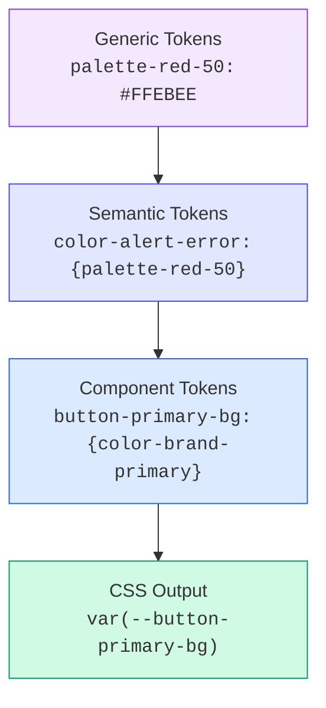

> Original issue: shaun0927/stocktitan-crawler#577

import DevQuickStart from '@site/src/components/DevQuickStart';

<DevQuickStart
  what="Design tokens follow a 3-tier architecture (Generic > Semantic > Component) that maps directly to CSS custom properties"
  learn="How to set up Style Dictionary to transform JSON tokens into platform-specific outputs"
  able="Build a complete token pipeline from JSON definition to CSS variables used in components"
/>

## 3-Tier 토큰 구조

디자인 토큰은 세 가지 계층으로 구성됩니다. 각 계층은 추상화 수준이 다르며, 이 구조를 통해 리브랜딩이나 다크 모드 전환이 단일 파일 수정만으로 가능해집니다.



### Tier 1: Generic (Primitive) Tokens

원시 값을 저장하는 팔레트 토큰입니다. 색상, 크기, 폰트 등의 raw 값을 정의합니다.

```json title="tokens/generic/colors.json"
{
  "color": {
    "palette": {
      "red": {
        "50":  { "value": "#FFEBEE", "type": "color" },
        "500": { "value": "#F44336", "type": "color" },
        "900": { "value": "#B71C1C", "type": "color" }
      },
      "blue": {
        "50":  { "value": "#E3F2FD", "type": "color" },
        "500": { "value": "#2196F3", "type": "color" },
        "900": { "value": "#0D47A1", "type": "color" }
      },
      "neutral": {
        "0":   { "value": "#FFFFFF", "type": "color" },
        "100": { "value": "#F5F5F5", "type": "color" },
        "900": { "value": "#212121", "type": "color" }
      }
    }
  }
}
```

### Tier 2: Semantic Tokens

디자인 결정을 표현하는 토큰입니다. Generic 토큰을 참조하여 "목적"을 부여합니다.

```json title="tokens/semantic/colors.json"
{
  "color": {
    "brand": {
      "primary":   { "value": "{color.palette.blue.500}" },
      "secondary": { "value": "{color.palette.blue.900}" }
    },
    "alert": {
      "error":   { "value": "{color.palette.red.500}" },
      "success": { "value": "#4CAF50" }
    },
    "background": {
      "default": { "value": "{color.palette.neutral.0}" },
      "surface": { "value": "{color.palette.neutral.100}" }
    },
    "text": {
      "primary":   { "value": "{color.palette.neutral.900}" },
      "on-primary": { "value": "{color.palette.neutral.0}" }
    }
  }
}
```

### Tier 3: Component Tokens

특정 컴포넌트에 바인딩된 토큰입니다. Semantic 토큰을 참조합니다.

```json title="tokens/component/button.json"
{
  "button": {
    "primary": {
      "background":       { "value": "{color.brand.primary}" },
      "background-hover": { "value": "{color.brand.secondary}" },
      "text":             { "value": "{color.text.on-primary}" },
      "border-radius":    { "value": "8px" }
    },
    "danger": {
      "background":       { "value": "{color.alert.error}" },
      "text":             { "value": "{color.text.on-primary}" }
    }
  }
}
```

## Style Dictionary 설정

[Style Dictionary](https://amzn.github.io/style-dictionary/)는 JSON 토큰을 CSS, iOS, Android 등 플랫폼별 출력으로 변환합니다.

```javascript title="style-dictionary.config.js"
module.exports = {
  source: [
    'tokens/generic/**/*.json',
    'tokens/semantic/**/*.json',
    'tokens/component/**/*.json',
  ],
  platforms: {
    css: {
      transformGroup: 'css',
      buildPath: 'dist/css/',
      files: [
        {
          destination: 'tokens.css',
          format: 'css/variables',
          options: {
            outputReferences: true, // preserve token references as comments
          },
        },
      ],
    },
    js: {
      transformGroup: 'js',
      buildPath: 'dist/js/',
      files: [
        {
          destination: 'tokens.js',
          format: 'javascript/es6',
        },
      ],
    },
    typescript: {
      transformGroup: 'js',
      buildPath: 'dist/ts/',
      files: [
        {
          destination: 'tokens.d.ts',
          format: 'typescript/es6-declarations',
        },
      ],
    },
  },
};
```

### 빌드 실행

```bash
npx style-dictionary build
```

### 생성된 CSS 출력

```css title="dist/css/tokens.css"
:root {
  /* Generic Tokens */
  --color-palette-red-50: #FFEBEE;
  --color-palette-red-500: #F44336;
  --color-palette-blue-500: #2196F3;
  --color-palette-blue-900: #0D47A1;
  --color-palette-neutral-0: #FFFFFF;
  --color-palette-neutral-900: #212121;

  /* Semantic Tokens */
  --color-brand-primary: var(--color-palette-blue-500);
  --color-alert-error: var(--color-palette-red-500);
  --color-background-default: var(--color-palette-neutral-0);
  --color-text-primary: var(--color-palette-neutral-900);

  /* Component Tokens */
  --button-primary-background: var(--color-brand-primary);
  --button-primary-text: var(--color-text-on-primary);
  --button-primary-border-radius: 8px;
  --button-danger-background: var(--color-alert-error);
}
```

## Before vs After: 왜 토큰인가?

### Before: 하드코딩된 값

```css title="Without tokens"
.button-primary {
  background-color: #2196F3;     /* What is this color? */
  color: #FFFFFF;
  border-radius: 8px;
}

.alert-error {
  background-color: #F44336;     /* Same red used elsewhere? */
  border: 1px solid #D32F2F;     /* Where does this come from? */
}

/* Rebranding? Find-and-replace across 200 files... */
```

### After: 토큰 기반 CSS

```css title="With tokens"
.button-primary {
  background-color: var(--button-primary-background);
  color: var(--button-primary-text);
  border-radius: var(--button-primary-border-radius);
}

.alert-error {
  background-color: var(--color-alert-error);
  border: 1px solid var(--color-alert-error-dark);
}

/* Rebranding? Change 1 JSON file, rebuild tokens. Done. */
```

## 토큰 재설계 프로세스

토큰 체계를 도입하거나 재설계할 때는 4단계 프로세스를 따릅니다.


### Step 1: Audit (감사)

기존 코드에서 하드코딩된 값을 추출합니다.

```bash
# Find all hardcoded hex colors in CSS/SCSS files
grep -rn '#[0-9A-Fa-f]\{3,8\}' src/styles/ --include='*.css' --include='*.scss' \
  | sort | uniq -c | sort -rn > color-audit.txt
```

### Step 2: Workshop (합의)

팀과 함께 토큰 이름과 구조를 결정합니다. 핵심 질문:
- Generic 토큰의 스케일은? (숫자 50-900 vs T-shirt S/M/L)
- Semantic 토큰의 네이밍 패턴은? (`color-brand-primary` vs `brand-color-primary`)
- Component 토큰이 필요한 범위는?

### Step 3: Decide (결정)

토큰 사양을 JSON으로 작성합니다. 위의 3-Tier 예시를 기반으로 프로젝트에 맞게 커스터마이징합니다.

### Step 4: Implement (구현)

마이그레이션은 컴포넌트 단위로 진행합니다.

```diff title="Button component migration"
 .button-primary {
-  background-color: #2196F3;
-  color: #FFFFFF;
-  border-radius: 8px;
+  background-color: var(--button-primary-background);
+  color: var(--button-primary-text);
+  border-radius: var(--button-primary-border-radius);
 }
```

## 다크 모드: Semantic 계층의 힘

3-Tier 구조에서 다크 모드는 Semantic 계층만 교체하면 됩니다.

```css
/* Light mode (default) */
:root {
  --color-background-default: var(--color-palette-neutral-0);
  --color-text-primary: var(--color-palette-neutral-900);
}

/* Dark mode - only semantic tokens change */
[data-theme="dark"] {
  --color-background-default: var(--color-palette-neutral-900);
  --color-text-primary: var(--color-palette-neutral-0);
}

/* Component tokens remain untouched */
/* --button-primary-background still references --color-brand-primary */
```

## 토큰 타입 확장

색상 외에도 다양한 디자인 속성을 토큰화할 수 있습니다.

| 타입 | Generic 예시 | Semantic 예시 | Component 예시 |
|------|-------------|---------------|----------------|
| **Color** | `palette-blue-500` | `color-brand-primary` | `button-primary-bg` |
| **Typography** | `font-size-16` | `text-body-size` | `card-title-size` |
| **Space** | `space-4` (16px) | `spacing-content-gap` | `card-padding` |
| **Size** | `size-48` | `size-icon-md` | `button-height-md` |
| **Border** | `radius-8` | `radius-interactive` | `input-border-radius` |
| **Shadow** | `shadow-2` | `shadow-elevated` | `card-shadow` |
| **Duration** | `duration-200` | `duration-transition` | `button-transition` |

---
> 출처: Nathan Curtis (EightShapes)

---

## 📎 Related Articles

import CrossRef from '@site/src/components/CrossRef';

<CrossRef
  related={[
    { path: "/docs/visual-foundations/color-system", label: "컬러 시스템 16가지 팁" },
    { path: "/docs/design-tokens/token-glossary", label: "디자인 토큰 용어 사전" },
    { path: "/docs/component-documentation/design-guidelines", label: "Component Design Guidelines" },
  ]}
/>
