> Original issue: shaun0927/stocktitan-crawler#531

import DevQuickStart from '@site/src/components/DevQuickStart';

<DevQuickStart
  what="Token naming conventions and automation pipelines reduce manual work and prevent naming inconsistencies across platforms"
  learn="3-tier naming templates (Primitive/Semantic/Component), W3C DTCG spec basics, and Style Dictionary transform automation"
  able="Set up an automated pipeline from token JSON to platform-specific outputs with consistent naming"
/>

## 핵심 원칙

### 1. 디자인 토큰의 본질
- **디자인 토큰 = 디자인 결정의 표현**
  - 플랫폼 독립적 공통 언어 (JSON)
  - W3C DTCG 스펙 기반 (name, type, value, description)
  - 디자이너-개발자-이해관계자 간 공유 가능한 단일 진실 공급원

### 2. 좋은 토큰 이름의 조건
| 원칙 | 의미 | 예시 |
|------|------|------|
| **Simple** | 단순하고 명확 | ❌ MDS.sys.sem.c.low ✅ button.neutral.tier2.default.bg |
| **Human Readable** | 사람이 읽을 수 있음 | ❌ 약어 남발 ✅ color.text.secondary |
| **Collaborative** | 모든 팀이 이해 가능 | 시스템 디자이너 ≠ 제품 디자이너 ≠ 개발자 |
| **Future Friendly** | 기술적으로 정확 유지 | ❌ button.outlined (스타일 변경 시 부적합) ✅ button.tier2 |
| **Scalable** | 시스템 확장에 대응 | 색상 추가, 상태 추가 시 구조 유지 |

### 3. "Semantic"의 함정
- **"Semantic" ≠ 만능 해결책**
  - "나에게 의미 있음" ≠ "신입 디자이너/PM에게 의미 있음"
  - 대신 **Contextual**(맥락적), **Thoughtful**(사려 깊은) 추구
  - 팀마다 다른 용어 합의 필요 (loading vs in-progress, primary vs default)

---

## 🏗️ 네이밍 규칙 (3단계 구조)

### Tier 1: Primitive (옵션/글로벌)
**역할**: 원시 값 저장소 (팔레트, 스케일)

**템플릿**: `{property}.{group}.{option}`

**예시**:
- colors.gray.500
- space.base.8
- font.weight.bold
- border.radius.md

**특징**:
- 하드코딩된 값 (hex, px, etc.)
- 숫자 스케일 (100-900) 또는 semantic (sm/md/lg) 통일 권장
- 속성 이름으로 시작 → 개발자가 primitive 임을 즉시 인식

### Tier 2: Semantic (결정 토큰)
**역할**: 디자인 결정 표현 (누구를 위한 것인가?)

**템플릿**: `{who}.{where}.{condition}`

**예시**:
- brand.colors.primary.default
- theme.colors.neutral.hover
- mode.colors.background.light

**특징**:
- 다른 토큰 참조 (primitive 또는 다른 semantic)
- **앞부분으로 컨텍스트 제공**: brand/theme/mode → 제품 디자이너가 빠르게 선택
- 2-layer 접근 (semantic만) vs 3-layer (semantic + component) 선택 가능

### Tier 3: Component Specific (컴포넌트 토큰)
**역할**: 특정 컴포넌트 전용 토큰

**템플릿**: `{component}.{role}.{state}.{property}`

**예시**:
- button.neutral.tier2.default.bg.color
- input.text.focus.border.color
- card.container.hover.shadow

**특징**:
- **모든 컴포넌트가 필요한 것은 아님** (작은 팀은 semantic으로 충분)
- 자동화/플러그인 개발 시 필수 (API가 세부 사항 필요)
- 공통 속성은 공유 가능 (예: 모든 CTA 버튼의 gap이 동일하면 1개 토큰으로 재사용)

---

## 🎯 네이밍 전략 (계층별 차별화)

### 핵심 인사이트: 계층마다 다른 템플릿 사용
**왜?** → 토큰 이름만 봐도 어느 계층인지 즉시 파악 (디버깅/유지보수 용이)

**예시**:
- Primitive:  colors.blue.500        (속성으로 시작)
- Semantic:   theme.colors.primary   (용도/대상으로 시작)
- Component:  button.primary.bg      (컴포넌트 이름으로 시작)

**개발자 입장 혜택**:
- 이름이 colors.* → primitive (하드코딩 값 찾기)
- 이름이 button.* → component token
- 나머지 → semantic decision token
- 자동화 스크립트 작성 용이 (Style Dictionary 등)

---

## 🔧 실무 워크플로우

### 토큰 관리 도구 선택

팀 규모와 기술 수준에 따라 적절한 관리 도구를 선택합니다.

| 도구 | 장점 | 적합한 팀 |
|------|------|----------|
| **JSON/YAML + Git** | 버전 관리, CI/CD 통합, 코드 리뷰 | 개발자 중심 팀 |
| **Spreadsheet/DB** | 비기술자 친화적, 시각적 관리 | 디자이너-개발자 혼합 팀 |
| **Token Studio** | Figma 네이티브, 실시간 동기화 | Figma 중심 워크플로우 |

### 자동화 파이프라인 구축

토큰 변경을 감지하고 자동으로 코드와 문서를 업데이트하는 파이프라인입니다.

```mermaid
graph LR
    A["Token Source<br/>(JSON/Figma)"] --> B["Git PR<br/>(변경 추적)"]
    B --> C["Style Dictionary<br/>(변환)"]
    C --> D["CSS / iOS / Android<br/>(플랫폼 출력)"]
    D --> E["npm publish<br/>(배포)"]

    style A fill:#f3e8ff,stroke:#7c3aed
    style C fill:#dbeafe,stroke:#2563eb
    style E fill:#d1fae5,stroke:#059669
```



---

## 🚀 자동화 전략

### 1. 토큰 스케일 일관성
**문제**: 팀마다 다른 스케일 혼용
- 색상: yellow 1, 2, 3
- 그림자: 100-500
- 폰트: XS/S/M/L
- 레이어: level 1-3

**해결**:
- 단일 로직 선택 (숫자형 또는 서수형)
- 예외 최소화 (border-radius만 semantic 허용 등)
- 신입 개발자/디자이너 인지 부하 감소

### 2. Composite Tokens (복합 토큰)
**개념**: 여러 속성을 하나로 묶기

**Typography composite 예시**:
- fontFamily + fontSize + fontWeight + lineHeight 결합

**Border composite 예시**:
- color + width + style 결합

### 3. Style Dictionary 자동 변환

Style Dictionary를 사용하면 JSON 토큰을 플랫폼별 출력으로 자동 변환할 수 있습니다.

```javascript title="style-dictionary.config.js"
module.exports = {
  source: ['tokens/**/*.json'],
  platforms: {
    css: {
      transformGroup: 'css',
      buildPath: 'dist/css/',
      files: [{
        destination: 'tokens.css',
        format: 'css/variables',
        options: { outputReferences: true },
      }],
    },
    ios: {
      transformGroup: 'ios-swift',
      buildPath: 'dist/ios/',
      files: [{
        destination: 'Tokens.swift',
        format: 'ios-swift/class.swift',
        className: 'DesignTokens',
      }],
    },
    android: {
      transformGroup: 'android',
      buildPath: 'dist/android/',
      files: [{
        destination: 'tokens.xml',
        format: 'android/resources',
      }],
    },
  },
};
```

```bash
# 빌드 실행
npx style-dictionary build

# CI/CD에서 자동화
# package.json에 추가:
# "scripts": { "build:tokens": "style-dictionary build" }
```

---

## 📋 워크샵 체크리스트 (팀 협업용)

### Phase 1: 기초 정의 (Workshop 준비)
- [ ] 현재 워크플로우 파악 (Figma → 코드 전달 방식)
- [ ] 컴포넌트 인벤토리 작성
- [ ] 3/6/9개월 로드맵 합의
- [ ] 도구 선택 (Token Studio/Figma Variables/Airtable 등)

### Phase 2: Workshop 진행
- [ ] **Name That Component 게임**: 같은 컴포넌트 다른 이름 붙이기 → 용어 통일
- [ ] **네이밍 구조 버전**: 여러 옵션 시도
- [ ] **경험 공유**: 멀티브랜드 경험자, 1인 디자인 시스템 경험자 등
- [ ] **도구 선택 최종 결정**

### Phase 3: MVP 구축
- [ ] 작은 subset 선택 (예: 버튼 + 인풋 필드만)
- [ ] 토큰 생성 및 문서화
- [ ] 실제 컴포넌트 적용 테스트
- [ ] 팀 피드백 수집

### Phase 4: 론칭 & 확장
- [ ] 런칭 (프로덕션 적용)
- [ ] 피드백 기반 조정
- [ ] 테마 확장 (light/dark, high contrast, 브랜드 추가)
- [ ] 자동화 도입 (linting, version control, API)

---

## ⚠️ 안티패턴 (하지 말아야 할 것)

### 1. 불필요한 레이어 중복
❌ BAD: size.100-600 → space.padding.xs/sm/md → space.desktop.sm
이유: 세 번째 레이어가 의미 없이 중복

### 2. 정확한 값 사용
❌ BAD: spacing.16px, color.hex-ff0000
이유: 값 변경 시 이름도 변경 필요 (not future-friendly)

### 3. 과도한 상태 정의
❌ BAD: button.default + button.primary + button.base (중복!)
이유: default vs primary 차이 불명확

### 4. ChatGPT로 이름 일괄 생성
⚠️ 주의: GPT는 맥락 없이 일반적 패턴만 제시
→ 팀 특성/비즈니스 컨텍스트 반영 불가
→ 일괄 생성 후 팀 리뷰 필수

---

## 🎯 핵심 Takeaways

1. **시작은 작게**: MVP로 버튼 1-2개만 토큰화 → 워크플로우 검증 후 확장
2. **팀 협업 필수**: 디자이너-개발자-PM 모두 이해 가능한 이름 합의
3. **도구는 수단**: Figma Variables, Token Studio, Airtable 중 팀에 맞는 것 선택
4. **문서화 자동화**: 변경 이력, 사용처 추적을 자동화로 해결
5. **완벽주의 경계**: 스타트업/PMF 찾는 중이면 토큰보다 비즈니스 우선
6. **계층별 차별화**: primitive/semantic/component 각각 다른 템플릿으로 가독성 확보
7. **Future Friendly**: 스타일 변경 시에도 이름이 유효하도록 추상적 네이밍

---

---
*출처: EightShapes, Tokens Studio*

---

## 📎 Related Articles

import CrossRef from '@site/src/components/CrossRef';

<CrossRef
  related={[
    { path: "/docs/design-tokens/naming-system", label: "디자인 토큰 네이밍 시스템" },
    { path: "/docs/design-tokens/token-glossary", label: "디자인 토큰 용어 사전" },
    { path: "/docs/component-design/components-as-data", label: "Components as Data" },
  ]}
/>
