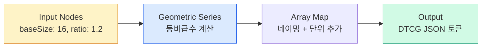

import DevQuickStart from '@site/src/components/DevQuickStart';

<DevQuickStart
  what="The W3C DTCG spec standardizes token formats across tools, while Graph Engines automate token generation from algorithmic rules"
  learn="W3C DTCG token format, Graph Engine concepts for algorithmic token generation, and multi-brand scaling strategies"
  able="Write tokens in W3C DTCG format and understand how graph-based token generation reduces manual maintenance"
/>

## W3C DTCG 표준 토큰 포맷

W3C Design Token Community Group(DTCG)은 플랫폼 독립적 토큰 형식을 표준화합니다. 이 형식을 사용하면 도구 간 토큰 교환이 가능합니다.

```json title="tokens.json (W3C DTCG format)"
{
  "color": {
    "brand": {
      "primary": {
        "$value": "#2563EB",
        "$type": "color",
        "$description": "Main brand color used for primary actions"
      }
    },
    "feedback": {
      "error": {
        "$value": "#EF4444",
        "$type": "color",
        "$description": "Error state indicator"
      }
    }
  },
  "spacing": {
    "base": {
      "$value": "16px",
      "$type": "dimension"
    },
    "compact": {
      "$value": "8px",
      "$type": "dimension"
    }
  },
  "typography": {
    "body": {
      "$value": {
        "fontFamily": "Inter",
        "fontSize": "16px",
        "fontWeight": 400,
        "lineHeight": 1.5
      },
      "$type": "typography"
    }
  }
}
```

### DTCG vs Figma Variables

| 항목 | Figma Variables | DTCG Tokens |
|------|----------------|-------------|
| **타입** | Color, Number, String, Boolean (4) | Color, Dimension, Typography, Shadow 등 (20+) |
| **포맷** | Figma 전용 | 플랫폼 독립적 JSON |
| **메타데이터** | 제한적 | `$description`, `$extensions` 풍부 |
| **도구 호환** | Figma only | Style Dictionary, Tokens Studio 등 |

## 현재 토큰 생태계의 한계

정적 토큰 관리의 근본적 문제점:

| 문제 | 설명 |
|------|------|
| **지식 손실** | 색상 팔레트의 생성 로직이 도구 안에 갇힘 |
| **토큰 폭발** | 브랜드 x 플랫폼 x 모드 x 밀도 = 수만 개 토큰 |
| **재현 불가** | "이 색상이 왜 #7034EA인가?" 답변 불가 |
| **변경 지옥** | 타이포그래피 스케일 변경 시 수십 개 토큰 수동 업데이트 |

Graph Engine은 토큰의 "결과값"이 아닌 "생성 로직"을 저장하여 이 문제를 해결합니다.

## Graph Engine 기본 개념

Graph Engine은 노드 기반 시각적 프로그래밍으로 토큰 생성 로직을 정의합니다.



| 구성 요소 | 설명 | 예시 |
|-----------|------|------|
| **Node** | 작업 단위 | Constant, Add, Multiply, Array Map |
| **Edge** | 데이터 흐름 (출력 → 입력) | baseSize → Geometric Series |
| **Subgraph** | 재사용 가능한 캡슐화된 로직 | Color Scale Generator |

### 지금 바로 시도하기: 타이포그래피 스케일 생성

JavaScript로 Graph Engine의 핵심 로직을 구현할 수 있습니다.

```javascript title="generate-type-scale.js"
function generateTypeScale(baseSize, ratio, stepsDown, stepsUp) {
  const tokens = {};
  const names = ['2xs', 'xs', 'sm', 'md', 'lg', 'xl', '2xl', '3xl', '4xl'];

  for (let i = -stepsDown; i <= stepsUp; i++) {
    const size = Math.round(baseSize * Math.pow(ratio, i) * 100) / 100;
    const nameIndex = i + stepsDown;
    const name = names[nameIndex] || `step-${i}`;

    tokens[`dimension.${name}`] = {
      $value: `${size}px`,
      $type: 'dimension',
    };
  }
  return tokens;
}

// Usage
const scale = generateTypeScale(16, 1.2, 2, 6);
console.log(JSON.stringify(scale, null, 2));
// → { "dimension.2xs": { "$value": "11.11px", "$type": "dimension" }, ... }

// baseSize를 20으로 변경하면 전체 스케일 자동 재계산
const largeScale = generateTypeScale(20, 1.25, 2, 6);
```

### 색상 스케일 자동 생성

```javascript title="generate-color-scale.js"
function generateColorScale(brandColors, steps = 11) {
  const tokens = {};

  for (const [name, hsl] of Object.entries(brandColors)) {
    for (let i = 0; i < steps; i++) {
      const lightness = 95 - (i * (90 / (steps - 1))); // 95% → 5%
      const step = (i + 1) * 100;

      tokens[`color.${name}.${step}`] = {
        $value: `hsl(${hsl.h}, ${hsl.s}%, ${Math.round(lightness)}%)`,
        $type: 'color',
      };
    }
  }
  return tokens;
}

const colors = generateColorScale({
  blue: { h: 220, s: 80 },
  red: { h: 0, s: 75 },
  green: { h: 140, s: 60 },
});
```

## Tokens Studio 도구 비교

| 항목 | Graph Engine (오픈소스) | Studio Platform (SaaS) |
|------|------------------------|------------------------|
| **가격** | 무료 | 유료 (조직 플랜) |
| **용도** | 로직 생성 단독 사용 | 전체 워크플로우 통합 |
| **Figma 연동** | JSON 다운로드 | 자동 동기화 |
| **버전 관리** | 없음 | Git 네이티브, 브랜치, PR |
| **출력** | DTCG JSON | Figma Variables + 코드 |

## 멀티브랜드 토큰 전략

### 토큰 폭발 문제

```
Before (정적):  10 브랜드 x 3 플랫폼 x 2 모드 = 120,000개 토큰 수동 관리
After (그래프):  20~50개 입력값 → 120,000개 토큰 자동 생성
```

### 화이트라벨 구현 예시

```json title="brand-config.json"
{
  "brand": "acme",
  "inputs": {
    "primaryColor": "#2563EB",
    "secondaryColor": "#7C3AED",
    "fontFamily": "Inter",
    "baseSize": 16,
    "borderRadius": 8,
    "density": "regular"
  }
}
```

```javascript title="generate-brand-tokens.js"
const { inputs } = require('./brand-config.json');

// 입력값 20개로 전체 디자인 시스템 토큰 생성
const tokens = {
  color: generateColorScale(inputs.primaryColor),     // → 66 color tokens
  typography: generateTypeScale(inputs.baseSize),      // → 13 type tokens
  spacing: generateSpacingScale(inputs.baseSize),      // → 13 spacing tokens
  radius: generateRadiusScale(inputs.borderRadius),    // → 6 radius tokens
};
// Total: ~100 tokens from 6 inputs
```

## 시작하기 체크리스트

- [ ] [graph.tokens.studio](https://graph.tokens.studio) 접속 (무료)
- [ ] Geometric Series로 타이포 스케일 만들어보기 (10분)
- [ ] DTCG JSON 파일 다운로드 및 확인
- [ ] 현재 프로젝트 토큰 개수 감사 (100개? 5000개?)
- [ ] 멀티브랜드 여부 확인 후 ROI 계산

---

## 📎 Related Articles

import CrossRef from '@site/src/components/CrossRef';

<CrossRef
  related={[
    { path: "/docs/design-tokens/algorithmic-systems", label: "알고리즘 기반 디자인 시스템" },
    { path: "/docs/design-tokens/scalable-scales", label: "확장 가능한 스케일 시스템" },
    { path: "/docs/visual-foundations/typography", label: "타이포그래피 시스템" },
  ]}
/>
