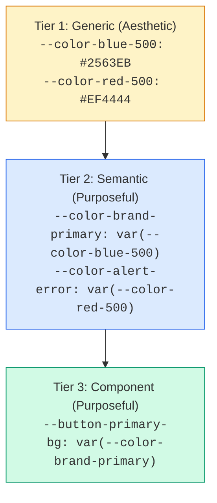
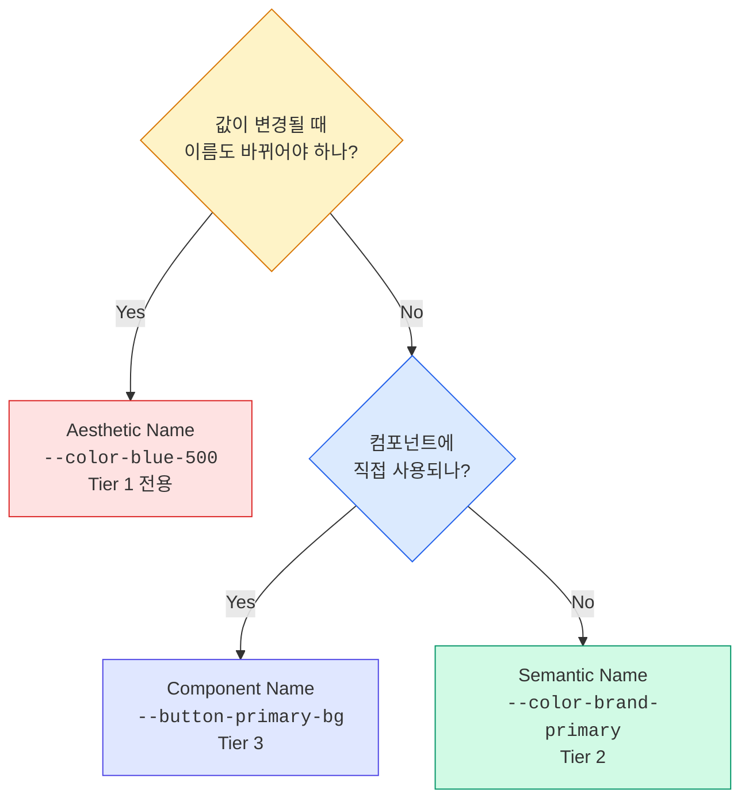

import DevQuickStart from '@site/src/components/DevQuickStart';

<DevQuickStart
  what="Token naming strategy directly impacts how safely you can rebrand or refactor your design system"
  learn="The tradeoffs between purposeful (semantic) and aesthetic (visual) naming, and when to use each"
  able="Choose a naming strategy for your tokens that survives rebranding without breaking changes"
/>

## 두 가지 네이밍 철학

디자인 토큰의 이름을 정할 때 두 가지 근본적으로 다른 접근법이 있습니다.

| | Purposeful (목적 기반) | Aesthetic (시각 기반) |
|---|---|---|
| **원칙** | "이것은 무엇을 위한 것인가?" | "이것은 어떻게 보이는가?" |
| **색상** | `--color-error`, `--color-success` | `--color-red-500`, `--color-green-400` |
| **버튼** | `--button-primary-bg` | `--button-blue-bg` |
| **간격** | `--spacing-content-gap` | `--spacing-16` |
| **장점** | 의도가 명확, 리브랜딩에 강함 | 유연함, 직관적 |
| **단점** | 경직될 수 있음 | 의미 불명확, 리브랜딩 시 깨짐 |

## 리브랜딩 시뮬레이션: 보라색에서 파란색으로

실제 리브랜딩 시나리오로 두 접근법의 차이를 확인합니다.

### Aesthetic Naming의 문제

```css title="Before rebranding (aesthetic names)"
:root {
  --purple-500: #7C3AED;
  --purple-600: #6D28D9;
  --purple-700: #5B21B6;
}

.button-primary {
  background-color: var(--purple-500);
}
.button-primary:hover {
  background-color: var(--purple-600);
}
.nav-active {
  border-color: var(--purple-500);
}
.badge-brand {
  background-color: var(--purple-700);
}
```

리브랜딩으로 브랜드 색상이 파란색으로 변경되면:

```css title="After rebranding - BROKEN naming"
:root {
  /* Option A: Change values but keep names (misleading!) */
  --purple-500: #2563EB; /* This is blue, not purple! */

  /* Option B: Rename everything (breaking change!) */
  --blue-500: #2563EB;
  /* Now find and replace --purple-500 → --blue-500
     across EVERY file in the codebase */
}
```

**Option A**: 이름이 거짓말을 합니다. `--purple-500`이 파란색을 반환합니다.
**Option B**: 모든 파일에서 변수명을 교체해야 합니다. Breaking change입니다.

### Purposeful Naming의 해결

```css title="Before rebranding (purposeful names)"
:root {
  --color-brand-primary: #7C3AED;
  --color-brand-primary-hover: #6D28D9;
  --color-brand-primary-dark: #5B21B6;
}

.button-primary {
  background-color: var(--color-brand-primary);
}
.button-primary:hover {
  background-color: var(--color-brand-primary-hover);
}
.nav-active {
  border-color: var(--color-brand-primary);
}
.badge-brand {
  background-color: var(--color-brand-primary-dark);
}
```

리브랜딩 시:

```css title="After rebranding - names still valid!"
:root {
  --color-brand-primary: #2563EB;       /* Just change the value */
  --color-brand-primary-hover: #1D4ED8; /* Just change the value */
  --color-brand-primary-dark: #1E40AF;  /* Just change the value */
}

/* Zero changes needed in component CSS files */
```

**단 3줄 수정**으로 리브랜딩 완료. 컴포넌트 코드 변경 없음.

## 하이브리드 접근법: 실무 권장 전략

실제로는 두 방식을 계층별로 혼합하여 사용합니다.



### 코드로 구현

```css title="Hybrid naming in practice"
:root {
  /* Tier 1: Aesthetic - raw palette (OK to use color names here) */
  --color-blue-50: #EFF6FF;
  --color-blue-500: #2563EB;
  --color-blue-700: #1D4ED8;
  --color-red-50: #FEF2F2;
  --color-red-500: #EF4444;
  --color-green-50: #F0FDF4;
  --color-green-500: #22C55E;

  /* Tier 2: Purposeful - design decisions (never use color names) */
  --color-brand-primary: var(--color-blue-500);
  --color-brand-primary-hover: var(--color-blue-700);
  --color-feedback-error: var(--color-red-500);
  --color-feedback-error-bg: var(--color-red-50);
  --color-feedback-success: var(--color-green-500);

  /* Tier 3: Purposeful - component-specific */
  --button-primary-bg: var(--color-brand-primary);
  --button-danger-bg: var(--color-feedback-error);
  --alert-error-bg: var(--color-feedback-error-bg);
}
```

### 컴포넌트에서의 사용 규칙

```css title="Component CSS"
/* CORRECT: Components reference Tier 2 or Tier 3 only */
.button-primary {
  background: var(--button-primary-bg);       /* Tier 3 */
  color: var(--color-text-on-primary);        /* Tier 2 */
}

.alert-error {
  background: var(--alert-error-bg);          /* Tier 3 */
  color: var(--color-feedback-error);         /* Tier 2 */
}

/* WRONG: Components should never reference Tier 1 directly */
.button-primary {
  background: var(--color-blue-500);  /* Breaks on rebrand! */
}
```

## 네이밍 결정 프레임워크

어떤 이름을 사용할지 결정할 때 이 기준을 적용합니다.



## Variant 네이밍: Purposeful 우선

컴포넌트 variant 이름에서도 같은 원칙이 적용됩니다.

```typescript title="Button variants"
// PURPOSEFUL: Survives visual changes
type ButtonVariant = 'primary' | 'secondary' | 'destructive' | 'ghost';

// AESTHETIC: Breaks when styles change
type ButtonVariant = 'filled' | 'outlined' | 'blue' | 'transparent';
// What happens when "outlined" becomes "filled with border"?
// What happens when "blue" becomes green?
```

```tsx title="Usage"
// Purposeful - describes WHAT it does
<Button variant="destructive">Delete Account</Button>

// Aesthetic - describes HOW it looks
<Button variant="red-filled">Delete Account</Button>
```

## 마이그레이션 체크리스트

기존 aesthetic 토큰을 purposeful로 마이그레이션할 때:

1. **Audit**: 현재 사용 중인 모든 토큰 이름 수집
2. **Map**: 각 aesthetic 이름에 대응하는 purposeful 이름 결정
3. **Alias**: 기존 이름을 새 이름의 별칭으로 유지 (deprecation period)
4. **Migrate**: 컴포넌트별 점진적 교체
5. **Remove**: deprecation period 후 이전 이름 제거

```css title="Migration with aliases"
:root {
  /* New purposeful tokens */
  --color-brand-primary: #7C3AED;

  /* Deprecated aliases (remove in v3.0) */
  /* @deprecated Use --color-brand-primary instead */
  --purple-500: var(--color-brand-primary);
}
```

## 핵심 원칙 요약

| 원칙 | 설명 |
|------|------|
| **Tier 1 = Aesthetic OK** | 팔레트 토큰은 시각적 이름 사용 가능 (`blue-500`) |
| **Tier 2-3 = Purposeful 필수** | Semantic/Component 토큰은 목적 기반 이름 사용 |
| **컴포넌트는 Tier 1 직접 참조 금지** | 항상 Tier 2-3을 통해 간접 참조 |
| **리브랜딩 테스트** | "색상이 바뀌면 이 이름이 거짓말이 되는가?" |
| **팀 합의** | 같은 개념에 같은 용어 사용 (warning vs caution 통일) |
| **일관성 > 완벽** | 하나의 패턴을 일관되게 적용하는 것이 혼합보다 나음 |

---
> 출처: Nathan Curtis (EightShapes)

---

## 📎 Related Articles

import CrossRef from '@site/src/components/CrossRef';

<CrossRef
  related={[
    { path: "/docs/design-tokens/naming-system", label: "디자인 토큰 네이밍 시스템" },
    { path: "/docs/design-tokens/naming-automation", label: "디자인 토큰 네이밍 자동화 노하우" },
    { path: "/docs/visual-foundations/color-system", label: "컬러 시스템 16가지 팁" },
  ]}
/>
