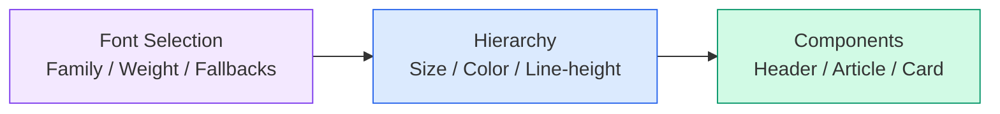

import DevQuickStart from '@site/src/components/DevQuickStart';

<DevQuickStart
  what="Typography tokens (font family, size scale, line height, color) form the foundation of readable, consistent UIs"
  learn="How to build a type scale with CSS custom properties, fluid typography with clamp(), and heading level vs HTML tag separation"
  able="Implement a complete typography token system with responsive scaling and component-level resets"
/>

## 핵심 개념

#### 타이포그래피의 중요성
- 디지털 인터페이스는 **이미지보다 텍스트로 구성**됨
- 디자인 시스템에서 **일관성 있는 사용자 경험의 기초**
- 단순한 폰트 선택을 넘어 **계층 구조, 색상, 반응형**까지 포함

#### 타이포그래피 시스템 구성



## 🎯 핵심 실무 노하우

### 1. 폰트 선택 및 배포

#### Fallback Cascade 전략
```css
font-family: "Barlow", Arial, sans-serif;
             ↑         ↑      ↑
         Primary   Fallback  Generic
```

#### Weight 선택의 딜레마
- **추가는 쉽지만 관리는 어려움**
- 권장: **2-3개 Weight로 시작**
- Light, Medium, Bold가 표준

### 2. Body Text 설계

#### Size 네이밍 전략
```
xs → small → medium → large → xl
12-14px  15-16px   18-20px
```

#### Lead 문단 처리
```html
<p class="lead">Workshop teach principles...</p>
<p>EightShapes' experience...</p>
```
- 기사 첫 문단 강조
- Medium보다 크고 Large보다 작음

### 3. Heading Level vs HTML Tag 분리

#### 잘못된 접근
```html
<!-- ❌ Level과 Tag 강제 결합 -->
<h1 class="heading-1">Title</h1>
```

#### 올바른 접근
```html
<!-- ✅ 독립적 관리 -->
<h2 class="heading-level-4">Error Message</h2>
<h2 class="heading-level-2">Personal Info</h2>
```

**이유**:
- 페이지마다 HTML 구조 다름
- 의미론적 계층 ≠ 시각적 계층
- 재사용성 증가

### 4. Line-height 관리

#### Cropping 전략
```css
/* Cropping 방식 */
.heading {
  line-height: 1.2;
  &::before, &::after {
    content: '';
    display: block;
    margin-top: calc((1 - 1.2) * 0.5em);
  }
}
```

**적용 여부 판단**:
- **Cropping 적용**: 정밀한 spacing 필요
- **No Cropping**: 빠른 개발, 유연성 우선

### 5. Fluid Typography with clamp()

```css
:root {
  /* Fluid type scale using clamp() */
  --text-xs: clamp(0.75rem, 0.7rem + 0.25vw, 0.875rem);
  --text-sm: clamp(0.875rem, 0.8rem + 0.35vw, 1rem);
  --text-base: clamp(1rem, 0.9rem + 0.5vw, 1.125rem);
  --text-lg: clamp(1.125rem, 1rem + 0.6vw, 1.25rem);
  --text-xl: clamp(1.25rem, 1rem + 1.25vw, 1.75rem);
  --text-2xl: clamp(1.5rem, 1rem + 2.5vw, 2.5rem);
  --text-3xl: clamp(1.875rem, 1rem + 4vw, 3.5rem);
}

/* Usage */
.heading-level-1 {
  font-size: var(--text-3xl);
  line-height: 1.2;
}

.body-text {
  font-size: var(--text-base);
  line-height: 1.6;
}
```

:::info text-box-trim (Emerging)
`text-box-trim` and `text-box-edge` are emerging CSS properties that will replace line-height cropping hacks. Currently available in Chrome 133+.
```css
.heading {
  text-box-trim: both;
  text-box-edge: cap alphabetic;
}
```
:::

### 6. Component-level Reset

```css
.system-button {
  font-family: var(--font-family-sans);
  font-size: var(--text-sm);
  line-height: 1.5;
  font-weight: 500;
  /* Reset inherited styles */
  letter-spacing: normal;
  text-transform: none;
}
```

**이유**:
- 다양한 환경에서 사용됨
- 다른 시스템과 충돌 가능
- 제어 가능한 경계에서만 관리

## 완전한 Typography Token 시스템

```css title="typography-tokens.css"
:root {
  /* Layer 1: Foundation */
  --font-family-sans: "Inter", -apple-system, BlinkMacSystemFont,
    "Segoe UI", Roboto, sans-serif;
  --font-family-mono: "JetBrains Mono", "Fira Code", monospace;
  --font-weight-regular: 400;
  --font-weight-medium: 500;
  --font-weight-bold: 700;

  /* Layer 2: Type Scale (fluid) */
  --text-xs: clamp(0.75rem, 0.7rem + 0.25vw, 0.875rem);
  --text-sm: clamp(0.875rem, 0.8rem + 0.35vw, 1rem);
  --text-base: clamp(1rem, 0.9rem + 0.5vw, 1.125rem);
  --text-lg: clamp(1.125rem, 1rem + 0.6vw, 1.25rem);
  --text-xl: clamp(1.25rem, 1rem + 1.25vw, 1.75rem);
  --text-2xl: clamp(1.5rem, 1rem + 2.5vw, 2.5rem);
  --text-3xl: clamp(1.875rem, 1rem + 4vw, 3.5rem);

  /* Layer 2: Line Heights */
  --leading-tight: 1.2;
  --leading-snug: 1.375;
  --leading-normal: 1.5;
  --leading-relaxed: 1.625;

  /* Layer 2: Text Colors */
  --text-primary: var(--color-gray-900);
  --text-secondary: var(--color-gray-600);
  --text-muted: var(--color-gray-400);
  --text-on-primary: white;

  /* Layer 3: Component Tokens */
  --heading-1-size: var(--text-3xl);
  --heading-1-weight: var(--font-weight-bold);
  --heading-1-leading: var(--leading-tight);
  --body-size: var(--text-base);
  --body-leading: var(--leading-relaxed);
}
```

## 💡 구현 체크리스트

### 초기 설정 (MVP)
- [ ] Primary 폰트 선택 (serif/sans-serif)
- [ ] 2-3개 Weight 결정
- [ ] Fallback cascade 정의
- [ ] 배포 방법 문서화

### 계층 구조
- [ ] Body Text 3개 크기 (S/M/L)
- [ ] Heading 4-6개 레벨
- [ ] 텍스트 색상 타입 정의
- [ ] Line-height 전략 결정

### 반응형
- [ ] 3개 브레이크포인트 크기 정의
- [ ] 반응형 옵션 설계
- [ ] 테스트 플랜 수립

### 컴포넌트 통합
- [ ] Header 컴포넌트
- [ ] Article 컴포넌트
- [ ] Component-level Reset mixin
- [ ] 사용자용 Typography mixins

## 🎓 주요 Takeaway

1. **점진적 복잡도 증가** - MVP: 기본 폰트 + 간단한 스케일 → 성숙기: 반응형 + 세밀한 제어
2. **Heading Level ≠ HTML Tag** - 시각적 스타일과 의미론적 태그 분리
3. **UI ≠ Article** - 서로 다른 타이포그래피 규칙 필요
4. **통제 가능한 범위만** - Page-level reset 지양, Component-level reset 적용
5. **사용자 지원 우선** - 강력한 도구(mixin) 제공으로 일관성 유지

---
*출처: Nathan Curtis (EightShapes)*

---

## 📎 Related Articles

import CrossRef from '@site/src/components/CrossRef';

<CrossRef
  related={[
    { path: "/docs/design-tokens/scalable-scales", label: "확장 가능한 스케일 시스템" },
    { path: "/docs/visual-foundations/ui-typography", label: "UI 타이포그래피 노하우" },
    { path: "/docs/component-design/subcomponents", label: "Subcomponents - 조합 가능한 부품" },
  ]}
/>
