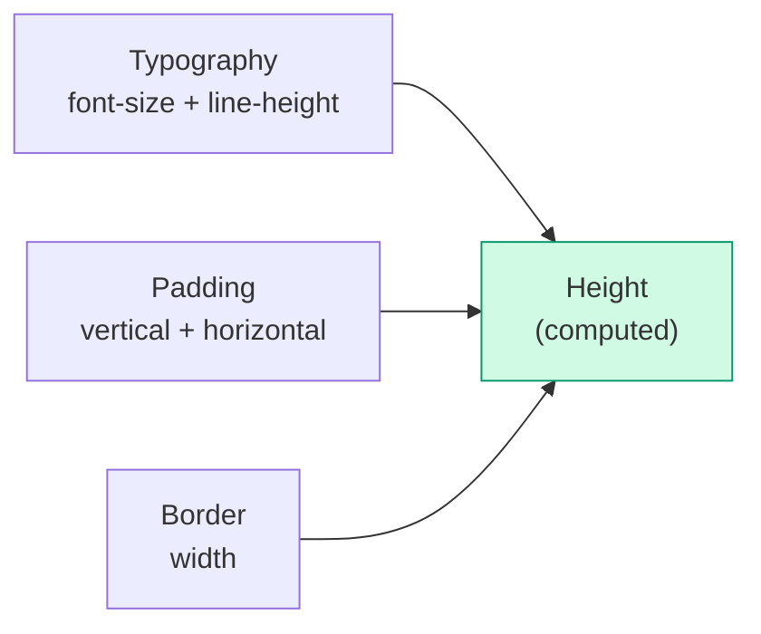

> Original issue: shaun0927/stocktitan-crawler#566

import DevQuickStart from '@site/src/components/DevQuickStart';

<DevQuickStart
  what="Consistent component heights across Button, Input, Select, etc. come from shared typography + spacing tokens, not fixed height values"
  learn="How to unify component sizing with min-height + flexbox instead of fixed heights, and how to separate size from density"
  able="Implement a 3-level size system (S/M/L) with CSS custom properties that automatically aligns all interactive components"
/>

## 핵심 개념

#### 사이즈의 정의



**목표**: 모든 컴포넌트가 **동일한 높이(Height)**를 공유하도록 통일

#### 밀도(Density)와의 관계
- **고밀도**: 데이터 중심 앱, 스크롤 최소화
- **저밀도**: 마케팅 사이트, CTA 집중

## 🎯 단계별 구축 가이드

### Step 1: 사이즈 레벨 정의
```
Small / Medium / Large (3단계) ← 가장 일반적

Small:  고밀도 데이터 인터페이스
Medium: 기본값, 범용
Large:  마케팅/온보딩 플로우
```

### Step 2: CSS Custom Properties로 사이즈 토큰 정의

```css title="size-tokens.css"
:root {
  /* Size token system */
  --size-sm-font: 0.875rem;    /* 14px */
  --size-sm-padding-y: 0.375rem; /* 6px */
  --size-sm-padding-x: 0.75rem;  /* 12px */
  --size-sm-height: 1.75rem;     /* 28px (computed) */

  --size-md-font: 1rem;         /* 16px */
  --size-md-padding-y: 0.625rem; /* 10px */
  --size-md-padding-x: 1rem;     /* 16px */
  --size-md-height: 2.375rem;    /* 38px (computed) */

  --size-lg-font: 1.125rem;     /* 18px */
  --size-lg-padding-y: 0.875rem; /* 14px */
  --size-lg-padding-x: 1.25rem;  /* 20px */
  --size-lg-height: 2.875rem;    /* 46px (computed) */
}
```

### Step 3: Modern CSS - min-height + flexbox

```css title="component-sizing.css"
/* Use min-height + flexbox instead of fixed height */
.button, .input, .select {
  display: inline-flex;
  align-items: center;
  line-height: 1.5;
}

.button--sm, .input--sm, .select--sm {
  font-size: var(--size-sm-font);
  padding: var(--size-sm-padding-y) var(--size-sm-padding-x);
  min-height: var(--size-sm-height);
}

.button--md, .input--md, .select--md {
  font-size: var(--size-md-font);
  padding: var(--size-md-padding-y) var(--size-md-padding-x);
  min-height: var(--size-md-height);
}

.button--lg, .input--lg, .select--lg {
  font-size: var(--size-lg-font);
  padding: var(--size-lg-padding-y) var(--size-lg-padding-x);
  min-height: var(--size-lg-height);
}

/* Border compensation */
.select--sm {
  padding-top: calc(var(--size-sm-padding-y) - 1px);
  padding-bottom: calc(var(--size-sm-padding-y) - 1px);
  border: 1px solid var(--color-border);
}
```

## 📊 사이즈별 컴포넌트 높이 통일

| 사이즈 | Button | Input | Select | List Item | **높이** |
|--------|--------|-------|--------|-----------|---------|
| Small  | 14px font | 14px font | 14px font | 14px font | **28px** |
| Medium | 16px font | 16px font | 16px font | 16px font | **37px** |
| Large  | 18px font | 18px font | 18px font | 18px font | **46px** |

**핵심**: 같은 사이즈 레벨에서 **모든 컴포넌트가 동일한 높이**

## 💡 실무 노하우

### 1. 모든 컴포넌트에 모든 사이즈가 필요하지 않음

| 컴포넌트 | Small | Medium | Large | 이유 |
|---------|-------|--------|-------|------|
| Alert | ❌ | ✅ | ✅ | Small은 주목도 떨어짐 |
| Tag | ✅ | ✅ | ❌ | Large는 지나치게 눈에 띔 |
| Button | ✅ | ✅ | ✅ | 모든 사이즈 필요 |

### 2. Width는 별도 네이밍

```scss
// ❌ 나쁜 예: S/M/L을 Width에 사용
.modal--small { width: 400px; }

// ✅ 좋은 예: Width는 명시적 값 기반
.modal--width-400 { width: 400px; }
.modal--narrow { width: 400px; }
```

### 3. 점진적 마이그레이션 전략

```
1단계: 모든 컴포넌트의 현재 사이즈 측정 (Audit)
2단계: 목표 높이 설정 (28px / 37px / 46px)
3단계: 분기별/반기별 대규모 업데이트
4단계: Major Version Bump (Breaking Change)
```

## 🚨 흔한 실수와 해결

### 실수 1: 높이를 직접 지정
```css
/* BAD: 고정 높이 - 텍스트가 2줄이면 잘림 */
.button--small {
  height: 28px;
  overflow: hidden;
}

/* GOOD: min-height + flexbox - 자연스럽게 확장 */
.button--small {
  font-size: var(--size-sm-font);
  line-height: 1.5;
  padding: var(--size-sm-padding-y) var(--size-sm-padding-x);
  min-height: var(--size-sm-height);
  display: inline-flex;
  align-items: center;
}
```

### ❌ 실수 2: 컴포넌트별 증분 구현
**문제**: Button, Input, Select를 각각 다른 기준으로 구현

**해결**: Mixin/Token으로 **사전 정의** 후 일괄 적용

## 💡 검증 체크리스트

### 설계 단계
- [ ] 사이즈 레벨 정의 (2~3단계)
- [ ] 목표 높이 설정 (Small: ~28px, Medium: ~36-40px, Large: ~44-48px)
- [ ] 핵심 컴포넌트 선정 (Button, Input 우선)

### 구현 단계
- [ ] Typography Mixin/Token 생성
- [ ] Space Token 정의
- [ ] 컴포넌트별 오버라이드 (border/icon 고려)

### 검증 단계
- [ ] 높이 측정
- [ ] 시각적 정렬 확인
- [ ] 크로스 브라우저 테스트

## 🎯 핵심 원칙

1. **높이 통일**: 같은 사이즈 레벨의 모든 컴포넌트는 동일한 높이
2. **Typography + Space**: 높이를 직접 지정하지 말고 자연스럽게 계산
3. **2~3단계 사이즈**: 과도한 세분화 지양
4. **Mixin/Token 우선**: 개별 컴포넌트 전에 공통 툴링 구축
5. **선택적 적용**: 모든 컴포넌트가 모든 사이즈를 가질 필요 없음

---
*출처: Nathan Curtis (EightShapes, 2019)*

---

## 📎 Related Articles

import CrossRef from '@site/src/components/CrossRef';

<CrossRef
  related={[
    { path: "/docs/visual-foundations/spacing", label: "스페이싱 시스템" },
    { path: "/docs/component-design/buttons", label: "버튼 컴포넌트 12가지 팁" },
    { path: "/docs/component-design/right-sizing", label: "Right-Sizing 컴포넌트 설계" },
  ]}
/>
