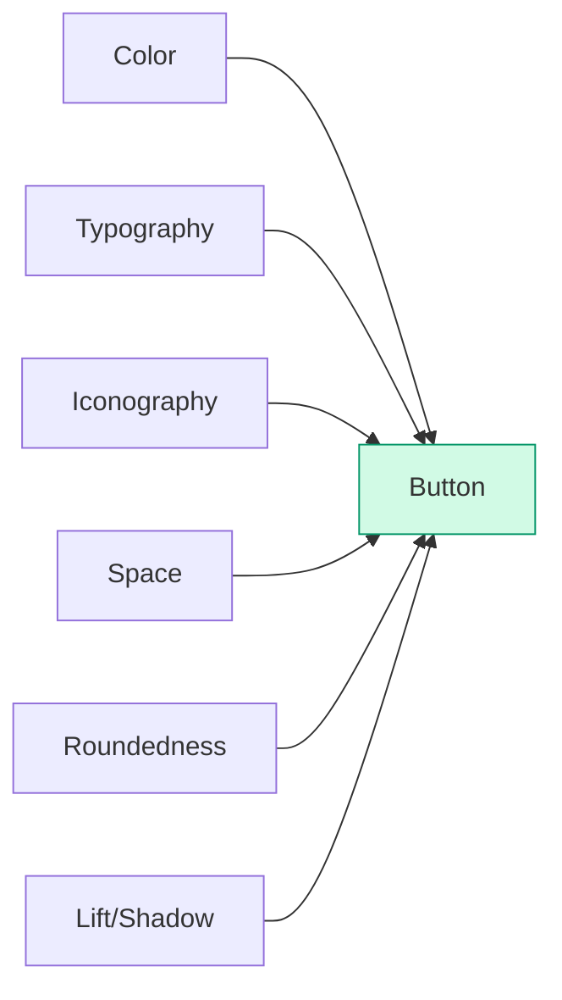

import DevQuickStart from '@site/src/components/DevQuickStart';

<DevQuickStart
  what="Buttons are the most important design system component - getting color, typography, spacing, and interaction states right sets the tone for everything else"
  learn="12 practical tips covering primary/secondary/ghost variants, 6 interaction states, size scales, and semantic HTML requirements"
  able="Implement a complete React Button component with TypeScript props, CSS custom properties, and all interaction states"
/>

## 핵심 개념

> "Buttons are arguably a design system's most important component."

### 버튼이 중요한 이유
1. **인터랙션의 원시적 표현**: 사용자 행동 → 결과
2. **디자인 언어의 순수한 원자적 표현**: 색상 + 타이포그래피 + 아이콘
3. **더 복잡한 컴포넌트의 기반**: 버튼 속성이 전체 시스템으로 파급

### 버튼의 핵심 속성



## 🎯 12가지 버튼 팁

### Primary Button

#### #1. 시스템의 스타일 톤 설정
```css
/* Big Three 먼저 정의 */
.button {
  /* 색상 */ background-color: var(--color-primary);
  /* 타이포 */ font-size: var(--font-size-body);
  /* Space */ padding: var(--space-md) var(--space-lg);
  /* 고급 */ border-radius: var(--border-radius-base);
}
```

#### #2. 언어적 톤도 함께 설정
```
명령형 사용:
✅ "Save", "Close", "Delete"
❌ "Saving", "Click to Close"

일관된 용어:
- 저장: "Save" (항상)
- 취소: "Cancel" (항상)
- 삭제: "Delete" (위험 액션)
```

#### #3. 복잡한 배경에서는 반전 버튼 사용
| 배경 유형 | 권장 버튼 | 비고 |
|----------|-----------|------|
| 흰색/밝은 회색 | Primary | 기본 |
| 어두운 회색/검정 | Inverted | 필수 |
| 밝은 사진 | Primary | 오버레이 |
| 어두운 사진 | Inverted | 필수 |

#### #4. 페이지당 하나로 제한 (반복 액션 제외)
```
기본 원칙: 페이지당 Primary 버튼 1개
예외: 검색 결과 등 동일 액션 반복
```

#### #5. 버튼의 인터랙션 아크 디자인
**필수 상태 6가지**:
- Default (기본)
- Hover (호버)
- Focus (포커스) - 접근성 필수
- Press/Active (누름)
- Disabled (비활성화)
- Progress/Loading (진행 중)

#### #6. 혼합 요소에 대한 복원력 확보
```tsx
// 복원력 있는 레이아웃
.button {
  display: inline-flex;
  align-items: center;
  gap: 8px;
}
```

### Secondary Buttons

#### #7. Secondary ≠ Disabled 확실히 구분
```css
/* Primary */
.btn-primary {
  background-color: #0066CC;
  color: white;
}

/* Secondary (색상 유지) */
.btn-secondary {
  background-color: white;
  color: #0066CC;
  border: 2px solid #0066CC;
}

/* Disabled (명확히 구분) */
.btn-primary:disabled {
  background-color: #E0E0E0;
  color: #9E9E9E;
  opacity: 0.5;
}
```

#### #8. Ghost 버튼 사용 시 주의
```
문제점:
- 가시성 부족 (특히 복잡한 배경)
- 사용성 테스트에서 반복적으로 실패

대안:
- Outline 버튼 (Ghost보다 대비 높음)
- 밝은 배경 Secondary
```

### Additional Button Types

#### #9. 크기 변형 제공
```css
/* 크기 스케일 정의 */
MICRO   SMALL   DEFAULT   LARGE   PUFFY
28px    36px    44px      56px    64px+
```

#### #10. Flat 버튼과 링크 구분
| | DEFAULT BUTTON | FLAT BUTTON | LINK |
|-|----------------|-------------|------|
| 배경 | 있음 (파랑) | 없음 | 없음 |
| HTML | `<button>` | `<button>` | `<a>` |
| 용도 | 액션 실행 | 액션 실행 | 페이지 이동 |

#### #11. 메뉴 및 존 버튼으로 다양성 확보
- **Menu Button**: 독립 옵션
- **Toggled Menu Button**: 현재 선택 표시
- **Split Button**: 분리된 존 (기본 액션 + 메뉴)

#### #12. 토글부터 툴바까지
```
Button Group: [Primary] [Secondary 1] [Secondary 2]
Toggle Buttons: [B] [I] [U]
Toolbar: [Primary] [Secondary] [Toggle] [Menu ▼]
```

## 💡 실무 체크리스트

### 디자인 시스템 버튼 구축
```
□ Primary Button
  □ 시각적 스타일 정의
  □ 토큰 변수와 연동
  □ 레이블 작성 가이드
  □ 다양한 배경에서 테스트

□ 인터랙션 상태
  □ 6가지 상태 디자인
  □ Live Demo + State Gallery

□ Secondary & Tertiary
  □ Secondary ≠ Disabled 구분
  □ Ghost 버튼 신중하게 사용

□ 크기 변형
  □ Micro, Small, Default, Large, Puffy
  □ 반응형 크기 전략

□ 코드 & 접근성
  □ <button> 요소 사용
  □ ARIA 속성
  □ 키보드 네비게이션 테스트
```

## 🚨 HTML 의미론적 사용

```html
<!-- ✅ 올바른 예: <button> 사용 -->
<button type="button" class="btn btn-primary">
  Save
</button>

<!-- ❌ 나쁜 예: <div>로 버튼 흉내 -->
<div onclick="save()">Save</div>
```

**왜 `<button>`을 써야 하는가?**
- 키보드 접근성 자동 지원
- 스크린 리더가 버튼으로 인식
- 브라우저 기본 동작 지원

## React Button Component

```tsx title="Button.tsx"
import React from 'react';

type ButtonVariant = 'primary' | 'secondary' | 'ghost' | 'danger';
type ButtonSize = 'sm' | 'md' | 'lg';

interface ButtonProps extends React.ButtonHTMLAttributes<HTMLButtonElement> {
  variant?: ButtonVariant;
  size?: ButtonSize;
  loading?: boolean;
  icon?: React.ReactNode;
  children: React.ReactNode;
}

const sizeMap: Record<ButtonSize, string> = {
  sm: 'btn--sm',
  md: 'btn--md',
  lg: 'btn--lg',
};

export function Button({
  variant = 'primary',
  size = 'md',
  loading = false,
  icon,
  disabled,
  children,
  ...props
}: ButtonProps) {
  return (
    <button
      className={`btn btn--${variant} ${sizeMap[size]}`}
      disabled={disabled || loading}
      aria-busy={loading || undefined}
      {...props}
    >
      {loading ? (
        <span className="btn__spinner" aria-hidden="true" />
      ) : icon ? (
        <span className="btn__icon" aria-hidden="true">{icon}</span>
      ) : null}
      <span className="btn__label">{children}</span>
    </button>
  );
}
```

```css title="button.css"
.btn {
  display: inline-flex;
  align-items: center;
  gap: 0.5rem;
  font-weight: 500;
  border: none;
  border-radius: var(--radius-md, 0.5rem);
  cursor: pointer;
  transition: background-color 0.2s, box-shadow 0.2s;
}

/* Sizes */
.btn--sm { font-size: 0.875rem; padding: 0.375rem 0.75rem; min-height: 1.75rem; }
.btn--md { font-size: 1rem; padding: 0.625rem 1rem; min-height: 2.375rem; }
.btn--lg { font-size: 1.125rem; padding: 0.875rem 1.25rem; min-height: 2.875rem; }

/* Variants */
.btn--primary { background: var(--color-primary); color: white; }
.btn--primary:hover:not(:disabled) { background: var(--color-primary-hover); }
.btn--primary:active:not(:disabled) { background: var(--color-primary-active); }

.btn--secondary {
  background: transparent;
  color: var(--color-primary);
  box-shadow: inset 0 0 0 2px var(--color-primary);
}

.btn--ghost { background: transparent; color: var(--color-primary); }
.btn--ghost:hover:not(:disabled) { background: var(--color-primary-subtle); }

.btn--danger { background: var(--color-error); color: white; }

/* States */
.btn:focus-visible { outline: 2px solid var(--color-focus); outline-offset: 2px; }
.btn:disabled { opacity: 0.5; cursor: not-allowed; }
```

## 참고 자료

- Nathan Curtis, "Buttons in Design Systems" (EightShapes, 2016)
- [WAI-ARIA Authoring Practices - Button](https://www.w3.org/WAI/ARIA/apg/patterns/button/) — 접근성 버튼 패턴
- [Radix UI Button](https://www.radix-ui.com/primitives/docs/components/button) — Headless 버튼 컴포넌트
- [Material Design - Buttons](https://m3.material.io/components/buttons/overview) — 버튼 시스템 사례
- Brad Frost, "Atomic Design" (2016) — 컴포넌트 원자 이론
- [Button Contrast Checker](https://buttonbuddy.dev/) — 버튼 접근성 검증 도구

> **실제 사례**: GitHub Primer Design System은 Primary/Secondary/Danger/Invisible 4가지 variant로 모든 인터랙션을 처리하며, 각 variant는 6가지 상태(default/hover/active/disabled/focus/loading)를 완전히 구현합니다. 특히 Focus 상태는 WCAG 2.1 기준을 초과하는 3px outline + 4px offset으로 키보드 사용자의 가시성을 극대화합니다.

> **심화 이론**: 버튼의 **Interaction Arc**(상호작용 호)는 UX 마이크로인터랙션 이론의 핵심입니다. Default → Hover → Press → Release → Success 흐름이 매끄러우면 사용자는 무의식적으로 "잘 작동한다"고 느낍니다. Press 상태에서 미세한 scale 변화(98%)나 box-shadow 감소는 물리적 버튼을 누르는 촉각 피드백을 시각적으로 시뮬레이션합니다.

---

## 📎 Related Articles

import CrossRef from '@site/src/components/CrossRef';

<CrossRef
  related={[
    { path: "/docs/visual-foundations/sizing", label: "사이즈 시스템 - 컴포넌트 높이 통일" },
    { path: "/docs/design-tokens/token-tips", label: "디자인 토큰 10가지 핵심 팁" },
    { path: "/docs/component-documentation/documenting-components", label: "컴포넌트 문서화 - Serving System Audiences" },
  ]}
/>
