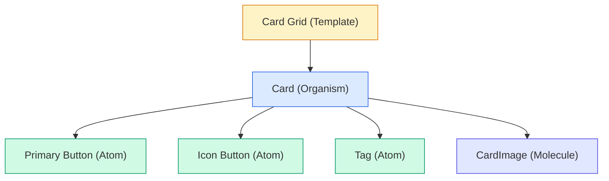

import DevQuickStart from '@site/src/components/DevQuickStart';

<DevQuickStart
  what="Component libraries need rich hierarchy from atomic elements to pre-assembled shells - not just a flat list of parts"
  learn="5 principles for sizing components: hierarchical nesting, encapsulation, big components, grid-as-component, and shell patterns"
  able="Structure a component library with proper hierarchy using npm package organization and React component trees"
/>

## 핵심 메시지

> **"컴포넌트 라이브러리는 단순한 부품 목록이 아니라, 작은 것부터 큰 것까지 계층적으로 짜여진 태피스트리다."**

디자인 시스템의 컴포넌트는 **단일 계층이 아닌 풍부한 계층적 구조**로 설계되어야 한다.

## 🎯 5가지 핵심 원칙

### #1. 컴포넌트는 계층적이며 다른 컴포넌트를 포함한다



**효과**:
- 라이브러리 제작자와 이해관계자가 더욱 섬세한 토론 가능
- "무엇이 중요한가", "어떻게 연관되는가"에 대한 명확한 이해

### #2. 작은 컴포넌트를 만들고 캡슐화하라

**필수 최소 컴포넌트 (~10-20개)**:
- Button, Textbox, Tag, Checkbox, Breadcrumb, Modal, Forms, Card 등

**캡슐화 도구**:
```css
/* CSS Custom Properties for encapsulation */
.btn-primary {
  background-color: var(--color-primary);
  padding: var(--space-s) var(--space-m);
  border-radius: var(--radius-md);
}
```

> "캡슐화는 라이브러리 확장에 필수적이지만, 복잡성을 증가시킨다. 효과적인 캡슐화는 결코 공짜가 아니다."

### #3. 중요한 큰 컴포넌트도 제공하라

**제공해야 할 큰 컴포넌트**:
- **Hero Carousel**
- **Toolbar** (다양한 메뉴, 아이콘, 버튼 포함)
- **Header System** (여러 제품에 걸친 통합)

> "5개 이상의 제품에 원자적 요소만 주고 최선을 바란다? 비용과 일관성 측면에서 터무니없음!"

**큰 컴포넌트의 부가 가치**:
1. **이음새(Seams) 노출**: 작은 것이 큰 것에 어떻게 맞는지 학습
2. **품질 보증(QA)**: 토큰 변경 시 영향 확인

### #4. Grid는 컴포넌트이지 Layout이 아니다

**Grid의 정체**:
- Grid는 **컴포넌트**다
- 페이지 반응성의 중심축
- 계층적: row → column → row → column
- 다른 컴포넌트를 담고 또 담김

**Grid ≠ 전체 Layout**:
- Grid는 최상위 컴포넌트가 아님
- 작은 부품들과 Layout 사이에 끼인 **중간 컴포넌트**

**Layout의 역할**:
- 빈 페이지 영역 제공
- 예: header, footer, sidebar가 main content를 둘러쌈

### #5. 사용자는 조립된 Shell을 가치있게 여긴다

**Shell의 정의**:
- 단순한 Grid나 빈 Layout이 아님
- **이미 Header, Global Navigation, 가능하면 Footer 포함**

**Shell의 가치**:
1. **조립 프로세스 간소화**: 몇 단계 앞서 시작 가능
2. **Bottom-up vs Top-down의 만남**:
   - 라이브러리는 bottom-up으로 시작 (원자적 요소)
   - 사용자는 top-down으로 구성 시작
   - **대화는 항상 중간에서 만난다**

## 📊 계층 분류 체계

| 계층 | 크기 기준 | 예시 | 재사용성 | 복잡도 |
|------|-----------|------|----------|--------|
| **Atomic** | 단일 요소 | Button, Input, Icon | 매우 높음 | 낮음 |
| **Molecular** | 2-5개 원자 | Search Field, Breadcrumb | 높음 | 중간 |
| **Organism** | 여러 분자 | Card, Toolbar, Navigation | 중간 | 중간-높음 |
| **Template** | 여러 유기체 | Card Grid, Product List | 낮음 | 높음 |
| **Shell** | 전역 구조 | Header + Navigation + Footer | 매우 낮음 | 매우 높음 |

## 💡 실무 우선순위 로드맵

### Phase 1: Foundation (0-3개월)
- ✅ 10-20개 작은 컴포넌트
- ✅ Grid 시스템
- ✅ 기본 Layout (1-2개)

### Phase 2: Composition (3-6개월)
- ✅ 5-10개 중간 컴포넌트 (Card, Toolbar)
- ✅ 캡슐화 패턴 정립

### Phase 3: Integration (6-9개월)
- ✅ 2-5개 큰 컴포넌트 (Header, Hero)
- ✅ 1-3개 Shell
- ✅ 제품 간 일관성 검증

### Phase 4: Maturity (9-12개월)
- ✅ 테마/변형 시스템
- ✅ 고급 패턴 라이브러리
- ✅ 자동화된 테스트/QA

## 🎓 핵심 교훈

### 1. "작은 것이 항상 좋은 것은 아니다"
- 큰 컴포넌트(Header, Hero) 없이 일관성 달성 불가능
- 중복 작업 발생: 5개 팀이 각각 Header를 만듦

### 2. "Grid는 컴포넌트다"
- Grid도 변형이 있고, 관리가 필요하며, 캡슐화됨
- Shell(전체 레이아웃)과 구분

### 3. "캡슐화는 공짜가 아니다"
- CSS 클래스 충돌
- 작은 컴포넌트 변경 시 큰 컴포넌트 깨짐
- 초기에 캡슐화 전략 수립 필요

### 4. "Shell로 시작점을 제공하라"
- 사용자는 top-down으로 생각함
- 빈 레이아웃만 주면 막막함
- "중간에서 만나기": bottom-up 부품 + top-down Shell

### 5. "큰 컴포넌트는 이음새를 드러낸다"
- 작은 부품들이 어떻게 조합되는지 실제 예시
- spacing, color, variable 사용법 학습
- QA: 토큰 변경 시 영향 확인

## ✅ 체크리스트

### 계층 구조 이해
- [ ] 컴포넌트가 다른 컴포넌트를 포함할 수 있음을 팀이 이해하는가?
- [ ] 문서에 컴포넌트 계층 다이어그램이 있는가?

### 작은 컴포넌트
- [ ] 10-20개 이상의 원자적 컴포넌트가 있는가?
- [ ] 캡슐화 전략이 정립되어 있는가?

### 큰 컴포넌트
- [ ] 중요한 큰 컴포넌트(Header, Hero, Toolbar)를 제공하는가?
- [ ] 큰 컴포넌트의 복잡성을 관리할 계획이 있는가?

### Grid vs Layout
- [ ] Grid를 컴포넌트로 취급하는가?
- [ ] Layout과 Grid를 구분하는가?

### Shell 제공
- [ ] 사전 조립된 Shell(Header + Footer 포함)을 제공하는가?
- [ ] Shell을 통해 글로벌 컴포넌트 재구축을 방지하는가?

## npm Package Structure

```
@myds/
├── core/                 # Atomic elements
│   ├── button/
│   ├── input/
│   ├── icon/
│   └── tag/
├── patterns/             # Molecular/Organism
│   ├── card/
│   ├── toolbar/
│   └── search-field/
├── layouts/              # Templates
│   ├── grid/
│   ├── page-layout/
│   └── sidebar-layout/
└── shells/               # Pre-assembled shells
    ├── app-shell/        # Header + Nav + Footer + Slot
    └── admin-shell/
```

```tsx title="AppShell.tsx"
interface AppShellProps {
  header?: React.ReactNode;
  sidebar?: React.ReactNode;
  footer?: React.ReactNode;
  children: React.ReactNode;
}

export function AppShell({ header, sidebar, footer, children }: AppShellProps) {
  return (
    <div className="app-shell">
      {header && <header className="app-shell__header">{header}</header>}
      <div className="app-shell__body">
        {sidebar && <aside className="app-shell__sidebar">{sidebar}</aside>}
        <main className="app-shell__main">{children}</main>
      </div>
      {footer && <footer className="app-shell__footer">{footer}</footer>}
    </div>
  );
}
```

## 참고 자료

- Nathan Curtis, "Component Library Hierarchy" (EightShapes, 2017)
- Brad Frost, "Atomic Design Methodology" (2016) — 컴포넌트 계층 이론
- [Storybook Composition](https://storybook.js.org/docs/react/sharing/storybook-composition) — 계층적 컴포넌트 문서화
- [Radix UI Primitives](https://www.radix-ui.com/primitives) — Atomic/Compositional 아키텍처 사례
- [Shopify Polaris Component Library](https://polaris.shopify.com/) — Shell 제공 전략
- Dan Abramov, "Presentational and Container Components" (2015)

> **실제 사례**: Shopify Polaris는 Atomic(Button, TextField) → Patterns(SearchField, EmptyState) → Shells(AppProvider + Frame + TopBar) 3계층 구조로 설계됩니다. Shell 컴포넌트는 이미 전역 네비게이션과 인증 상태를 포함하여, 개발자가 빈 페이지에서 시작하지 않고 "90% 완성된 앱"에서 시작하게 합니다.

> **심화 이론**: 계층적 컴포넌트 구조는 **Encapsulation**(캡슐화)과 **Composition**(조합)의 균형입니다. 너무 많은 캡슐화는 유연성을 제한하고(mega-component with 50 props), 너무 적은 캡슐화는 일관성을 해칩니다. 적절한 계층 분리는 각 레벨이 명확한 책임을 가지도록 하여, Gang of Four의 **Single Responsibility Principle**을 컴포넌트 아키텍처에 적용한 것입니다.

---

## 📎 Related Articles

import CrossRef from '@site/src/components/CrossRef';

<CrossRef
  related={[
    { path: "/docs/component-design/cards-composability", label: "Cards and Composability - 컴포저블 컴포넌트 설계" },
    { path: "/docs/visual-foundations/sizing", label: "사이즈 시스템 - 컴포넌트 높이 통일" },
    { path: "/docs/component-documentation/documenting-components", label: "컴포넌트 문서화 - Serving System Audiences" },
  ]}
/>
