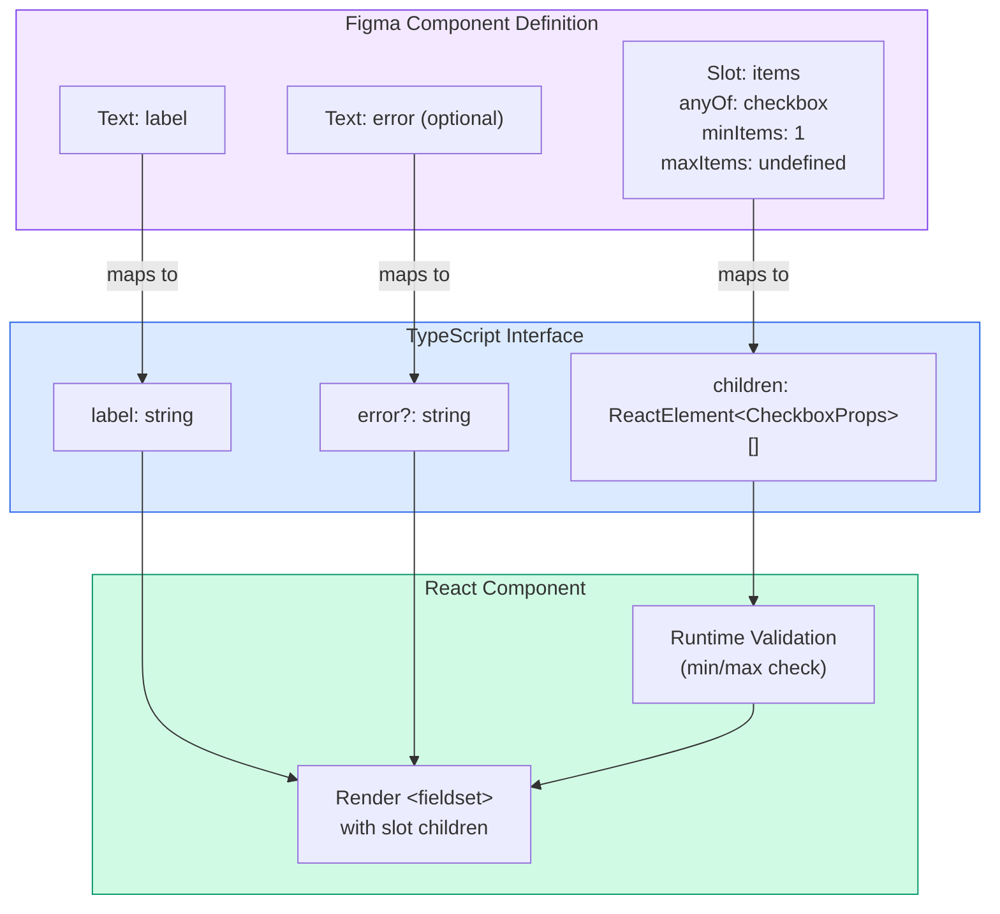

import DevQuickStart from '@site/src/components/DevQuickStart';

<DevQuickStart
  what="Figma native slots solve repeating item patterns (checkbox groups, tabs, breadcrumbs) with better composability than instance swapping or hidden layers"
  learn="Slot naming conventions, default item quantity rules, min/max constraints, and how Figma slot properties map to React component props"
  able="Map Figma slot definitions to TypeScript component interfaces with proper type constraints"
/>

## 핵심 개념

- **Repeating items는 가장 흔한 패턴**: Checkbox Group, Radio Button Group, Tabs, Breadcrumbs 등
- **기존 방식의 한계**: Instance swapping (불편), Hidden layers (성능 저하), Count props (variant 폭발)
- **Native Slots 솔루션**: 향상된 조합성, 낮은 에셋 복잡도, 명확한 API

## 🎯 실무 노하우

### Naming Convention
- ✅ **권장**: `items` (목적성 있는 이름)
- ⚠️ **비권장**: `children` (너무 범용적)

### Default Item Quantity
- ✅ **권장**: 3개 (Indeterminate list 느낌, Selected state 구분)
- ⚠️ **주의**: Default ≠ Example

### Min/Max Item Constraints
```yaml
items:
  type: slot
  anyOf: checkbox
  minItems: 1    # 최소 1개 필수
  maxItems: 4    # 선택적 (Avatar Group 등)
```

### Preferred vs Permitted Values
- Figma slots는 본질적으로 **개방형** (신뢰 기반 시스템)
- **Code-only props**로 validation 규칙 명세
- 디자인 QA + 코드 생성 시 검증

### Slot Architecture Pattern
```yaml
checkboxGroup:
  elements:
    headerArea:    # Header 영역
    items:         # 반복 아이템 영역 (Slot!)
    error:         # Validation 영역
```

## 📊 다이어그램

### Checkbox Group 구조
```
┌─────────────────────────────────────┐
│ {Checkbox group label}              │
│ ┌─ Items Slot ──────────────────┐  │
│ │ ☐ {Checkbox item label}       │  │
│ │ ☐ {Checkbox item label}       │  │
│ │ ☐ {Checkbox item label}       │  │
│ └───────────────────────────────┘  │
└─────────────────────────────────────┘
```

### Slot Property Panel (사용자 경험)
1. `Items` 슬롯 옆 `⊕` 버튼 클릭
2. "Add instances" 패널 오픈
3. "Preferred" 탭에서 `DS Checkbox` 선택
4. 검색도 가능 (`Search preferred values`)

## 🎨 Figma Slot → Code 시각적 매핑

이 다이어그램은 Figma의 slot 정의가 어떻게 React 코드로 변환되는지 보여줍니다.



---

## 📋 Figma Slot 정의 표기법 (표준화)

기존 YAML 표기법 대신, Figma의 실제 UI와 일치하는 표준 JSON 스키마를 사용합니다.

### Figma Properties Panel 표기

```json
{
  "componentName": "CheckboxGroup",
  "properties": {
    "label": {
      "type": "text",
      "default": "Select options"
    },
    "items": {
      "type": "slot",
      "anyOf": ["Checkbox"],
      "minItems": 1,
      "maxItems": null,
      "preferredValues": ["DS Checkbox", "DS Checkbox (with description)"]
    },
    "error": {
      "type": "text",
      "default": "",
      "visible": "if has validation error"
    }
  }
}
```

### 동등한 TypeScript 정의

```typescript
interface FigmaSlotDefinition {
  type: 'slot';
  /** Which component types are allowed in this slot */
  anyOf: string[];
  /** Minimum number of items required */
  minItems?: number;
  /** Maximum number of items allowed (null = unlimited) */
  maxItems?: number | null;
  /** Suggested components shown in "Add instances" panel */
  preferredValues?: string[];
}

// Example: Checkbox Group slot configuration
const checkboxGroupSlot: FigmaSlotDefinition = {
  type: 'slot',
  anyOf: ['Checkbox'],
  minItems: 1,
  maxItems: null,
  preferredValues: ['DS Checkbox']
};
```

---

## 🛠️ 완전한 Card 컴포넌트 예시 (3개 Slot)

이 예시는 여러 slot을 가진 복잡한 컴포넌트를 보여줍니다.

### Figma Component Structure

```
Card
├── header (slot: CardHeader)
├── media (slot: Image | Video)
├── content (slot: any, minItems: 1)
└── actions (slot: Button, maxItems: 3)
```

### Figma Slot Definitions (JSON)

```json
{
  "componentName": "Card",
  "slots": {
    "header": {
      "type": "slot",
      "anyOf": ["CardHeader"],
      "minItems": 0,
      "maxItems": 1,
      "preferredValues": ["DS Card Header"]
    },
    "media": {
      "type": "slot",
      "anyOf": ["Image", "Video", "Chart"],
      "minItems": 0,
      "maxItems": 1,
      "preferredValues": ["DS Image", "DS Video"]
    },
    "content": {
      "type": "slot",
      "anyOf": ["Text", "Paragraph", "List"],
      "minItems": 1,
      "maxItems": null
    },
    "actions": {
      "type": "slot",
      "anyOf": ["Button"],
      "minItems": 0,
      "maxItems": 3,
      "preferredValues": ["DS Button Primary", "DS Button Secondary"]
    }
  }
}
```

### TypeScript Interface (Generated)

```typescript
interface CardHeaderProps {
  title: string;
  subtitle?: string;
}

interface CardProps {
  /** Optional: Card header (max 1) */
  header?: React.ReactElement<CardHeaderProps>;

  /** Optional: Visual media (Image, Video, or Chart) */
  media?: React.ReactElement<ImageProps | VideoProps | ChartProps>;

  /** Required: Main content (min 1, no max) */
  children: React.ReactNode;

  /** Optional: Action buttons (max 3) */
  actions?: React.ReactElement<ButtonProps> | React.ReactElement<ButtonProps>[];

  /** Visual props */
  elevation?: 'flat' | 'raised' | 'floating';
  padding?: 'none' | 'compact' | 'default' | 'spacious';
}
```

### React Component Implementation

```typescript
import React from 'react';

export function Card({
  header,
  media,
  children,
  actions,
  elevation = 'raised',
  padding = 'default'
}: CardProps) {
  // Runtime validation
  const actionButtons = React.Children.toArray(actions);
  if (actionButtons.length > 3) {
    console.warn(`Card: Too many actions (${actionButtons.length}). Maximum is 3.`);
  }

  const childrenArray = React.Children.toArray(children);
  if (childrenArray.length < 1) {
    console.warn('Card: At least 1 content child is required.');
  }

  return (
    <div
      className={`card card--${elevation} card--padding-${padding}`}
      role="article"
    >
      {/* Slot: header (optional, max 1) */}
      {header && (
        <div className="card__header">
          {header}
        </div>
      )}

      {/* Slot: media (optional, max 1) */}
      {media && (
        <div className="card__media">
          {media}
        </div>
      )}

      {/* Slot: content (required, min 1) */}
      <div className="card__content">
        {children}
      </div>

      {/* Slot: actions (optional, max 3) */}
      {actions && actionButtons.length > 0 && (
        <div className="card__actions">
          {actionButtons.slice(0, 3)}
        </div>
      )}
    </div>
  );
}

// Sub-component: CardHeader
export function CardHeader({ title, subtitle }: CardHeaderProps) {
  return (
    <header className="card-header">
      <h3 className="card-header__title">{title}</h3>
      {subtitle && <p className="card-header__subtitle">{subtitle}</p>}
    </header>
  );
}
```

### Usage Example

```tsx
import { Card, CardHeader } from './Card';
import { Image } from './Image';
import { Button } from './Button';

function ProductCard() {
  return (
    <Card elevation="floating" padding="default">
      {/* Slot: header */}
      <CardHeader
        title="Premium Headphones"
        subtitle="Noise-cancelling, 30hr battery"
      />

      {/* Slot: media */}
      <Image
        src="/headphones.jpg"
        alt="Premium headphones"
        aspectRatio="16:9"
      />

      {/* Slot: content (children) */}
      <p>
        Experience studio-quality sound with advanced noise cancellation
        technology. Perfect for music lovers and remote workers.
      </p>
      <p className="price">$299.99</p>

      {/* Slot: actions (max 3) */}
      <Button variant="primary">Add to Cart</Button>
      <Button variant="secondary">Learn More</Button>
    </Card>
  );
}
```

---

## 🧑‍💻 개발자 구현 가이드: Figma Spec → React Component

Figma 디자이너로부터 slot이 포함된 컴포넌트 스펙을 받았을 때, 이 단계를 따르세요.

### Step 1: Figma 스펙 읽기

디자이너가 제공하는 스펙 문서 또는 Figma Dev Mode에서 다음 정보를 확인:

- **Slot 이름**: `items`, `actions`, `header` 등
- **anyOf**: 허용되는 컴포넌트 타입
- **minItems/maxItems**: 개수 제약
- **preferredValues**: 권장 컴포넌트 목록

### Step 2: TypeScript Interface 생성

```typescript
// From Figma spec:
// items: { type: slot, anyOf: [Checkbox], minItems: 1 }

interface CheckboxGroupProps {
  // Slot → children prop
  children: React.ReactElement<CheckboxProps> | React.ReactElement<CheckboxProps>[];
  // Other visual props from Figma
  label: string;
  error?: string;
  orientation?: 'vertical' | 'horizontal';
}
```

**매핑 규칙:**
- Figma slot → React `children` prop (또는 named slot prop)
- `anyOf: [Type]` → `ReactElement<TypeProps>`
- `minItems: 1` → Type validation in component
- `maxItems: 3` → `.slice(0, 3)` in render

### Step 3: 런타임 검증 추가

```typescript
function CheckboxGroup({ children, label, error, orientation = 'vertical' }: CheckboxGroupProps) {
  const items = React.Children.toArray(children);

  // Validate minItems
  if (items.length < 1) {
    console.warn('[CheckboxGroup] minItems violation: At least 1 Checkbox required');
  }

  // Validate anyOf (type checking)
  const invalidChildren = items.filter(child => {
    return !React.isValidElement(child) || child.type !== Checkbox;
  });

  if (invalidChildren.length > 0) {
    console.warn(
      `[CheckboxGroup] anyOf violation: Only Checkbox components allowed. ` +
      `Found ${invalidChildren.length} invalid children.`
    );
  }

  return (/* render implementation */);
}
```

### Step 4: Storybook Examples 작성

```typescript
import type { Meta, StoryObj } from '@storybook/react';
import { CheckboxGroup, Checkbox } from './CheckboxGroup';

const meta: Meta<typeof CheckboxGroup> = {
  title: 'Components/CheckboxGroup',
  component: CheckboxGroup,
  parameters: {
    design: {
      type: 'figma',
      url: 'https://figma.com/file/xxx/CheckboxGroup',
    },
  },
};

export default meta;
type Story = StoryObj<typeof CheckboxGroup>;

// Valid: meets minItems = 1
export const Default: Story = {
  render: () => (
    <CheckboxGroup label="Select your interests">
      <Checkbox label="Design Systems" />
      <Checkbox label="Component Libraries" />
      <Checkbox label="Accessibility" />
    </CheckboxGroup>
  ),
};

// Invalid: violates minItems (triggers console.warn in dev)
export const MinItemsViolation: Story = {
  render: () => (
    <CheckboxGroup label="Empty group (invalid)">
      {/* No children - violates minItems: 1 */}
    </CheckboxGroup>
  ),
  parameters: {
    docs: {
      description: {
        story: '⚠️ This example violates minItems constraint (should have at least 1 Checkbox)',
      },
    },
  },
};

// Invalid: violates anyOf (wrong child type)
export const AnyOfViolation: Story = {
  render: () => (
    <CheckboxGroup label="Invalid children">
      <Checkbox label="Valid checkbox" />
      <button>Invalid button</button> {/* ❌ anyOf violation */}
    </CheckboxGroup>
  ),
};
```

### Step 5: 디자인 QA 체크리스트

컴포넌트 구현 후 디자이너와 함께 검증:

- [ ] Slot 이름이 Figma 정의와 일치하는가?
- [ ] `minItems` 제약이 런타임 검증되는가?
- [ ] `maxItems` 제약이 enforced되는가? (`.slice()` 또는 warning)
- [ ] `preferredValues`가 Storybook examples에 반영되었는가?
- [ ] 잘못된 자식 컴포넌트 사용 시 명확한 에러 메시지가 표시되는가?

---

## 🔄 Figma Slots to TypeScript Mapping (완전판)

### Basic Mapping

```typescript
// Figma slot definition
interface FigmaSlotSpec {
  type: 'slot';
  anyOf: string[];
  minItems?: number;
  maxItems?: number | null;
}

// React TypeScript mapping utility
type SlotToReactType<
  T extends FigmaSlotSpec,
  ComponentType
> = T['minItems'] extends 1
  ? T['maxItems'] extends 1
    ? React.ReactElement<ComponentType>  // Exactly 1
    : React.ReactElement<ComponentType> | React.ReactElement<ComponentType>[]  // 1 or more
  : T['maxItems'] extends 1
    ? React.ReactElement<ComponentType> | undefined  // 0 or 1
    : React.ReactElement<ComponentType>[] | undefined;  // 0 or more

// Usage
type CheckboxSlot = SlotToReactType<
  { type: 'slot'; anyOf: ['Checkbox']; minItems: 1; maxItems: null },
  CheckboxProps
>;
// Result: ReactElement<CheckboxProps> | ReactElement<CheckboxProps>[]
```

### Advanced: Multi-Type Slot

```typescript
// Figma: anyOf: ["Image", "Video", "Chart"]
type MediaSlot = React.ReactElement<ImageProps | VideoProps | ChartProps>;

interface CardProps {
  media?: MediaSlot;
}

// Runtime type guard
function isValidMediaComponent(element: React.ReactNode): element is MediaSlot {
  if (!React.isValidElement(element)) return false;
  const validTypes = [Image, Video, Chart];
  return validTypes.some(type => element.type === type);
}
```

## 참고 자료

- [Figma Component Properties](https://help.figma.com/hc/en-us/articles/5579474826519-Create-and-use-component-properties) — Figma 공식 가이드
- [Figma Variants Documentation](https://help.figma.com/hc/en-us/articles/360056440594-Create-and-use-variants) — Variant 활용법
- Nathan Curtis, "Design Systems in Figma" (EightShapes, 2020)
- [Figma Best Practices](https://www.figma.com/best-practices/) — 컴포넌트 설계 베스트 프랙티스
- [Design Systems for Figma](https://www.designsystemsforfigma.com/) — Figma DS 리소스
- Thomas Lowry, "Figma Component Architecture" (2021)

> **실제 사례**: Uber's Base Design System은 Figma에서 ListItem 컴포넌트를 100개 이상의 variant 조합(leading slot × trailing slot × size × state)으로 정의했다가, 유지보수 불가능 상태가 되었습니다. 이를 Boolean Properties + Instance Swap으로 재설계하여 variant 수를 90% 감소시켰고, 디자이너 생산성이 3배 향상되었습니다.

> **심화 이론**: Figma의 Instance Swap은 **Strategy Pattern**(전략 패턴)의 시각적 구현입니다. 런타임에 알고리즘(슬롯 내용)을 교체할 수 있도록 하여, 컴포넌트 구조를 변경하지 않고도 동작을 바꿀 수 있습니다. 이는 Gang of Four 디자인 패턴을 디자인 도구에 적용한 혁신적 사례입니다.

---

## 📎 Related Articles

import CrossRef from '@site/src/components/CrossRef';

<CrossRef
  related={[
    { path: "/docs/component-design/slots", label: "Slots in Design Systems - 조합의 철학" },
    { path: "/docs/component-design/code-only-props", label: "Code Only Props - 비시각적 속성 관리" },
    { path: "/docs/component-documentation/component-examples", label: "컴포넌트 예시 15가지 팁" },
  ]}
/>
