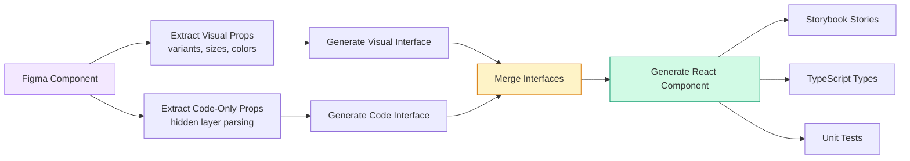

import DevQuickStart from '@site/src/components/DevQuickStart';

<DevQuickStart
  what="Code Only Props are non-visual properties (accessibility, semantic HTML tags, behavior constraints) that exist in Figma but only render in code"
  learn="How to create hidden Figma layers for code-only props, visibility strategies, and type inference rules from Figma to TypeScript"
  able="Map Figma code-only prop definitions to TypeScript interfaces with proper type inference"
/>

## 핵심 개념

**문제**: Figma는 시각적 결과물 중심으로 설계되어 접근성, 동작, 비시각적 로직 표현 수단이 제한적

**솔루션**: 실제로는 보이지 않지만 Figma 컴포넌트 구조 내에 존재하는 "Code Only Props" 레이어

## 🎯 실무 노하우

### 구현 프로세스

**Step 1: Code only props 레이어 생성**
```
1. 컴포넌트 루트의 자식으로 프레임 추가
2. 이름: "Code only props"
3. 위치: X=0, Y=0
4. 크기: W=0.01, H=0.01
5. Clip content 활성화
```

**Step 2: 각 prop별 레이어 추가**
- TEXT 레이어 → 컴포넌트 prop에 바인딩
- VARIANT 레이어 → 별도 컴포넌트 생성 (예: "as" 컴포넌트)
- 필요시 레이어 숨김 (프로덕트 디자이너에게 불필요한 경우)

**Step 3: 자동화 통합**
- Anova 플러그인 등이 Code only props 레이어 탐색
- 자식 레이어의 prop 값 읽기
- spec data로 변환

### 노출 전략 (Visibility Strategy)

| 상황 | 레이어 표시 | 프로덕트 디자이너가 봄 |
|------|------------|---------------------|
| 접근성 필수 항목 | ✅ | ✅ (입력 가능) |
| 플랫폼별 기술 속성 | ❌ | ❌ (자동화 전용) |
| 동작 제약 조건 | ❌ 또는 ✅ | 선택적 |

### 타입 추론 규칙

```yaml
"Label"     → type: string
"0"         → type: number
"h1|h2|h3"  → type: string, enum: [h1, h2, h3]
```

## 📊 예시

### Heading 컴포넌트
```yaml
props:
  as:
    type: string
    enum: [h1, h2, h3, h4, h5, h6]
    default: h1
  level:
    type: number
    enum: [1, 2, 3, 4, 5, 6]
    default: 1
```

### Checkbox Group (Slot 제약)
```yaml
props:
  items anyOf:
    type: text
    value: "checkbox"
    codeOnly: true
  items minItems:
    type: text
    value: "1"
    codeOnly: true
```

## 🔌 Anova 플러그인 대안

Anova는 상용 플러그인이므로, 오픈소스 대안 및 수동 접근법을 소개합니다.

### 방법 1: Figma REST API 활용

Figma의 공식 REST API를 사용해 코드 전용 props를 프로그래밍 방식으로 추출할 수 있습니다.

```typescript
// figma-code-props-extractor.ts
interface FigmaNode {
  id: string;
  name: string;
  type: string;
  children?: FigmaNode[];
  characters?: string; // TEXT 노드의 텍스트 내용
}

interface CodeOnlyProp {
  name: string;
  value: string;
  type: 'string' | 'number' | 'enum';
  enumValues?: string[];
}

async function extractCodeOnlyProps(
  fileKey: string,
  componentNodeId: string,
  figmaToken: string
): Promise<CodeOnlyProp[]> {
  // Step 1: Figma REST API로 컴포넌트 노드 가져오기
  const response = await fetch(
    `https://api.figma.com/v1/files/${fileKey}/nodes?ids=${componentNodeId}`,
    {
      headers: { 'X-Figma-Token': figmaToken }
    }
  );

  const data = await response.json();
  const componentNode = data.nodes[componentNodeId].document;

  // Step 2: "Code only props" 프레임 찾기
  const codePropsFrame = findChildByName(componentNode, 'Code only props');
  if (!codePropsFrame) {
    throw new Error('Code only props frame not found');
  }

  // Step 3: 각 TEXT 레이어를 prop으로 파싱
  const props: CodeOnlyProp[] = [];

  for (const child of codePropsFrame.children || []) {
    if (child.type !== 'TEXT') continue;

    const propName = child.name;
    const propValue = child.characters || '';

    // 타입 추론
    const prop = inferPropType(propName, propValue);
    props.push(prop);
  }

  return props;
}

function findChildByName(node: FigmaNode, name: string): FigmaNode | null {
  if (node.name === name) return node;

  for (const child of node.children || []) {
    const found = findChildByName(child, name);
    if (found) return found;
  }

  return null;
}

function inferPropType(name: string, value: string): CodeOnlyProp {
  // "h1|h2|h3" → enum
  if (value.includes('|')) {
    const enumValues = value.split('|').map(v => v.trim());
    return {
      name,
      value,
      type: 'enum',
      enumValues
    };
  }

  // "0", "1", "42" → number
  if (/^\d+$/.test(value)) {
    return {
      name,
      value,
      type: 'number'
    };
  }

  // Default → string
  return {
    name,
    value,
    type: 'string'
  };
}

// Usage
const props = await extractCodeOnlyProps(
  'ABC123', // Figma file key
  '1:234',  // Component node ID
  process.env.FIGMA_TOKEN!
);

console.log(props);
// [
//   { name: 'as', value: 'h1|h2|h3|h4|h5|h6', type: 'enum', enumValues: ['h1', 'h2', ...] },
//   { name: 'level', value: '1|2|3|4|5|6', type: 'enum', enumValues: ['1', '2', ...] }
// ]
```

### 방법 2: Figma Plugin API로 커스텀 플러그인 제작

직접 Figma 플러그인을 만들어 code-only props를 추출할 수 있습니다.

```typescript
// figma-plugin-code.ts (Figma Plugin Sandbox에서 실행)
figma.showUI(__html__, { width: 400, height: 300 });

// 현재 선택된 컴포넌트에서 code-only props 추출
const selection = figma.currentPage.selection[0];

if (selection && selection.type === 'COMPONENT') {
  const codeProps = extractCodePropsFromComponent(selection);

  // UI에 전달 (JSON으로 변환)
  figma.ui.postMessage({
    type: 'code-props-extracted',
    data: codeProps
  });
}

function extractCodePropsFromComponent(component: ComponentNode) {
  // "Code only props" 프레임 찾기
  const codePropsFrame = component.children.find(
    child => child.name === 'Code only props' && child.type === 'FRAME'
  ) as FrameNode | undefined;

  if (!codePropsFrame) {
    return [];
  }

  const props: Array<{ name: string; value: string; visible: boolean }> = [];

  // TEXT 레이어를 순회하며 prop 추출
  for (const child of codePropsFrame.children) {
    if (child.type === 'TEXT') {
      props.push({
        name: child.name,
        value: (child as TextNode).characters,
        visible: child.visible
      });
    }
  }

  return props;
}

// UI 코드 (HTML + JavaScript)
const __html__ = `
<script>
  window.onmessage = (event) => {
    const { type, data } = event.data.pluginMessage;
    if (type === 'code-props-extracted') {
      document.getElementById('output').textContent = JSON.stringify(data, null, 2);
    }
  };
</script>
<pre id="output">Select a component to extract code-only props...</pre>
`;
```

### 방법 3: 수동 문서화 (Markdown Table)

자동화가 불가능한 경우, 디자이너가 Markdown 테이블로 code-only props를 문서화할 수 있습니다.

```markdown
## Button Component - Code Only Props

| Prop Name | Type | Values | Default | Description |
|-----------|------|--------|---------|-------------|
| `as` | enum | `button`, `a`, `div` | `button` | Semantic HTML tag |
| `disabled` | boolean | `true`, `false` | `false` | Disable interactions |
| `loading` | boolean | `true`, `false` | `false` | Show loading spinner |
| `type` | enum | `button`, `submit`, `reset` | `button` | Button type attribute |
| `ariaLabel` | string | Any string | - | Accessibility label |
```

개발자는 이 테이블을 TypeScript interface로 변환:

```typescript
interface ButtonCodeOnlyProps {
  as?: 'button' | 'a' | 'div';
  disabled?: boolean;
  loading?: boolean;
  type?: 'button' | 'submit' | 'reset';
  ariaLabel?: string;
}
```

---

## 🔧 개선된 TypeScript 타입 추론 유틸리티

기존 `InferFigmaPropType`를 더 현실적으로 개선한 버전입니다.

```typescript
// 향상된 타입 추론 시스템
type InferFigmaPropType<T extends string> =
  // "true|false" → boolean
  T extends 'true|false' | 'false|true' ? boolean :
  // "1|2|3" (숫자만) → number enum
  T extends `${number}` ? number :
  T extends `${number}|${infer Rest}` ?
    Rest extends `${number}` | `${number}|${string}`
      ? number  // 모든 값이 숫자면 number
      : string  // 하나라도 문자면 string enum
    : never :
  // "value1|value2|value3" → string enum
  T extends `${string}|${string}` ? string :
  // "0", "42" (단일 숫자) → number
  T extends `${number}` ? number :
  // 기본값 → string
  string;

// 테스트 케이스
type Test1 = InferFigmaPropType<'h1|h2|h3'>;        // string
type Test2 = InferFigmaPropType<'1|2|3|4|5|6'>;     // number
type Test3 = InferFigmaPropType<'true|false'>;      // boolean
type Test4 = InferFigmaPropType<'Label text'>;      // string
type Test5 = InferFigmaPropType<'42'>;              // number

// Enum 값 추출 유틸리티
type ExtractEnumValues<T extends string> =
  T extends `${infer First}|${infer Rest}`
    ? First | ExtractEnumValues<Rest>
    : T;

type HeadingLevels = ExtractEnumValues<'h1|h2|h3|h4|h5|h6'>;
// Result: 'h1' | 'h2' | 'h3' | 'h4' | 'h5' | 'h6'

// 실전 적용: Figma spec → TypeScript interface
interface FigmaCodePropSpec {
  name: string;
  value: string;
}

type SpecToProps<T extends readonly FigmaCodePropSpec[]> = {
  [K in T[number] as K['name']]: InferFigmaPropType<K['value']> extends boolean
    ? boolean
    : InferFigmaPropType<K['value']> extends number
      ? ExtractEnumValues<K['value']> extends `${number}`
        ? number  // 순수 number enum
        : never
      : ExtractEnumValues<K['value']>;  // string literal union
};

// 사용 예시
const headingSpec = [
  { name: 'as', value: 'h1|h2|h3|h4|h5|h6' },
  { name: 'level', value: '1|2|3|4|5|6' },
  { name: 'truncate', value: 'true|false' }
] as const;

type HeadingProps = SpecToProps<typeof headingSpec>;
// Result:
// {
//   as: 'h1' | 'h2' | 'h3' | 'h4' | 'h5' | 'h6';
//   level: '1' | '2' | '3' | '4' | '5' | '6';
//   truncate: boolean;
// }
```

---

## 💼 실전 예시: Button 컴포넌트 (Code-Only Props 포함)

### Figma "Code Only Props" 레이어 구조

```
Button Component
├── Visual layers (background, text, icon)
└── Code only props (Frame, W=0.01, H=0.01, Clip=true)
    ├── as (TEXT: "button|a|div")
    ├── type (TEXT: "button|submit|reset")
    ├── disabled (TEXT: "true|false")
    ├── loading (TEXT: "true|false")
    ├── ariaLabel (TEXT: "Descriptive label")
    └── onClick (TEXT: "() => void")
```

### 추출된 Spec

```typescript
const buttonCodeOnlySpec = [
  { name: 'as', value: 'button|a|div' },
  { name: 'type', value: 'button|submit|reset' },
  { name: 'disabled', value: 'true|false' },
  { name: 'loading', value: 'true|false' },
  { name: 'ariaLabel', value: 'Accessible label' },
  { name: 'onClick', value: '() => void' }
] as const;
```

### 생성된 TypeScript Interface

```typescript
interface ButtonVisualProps {
  /** Visual: shown in Figma */
  variant: 'primary' | 'secondary' | 'tertiary';
  size: 'sm' | 'md' | 'lg';
  children: React.ReactNode;
  icon?: React.ReactNode;
}

interface ButtonCodeOnlyProps {
  /** Code-only: semantic HTML tag */
  as?: 'button' | 'a' | 'div';
  /** Code-only: button type attribute */
  type?: 'button' | 'submit' | 'reset';
  /** Code-only: disable interactions */
  disabled?: boolean;
  /** Code-only: show loading spinner */
  loading?: boolean;
  /** Code-only: accessibility label (overrides children) */
  ariaLabel?: string;
  /** Code-only: click handler */
  onClick?: () => void;
  /** Code-only: href for 'a' tag variant */
  href?: string;
}

// 최종 병합된 Props
type ButtonProps = ButtonVisualProps & ButtonCodeOnlyProps;
```

### React Component 구현

```typescript
import React from 'react';
import { Spinner } from './Spinner';

export function Button({
  // Visual props
  variant = 'primary',
  size = 'md',
  children,
  icon,

  // Code-only props
  as: Component = 'button',
  type = 'button',
  disabled = false,
  loading = false,
  ariaLabel,
  onClick,
  href
}: ButtonProps) {
  // Link 변형 처리
  const isLink = Component === 'a' || href;
  const actualComponent = isLink ? 'a' : Component;

  // 로딩 중이면 비활성화
  const isDisabled = disabled || loading;

  const handleClick = (e: React.MouseEvent) => {
    if (isDisabled) {
      e.preventDefault();
      return;
    }
    onClick?.();
  };

  return React.createElement(
    actualComponent,
    {
      className: `btn btn--${variant} btn--${size}`,
      type: actualComponent === 'button' ? type : undefined,
      disabled: actualComponent === 'button' ? isDisabled : undefined,
      'aria-label': ariaLabel,
      'aria-disabled': isDisabled,
      'aria-busy': loading,
      href: isLink ? href : undefined,
      onClick: handleClick
    },
    <>
      {loading && <Spinner size={size} />}
      {icon && !loading && <span className="btn__icon">{icon}</span>}
      <span className="btn__text">{children}</span>
    </>
  );
}
```

### Storybook Examples

```typescript
import type { Meta, StoryObj } from '@storybook/react';
import { Button } from './Button';

const meta: Meta<typeof Button> = {
  title: 'Components/Button',
  component: Button,
  argTypes: {
    // Visual props (from Figma variants)
    variant: {
      control: 'select',
      options: ['primary', 'secondary', 'tertiary']
    },
    size: {
      control: 'select',
      options: ['sm', 'md', 'lg']
    },

    // Code-only props (not visible in Figma)
    as: {
      control: 'select',
      options: ['button', 'a', 'div'],
      description: 'Code-only: Semantic HTML tag'
    },
    type: {
      control: 'select',
      options: ['button', 'submit', 'reset'],
      description: 'Code-only: Button type attribute'
    },
    disabled: {
      control: 'boolean',
      description: 'Code-only: Disable interactions'
    },
    loading: {
      control: 'boolean',
      description: 'Code-only: Show loading spinner'
    }
  }
};

export default meta;
type Story = StoryObj<typeof Button>;

// Visual props만 사용 (Figma에서 보이는 것)
export const Primary: Story = {
  args: {
    variant: 'primary',
    size: 'md',
    children: 'Click me'
  }
};

// Code-only props 활용 (Figma에서 보이지 않음)
export const LoadingState: Story = {
  args: {
    variant: 'primary',
    loading: true,  // Code-only prop
    children: 'Processing...'
  }
};

export const DisabledState: Story = {
  args: {
    variant: 'primary',
    disabled: true,  // Code-only prop
    children: 'Disabled button'
  }
};

export const AsLink: Story = {
  args: {
    variant: 'primary',
    as: 'a',  // Code-only prop
    href: 'https://example.com',  // Code-only prop
    children: 'Link styled as button'
  }
};

export const SubmitButton: Story = {
  args: {
    variant: 'primary',
    type: 'submit',  // Code-only prop
    children: 'Submit form'
  }
};
```

---

## 🎯 Design-to-Code Pipeline with Code-Only Props



---

## Figma to TypeScript Mapping

Use the `InferFigmaPropType` and `SpecToProps` utilities shown above to automatically generate TypeScript interfaces from Figma component properties. This ensures type safety and eliminates manual synchronization errors.

---

## 📎 Related Articles

import CrossRef from '@site/src/components/CrossRef';

<CrossRef
  related={[
    { path: "/docs/component-design/figma-slots", label: "Figma Slots for Repeating Items" },
    { path: "/docs/component-design/states", label: "States Management - 상태 관리의 정석" },
    { path: "/docs/component-documentation/spec-guide", label: "컴포넌트 명세서 작성 가이드" },
  ]}
/>
