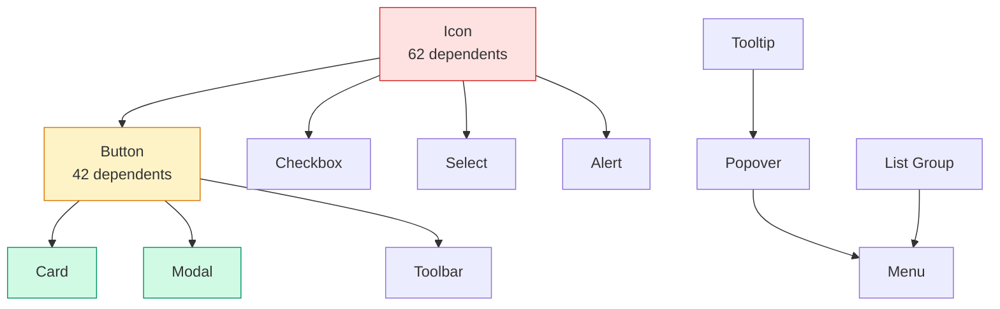
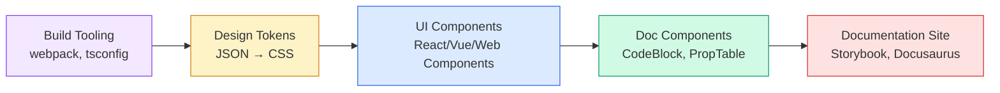

import DevQuickStart from '@site/src/components/DevQuickStart';

<DevQuickStart
  what="Component dependency chains determine your build order, release strategy, and the blast radius of every change"
  learn="How to manage dependencies with peerDependencies, monorepo tooling, and automated dependency graphs"
  able="Set up a monorepo with proper dependency tracking and automated versioning using Changesets"
/>

## 의존성 체인 이해

디자인 시스템에서 컴포넌트는 서로 의존합니다. Icon을 변경하면 Button, Checkbox, Select, Alert 등 모든 의존 컴포넌트에 영향을 미칩니다.



### 의존성 레벨

| Level | 예시 | Dependents | 변경 위험도 |
|-------|------|------------|------------|
| **1 (Foundation)** | Icon, Token | 60+ | Very High |
| **2 (Core)** | Button, Avatar, Input | 20-40 | High |
| **3 (Composite)** | Menu, Popover, Modal | 5-15 | Medium |
| **4 (Pattern)** | Card Grid, Toolbar | 0-5 | Low |

## npm peerDependencies 전략

디자인 시스템 패키지에서 peerDependencies를 사용하면 버전 충돌을 방지하고 번들 크기를 줄일 수 있습니다.

### 패키지 구조

```json title="packages/button/package.json"
{
  "name": "@myds/button",
  "version": "2.1.0",
  "peerDependencies": {
    "react": "^18.0.0 || ^19.0.0",
    "@myds/icon": "^3.0.0",
    "@myds/tokens": "^1.0.0"
  },
  "devDependencies": {
    "@myds/icon": "^3.2.0",
    "@myds/tokens": "^1.4.0"
  }
}
```

```json title="packages/modal/package.json"
{
  "name": "@myds/modal",
  "version": "1.5.0",
  "peerDependencies": {
    "react": "^18.0.0 || ^19.0.0",
    "@myds/button": "^2.0.0",
    "@myds/icon": "^3.0.0",
    "@myds/tokens": "^1.0.0"
  },
  "dependencies": {
    "@myds/focus-trap": "^1.0.0"
  }
}
```

### 언제 어떤 dependency 타입을 사용하나?

| 타입 | 사용 시점 | 예시 |
|------|----------|------|
| `peerDependencies` | 소비자가 이미 설치한 패키지 | React, 다른 DS 컴포넌트 |
| `dependencies` | 내부 유틸리티, 소비자에게 노출 안 됨 | focus-trap, class-variance-authority |
| `devDependencies` | 빌드/테스트 전용 | TypeScript, Jest, Storybook |

## 모노레포 설정

### Turborepo 구성

```json title="turbo.json"
{
  "$schema": "https://turbo.build/schema.json",
  "tasks": {
    "build": {
      "dependsOn": ["^build"],
      "outputs": ["dist/**"]
    },
    "test": {
      "dependsOn": ["^build"]
    },
    "lint": {}
  }
}
```

`"dependsOn": ["^build"]`는 패키지의 의존성이 먼저 빌드되도록 보장합니다. Icon이 먼저 빌드되고, 그 다음 Button, 그 다음 Modal 순서입니다.

### 디렉토리 구조

```
design-system/
├── packages/
│   ├── tokens/          # Foundation - 가장 먼저 빌드
│   │   ├── src/
│   │   └── package.json
│   ├── icon/            # Level 1
│   │   ├── src/
│   │   └── package.json
│   ├── button/          # Level 2 - depends on icon, tokens
│   │   ├── src/
│   │   └── package.json
│   ├── modal/           # Level 3 - depends on button, icon
│   │   ├── src/
│   │   └── package.json
│   └── react/           # Meta-package (re-exports all)
│       └── package.json
├── turbo.json
├── package.json
└── pnpm-workspace.yaml
```

```yaml title="pnpm-workspace.yaml"
packages:
  - 'packages/*'
```

## Changesets를 사용한 자동 버전 관리

[Changesets](https://github.com/changesets/changesets)는 변경 사항을 추적하고 자동으로 버전을 증가시킵니다.

### 설치 및 초기화

```bash
pnpm add -Dw @changesets/cli
pnpm changeset init
```

### 변경 사항 기록

Icon 컴포넌트를 수정했다면:

```bash
pnpm changeset
```

```markdown title=".changeset/cool-tigers-fly.md"
---
"@myds/icon": minor
---

Added new `ChevronDown` icon variant for dropdown indicators.
```

### 의존성 체인 자동 버전 업데이트

Changesets는 의존하는 패키지의 버전도 자동으로 올립니다.

```bash
pnpm changeset version
```

결과:
- `@myds/icon`: 3.2.0 -> 3.3.0 (minor - 새 기능)
- `@myds/button`: 2.1.0 -> 2.1.1 (patch - dependency update)
- `@myds/modal`: 1.5.0 -> 1.5.1 (patch - dependency update)

### Breaking Change 전파 규칙

Icon이 breaking change(major)를 발생시켜도, 의존하는 모든 패키지가 major일 필요는 없습니다.

```markdown title="When icon has a breaking change"
@myds/icon:   3.x.x → 4.0.0  (MAJOR - API changed)
@myds/button: 2.x.x → 2.2.0  (MINOR - adapts to new icon API internally)
@myds/modal:  1.x.x → 1.5.1  (PATCH - no API change for modal consumers)
```

핵심: 소비자의 API가 변경되지 않으면 patch/minor로 충분합니다.

## 의존성 시각화

### 스크립트로 의존성 그래프 생성

```typescript title="scripts/dependency-graph.ts"
import { readFileSync, readdirSync } from 'fs';
import { join } from 'path';

interface PackageInfo {
  name: string;
  peerDependencies?: Record<string, string>;
  dependencies?: Record<string, string>;
}

function buildDependencyGraph(packagesDir: string) {
  const packages = readdirSync(packagesDir);
  const graph: Record<string, string[]> = {};

  for (const pkg of packages) {
    const pkgJsonPath = join(packagesDir, pkg, 'package.json');
    const pkgJson: PackageInfo = JSON.parse(
      readFileSync(pkgJsonPath, 'utf-8')
    );

    const deps = {
      ...pkgJson.peerDependencies,
      ...pkgJson.dependencies,
    };

    const internalDeps = Object.keys(deps || {}).filter((d) =>
      d.startsWith('@myds/')
    );

    graph[pkgJson.name] = internalDeps;
  }

  return graph;
}

function getDependents(
  graph: Record<string, string[]>,
  packageName: string
): string[] {
  return Object.entries(graph)
    .filter(([, deps]) => deps.includes(packageName))
    .map(([name]) => name);
}

// Usage: "What breaks if I change @myds/icon?"
const graph = buildDependencyGraph('./packages');
const affected = getDependents(graph, '@myds/icon');
console.log('Affected packages:', affected);
// → ["@myds/button", "@myds/checkbox", "@myds/select", "@myds/alert", ...]
```

## 시스템 전체 의존성 흐름

컴포넌트 외에도 빌드 도구, 토큰, 문서 사이트 간의 의존성이 있습니다.



## 의존성 관리 체크리스트

- [ ] 모든 내부 패키지 간 의존성을 `peerDependencies`로 선언
- [ ] Turborepo 또는 Nx로 빌드 순서 자동 관리
- [ ] Changesets로 버전 관리 자동화
- [ ] CI에서 `pnpm changeset status`로 changeset 누락 체크
- [ ] 의존성 그래프 시각화 도구 구축 (영향 범위 파악용)
- [ ] Breaking change 전파 규칙 문서화

## 참고 자료

- Nathan Curtis, "Component Dependencies" (EightShapes, 2018)
- [Storybook Composition](https://storybook.js.org/docs/react/sharing/storybook-composition) — 컴포넌트 의존성 시각화
- [Nx Dependency Graph](https://nx.dev/core-features/explore-graph) — Monorepo 의존성 그래프
- [Madge](https://github.com/pahen/madge) — JavaScript 의존성 분석 도구
- Robert C. Martin, "Clean Architecture" (2017) — 의존성 관리 원칙
- [Atomic Design by Brad Frost](https://atomicdesign.bradfrost.com/) — 컴포넌트 계층 이론

> **실제 사례**: Shopify Polaris는 npm 패키지를 `@shopify/polaris-tokens` → `@shopify/polaris-icons` → `@shopify/polaris` 3계층으로 분리하여, 토큰만 필요한 팀은 전체 컴포넌트 라이브러리를 설치하지 않아도 됩니다. 이는 번들 크기를 90% 감소시켰고, 빌드 속도를 5배 향상시켰습니다.

> **심화 이론**: 컴포넌트 의존성 관리는 **Acyclic Dependencies Principle**(비순환 의존성 원칙)을 따라야 합니다. Button → Icon → Button 같은 순환 참조는 빌드 실패, 무한 루프, Tree-shaking 불가를 초래합니다. 의존성 방향은 항상 단방향(Atoms → Molecules → Organisms)이어야 하며, 이는 Robert C. Martin의 "안정된 의존성 원칙"을 UI에 적용한 것입니다.

---

*출처: Nathan Curtis (EightShapes)*
*Series: Releasing Design Systems #5 of 6*

---

## 📎 Related Articles

import CrossRef from '@site/src/components/CrossRef';

<CrossRef
  related={[
    { path: "/docs/component-design/subcomponents", label: "Subcomponents - 컴포넌트 분해 전략" },
    { path: "/docs/design-tokens/token-taxonomy", label: "Token Taxonomy - Audit to Implementation" },
    { path: "/docs/versioning-releases/versioning", label: "버저닝 기초" },
  ]}
/>
