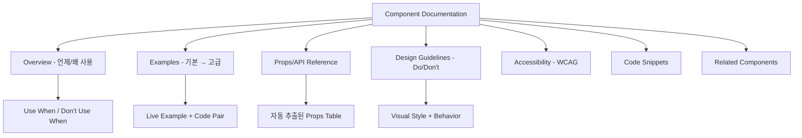
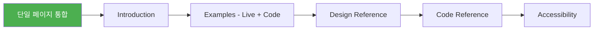

import DevQuickStart from '@site/src/components/DevQuickStart';

<DevQuickStart
  what="컴포넌트 문서화의 5대 청중별 구조와 Storybook MDX 기반 문서 작성법을 배웁니다."
  learn="Storybook MDX로 컴포넌트를 문서화하고 Props를 자동 추출하는 기법"
  able="완성된 Storybook 문서 페이지를 가진 컴포넌트를 제작할 수 있습니다."
/>

## 핵심 개념

- **컴포넌트 문서화의 5가지 대상 청중**: 디자이너, 개발자, 콘텐츠 작성자, QA 담당자, 제품 관리자 - 각 청중에 맞는 문서 구조 필요
- **문서화 7가지 핵심 섹션**: Overview, Examples, Design Guidelines, Code Guidelines, Accessibility, Changelog, Related Components
- **"Show, Don't Tell" 원칙**: 텍스트 설명보다 시각적 예제와 인터랙티브 데모가 효과적
- **점진적 공개 (Progressive Disclosure)**: 기본 사용법부터 고급 사용법까지 단계별 정보 제공

## 실무 노하우

- **Do/Don't 패턴 활용**: 올바른 사용법과 잘못된 사용법을 나란히 비교하여 명확한 가이드라인 제시
- **실제 사용 컨텍스트 제공**: 컴포넌트가 실제 UI에서 어떻게 사용되는지 스크린샷과 함께 설명
- **API 문서 자동화**: Props/Slots 정의를 코드에서 자동 추출하여 문서와 코드 동기화 유지
- **버전별 변경사항 추적**: Breaking changes와 migration guide를 명확히 문서화
- **검색 가능한 구조**: 태그, 카테고리, 키워드로 컴포넌트를 쉽게 찾을 수 있도록 구성

## 문서 구조



## Storybook MDX 문서화 예제

Storybook MDX를 사용하면 문서와 인터랙티브 예제를 한 파일에서 관리할 수 있습니다.

### 1. 기본 Storybook MDX 구조

```mdx
{/* Button.mdx */}
import { Meta, Story, Canvas, ArgsTable, Source } from '@storybook/blocks';
import * as ButtonStories from './Button.stories';

<Meta of={ButtonStories} />

# Button

버튼은 사용자 액션을 트리거하는 인터랙티브 요소입니다.
폼 제출, 대화상자 열기, 작업 확인 등에 사용하세요.

## Use When
- 사용자가 **명시적 액션**을 수행해야 할 때
- 폼 제출, 모달 열기, 데이터 저장 등

## Don't Use When
- 단순 페이지 이동에는 `<a>` 태그를 사용하세요
- 토글 상태 전환에는 Switch 컴포넌트를 사용하세요

## Examples

<Canvas of={ButtonStories.Primary} />
<Canvas of={ButtonStories.Secondary} />
<Canvas of={ButtonStories.AllSizes} />

## Props

<ArgsTable of={ButtonStories} />
```

### 2. React 컴포넌트 + Props 자동 문서화

```tsx
// Button.tsx
import React from 'react';

export interface ButtonProps {
  /** 버튼의 시각적 스타일 */
  variant?: 'primary' | 'secondary' | 'ghost' | 'danger';
  /** 버튼 크기 */
  size?: 'sm' | 'md' | 'lg';
  /** 비활성화 여부 */
  disabled?: boolean;
  /** 로딩 상태 표시 */
  loading?: boolean;
  /** 클릭 이벤트 핸들러 */
  onClick?: (event: React.MouseEvent<HTMLButtonElement>) => void;
  /** 버튼 내용 */
  children: React.ReactNode;
}

export const Button: React.FC<ButtonProps> = ({
  variant = 'primary',
  size = 'md',
  disabled = false,
  loading = false,
  onClick,
  children,
}) => {
  return (
    <button
      className={`btn btn--${variant} btn--${size}`}
      disabled={disabled || loading}
      onClick={onClick}
      aria-busy={loading}
    >
      {loading && <span className="btn__spinner" aria-hidden="true" />}
      {children}
    </button>
  );
};
```

### 3. Storybook Stories 파일

```tsx
// Button.stories.tsx
import type { Meta, StoryObj } from '@storybook/react';
import { Button } from './Button';

const meta: Meta<typeof Button> = {
  title: 'Components/Button',
  component: Button,
  tags: ['autodocs'],
  argTypes: {
    variant: {
      control: 'select',
      options: ['primary', 'secondary', 'ghost', 'danger'],
      description: '버튼의 시각적 스타일',
      table: { defaultValue: { summary: 'primary' } },
    },
    size: {
      control: 'select',
      options: ['sm', 'md', 'lg'],
      description: '버튼 크기',
      table: { defaultValue: { summary: 'md' } },
    },
  },
};

export default meta;
type Story = StoryObj<typeof Button>;

export const Primary: Story = {
  args: { children: '확인', variant: 'primary' },
};

export const Secondary: Story = {
  args: { children: '취소', variant: 'secondary' },
};

export const AllSizes: Story = {
  render: () => (
    <div style={{ display: 'flex', gap: '8px', alignItems: 'center' }}>
      <Button size="sm">Small</Button>
      <Button size="md">Medium</Button>
      <Button size="lg">Large</Button>
    </div>
  ),
};

export const Loading: Story = {
  args: { children: '저장 중...', loading: true },
};
```

## 컴포넌트 네이밍 규칙

컴포넌트 이름은 디자인, 코드, 대화 전체에서 일관되게 유지해야 합니다.

### 네이밍 일관성 매핑

| 컨텍스트 | 네이밍 | 예시 |
|---------|--------|------|
| Figma 레이어 | PascalCase | `PrimaryButton` |
| React 컴포넌트 | PascalCase | `<PrimaryButton />` |
| CSS 클래스 | kebab-case (BEM) | `.primary-button` |
| 파일 경로 | kebab-case | `primary-button.tsx` |
| Storybook | Title Case | `Components / Primary Button` |
| 대화/문서 | 자연어 | "프라이머리 버튼" |

### 설명 작성 원칙

```
좋은 예: "사용자 액션을 트리거하는 인터랙티브 요소" (구조와 목적)
나쁜 예: "12px 패딩에 border-radius 4px인 클릭 가능 요소" (구현 세부사항)
```

- **설명은 144자(Tweet 길이) 이내**로 간결하게 작성
- **단수형 vs 복수형**: 대부분 복수형 선호 (Buttons, Inputs), 한 번만 나오는 요소는 단수형 (Footer, Grid)
- **"Also known as" 패턴**: 동의어를 자연스럽게 제시하여 검색성 향상

## Combinatoric 함정 피하기

컴포넌트를 문서화할 때 **모든 조합을 보여주지 마세요.**

```
5개 속성 x 4개 옵션 = 625가지 조합
→ 모두 보여주면 독자가 압도당함
```

### 비용 vs 가치 매트릭스

| | 낮은 비용 | 높은 비용 |
|---|-----------|-----------|
| **높은 가치** | Introduction (1-2문장), Example+Code Pair, State 표시, Copy-to-clipboard | Component Explorer, Multi-platform 코드 탭 |
| **낮은 가치** | 625가지 조합 전부, Lorem ipsum 콘텐츠 | iframe 스케일링, 깊은 가이드라인 |

**권장 전략:**
1. **대표 예시 우선**: 가장 많이 사용되는 variant 1-2개로 시작
2. **State는 수직 나열**: 수평 나열은 확장성 없음
3. **Theming 증명**: Light/Dark 토글로 토큰 시스템 동작 검증

```tsx
// 대표 예시만 보여주는 효과적인 문서 구조
export const DocumentationLayout = () => (
  <div>
    {/* 1. 가장 일반적인 사용법 */}
    <h3>기본 사용법</h3>
    <Button variant="primary">확인</Button>

    {/* 2. States를 수직으로 */}
    <h3>상태별 표시</h3>
    <div style={{ display: 'flex', flexDirection: 'column', gap: 8 }}>
      <Button variant="primary">Default</Button>
      <Button variant="primary" disabled>Disabled</Button>
      <Button variant="primary" loading>Loading</Button>
    </div>

    {/* 3. 크기 비교 */}
    <h3>크기 비교</h3>
    <div style={{ display: 'flex', gap: 8, alignItems: 'center' }}>
      <Button size="sm">Small</Button>
      <Button size="md">Medium</Button>
      <Button size="lg">Large</Button>
    </div>
  </div>
);
```

## Design/Code 통합 전략

Material Design 규모가 아닌 이상, **Design 문서와 Code 문서를 단일 페이지에 통합**하세요.



**분리의 위험:**
- 시간이 지나면서 네이밍 불일치 발생 (loader vs spinner)
- 기능 불일치: 디자인은 깊은 기능 표현, 코드는 미구현
- 사용자는 단일 정보원을 원함 (back and forth 싫어함)

## 실무 적용 체크리스트

- [ ] 모든 컴포넌트에 JSDoc 주석으로 Props 설명 추가
- [ ] Storybook `tags: ['autodocs']`로 자동 문서 생성 활성화
- [ ] Example-Code Pair가 각 컴포넌트에 1개 이상 존재
- [ ] 네이밍이 Figma/Code/Storybook/대화에서 일관됨
- [ ] Do/Don't 이미지 또는 코드 비교가 포함됨
- [ ] 대표 예시 위주로 문서화 (625가지 전부 X)
- [ ] Accessibility 섹션에 ARIA, 키보드, 스크린리더 가이드 포함

---
> 출처: Nathan Curtis (EightShapes)

---

## 참고 자료

- [Storybook Documentation](https://storybook.js.org/docs) — 컴포넌트 문서화의 업계 표준 도구
- [Documenting Components (Nathan Curtis, EightShapes)](https://medium.com/eightshapes-llc/documenting-components-9fe59b80c015) — 5대 청중 프레임워크 원문
- [MDX Specification](https://mdxjs.com/) — Markdown에서 JSX를 사용하는 문서 포맷
- [Component API Design (Kent C. Dodds)](https://kentcdodds.com/blog/how-to-write-a-react-component-in-typescript) — TypeScript Props 디자인 패턴
- [Progressive Disclosure (Nielsen Norman Group)](https://www.nngroup.com/articles/progressive-disclosure/) — 정보 아키텍처의 점진적 공개 원칙
- [Figma Dev Mode Documentation](https://help.figma.com/hc/en-us/articles/15023124644247-Guide-to-Dev-Mode) — 디자인-코드 핸드오프 워크플로우

### 실제 사례
- **Shopify Polaris**: 각 컴포넌트에 "Use when", "Best practices" 섹션으로 의사 결정 지원
- **Adobe Spectrum**: Props 테이블을 자동 생성하고 TypeScript 타입과 1:1 동기화
- **GitHub Primer**: 모든 컴포넌트에 Do/Don't 이미지 페어링으로 가이드라인 강화

---

## Related Articles

import CrossRef from '@site/src/components/CrossRef';

<CrossRef
  related={[
    { path: "/docs/component-documentation/component-examples", label: "Component Examples - 15 Tips" },
    { path: "/docs/component-documentation/design-guidelines", label: "Component Design Guidelines" },
    { path: "/docs/component-design/buttons", label: "버튼 컴포넌트 12가지 팁" },
  ]}
/>
