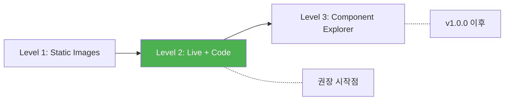

import DevQuickStart from '@site/src/components/DevQuickStart';

<DevQuickStart
  what="컴포넌트 예제 작성의 15가지 핵심 팁과 Storybook args matrix 구성법을 배웁니다."
  learn="Live Example + Code Pairing 패턴과 Storybook args 자동 생성 기법"
  able="모든 컴포넌트에 체계적인 예제 페이지를 구축할 수 있습니다."
/>

## 핵심 개념
- **시각적 예제가 핵심**: 효과적인 컴포넌트 문서에서 가장 중요한 요소
- **보여주고 말하지 마라(Show don't tell)**: 모든 컴포넌트는 예제로 시작해야 함
- **3가지 예제 수준**:
  1. **Static Screenshot**: 정적 이미지
  2. **Live Example + Code**: 렌더링된 예제와 코드 페어링 (권장)
  3. **Component Explorer**: 컨트롤 패널로 속성 조작 가능 (고급, 구축 비용 높음)
- **이미지 + 코드 페어링**: 가장 효과적인 학습 순간

## 실무 노하우

### Tip #1: Lead by Example
- 모든 컴포넌트(보이지 않는 것도 다이어그램으로!)는 예제로 시작
- 시각화된 예제 = 페이지에서 가장 효과적인 교육 순간
- 코드가 있는 라이브러리: 예제와 코드를 함께 렌더링
- 디자인 온리 라이브러리: 이미지로 충분 (Material Design도 이미지 기반)

### Component Explorer는 나중에
- 초기에는 유혹적이지만 구축 비용이 높음:
  - UI 빌드
  - 로직 레이어 구현
  - 컴포넌트별 개별 구현
- **권장**: 1.0.0 출시 후 화려한 후속 기능으로 추가
- 초기 팀에게는 방해 요소가 될 수 있음

### 이미지 기반 문서화
- 컴포넌트 해부학(anatomy) 묘사
- 주석용 시각 언어 표준화 필요 (예: 오렌지 색상)
- 일관된 이미지 크기와 스타일 템플릿
- PNG로 저장하여 문서 사이트 콘텐츠로 사용

### 예제 배치 전략
- 빠른 사용과 실험을 위한 배치
- 효과적인 콘텐츠 제공 (가이드라인 임베디드는 피하기)
- 라이브러리 전체에 걸쳐 일관된 예제 구성

## 예제 성숙도 수준



## CodeBlock 컴포넌트 구현

문서 사이트에서 Example + Code Pair를 보여주는 핵심 컴포넌트입니다.

```tsx
// components/CodeBlock.tsx
import React, { useState } from 'react';
import { Highlight, themes } from 'prism-react-renderer';

interface CodeBlockProps {
  /** 렌더링할 React 요소 */
  preview: React.ReactNode;
  /** 표시할 소스 코드 문자열 */
  code: string;
  /** 코드 언어 (구문 강조용) */
  language?: string;
  /** 제목 */
  title?: string;
}

export const CodeBlock: React.FC<CodeBlockProps> = ({
  preview,
  code,
  language = 'tsx',
  title,
}) => {
  const [showCode, setShowCode] = useState(false);
  const [copied, setCopied] = useState(false);

  const handleCopy = async () => {
    await navigator.clipboard.writeText(code);
    setCopied(true);
    setTimeout(() => setCopied(false), 2000);
  };

  return (
    <div className="code-block-wrapper">
      {title && <div className="code-block-title">{title}</div>}

      {/* Live Preview */}
      <div className="code-block-preview">
        {preview}
      </div>

      {/* Toggle + Copy */}
      <div className="code-block-toolbar">
        <button onClick={() => setShowCode(!showCode)}>
          {showCode ? 'Hide Code' : 'Show Code'}
        </button>
        <button onClick={handleCopy}>
          {copied ? 'Copied!' : 'Copy'}
        </button>
      </div>

      {/* Code */}
      {showCode && (
        <Highlight theme={themes.nightOwl} code={code} language={language}>
          {({ style, tokens, getLineProps, getTokenProps }) => (
            <pre style={style}>
              {tokens.map((line, i) => (
                <div key={i} {...getLineProps({ line })}>
                  <span className="line-number">{i + 1}</span>
                  {line.map((token, key) => (
                    <span key={key} {...getTokenProps({ token })} />
                  ))}
                </div>
              ))}
            </pre>
          )}
        </Highlight>
      )}
    </div>
  );
};
```

### CSS 스타일

```css
.code-block-wrapper {
  border: 1px solid var(--color-border, #e2e8f0);
  border-radius: 8px;
  overflow: hidden;
  margin: 1rem 0;
}

.code-block-title {
  padding: 8px 16px;
  background: var(--color-surface, #f8fafc);
  font-weight: 600;
  font-size: 14px;
  border-bottom: 1px solid var(--color-border, #e2e8f0);
}

.code-block-preview {
  padding: 24px;
  display: flex;
  align-items: center;
  justify-content: center;
  gap: 12px;
  min-height: 80px;
}

.code-block-toolbar {
  display: flex;
  gap: 8px;
  padding: 8px 16px;
  border-top: 1px solid var(--color-border, #e2e8f0);
  background: var(--color-surface, #f8fafc);
}

.code-block-toolbar button {
  padding: 4px 12px;
  border-radius: 4px;
  border: 1px solid var(--color-border, #e2e8f0);
  background: white;
  cursor: pointer;
  font-size: 13px;
}
```

## Storybook Args Matrix 설정

Storybook의 `argTypes`를 활용하면 모든 조합을 자동으로 탐색할 수 있습니다.

```tsx
// Alert.stories.tsx - Args Matrix 예제
import type { Meta, StoryObj } from '@storybook/react';
import { Alert } from './Alert';

const meta: Meta<typeof Alert> = {
  title: 'Components/Alert',
  component: Alert,
  argTypes: {
    severity: {
      control: 'select',
      options: ['info', 'success', 'warning', 'error'],
      table: {
        type: { summary: "'info' | 'success' | 'warning' | 'error'" },
        defaultValue: { summary: 'info' },
      },
    },
    variant: {
      control: 'radio',
      options: ['filled', 'outlined', 'standard'],
    },
    closable: { control: 'boolean' },
    icon: { control: 'boolean' },
  },
};

export default meta;
type Story = StoryObj<typeof Alert>;

// 각 severity를 한 눈에 비교
export const AllSeverities: Story = {
  render: () => (
    <div style={{ display: 'flex', flexDirection: 'column', gap: 12 }}>
      <Alert severity="info">정보 메시지입니다.</Alert>
      <Alert severity="success">성공적으로 완료되었습니다.</Alert>
      <Alert severity="warning">주의가 필요합니다.</Alert>
      <Alert severity="error">오류가 발생했습니다.</Alert>
    </div>
  ),
};

// Variant x Severity 매트릭스 (핵심 조합만)
export const VariantMatrix: Story = {
  render: () => (
    <table style={{ borderCollapse: 'collapse', width: '100%' }}>
      <thead>
        <tr>
          <th></th>
          <th>Filled</th>
          <th>Outlined</th>
          <th>Standard</th>
        </tr>
      </thead>
      <tbody>
        {(['info', 'success', 'warning', 'error'] as const).map((sev) => (
          <tr key={sev}>
            <td><strong>{sev}</strong></td>
            {(['filled', 'outlined', 'standard'] as const).map((v) => (
              <td key={v} style={{ padding: 8 }}>
                <Alert severity={sev} variant={v}>Example</Alert>
              </td>
            ))}
          </tr>
        ))}
      </tbody>
    </table>
  ),
};
```

## Material Design 사례
- 이미지와 인라인 데모로 가득한 디자인 스펙
- 코드 없이도 효과적인 디자인 문서화 증명
- 누구도 Material Design의 이미지 기반 접근을 비판하지 않음

## 실무 적용 체크리스트
- [ ] 코드 라이브러리: 초기에 라이브 예제 + 코드 페어링 활성화
- [ ] Component Explorer는 v1.0.0 이후로 연기
- [ ] 이미지 의존 시: 주석 시각 언어(색상, 타입, 크기) 안정화
- [ ] 일관된 이미지 생성 템플릿 확립
- [ ] 예제가 가이드라인을 포함하지 않도록 분리 유지
- [ ] Args Matrix로 핵심 조합만 보여주기 (모든 조합 X)

## 피해야 할 것
- 초기 단계에서 Component Explorer 구축에 몰두
- 예제 없이 텍스트 설명만 제공
- 일관성 없는 이미지 스타일과 크기
- 예제 안에 가이드라인 텍스트 임베디드

---
> 출처: Nathan Curtis (EightShapes), Mar 24, 2018
> 원문: Component Examples - Showcasing a component's quality, depth and versatility
> 시리즈: #3 of 7 (Overview | Intros | Examples | Design | Code | Authoring | Myths)

---

## 참고 자료

- [Storybook Args & Controls](https://storybook.js.org/docs/react/essentials/controls) — 인터랙티브 Component Explorer 구축법
- [prism-react-renderer](https://github.com/FormidableLabs/prism-react-renderer) — 구문 강조 코드 블록 렌더링 도구
- [Material Design Guidelines](https://m3.material.io/) — 이미지 기반 디자인 문서화의 황금 표준
- [Chakra UI Examples](https://chakra-ui.com/docs/components) — Live Example + Code Pairing 패턴의 우수 사례
- [Testing Library Best Practices](https://kentcdodds.com/blog/common-mistakes-with-react-testing-library) — 예제 코드의 테스트 가능성 확보

### 이론적 배경
- **Show, Don't Tell**: 인지 과학에서 시각적 정보는 텍스트 정보보다 60,000배 빠르게 처리됨 (3M Corporation)
- **Cognitive Load Theory**: 예제와 코드를 분리 배치할 때 인지 부하가 증가 (Sweller, 1988)

### 실제 사례
- **Radix UI**: 모든 컴포넌트에 Sandbox 링크로 즉시 실험 가능
- **shadcn/ui**: Copy-paste 블록으로 예제를 직접 프로젝트에 사용 가능
- **Ant Design**: Props 조합 매트릭스를 격자 레이아웃으로 시각화

---

## Related Articles

import CrossRef from '@site/src/components/CrossRef';

<CrossRef
  related={[
    { path: "/docs/component-documentation/documenting-components", label: "Documenting Components - Serving System Audiences" },
    { path: "/docs/component-documentation/design-guidelines", label: "Component Design Guidelines" },
    { path: "/docs/component-documentation/doc-components", label: "Doc Components - Top 8 재사용 컴포넌트" },
  ]}
/>
