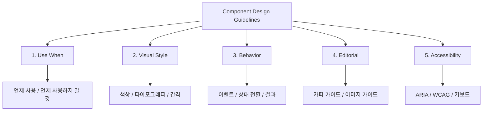

import DevQuickStart from '@site/src/components/DevQuickStart';

<DevQuickStart
  what="컴포넌트 디자인 가이드라인의 5대 섹션 구조와 코드 번역 방법을 배웁니다."
  learn="Use When / Visual Style / Behavior / Editorial / Accessibility 각 섹션을 코드로 구현하는 기법"
  able="디자인 가이드라인을 읽고 즉시 코드로 번역할 수 있습니다."
/>

## 핵심 개념
- **가이드라인은 참조 자료**: 즐거운 읽기가 아닌 빠른 학습과 빠른 검색을 위한 레퍼런스
- **명확성과 구조**: 무작위 메모가 아닌, 명확하고 조직화된 문서
- **단어부터 시작**: 디자인 가이드라인은 글쓰기 작업으로 시작 (나중에 이미지/데모 추가)
- **일관된 섹션 구조**: Use When, Visual Style, Behavior, Editorial, Accessibility
- **이미지와 데모**: Material Design처럼 글만이 아닌 시각적 설명으로 더 강력한 전달

## 가이드라인 5대 섹션



## Button 가이드라인 완전 예제

실제 Button 컴포넌트의 각 가이드라인 섹션을 코드로 번역하는 방법입니다.

### 1. Use When (+ Don't Use When)

**가이드라인:**
> 사용자가 명시적 액션을 수행해야 할 때 Button을 사용하세요.

**코드 번역:**

```tsx
{/* Use When: 폼 제출 */}
<form onSubmit={handleSubmit}>
  <Button type="submit">저장하기</Button>
</form>

{/* Use When: 대화상자 열기 */}
<Button onClick={() => setModalOpen(true)}>설정</Button>

{/* DON'T: 페이지 이동에는 Link 사용 */}
{/* Bad */}
<Button onClick={() => router.push('/about')}>About</Button>
{/* Good */}
<a href="/about">About</a>
```

### 2. Visual Style

**가이드라인:**
> Primary 버튼은 페이지당 1개만, Secondary는 여러 개 가능. Ghost는 보조 액션에만.

**코드 번역:**

```tsx
// Visual Style 가이드라인의 코드 구현
const buttonStyles = {
  primary: {
    background: 'var(--color-brand-500)',
    color: 'var(--color-white)',
    border: 'none',
    fontWeight: 600,
  },
  secondary: {
    background: 'transparent',
    color: 'var(--color-brand-500)',
    border: '1px solid var(--color-brand-500)',
    fontWeight: 500,
  },
  ghost: {
    background: 'transparent',
    color: 'var(--color-text-secondary)',
    border: 'none',
    fontWeight: 400,
  },
};

// 크기별 토큰
const sizeTokens = {
  sm: { padding: 'var(--space-1) var(--space-3)', fontSize: 'var(--font-size-sm)' },
  md: { padding: 'var(--space-2) var(--space-4)', fontSize: 'var(--font-size-md)' },
  lg: { padding: 'var(--space-3) var(--space-5)', fontSize: 'var(--font-size-lg)' },
};
```

### 3. Behavior

**가이드라인:**
> 클릭 시 즉각적 피드백, 로딩 상태 표시, 더블 클릭 방지.

**코드 번역:**

```tsx
const Button: React.FC<ButtonProps> = ({ onClick, children, ...props }) => {
  const [isLoading, setIsLoading] = useState(false);

  const handleClick = async (e: React.MouseEvent) => {
    if (isLoading) return; // 더블 클릭 방지

    setIsLoading(true);
    try {
      await onClick?.(e);
    } finally {
      setIsLoading(false);
    }
  };

  return (
    <button
      onClick={handleClick}
      disabled={isLoading}
      aria-busy={isLoading}
      {...props}
    >
      {isLoading ? (
        <>
          <Spinner size="sm" aria-hidden="true" />
          <span>처리 중...</span>
        </>
      ) : (
        children
      )}
    </button>
  );
};
```

### 4. Editorial

**가이드라인:**
> 버튼 라벨은 동사로 시작. 2-3 단어 이내. 구체적 액션 명시.

**코드 번역:**

```tsx
// Editorial 가이드라인: 버튼 라벨 패턴
const BUTTON_LABELS = {
  // Good: 동사로 시작, 구체적
  save: '저장하기',
  delete: '삭제하기',
  confirm: '확인',
  cancel: '취소',
  submit: '제출하기',

  // Bad: 모호하거나 너무 길다
  // 'OK', 'Yes', 'No' (모호)
  // '이 항목을 저장하시겠습니까?' (너무 길다)
};

// 라벨 길이 검증 유틸리티
function validateButtonLabel(label: string): boolean {
  const words = label.trim().split(/\s+/);
  if (words.length > 3) {
    console.warn(`Button label too long: "${label}" (${words.length} words)`);
    return false;
  }
  return true;
}
```

### 5. Accessibility

**가이드라인:**
> 키보드 접근 가능, 포커스 표시, 스크린리더에 상태 전달.

**코드 번역:**

```tsx
// 접근성 완비된 Button
<button
  type="button"
  role="button"
  tabIndex={0}
  aria-label={ariaLabel || undefined}
  aria-disabled={disabled}
  aria-busy={loading}
  aria-pressed={toggle ? pressed : undefined}
  className={cn(
    'btn',
    'focus-visible:outline focus-visible:outline-2',
    'focus-visible:outline-offset-2 focus-visible:outline-brand-500'
  )}
>
  {children}
</button>
```

```css
/* 포커스 표시 CSS */
.btn:focus-visible {
  outline: 3px solid var(--color-brand-500);
  outline-offset: 2px;
}

/* 비활성화 상태 */
.btn[aria-disabled="true"] {
  opacity: 0.5;
  cursor: not-allowed;
  pointer-events: none;
}
```

## 대체 헤딩 옵션

| 기본 | 대안 1 | 대안 2 |
|------|--------|--------|
| Visual Style | Visual Language | Design Language |
| Behavior | Interaction | Patterns |
| Use When | When to Use | Usage |
| Editorial | Content | Copy Guidelines |

## 피해야 할 것
- 무지한 단독 작업자의 낙서 같은 메모
- 조직되지 않은 대규모 불릿 포인트 목록
- 독자가 읽지 않을 조밀하고 조잡한 산문
- 커뮤니티 참여 없는 일방적 작성

---
> 출처: Nathan Curtis (EightShapes), Jun 16, 2018
> 원문: Component Design Guidelines
> 시리즈: #4 of 7 (Overview | Intros | Examples | Design | Code | Authoring | Myths)

---

## Related Articles

import CrossRef from '@site/src/components/CrossRef';

<CrossRef
  related={[
    { path: "/docs/component-documentation/component-examples", label: "Component Examples - 15 Tips" },
    { path: "/docs/component-documentation/spec-guide", label: "컴포넌트 명세서 작성 가이드" },
    { path: "/docs/accessibility/accessible-systems", label: "접근성 기초" },
  ]}
/>
