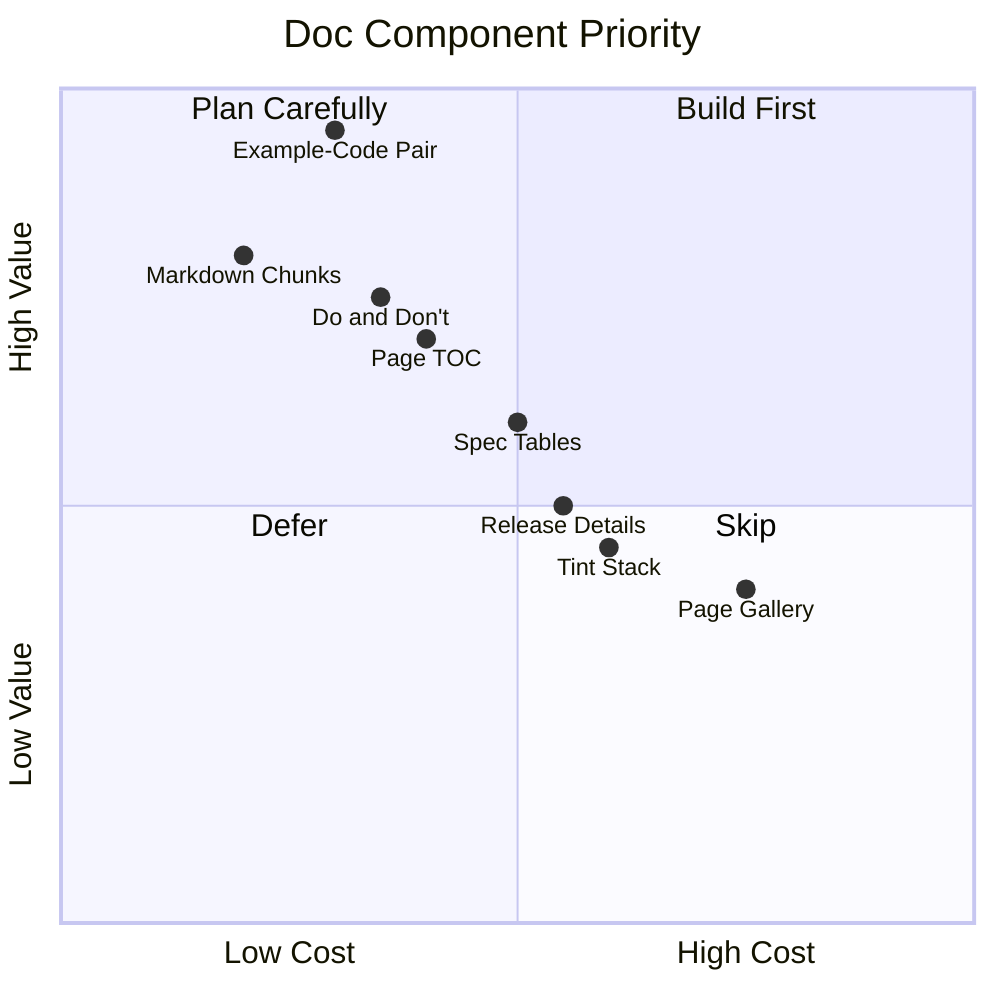

import DevQuickStart from '@site/src/components/DevQuickStart';

<DevQuickStart
  what="문서 사이트를 위한 Top 8 재사용 컴포넌트와 그 React 구현을 배웁니다."
  learn="Example-Code Pair, Do/Don't, Spec Table 컴포넌트의 실제 React 코드"
  able="문서 사이트 전용 컴포넌트 라이브러리를 직접 구축할 수 있습니다."
/>

## 핵심 개념
- **Documentation as product**: Doc site도 library toolkit을 사용하여 구축하는 또 다른 제품
- **Missing components**: System은 자체 documentation에 필요한 모든 parts를 제공하지 않음 (code viewer, color swatch 등)
- **Top 8 doc components**: (1) Example-Code Pair (2) Markdown Chunks (3) Page TOC (4) Do & Don't (5) Tint Stack (6) Framed Page Gallery (7) Release Details (8) Spec/Token Tables
- **Build your own**: Documentation 전용 components를 library와 분리하여 구축
- **Meta benefit**: Doc site 구축 과정이 team을 library 사용자 입장에 sensitize함

## 우선순위 매트릭스



## Top 3 컴포넌트 React 구현

### #1 Example-Code Pair

문서의 핵심 컴포넌트. 실시간 렌더링 + 코드를 나란히 보여줍니다.

```tsx
// components/doc/ExampleCodePair.tsx
import React, { useState } from 'react';

interface ExampleCodePairProps {
  /** 렌더링할 실시간 예제 */
  children: React.ReactNode;
  /** 표시할 코드 (문자열) */
  code: string;
  /** 코드 언어 */
  language?: 'tsx' | 'html' | 'css';
  /** 제목 */
  title?: string;
  /** 반응형 토글 활성화 */
  responsive?: boolean;
}

type Viewport = 'sm' | 'md' | 'lg';

export const ExampleCodePair: React.FC<ExampleCodePairProps> = ({
  children,
  code,
  language = 'tsx',
  title,
  responsive = false,
}) => {
  const [viewport, setViewport] = useState<Viewport>('lg');
  const [copied, setCopied] = useState(false);

  const viewportWidths: Record<Viewport, string> = {
    sm: '320px',
    md: '768px',
    lg: '100%',
  };

  const handleCopy = async () => {
    await navigator.clipboard.writeText(code);
    setCopied(true);
    setTimeout(() => setCopied(false), 2000);
  };

  return (
    <figure className="example-code-pair" role="figure" aria-label={title}>
      {title && <figcaption className="ecp-title">{title}</figcaption>}

      {/* Responsive toggles */}
      {responsive && (
        <div className="ecp-viewport-bar" role="radiogroup" aria-label="Viewport size">
          {(['sm', 'md', 'lg'] as const).map((vp) => (
            <button
              key={vp}
              role="radio"
              aria-checked={viewport === vp}
              onClick={() => setViewport(vp)}
              className={viewport === vp ? 'active' : ''}
            >
              {vp.toUpperCase()}
            </button>
          ))}
        </div>
      )}

      {/* Live preview */}
      <div
        className="ecp-preview"
        style={{ maxWidth: responsive ? viewportWidths[viewport] : '100%' }}
      >
        {children}
      </div>

      {/* Code block */}
      <div className="ecp-code">
        <div className="ecp-code-header">
          <span className="ecp-language">{language}</span>
          <button onClick={handleCopy} className="ecp-copy">
            {copied ? 'Copied!' : 'Copy'}
          </button>
        </div>
        <pre><code className={`language-${language}`}>{code}</code></pre>
      </div>
    </figure>
  );
};
```

### #2 Do/Don't

가이드라인 시각화의 핵심 도구. 초록/빨강 테두리로 올바른/잘못된 사용법을 구분합니다.

```tsx
// components/doc/DoDont.tsx
import React from 'react';

interface DoDontItem {
  /** 시각적 예제 (이미지 또는 컴포넌트) */
  children: React.ReactNode;
  /** 설명 텍스트 */
  description: string;
}

interface DoDontProps {
  doExample: DoDontItem;
  dontExample: DoDontItem;
}

export const DoDont: React.FC<DoDontProps> = ({ doExample, dontExample }) => (
  <div className="do-dont-grid" role="group" aria-label="Do and Don't comparison">
    {/* DO */}
    <div className="do-dont-card do-dont-card--do">
      <div className="do-dont-badge" aria-hidden="true">DO</div>
      <div className="do-dont-preview">{doExample.children}</div>
      <p className="do-dont-desc">{doExample.description}</p>
    </div>

    {/* DON'T */}
    <div className="do-dont-card do-dont-card--dont">
      <div className="do-dont-badge" aria-hidden="true">DON'T</div>
      <div className="do-dont-preview">{dontExample.children}</div>
      <p className="do-dont-desc">{dontExample.description}</p>
    </div>
  </div>
);

// 사용 예시:
// <DoDont
//   doExample={{
//     children: <Button variant="primary">저장하기</Button>,
//     description: "동사로 시작하는 구체적 라벨 사용"
//   }}
//   dontExample={{
//     children: <Button variant="primary">OK</Button>,
//     description: "모호한 라벨은 사용자를 혼란시킴"
//   }}
// />
```

```css
.do-dont-grid {
  display: grid;
  grid-template-columns: 1fr 1fr;
  gap: 16px;
  margin: 1rem 0;
}

.do-dont-card {
  border-radius: 8px;
  overflow: hidden;
}

.do-dont-card--do {
  border: 2px solid #22c55e;
}

.do-dont-card--dont {
  border: 2px solid #ef4444;
}

.do-dont-badge {
  padding: 4px 12px;
  font-weight: 700;
  font-size: 12px;
  text-transform: uppercase;
  letter-spacing: 0.05em;
}

.do-dont-card--do .do-dont-badge {
  background: #22c55e;
  color: white;
}

.do-dont-card--dont .do-dont-badge {
  background: #ef4444;
  color: white;
}

.do-dont-preview {
  padding: 24px;
  display: flex;
  align-items: center;
  justify-content: center;
}

.do-dont-desc {
  padding: 12px 16px;
  margin: 0;
  font-size: 14px;
  color: var(--color-text-secondary, #64748b);
  border-top: 1px solid var(--color-border, #e2e8f0);
}
```

### #3 Spec/Token Table

디자인 토큰의 계층 구조와 실제 값을 보여주는 테이블입니다.

```tsx
// components/doc/SpecTable.tsx
import React from 'react';

interface TokenSpec {
  /** 토큰 이름 (예: --space-inset-s) */
  token: string;
  /** 상위 토큰 (계층 표시) */
  parent?: string;
  /** CSS 값 */
  value: string;
  /** 시각적 미리보기 (색상 swatch 등) */
  preview?: React.ReactNode;
}

interface SpecTableProps {
  title: string;
  tokens: TokenSpec[];
}

export const SpecTable: React.FC<SpecTableProps> = ({ title, tokens }) => (
  <div className="spec-table-wrapper">
    <h4 className="spec-table-title">{title}</h4>
    <table className="spec-table">
      <thead>
        <tr>
          <th>Token</th>
          <th>Alias / Parent</th>
          <th>Value</th>
          <th>Preview</th>
        </tr>
      </thead>
      <tbody>
        {tokens.map((t) => (
          <tr key={t.token}>
            <td>
              <code className="spec-token-name">{t.token}</code>
            </td>
            <td>{t.parent || '-'}</td>
            <td><code>{t.value}</code></td>
            <td>{t.preview || null}</td>
          </tr>
        ))}
      </tbody>
    </table>
  </div>
);

// 사용 예시:
// <SpecTable
//   title="Spacing Tokens"
//   tokens={[
//     { token: '--space-s', value: '8px', parent: '--space-base' },
//     { token: '--space-inset-s', value: '8px', parent: '--space-s' },
//     { token: '--space-inset-squish-s', value: '4px 8px', parent: '--space-s' },
//   ]}
// />
```

## 실제 오픈소스 구현 참고

| 디자인 시스템 | Example-Code | Do/Don't | Spec Table | URL |
|--------------|-------------|----------|------------|-----|
| **Chakra UI** | Editable JSX | Aspect cards | Props table | chakra-ui.com/docs |
| **Radix UI** | Live sandbox | Usage notes | API reference | radix-ui.com |
| **shadcn/ui** | Copy-paste blocks | - | CLI install | ui.shadcn.com |
| **Storybook** | Canvas + Controls | - | ArgsTable | storybook.js.org |

## 나머지 5개 컴포넌트 요약

| # | 컴포넌트 | 핵심 기능 | 구현 우선순위 |
|---|---------|-----------|-------------|
| #2 | Markdown Chunks | Nunjucks 통합, Google Docs migration | 높음 |
| #3 | Page TOC | Sticky, scroll-based subsection 표시 | 높음 |
| #5 | Tint Stack | AA/AAA score 표시, click-to-copy 변수명 | 중간 |
| #6 | Framed Page Gallery | iframe + transform:scale(), viewport toggle | 낮음 |
| #7 | Release Details | Change type (markup/style/script), grouping | 중간 |

---
> 출처: Nathan Curtis (EightShapes)
> Article: Design System Doc Components (Sep 13, 2016)

---

## Related Articles

import CrossRef from '@site/src/components/CrossRef';

<CrossRef
  related={[
    { path: "/docs/component-documentation/component-examples", label: "Component Examples - 15 Tips" },
    { path: "/docs/component-documentation/documenting-components", label: "Documenting Components - Serving System Audiences" },
    { path: "/docs/design-tokens/token-taxonomy", label: "Token Taxonomy - Audit to Implementation" },
  ]}
/>
