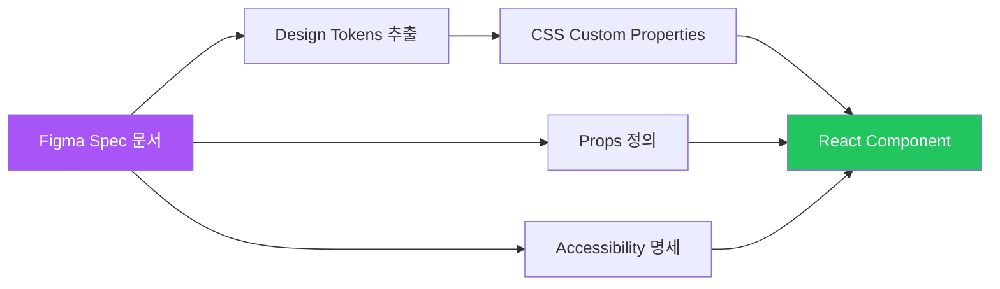

import DevQuickStart from '@site/src/components/DevQuickStart';

<DevQuickStart
  what="Figma 스펙 문서를 코드로 변환하는 전체 워크플로우를 배웁니다."
  learn="디자인 토큰을 CSS 변수로 매핑하고 스펙에서 컴포넌트 API를 추출하는 기법"
  able="스펙 문서를 받아 TypeScript 인터페이스와 CSS 토큰까지 구현할 수 있습니다."
/>

## 핵심 개념

### 1. 스펙 문서의 필요성 변화
**현재 (2023~)**:
- 멀티플랫폼 빌드 (iOS, Android, Web 등)
- 디자이너 1명이 여러 개발팀에 전달
- 접근성(Accessibility) 중요성 상승
- 컴포넌트 복잡도 증가
- **명시적 문서화 필수**

### 2. 핵심 원칙
> **"디자인 의도 이해가 보물찾기가 되어서는 안 된다"**

**Figma Inspect의 한계**:
- 시각적 속성만 확인 가능
- 동작(Behavior), 접근성, 코드 전용 속성 누락

## Figma Spec에서 Code Component까지



## 디자인 가이드라인 vs 스펙

| | 스펙 (Specs) | 디자인 가이드라인 |
|---|---|---|
| **목적** | How to MAKE (만드는 방법) | How to USE (사용 방법) |
| **독자** | 개발자 (1차), 디자이너 (2차) | 디자이너, 프로덕트 팀 |
| **내용** | 구현 상세 (토큰, props, 접근성, 동작) | 사용 사례, Do/Don't, 베스트 프랙티스 |
| **시점** | 컴포넌트 디자인 안정화 시점 | 릴리스 전후 |

## 디자인 토큰 매핑: Figma에서 CSS까지

스펙 문서의 `$esds-...` 토큰을 CSS Custom Properties로 변환하는 방법입니다.

### 토큰 변환 테이블

| Figma 토큰 (ESDS) | CSS Custom Property | 값 | 용도 |
|-------------------|--------------------|----|------|
| `$esds-color-primary-500` | `var(--color-primary-500)` | `#6366f1` | 브랜드 메인 |
| `$esds-color-primary-600` | `var(--color-primary-600)` | `#4f46e5` | 호버 상태 |
| `$esds-space-inset-md` | `var(--space-inset-md)` | `12px 16px` | 패딩 |
| `$esds-space-stack-sm` | `var(--space-stack-sm)` | `0 0 8px 0` | 마진 하단 |
| `$esds-font-heading-md` | `var(--font-heading-md)` | `600 18px/1.4 Inter` | 제목 텍스트 |
| `$esds-radius-md` | `var(--radius-md)` | `8px` | 모서리 |
| `$esds-shadow-card` | `var(--shadow-card)` | `0 2px 8px rgba(0,0,0,0.1)` | 카드 그림자 |

### CSS 토큰 구현

```css
/* tokens/components/alert.css */
:root {
  /* Figma spec: $esds-alert-padding → Inset MD */
  --alert-padding: var(--space-inset-md);

  /* Figma spec: $esds-alert-radius → Radius MD */
  --alert-radius: var(--radius-md);

  /* Figma spec: $esds-alert-icon-size → 20px */
  --alert-icon-size: 20px;

  /* Figma spec: $esds-alert-gap → Space SM */
  --alert-gap: var(--space-sm);

  /* Severity-specific tokens */
  --alert-info-bg: var(--color-blue-50);
  --alert-info-border: var(--color-blue-200);
  --alert-info-icon: var(--color-blue-500);

  --alert-error-bg: var(--color-red-50);
  --alert-error-border: var(--color-red-200);
  --alert-error-icon: var(--color-red-500);
}
```

## 스펙 문서 작성법

### Step 1: Anatomy 작성

스펙의 Anatomy를 TypeScript 인터페이스로 변환합니다.

```tsx
// Figma 스펙의 Anatomy 섹션:
// ① Container
//   ② Icon (depends on: severity)
//   ③ Content
//     ④ Title (Text element, Font: heading-sm)
//     ⑤ Description (Text element, Font: body-md)
//   ⑥ Close Button (depends on: IconButton)

// 코드 변환:
interface AlertProps {
  /** ② 아이콘 - severity에 따라 자동 결정 */
  severity: 'info' | 'success' | 'warning' | 'error';
  /** ④ 제목 */
  title?: string;
  /** ⑤ 설명 */
  children: React.ReactNode;
  /** ⑥ 닫기 버튼 표시 여부 */
  closable?: boolean;
  /** 닫기 이벤트 */
  onClose?: () => void;
}
```

### Step 2: Properties 작성

```tsx
// Figma 스펙의 Properties:
// | Property | Type    | Default | Options                        |
// |----------|---------|---------|--------------------------------|
// | severity | enum    | info    | info, success, warning, error  |
// | closable | boolean | false   | true, false                    |
// | variant  | enum    | filled  | filled, outlined, standard     |

// TypeScript로 직접 매핑:
interface AlertProps {
  severity?: 'info' | 'success' | 'warning' | 'error'; // default: 'info'
  closable?: boolean;                                    // default: false
  variant?: 'filled' | 'outlined' | 'standard';         // default: 'filled'
}
```

### Step 3: Layout and Spacing 작성

```css
/* Figma 스펙의 Layout:
   Direction: Horizontal
   Alignment: Top left
   Item spacing: 12px
   Padding: 12px 16px */

.alert {
  display: flex;
  flex-direction: row;      /* Direction: Horizontal */
  align-items: flex-start;  /* Alignment: Top left */
  gap: var(--alert-gap);    /* Item spacing: 12px */
  padding: var(--alert-padding); /* Padding: 12px 16px */
  border-radius: var(--alert-radius);
}
```

### Step 4: Behavior 작성

```tsx
// Figma 스펙의 Behavior:
// Event: click on close button
// Trigger: click
// Result: alert dismissed with fade-out animation

const Alert: React.FC<AlertProps> = ({ closable, onClose, children }) => {
  const [visible, setVisible] = useState(true);
  const [exiting, setExiting] = useState(false);

  const handleClose = () => {
    setExiting(true);
    // fade-out 후 제거
    setTimeout(() => {
      setVisible(false);
      onClose?.();
    }, 200);
  };

  if (!visible) return null;

  return (
    <div className={`alert ${exiting ? 'alert--exiting' : ''}`} role="alert">
      {children}
      {closable && (
        <button onClick={handleClose} aria-label="닫기">
          <CloseIcon />
        </button>
      )}
    </div>
  );
};
```

### Step 5: Accessibility 작성

```tsx
// Figma 스펙의 Accessibility:
// Role: alert (assertive) or status (polite)
// Reading: "{severity}: {title}. {description}"
// Focus order: 1. Content 2. Close button

<div
  role={severity === 'error' ? 'alert' : 'status'}
  aria-live={severity === 'error' ? 'assertive' : 'polite'}
  aria-label={`${severity}: ${title}`}
>
  {/* 콘텐츠 */}
  {closable && (
    <button aria-label="알림 닫기" tabIndex={0}>
      <CloseIcon aria-hidden="true" />
    </button>
  )}
</div>
```

### Step 6: Component Tokens 작성

```css
/* Figma 스펙의 Component Tokens:
   Token          | Alias              | Value
   ⬛ bg-info     | $esds-color-blue-50 | #eff6ff
   ⬛ border-info | $esds-color-blue-200| #bfdbfe */

.alert--info {
  background-color: var(--alert-info-bg);     /* $esds-color-blue-50 */
  border: 1px solid var(--alert-info-border); /* $esds-color-blue-200 */
}

.alert--info .alert__icon {
  color: var(--alert-info-icon);              /* $esds-color-blue-500 */
}
```

## 개발자 스펙 체크리스트

디자이너 체크리스트와 병행하여 사용하세요.

### Anatomy
- [ ] 모든 요소가 React 컴포넌트/엘리먼트로 매핑되었는가?
- [ ] 중첩 컴포넌트가 import 경로와 함께 명시되었는가?
- [ ] 레이어 이름이 CSS 클래스명과 일치하는가?
- [ ] 조건부 렌더링 요소가 식별되었는가?

### Properties
- [ ] 모든 props의 TypeScript 타입이 정의되었는가?
- [ ] 기본값이 코드에 반영되었는가?
- [ ] enum 옵션이 union type으로 변환되었는가?

### Layout
- [ ] Figma Auto Layout이 CSS Flexbox/Grid로 매핑되었는가?
- [ ] 모든 spacing이 디자인 토큰을 사용하는가?
- [ ] 반응형 동작이 정의되었는가?

### Accessibility
- [ ] ARIA role이 HTML 시맨틱 요소로 구현되었는가?
- [ ] Focus order가 tabIndex와 일치하는가?
- [ ] Screen reader 읽기 형식이 테스트되었는가?

### Tokens
- [ ] 모든 `$esds-*` 토큰이 `var(--*)` CSS 변수로 변환되었는가?
- [ ] 하드코딩된 색상/크기가 없는가?
- [ ] 다크모드 토큰이 별도 정의되었는가?

## 주요 인사이트

1. **"보물찾기"를 없애라**: Figma Inspect는 보조 도구, 유일한 소스가 아님
2. **스펙 = 가이드라인**: 스펙을 먼저, 가이드라인은 릴리스 전에
3. **멀티플랫폼 시대의 필수품**: 한 디자인이 여러 플랫폼으로
4. **접근성은 선택이 아닌 필수**: 디자인 단계부터 고려
5. **네이밍의 결정적 순간**: 스펙 핸드오프 = 네이밍 합의의 시점

---
*출처: Nathan Curtis (EightShapes)*

---

## 참고 자료

- [Figma Dev Mode](https://help.figma.com/hc/en-us/articles/15023124644247-Guide-to-Dev-Mode) — 디자인-개발 핸드오프 공식 가이드
- [Design Tokens Format Module](https://tr.designtokens.org/format/) — W3C 표준 토큰 포맷
- [Style Dictionary](https://amzn.github.io/style-dictionary/) — 디자인 토큰을 플랫폼별 코드로 변환
- [Figma REST API](https://www.figma.com/developers/api) — 컴포넌트 속성 프로그래밍 방식 추출
- [TypeScript Handbook: Interfaces](https://www.typescriptlang.org/docs/handbook/interfaces.html) — Props 타입 정의 패턴

### 이론적 배경
- **Single Source of Truth**: 명세서는 디자인-코드 간 계약(Contract)의 역할 (Martin Fowler)
- **Design System as a Contract**: 명세는 구현 독립적이어야 함 (Nathan Curtis)

### 실제 사례
- **Shopify Polaris**: Figma 컴포넌트와 React Props가 1:1 매핑되는 네이밍 규칙 운영
- **Uber Base Design System**: 명세서를 JSON 포맷으로 관리하여 자동 코드 생성
- **Adobe Spectrum**: 멀티플랫폼(Web/iOS/Android) 명세를 단일 문서로 통합 관리

---

## Related Articles

import CrossRef from '@site/src/components/CrossRef';

<CrossRef
  related={[
    { path: "/docs/component-documentation/design-guidelines", label: "Component Design Guidelines" },
    { path: "/docs/component-design/states", label: "States Management - 상태 관리의 정석" },
    { path: "/docs/accessibility/accessible-systems", label: "접근성 기초" },
  ]}
/>
