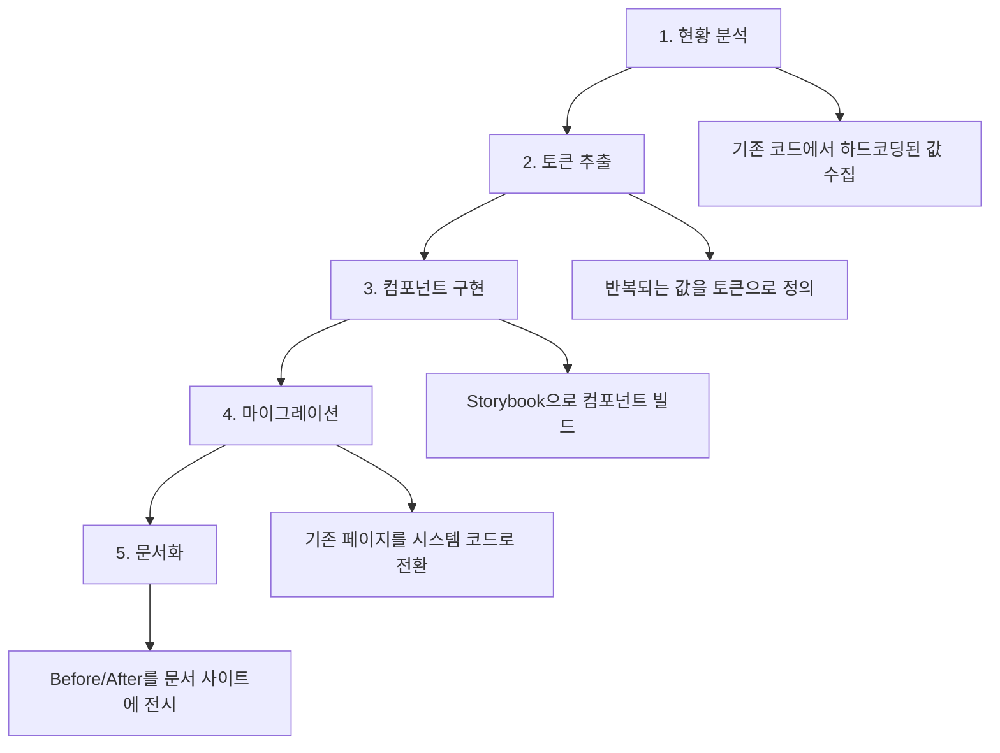

import DevQuickStart from '@site/src/components/DevQuickStart';

<DevQuickStart
  what="디자인 시스템 적용 전후의 코드 차이를 비교하고 개발자 역할을 이해합니다."
  learn="Ad-hoc 코드를 디자인 시스템 기반 코드로 리팩토링하는 구체적 방법"
  able="기존 페이지를 디자인 시스템 컴포넌트로 마이그레이션할 수 있습니다."
/>

## 핵심 개념

- **Reference Design = 시스템 설득 도구**: "시스템 없는 현재" vs "시스템 적용 후 미래"를 비교하는 실증 사례
- **개발자의 역할**: 디자인 시스템 적용이 코드 품질, 유지보수성, 일관성에 미치는 영향을 코드로 증명
- **Before/After 비교**: 동일한 페이지를 ad-hoc 코드와 시스템 코드로 구현하여 차이를 시각화

## Before: 디자인 시스템 없이

시스템 없이 만든 카드 목록 페이지. 하드코딩된 값, 일관성 없는 스타일, 중복 코드가 특징입니다.

```tsx
// pages/ProductList.tsx - 디자인 시스템 없음
export default function ProductList() {
  return (
    <div style={{ padding: '20px', maxWidth: '1200px', margin: '0 auto' }}>
      <h1 style={{ fontSize: '28px', fontWeight: 700, color: '#1a1a1a', marginBottom: '24px' }}>
        상품 목록
      </h1>

      <div style={{ display: 'grid', gridTemplateColumns: 'repeat(3, 1fr)', gap: '16px' }}>
        {/* 카드 1 - 개발자 A가 작성 */}
        <div style={{
          border: '1px solid #e0e0e0',
          borderRadius: '8px',
          padding: '16px',
          boxShadow: '0 2px 4px rgba(0,0,0,0.1)',
        }}>
          
          <h3 style={{ fontSize: '16px', fontWeight: 600, marginTop: '12px' }}>상품명</h3>
          <p style={{ color: '#666', fontSize: '14px' }}>설명 텍스트</p>
          <span style={{ color: '#e53e3e', fontWeight: 700, fontSize: '18px' }}>29,900원</span>
          <button style={{
            width: '100%',
            marginTop: '12px',
            padding: '10px',
            backgroundColor: '#3182ce',
            color: 'white',
            border: 'none',
            borderRadius: '6px',
            cursor: 'pointer',
          }}>
            장바구니 담기
          </button>
        </div>

        {/* 카드 2 - 개발자 B가 작성 (미묘하게 다른 스타일) */}
        <div style={{
          border: '1px solid #ddd',      /* 다른 보더 색상 */
          borderRadius: '12px',           /* 다른 radius */
          padding: '20px',               /* 다른 패딩 */
          boxShadow: '0 1px 3px rgba(0,0,0,0.08)', /* 다른 그림자 */
        }}>
          
          <h3 style={{ fontSize: '18px', fontWeight: 500, marginTop: '8px' }}>상품명</h3>
          <p style={{ color: '#888', fontSize: '13px' }}>설명 텍스트</p>
          <span style={{ color: '#c53030', fontWeight: 600, fontSize: '20px' }}>39,900원</span>
          <button style={{
            width: '100%',
            marginTop: '16px',
            padding: '12px',
            backgroundColor: '#2b6cb0',  /* 미묘하게 다른 파란색 */
            color: 'white',
            border: 'none',
            borderRadius: '8px',
          }}>
            구매하기              {/* 다른 라벨 */}
          </button>
        </div>
      </div>
    </div>
  );
}
```

**문제점:**
- 8가지 하드코딩된 색상 (`#e0e0e0`, `#666`, `#e53e3e`, `#3182ce`, ...)
- 카드 간 불일치: radius 8px vs 12px, padding 16px vs 20px
- 같은 역할의 버튼이 다른 라벨 ("장바구니 담기" vs "구매하기")
- 접근성 속성 전무 (alt, aria-label 없음)
- 다크모드 전환 불가능

## After: 디자인 시스템 적용

동일한 페이지를 디자인 시스템 컴포넌트로 구현한 버전. Compound Component 패턴과 CSS Custom Properties를 활용합니다.

```tsx
// pages/ProductList.tsx - 디자인 시스템 적용 (Self-contained 버전)
// 예시: 실제 구현 시 디자인 시스템 패키지의 컴포넌트로 대체하세요

interface Product {
  id: string;
  name: string;
  description: string;
  price: number;
  image: string;
}

// Compound Component 패턴으로 구성 가능한 ProductCard
function ProductCard({ children, ...props }: React.PropsWithChildren<React.HTMLAttributes<HTMLDivElement>>) {
  return (
    <div
      {...props}
      style={{
        border: '1px solid var(--color-border)',
        borderRadius: 'var(--radius-card, 8px)',
        overflow: 'hidden',
        boxShadow: 'var(--shadow-card)',
        transition: 'all 0.2s',
        ...props.style,
      }}
    >
      {children}
    </div>
  );
}

ProductCard.Image = function CardImage({ src, alt }: { src: string; alt: string }) {
  return ;
};

ProductCard.Body = function CardBody({ children }: React.PropsWithChildren) {
  return <div style={{ padding: 'var(--space-md, 16px)' }}>{children}</div>;
};

ProductCard.Title = function CardTitle({ children }: React.PropsWithChildren) {
  return <h3 style={{ fontSize: '1rem', fontWeight: 600, margin: '0 0 0.5rem' }}>{children}</h3>;
};

ProductCard.Description = function CardDescription({ children }: React.PropsWithChildren) {
  return <p style={{ fontSize: '0.875rem', color: 'var(--color-text-secondary)', margin: '0 0 0.75rem' }}>{children}</p>;
};

ProductCard.Price = function CardPrice({ children }: React.PropsWithChildren) {
  return <div style={{ fontSize: '1.25rem', fontWeight: 700, color: 'var(--color-primary)' }}>{children}</div>;
};

ProductCard.Footer = function CardFooter({ children }: React.PropsWithChildren) {
  return <div style={{ padding: '0 var(--space-md, 16px) var(--space-md, 16px)' }}>{children}</div>;
};

// 메인 컴포넌트
export default function ProductList({ products }: { products: Product[] }) {
  const addToCart = (id: string) => {
    console.log('Add to cart:', id);
  };

  return (
    <div style={{ padding: 'var(--space-md, 16px)', maxWidth: '1200px', margin: '0 auto' }}>
      <h1 style={{ fontSize: '2rem', fontWeight: 700, marginBottom: '1.5rem' }}>
        상품 목록
      </h1>

      <div
        style={{
          display: 'grid',
          gridTemplateColumns: 'repeat(auto-fill, minmax(300px, 1fr))',
          gap: 'var(--space-md, 16px)',
        }}
      >
        {products.map((product) => (
          <ProductCard key={product.id}>
            <ProductCard.Image
              src={product.image}
              alt={`${product.name} 상품 이미지`}
            />
            <ProductCard.Body>
              <ProductCard.Title>{product.name}</ProductCard.Title>
              <ProductCard.Description>{product.description}</ProductCard.Description>
              <ProductCard.Price>
                {product.price.toLocaleString('ko-KR')}원
              </ProductCard.Price>
            </ProductCard.Body>
            <ProductCard.Footer>
              <button
                onClick={() => addToCart(product.id)}
                aria-label={`${product.name} 장바구니에 담기`}
                style={{
                  width: '100%',
                  padding: '0.75rem',
                  backgroundColor: 'var(--color-primary)',
                  color: 'white',
                  border: 'none',
                  borderRadius: 'var(--radius-button, 6px)',
                  cursor: 'pointer',
                  fontSize: '1rem',
                  fontWeight: 600,
                }}
              >
                장바구니 담기
              </button>
            </ProductCard.Footer>
          </ProductCard>
        ))}
      </div>
    </div>
  );
}
```

**개선된 점:**
- 하드코딩된 색상 0개 (모두 토큰)
- 모든 카드가 동일한 구조, 스타일, 간격
- 반응형 Grid (sm: 1열, md: 2열, lg: 3열)
- 접근성: alt 텍스트, aria-label 포함
- 다크모드 자동 지원 (토큰 기반)

## 코드 비교 요약

| 항목 | Before | After |
|------|--------|-------|
| **하드코딩 색상** | 8개 | 0개 |
| **일관성** | 카드마다 다름 | 100% 동일 |
| **반응형** | 없음 (3열 고정) | sm/md/lg breakpoint |
| **접근성** | aria 속성 없음 | alt, aria-label 완비 |
| **다크모드** | 불가능 | 토큰 기반 자동 전환 |
| **코드 라인** | 65줄 (카드 2개) | 42줄 (N개 확장 가능) |
| **컴포넌트 재사용** | 0% | 100% |
| **유지보수** | 카드별 수정 | 시스템 수정 1회 |

## 개발자의 Reference Design 기여

개발자는 Reference Design 과정에서 다음과 같이 기여합니다.



### 마이그레이션 스크립트 예시

```bash
# 하드코딩된 색상을 토큰으로 변환하는 codemod
npx jscodeshift -t transforms/hardcoded-colors.ts src/

# 변환 결과 확인
# Before: style={{ color: '#3182ce' }}
# After:  className="text-brand-500"
```

## 실무 적용 체크리스트

- [ ] 현재 제품에서 5-10개 대표 페이지 선정
- [ ] 각 페이지의 하드코딩된 값 수집 (색상, 간격, 폰트)
- [ ] 반복 패턴에서 토큰 후보 추출
- [ ] Before 코드 스냅샷 저장
- [ ] 디자인 시스템 컴포넌트로 After 버전 구현
- [ ] 코드 비교표 작성 (라인 수, 색상 수, 접근성 등)
- [ ] Storybook/문서 사이트에 Before/After 전시

---
> 출처: Nathan Curtis (EightShapes)

---

## 참고 자료

- [Brad Frost's Pattern Lab](https://patternlab.io/) — 컴포넌트 기반 디자인 시스템 구축 방법론
- [Atomic Design by Brad Frost](https://atomicdesign.bradfrost.com/) — 컴포넌트 시스템의 이론적 기반
- [CSS Variables (MDN)](https://developer.mozilla.org/en-US/docs/Web/CSS/Using_CSS_custom_properties) — 디자인 토큰 구현 기술
- [Design System ROI Calculator (Knapsack)](https://www.knapsack.cloud/roi-calculator) — 디자인 시스템의 비용 절감 효과 계산
- [jscodeshift](https://github.com/facebook/jscodeshift) — 코드 마이그레이션 자동화 도구

### 이론적 배경
- **Before/After 비교의 심리학**: 변화의 시각화는 채택 동기를 3배 증가 (Dan Ariely, Behavioral Economics)
- **Compound Component Pattern**: 유연한 조합을 위한 React 디자인 패턴 (Kent C. Dodds)

### 실제 사례
- **Airbnb DLS**: 레거시 코드베이스를 디자인 시스템으로 마이그레이션한 사례 공개 (74% 코드 감소)
- **GitHub Primer**: 하드코딩된 색상 2,400개를 토큰 시스템으로 전환한 마이그레이션 가이드 제공
- **Salesforce Lightning**: Before/After 비교를 Storybook에 전시하여 팀 설득

---

## Related Articles

import CrossRef from '@site/src/components/CrossRef';

<CrossRef
  related={[
    { path: "/docs/component-documentation/developer-onboarding", label: "Getting Developers Started - 8-Step Onboarding" },
    { path: "/docs/governance-operations/core-principles", label: "거버넌스 운영 기초" },
    { path: "/docs/component-documentation/documenting-components", label: "Documenting Components - Serving System Audiences" },
  ]}
/>
