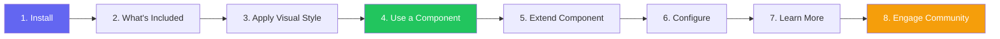

import DevQuickStart from '@site/src/components/DevQuickStart';

<DevQuickStart
  what="디자인 시스템 개발자 온보딩의 8단계 프레임워크와 실제 React/Next.js 코드를 배웁니다."
  learn="npm 설치부터 첫 컴포넌트 사용, 확장, 커뮤니티 참여까지의 전체 워크플로우"
  able="새로운 개발자가 30분 내에 디자인 시스템을 설치하고 사용할 수 있는 온보딩 문서를 작성할 수 있습니다."
/>

## 핵심 개념
- **8단계 온보딩 프레임워크**: Install, What's Included, Apply Visual Style, Use Component, Extend Component, Configure, Learn More, Engage Community
- **첫인상이 전부**: Getting Started 문서는 시스템 성공의 핵심 - 개발자가 막히면 시스템 신뢰도 붕괴
- **빠르고 고통 없는 경험**: 개발자는 몇 분 안에 설치부터 첫 컴포넌트 사용까지 완료하며 자신감을 얻어야 함

## 8단계 온보딩 플로우



## React/Next.js 실전 예제

> **📦 예시 패키지명 안내**: 아래 코드는 실제 디자인 시스템 구조를 보여주기 위한 예시입니다. `@your-company/design-system`을 프로젝트의 실제 패키지명으로 변경하세요.

### Step 1: Installation

```bash
# npm 설치 (예시: 실제 패키지명으로 변경 필요)
npm install @your-company/design-system @your-company/tokens

# 또는 yarn
yarn add @your-company/design-system @your-company/tokens

# 또는 pnpm (monorepo 권장)
pnpm add @your-company/design-system @your-company/tokens
```

**인증이 필요한 경우:**

```bash
# .npmrc 설정 (private registry)
@your-company:registry=https://npm.pkg.github.com
//npm.pkg.github.com/:_authToken=${GITHUB_TOKEN}
```

### Step 2: What's Included

```bash
# 패키지 구조 확인
ls node_modules/@your-company/design-system/

# 결과:
# dist/
#   ├── components/     # React 컴포넌트 (ESM + CJS)
#   ├── styles/         # CSS 번들
#   ├── tokens/         # 디자인 토큰 (CSS Variables)
#   ├── icons/          # SVG 아이콘
#   └── types/          # TypeScript 타입 정의
```

```tsx
// 예시: 디자인 시스템이 제공하는 주요 API
// 실제 시스템 패키지로 import 경로를 변경하세요
import {
  // 레이아웃
  PageLayout, Grid, Stack, Flex,
  // 컴포넌트
  Button, Input, Select, Modal, Alert, Badge,
  // 타이포그래피
  Heading, Text, Link,
  // 유틸리티
  ThemeProvider, useTheme, tokens,
} from '@your-company/design-system';
```

### Step 3: Apply Visual Style

```tsx
// app/layout.tsx (Next.js App Router)
// 예시: CSS import 경로는 실제 패키지 구조에 맞게 조정
import '@your-company/design-system/dist/styles/tokens.css';
import '@your-company/design-system/dist/styles/reset.css';
import '@your-company/design-system/dist/styles/components.css';

// ThemeProvider는 대부분의 디자인 시스템에서 제공하는 표준 패턴입니다
export default function RootLayout({ children }: { children: React.ReactNode }) {
  return (
    <html lang="ko">
      <head>
        {/* Web Fonts */}
        <link
          href="https://fonts.googleapis.com/css2?family=Inter:wght@400;500;600;700&display=swap"
          rel="stylesheet"
        />
      </head>
      <body>
        {/* 다크모드 지원을 위한 ThemeProvider 패턴 */}
        <div data-theme="light">
          {children}
        </div>
      </body>
    </html>
  );
}
```

### Step 4: Use a Component

```tsx
// app/page.tsx - 첫 번째 컴포넌트 사용 예시
// 실제로는 디자인 시스템 문서를 참고하여 컴포넌트를 import하세요

export default function HomePage() {
  return (
    <div style={{ padding: '2rem', maxWidth: '1200px', margin: '0 auto' }}>
      <h1 style={{ fontSize: '2rem', fontWeight: 700, marginBottom: '1.5rem' }}>
        디자인 시스템에 오신 것을 환영합니다
      </h1>

      <p style={{ fontSize: '1.125rem', color: 'var(--color-text-secondary)', marginBottom: '1rem' }}>
        첫 번째 컴포넌트를 성공적으로 렌더링했습니다.
      </p>

      <div style={{
        padding: '1rem',
        backgroundColor: 'var(--color-success-light)',
        borderLeft: '4px solid var(--color-success)',
        marginBottom: '1.5rem'
      }}>
        <strong>설치 완료</strong>
        <p>디자인 시스템이 정상적으로 동작합니다.</p>
      </div>

      <div style={{ display: 'flex', gap: '1rem' }}>
        <button style={{
          padding: '0.75rem 1.5rem',
          backgroundColor: 'var(--color-primary)',
          color: 'white',
          border: 'none',
          borderRadius: '0.5rem',
          cursor: 'pointer',
          fontSize: '1rem',
          fontWeight: 600
        }}>
          시작하기
        </button>
        <button style={{
          padding: '0.75rem 1.5rem',
          backgroundColor: 'transparent',
          color: 'var(--color-primary)',
          border: '2px solid var(--color-primary)',
          borderRadius: '0.5rem',
          cursor: 'pointer',
          fontSize: '1rem',
          fontWeight: 600
        }}>
          문서 보기
        </button>
      </div>
    </div>
  );
}
```

### Step 5: Extend/Override Component

```tsx
// components/ProductCard.tsx - 커스텀 컴포넌트 구현 예시
interface ProductCardProps {
  title: string;
  price: number;
  isNew?: boolean;
}

export function ProductCard({ title, price, isNew }: ProductCardProps) {
  return (
    <div style={{
      padding: '1.5rem',
      border: '1px solid var(--color-border)',
      borderRadius: '0.75rem',
      boxShadow: '0 2px 8px rgba(0,0,0,0.1)',
      transition: 'all 0.2s',
    }}>
      {isNew && (
        <span style={{
          display: 'inline-block',
          padding: '0.25rem 0.5rem',
          backgroundColor: 'var(--color-accent)',
          color: 'white',
          fontSize: '0.75rem',
          fontWeight: 600,
          borderRadius: '0.25rem',
          marginBottom: '0.5rem'
        }}>
          NEW
        </span>
      )}
      <h3 style={{ fontSize: '1rem', fontWeight: 600, margin: '0.5rem 0' }}>{title}</h3>
      <p style={{ color: 'var(--color-primary)', fontWeight: 700, fontSize: '1.25rem' }}>
        {price.toLocaleString('ko-KR')}원
      </p>
    </div>
  );
}
```

### Step 6: Configure (Theme & Tokens)

```tsx
// config/theme.ts - CSS Custom Properties로 브랜드 커스터마이징
// 디자인 시스템의 토큰을 오버라이드하는 패턴

export const brandTokens = {
  // CSS Custom Properties로 브랜드 색상 정의
  '--color-primary': '#8b5cf6',
  '--color-primary-hover': '#7c3aed',
  '--color-primary-active': '#6d28d9',
  '--font-family-heading': '"Pretendard", sans-serif',
  '--font-family-body': '"Pretendard", sans-serif',
  '--radius-card': '12px',
  '--radius-button': '8px',
} as const;

// app/layout.tsx에서 적용
export default function RootLayout({ children }: { children: React.ReactNode }) {
  return (
    <html lang="ko">
      <body style={brandTokens as React.CSSProperties}>
        {children}
      </body>
    </html>
  );
}
```

### Step 7: Learn More

```tsx
// 아키텍처 확인
// 시스템은 이 원칙을 따릅니다:

// 1. Composition over Inheritance
<Card>
  <Card.Header>제목</Card.Header>
  <Card.Body>내용</Card.Body>
  <Card.Footer>
    <Button>액션</Button>
  </Card.Footer>
</Card>

// 2. Design Token 기반 스타일
// 모든 시각적 속성은 CSS Custom Properties 사용
// 하드코딩 값 사용 금지

// 3. 접근성 내장
// 모든 컴포넌트에 ARIA 속성, 키보드 내비게이션 포함
// WCAG 2.2 AA 준수
```

**지원 브라우저:**

| 브라우저 | 최소 버전 |
|---------|-----------|
| Chrome | 90+ |
| Firefox | 88+ |
| Safari | 14+ |
| Edge | 90+ |

### Step 8: Engage Community

```bash
# 도움 요청
# Slack: #design-system-help
# GitHub Issues: https://github.com/your-company/design-system/issues

# 버그 신고
gh issue create --repo your-company/design-system \
  --title "Button: hover 상태에서 색상 깜빡임" \
  --label "bug,component:button"

# 기능 요청
gh issue create --repo your-company/design-system \
  --title "feat: DatePicker 컴포넌트 추가" \
  --label "feature-request" \
  --template feature_request.md

# 기여하기
git clone https://github.com/your-company/design-system
cd design-system
pnpm install
pnpm storybook  # 개발 환경 시작
```

## 온보딩 성공 측정

| 지표 | 목표 | 측정 방법 |
|------|------|-----------|
| Time to First Render | 15분 이내 | 온보딩 테스트 |
| 설치 성공률 | 95%+ | npm 에러 리포트 |
| 첫 주 컴포넌트 사용 수 | 5개+ | 번들 분석 |
| 지원 요청 비율 | 10% 미만 | Slack 채널 트래킹 |

## 실무 적용 체크리스트

- [ ] npm/yarn 설치가 한 줄로 완료되는가?
- [ ] TypeScript 자동완성이 즉시 동작하는가?
- [ ] 첫 컴포넌트 렌더링까지 15분 이내인가?
- [ ] 에러 메시지가 해결 방법을 안내하는가?
- [ ] 다크모드가 별도 작업 없이 동작하는가?
- [ ] Storybook에서 모든 컴포넌트를 탐색할 수 있는가?
- [ ] 기여 방법이 CONTRIBUTING.md에 명시되어 있는가?

---
> 출처: Nathan Curtis (EightShapes)
> 원문: "Getting Developers Started with a Design System" (May 2018)

---

## 참고 자료

- [npm Registry Documentation](https://docs.npmjs.com/cli/v10/using-npm/registry) — Private registry 설정 가이드
- [pnpm Workspaces](https://pnpm.io/workspaces) — Monorepo에서의 디자인 시스템 관리
- [Next.js Font Optimization](https://nextjs.org/docs/pages/building-your-application/optimizing/fonts) — 웹 폰트 최적화 패턴
- [Storybook Onboarding](https://storybook.js.org/docs/react/get-started/install) — 컴포넌트 탐색 환경 구축
- [GitHub Packages Registry](https://docs.github.com/en/packages) — Private npm 패키지 호스팅

### 이론적 배경
- **Time to First Success**: 온보딩 성공의 핵심 지표는 15분 이내 첫 렌더링 (Kathy Sierra)
- **Progressive Enhancement**: CSS → 컴포넌트 → 고급 기능 순의 점진적 학습 구조

### 실제 사례
- **Material-UI**: `npx create-react-app --template material-ui`로 즉시 시작 가능한 템플릿 제공
- **Ant Design**: 중국어/영어 이중 언어 온보딩 문서로 글로벌 채택 성공
- **Chakra UI**: "30초 설치" 약속과 함께 실제 측정 시간 기록 공개

---

## Related Articles

import CrossRef from '@site/src/components/CrossRef';

<CrossRef
  related={[
    { path: "/docs/component-documentation/documenting-components", label: "Documenting Components - Serving System Audiences" },
    { path: "/docs/component-documentation/reference-designs", label: "Reference Designs - Before & After" },
    { path: "/docs/versioning-releases/versioning", label: "버저닝 기초" },
  ]}
/>
