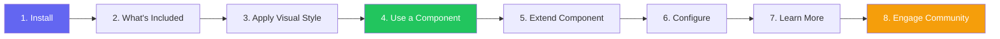

import DevQuickStart from '@site/src/components/DevQuickStart';

<DevQuickStart
  what="디자인 시스템 개발자 온보딩의 8단계 프레임워크와 실제 React/Next.js 코드를 배웁니다."
  learn="npm 설치부터 첫 컴포넌트 사용, 확장, 커뮤니티 참여까지의 전체 워크플로우"
  able="새로운 개발자가 30분 내에 디자인 시스템을 설치하고 사용할 수 있는 온보딩 문서를 작성할 수 있습니다."
/>

## 핵심 개념
- **8단계 온보딩 프레임워크**: Install, What's Included, Apply Visual Style, Use Component, Extend Component, Configure, Learn More, Engage Community
- **첫인상이 전부**: Getting Started 문서는 시스템 성공의 핵심 - 개발자가 막히면 시스템 신뢰도 붕괴
- **빠르고 고통 없는 경험**: 개발자는 몇 분 안에 설치부터 첫 컴포넌트 사용까지 완료하며 자신감을 얻어야 함

## 8단계 온보딩 플로우



## React/Next.js 실전 예제

### Step 1: Installation

```bash
# npm 설치
npm install @acme/design-system @acme/tokens

# 또는 yarn
yarn add @acme/design-system @acme/tokens

# 또는 pnpm (monorepo 권장)
pnpm add @acme/design-system @acme/tokens
```

**인증이 필요한 경우:**

```bash
# .npmrc 설정 (private registry)
@acme:registry=https://npm.pkg.github.com
//npm.pkg.github.com/:_authToken=${GITHUB_TOKEN}
```

### Step 2: What's Included

```bash
# 패키지 구조 확인
ls node_modules/@acme/design-system/

# 결과:
# dist/
#   ├── components/     # React 컴포넌트 (ESM + CJS)
#   ├── styles/         # CSS 번들
#   ├── tokens/         # 디자인 토큰 (CSS Variables)
#   ├── icons/          # SVG 아이콘
#   └── types/          # TypeScript 타입 정의
```

```tsx
// 주요 export 확인
import {
  // 레이아웃
  PageLayout, Grid, Stack, Flex,
  // 컴포넌트
  Button, Input, Select, Modal, Alert, Badge,
  // 타이포그래피
  Heading, Text, Link,
  // 유틸리티
  ThemeProvider, useTheme, tokens,
} from '@acme/design-system';
```

### Step 3: Apply Visual Style

```tsx
// app/layout.tsx (Next.js App Router)
import '@acme/design-system/dist/styles/tokens.css';  // 토큰 먼저
import '@acme/design-system/dist/styles/reset.css';    // 리셋
import '@acme/design-system/dist/styles/components.css'; // 컴포넌트
import { ThemeProvider } from '@acme/design-system';

export default function RootLayout({ children }: { children: React.ReactNode }) {
  return (
    <html lang="ko">
      <head>
        {/* Web Fonts */}
        <link
          href="https://fonts.googleapis.com/css2?family=Inter:wght@400;500;600;700&display=swap"
          rel="stylesheet"
        />
      </head>
      <body>
        <ThemeProvider defaultTheme="light" storageKey="acme-theme">
          {children}
        </ThemeProvider>
      </body>
    </html>
  );
}
```

### Step 4: Use a Component

```tsx
// app/page.tsx - 첫 번째 컴포넌트 사용
import { Button, Heading, Text, Stack, Alert } from '@acme/design-system';

export default function HomePage() {
  return (
    <Stack gap="lg" padding="xl">
      <Heading level={1} size="2xl">
        디자인 시스템에 오신 것을 환영합니다
      </Heading>

      <Text size="lg" color="secondary">
        첫 번째 컴포넌트를 성공적으로 렌더링했습니다.
      </Text>

      <Alert severity="success" title="설치 완료">
        디자인 시스템이 정상적으로 동작합니다.
      </Alert>

      <Stack direction="horizontal" gap="md">
        <Button variant="primary" size="lg">
          시작하기
        </Button>
        <Button variant="secondary" size="lg">
          문서 보기
        </Button>
      </Stack>
    </Stack>
  );
}
```

### Step 5: Extend/Override Component

```tsx
// components/CustomCard.tsx - 시스템 컴포넌트를 확장
import { Card, Badge, Text, tokens } from '@acme/design-system';
import type { CardProps } from '@acme/design-system';

interface ProductCardProps extends CardProps {
  title: string;
  price: number;
  isNew?: boolean;
}

export function ProductCard({ title, price, isNew, ...cardProps }: ProductCardProps) {
  return (
    <Card
      {...cardProps}
      padding="lg"
      shadow="md"
      hover={{ shadow: 'lg', transform: 'translateY(-2px)' }}
    >
      {isNew && <Badge variant="accent" size="sm">NEW</Badge>}
      <Text weight="semibold" size="md">{title}</Text>
      <Text color="brand" weight="bold" size="lg">
        {price.toLocaleString('ko-KR')}원
      </Text>
    </Card>
  );
}
```

### Step 6: Configure (Theme & Tokens)

```tsx
// config/theme.ts - 브랜드 커스터마이징
import { createTheme } from '@acme/design-system';

export const myTheme = createTheme({
  colors: {
    brand: {
      50: '#faf5ff',
      500: '#8b5cf6',  // 보라색 브랜드
      600: '#7c3aed',
      700: '#6d28d9',
    },
  },
  fonts: {
    heading: '"Pretendard", sans-serif',
    body: '"Pretendard", sans-serif',
  },
  radii: {
    card: '12px',    // 기본 8px → 12px로 오버라이드
    button: '8px',
  },
});

// app/layout.tsx에서 적용
<ThemeProvider theme={myTheme}>
  {children}
</ThemeProvider>
```

### Step 7: Learn More

```tsx
// 아키텍처 확인
// 시스템은 이 원칙을 따릅니다:

// 1. Composition over Inheritance
<Card>
  <Card.Header>제목</Card.Header>
  <Card.Body>내용</Card.Body>
  <Card.Footer>
    <Button>액션</Button>
  </Card.Footer>
</Card>

// 2. Design Token 기반 스타일
// 모든 시각적 속성은 CSS Custom Properties 사용
// 하드코딩 값 사용 금지

// 3. 접근성 내장
// 모든 컴포넌트에 ARIA 속성, 키보드 내비게이션 포함
// WCAG 2.2 AA 준수
```

**지원 브라우저:**

| 브라우저 | 최소 버전 |
|---------|-----------|
| Chrome | 90+ |
| Firefox | 88+ |
| Safari | 14+ |
| Edge | 90+ |

### Step 8: Engage Community

```bash
# 도움 요청
# Slack: #design-system-help
# GitHub Issues: https://github.com/acme/design-system/issues

# 버그 신고
gh issue create --repo acme/design-system \
  --title "Button: hover 상태에서 색상 깜빡임" \
  --label "bug,component:button"

# 기능 요청
gh issue create --repo acme/design-system \
  --title "feat: DatePicker 컴포넌트 추가" \
  --label "feature-request" \
  --template feature_request.md

# 기여하기
git clone https://github.com/acme/design-system
cd design-system
pnpm install
pnpm storybook  # 개발 환경 시작
```

## 온보딩 성공 측정

| 지표 | 목표 | 측정 방법 |
|------|------|-----------|
| Time to First Render | 15분 이내 | 온보딩 테스트 |
| 설치 성공률 | 95%+ | npm 에러 리포트 |
| 첫 주 컴포넌트 사용 수 | 5개+ | 번들 분석 |
| 지원 요청 비율 | 10% 미만 | Slack 채널 트래킹 |

## 실무 적용 체크리스트

- [ ] npm/yarn 설치가 한 줄로 완료되는가?
- [ ] TypeScript 자동완성이 즉시 동작하는가?
- [ ] 첫 컴포넌트 렌더링까지 15분 이내인가?
- [ ] 에러 메시지가 해결 방법을 안내하는가?
- [ ] 다크모드가 별도 작업 없이 동작하는가?
- [ ] Storybook에서 모든 컴포넌트를 탐색할 수 있는가?
- [ ] 기여 방법이 CONTRIBUTING.md에 명시되어 있는가?

---
> 출처: Nathan Curtis (EightShapes)
> 원문: "Getting Developers Started with a Design System" (May 2018)

---

## Related Articles

import CrossRef from '@site/src/components/CrossRef';

<CrossRef
  related={[
    { path: "/docs/component-documentation/documenting-components", label: "Documenting Components - Serving System Audiences" },
    { path: "/docs/component-documentation/reference-designs", label: "Reference Designs - Before & After" },
    { path: "/docs/versioning-releases/versioning", label: "버저닝 기초" },
  ]}
/>
