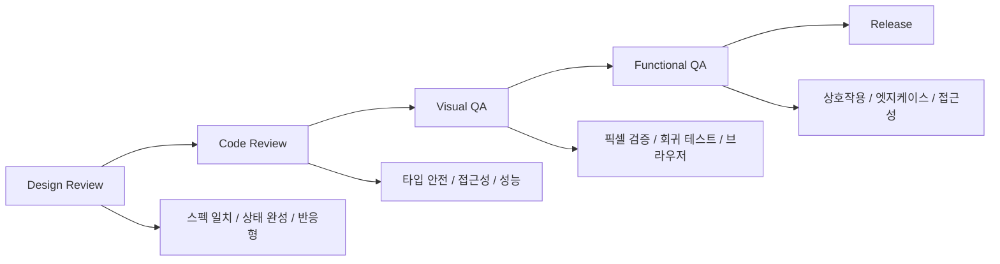

import DevQuickStart from '@site/src/components/DevQuickStart';

<DevQuickStart
  what="컴포넌트 품질 보증의 4단계 프로세스와 구체적인 테스트 코드를 배웁니다."
  learn="Jest + React Testing Library로 컴포넌트를 테스트하고 Chromatic CI를 설정하는 방법"
  able="Button.test.tsx 수준의 완전한 테스트를 작성하고 CI에서 시각적 회귀를 자동 감지할 수 있습니다."
/>

## 핵심 개념

- **QA는 프로세스다**: 개별 테스트가 아닌 체계적인 품질 보증 워크플로우 구축이 핵심
- **4단계 QA 프로세스**: Design Review, Code Review, Visual QA, Functional QA
- **자동화 + 수동 검증 병행**: 자동화 테스트로 회귀 방지, 수동 검토로 UX 품질 확보
- **체크리스트 기반 검증**: 모든 컴포넌트에 일관된 품질 기준 적용
- **Cross-functional 협업**: 디자이너, 개발자, QA가 함께 참여하는 리뷰 프로세스

## QA 프로세스 흐름



## Button.test.tsx 완전 예제

```tsx
// __tests__/Button.test.tsx
import { render, screen, fireEvent, waitFor } from '@testing-library/react';
import userEvent from '@testing-library/user-event';
import { axe, toHaveNoViolations } from 'jest-axe';
import { Button } from '../Button';

expect.extend(toHaveNoViolations);

describe('Button', () => {
  // === 렌더링 테스트 ===
  describe('Rendering', () => {
    it('기본 버튼을 렌더링한다', () => {
      render(<Button>Click me</Button>);
      expect(screen.getByRole('button', { name: 'Click me' })).toBeInTheDocument();
    });

    it('모든 variant를 올바르게 렌더링한다', () => {
      const variants = ['primary', 'secondary', 'ghost', 'danger'] as const;
      variants.forEach((variant) => {
        const { container } = render(<Button variant={variant}>Test</Button>);
        expect(container.firstChild).toHaveClass(`btn--${variant}`);
      });
    });

    it('모든 size를 올바르게 렌더링한다', () => {
      const sizes = ['sm', 'md', 'lg'] as const;
      sizes.forEach((size) => {
        const { container } = render(<Button size={size}>Test</Button>);
        expect(container.firstChild).toHaveClass(`btn--${size}`);
      });
    });

    it('loading 상태에서 spinner를 표시한다', () => {
      render(<Button loading>Submit</Button>);
      expect(screen.getByRole('button')).toHaveAttribute('aria-busy', 'true');
      expect(screen.getByRole('button')).toBeDisabled();
    });

    it('disabled 상태를 올바르게 처리한다', () => {
      render(<Button disabled>Disabled</Button>);
      expect(screen.getByRole('button')).toBeDisabled();
    });
  });

  // === 상호작용 테스트 ===
  describe('Interaction', () => {
    it('클릭 이벤트를 발생시킨다', async () => {
      const handleClick = jest.fn();
      render(<Button onClick={handleClick}>Click</Button>);

      await userEvent.click(screen.getByRole('button'));
      expect(handleClick).toHaveBeenCalledTimes(1);
    });

    it('disabled일 때 클릭이 무시된다', async () => {
      const handleClick = jest.fn();
      render(<Button disabled onClick={handleClick}>Click</Button>);

      await userEvent.click(screen.getByRole('button'));
      expect(handleClick).not.toHaveBeenCalled();
    });

    it('loading일 때 클릭이 무시된다', async () => {
      const handleClick = jest.fn();
      render(<Button loading onClick={handleClick}>Click</Button>);

      await userEvent.click(screen.getByRole('button'));
      expect(handleClick).not.toHaveBeenCalled();
    });

    it('키보드 Enter/Space로 활성화된다', async () => {
      const handleClick = jest.fn();
      render(<Button onClick={handleClick}>Click</Button>);

      const button = screen.getByRole('button');
      button.focus();
      await userEvent.keyboard('{Enter}');
      await userEvent.keyboard(' ');
      expect(handleClick).toHaveBeenCalledTimes(2);
    });
  });

  // === 접근성 테스트 ===
  describe('Accessibility', () => {
    it('axe 접근성 위반이 없다', async () => {
      const { container } = render(<Button>Accessible</Button>);
      const results = await axe(container);
      expect(results).toHaveNoViolations();
    });

    it('aria-label을 올바르게 전달한다', () => {
      render(<Button aria-label="Close dialog">X</Button>);
      expect(screen.getByRole('button')).toHaveAttribute('aria-label', 'Close dialog');
    });

    it('포커스 가능하다', () => {
      render(<Button>Focusable</Button>);
      const button = screen.getByRole('button');
      button.focus();
      expect(button).toHaveFocus();
    });
  });

  // === 성능 벤치마크 ===
  describe('Performance', () => {
    it('16ms 이내에 렌더링된다', () => {
      const start = performance.now();
      render(<Button>Perf Test</Button>);
      const duration = performance.now() - start;
      expect(duration).toBeLessThan(16); // 1 frame at 60fps
    });

    it('100개 동시 렌더링이 100ms 미만이다', () => {
      const start = performance.now();
      render(
        <div>
          {Array.from({ length: 100 }, (_, i) => (
            <Button key={i}>Button {i}</Button>
          ))}
        </div>
      );
      const duration = performance.now() - start;
      expect(duration).toBeLessThan(100);
    });
  });
});
```

## 성능 벤치마크 기준

| 지표 | 목표 | 측정 방법 |
|------|------|-----------|
| 단일 렌더링 | < 16ms | `performance.now()` |
| 100개 동시 렌더링 | < 100ms | `performance.now()` |
| 번들 크기 (gzip) | < 5KB per component | `bundlephobia` |
| Lighthouse 성능 점수 | > 90 | `lighthouse-ci` |
| CLS (Layout Shift) | < 0.1 | Web Vitals |

## Chromatic CI 설정

```yaml
# .github/workflows/chromatic.yml
name: Chromatic Visual Tests

on:
  push:
    branches: [main, develop]
  pull_request:
    branches: [main]

jobs:
  chromatic:
    runs-on: ubuntu-latest
    steps:
      - uses: actions/checkout@v4
        with:
          fetch-depth: 0  # 전체 히스토리 (비교용)

      - uses: actions/setup-node@v4
        with:
          node-version: 20
          cache: 'pnpm'

      - run: pnpm install --frozen-lockfile

      - name: Run Chromatic
        uses: chromaui/action@latest
        with:
          projectToken: ${{ secrets.CHROMATIC_PROJECT_TOKEN }}
          buildScriptName: build-storybook
          exitZeroOnChanges: true  # 변경 감지 시에도 CI 통과
          onlyChanged: true        # 변경된 스토리만 스냅샷
          externals: |
            - 'src/tokens/**'
            - 'src/styles/**'
```

### Storybook Chromatic 연동

```tsx
// .storybook/main.ts
import type { StorybookConfig } from '@storybook/react-vite';

const config: StorybookConfig = {
  stories: ['../src/**/*.stories.@(ts|tsx)'],
  addons: [
    '@storybook/addon-essentials',
    '@storybook/addon-a11y',        // 접근성 패널
    '@storybook/addon-interactions', // 인터랙션 테스트
  ],
  framework: '@storybook/react-vite',
};

export default config;
```

## QA 체크리스트

### Design QA
- [ ] 디자인 스펙과 100% 일치
- [ ] 모든 상태(default, hover, focus, active, disabled) 구현
- [ ] 반응형 breakpoint 동작 확인
- [ ] 다크모드/라이트모드 지원

### Code QA
- [ ] TypeScript 타입 정의 완전
- [ ] Props validation 통과
- [ ] 테스트 커버리지 80% 이상
- [ ] ESLint + Prettier 통과

### Accessibility QA
- [ ] 키보드 네비게이션 가능
- [ ] 스크린리더 호환
- [ ] axe-core 위반 0건
- [ ] 색상 대비 4.5:1 이상 (AA)

### Performance QA
- [ ] 렌더링 < 16ms
- [ ] 번들 크기 < 5KB (gzip)
- [ ] 불필요한 리렌더링 없음
- [ ] 메모리 누수 없음

---
> 출처: Nathan Curtis (EightShapes)

---

## Related Articles

import CrossRef from '@site/src/components/CrossRef';

<CrossRef
  related={[
    { path: "/docs/accessibility/accessible-systems", label: "Accessible Design Systems Don't Guarantee Accessible Products" },
    { path: "/docs/category/04-component-documentation", label: "Component Documentation" },
    { path: "/docs/quality-testing/testing-plan", label: "컴포넌트 테스팅 계획" },
  ]}
/>
