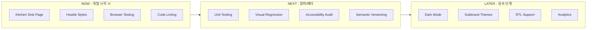

import DevQuickStart from '@site/src/components/DevQuickStart';

<DevQuickStart
  what="NOW/NEXT/LATER 단계별 테스팅 로드맵과 CI 파이프라인 구성을 배웁니다."
  learn="BackstopJS 시각적 회귀 테스트, jest-axe 접근성 통합, GitHub Actions CI 파이프라인 구축"
  able="디자인 시스템의 품질 보증을 자동화하는 완전한 CI 파이프라인을 구축할 수 있습니다."
/>

## 핵심 개념

### 품질 vs 수량의 패러다임 전환
- 30개의 평범한 컴포넌트보다 10개의 완벽한 컴포넌트
- 품질은 **구현된 테스팅 계획**에서 나옴
- 점진적으로 추가 가능한 능력(Capability)

### NOW / NEXT / LATER 로드맵



## BackstopJS 시각적 회귀 테스트

```json
// backstop.json
{
  "id": "design-system",
  "viewports": [
    { "label": "mobile", "width": 375, "height": 812 },
    { "label": "tablet", "width": 768, "height": 1024 },
    { "label": "desktop", "width": 1440, "height": 900 }
  ],
  "scenarios": [
    {
      "label": "Button - All Variants",
      "url": "http://localhost:6006/iframe.html?id=components-button--all-variants",
      "selectors": [".story-container"],
      "delay": 500,
      "misMatchThreshold": 0.1,
      "requireSameDimensions": true
    },
    {
      "label": "Button - Hover State",
      "url": "http://localhost:6006/iframe.html?id=components-button--primary",
      "selectors": ["button"],
      "hoverSelector": "button",
      "delay": 300
    },
    {
      "label": "Alert - All Severities",
      "url": "http://localhost:6006/iframe.html?id=components-alert--all-severities",
      "selectors": [".story-container"],
      "delay": 500
    },
    {
      "label": "Card - Responsive",
      "url": "http://localhost:6006/iframe.html?id=components-card--responsive",
      "selectors": [".story-container"],
      "delay": 500
    }
  ],
  "paths": {
    "bitmaps_reference": "backstop_data/bitmaps_reference",
    "bitmaps_test": "backstop_data/bitmaps_test",
    "html_report": "backstop_data/html_report"
  },
  "engine": "playwright",
  "engineOptions": {
    "args": ["--no-sandbox"]
  },
  "report": ["browser"],
  "debug": false
}
```

```bash
# BackstopJS 사용법
npx backstop reference  # 기준 스크린샷 생성
npx backstop test       # 현재 상태와 비교
npx backstop approve    # 변경 사항 승인
```

## jest-axe 접근성 테스트 통합

```tsx
// test-utils/a11y.ts - 재사용 가능한 접근성 테스트 헬퍼
import { render, RenderResult } from '@testing-library/react';
import { axe, toHaveNoViolations, JestAxeConfigureOptions } from 'jest-axe';

expect.extend(toHaveNoViolations);

const axeConfig: JestAxeConfigureOptions = {
  rules: {
    // AA 수준 강제
    'color-contrast': { enabled: true },
    'link-name': { enabled: true },
    'button-name': { enabled: true },
    'image-alt': { enabled: true },
    // 문서 구조 (컴포넌트 단위에서는 완화)
    'region': { enabled: false },
    'page-has-heading-one': { enabled: false },
  },
};

/**
 * 컴포넌트의 접근성을 자동 검증합니다.
 * 모든 컴포넌트 테스트 파일에서 사용하세요.
 */
export async function expectAccessible(
  ui: React.ReactElement,
  options?: JestAxeConfigureOptions
) {
  const { container } = render(ui);
  const results = await axe(container, options || axeConfig);
  expect(results).toHaveNoViolations();
  return results;
}

// 사용 예시:
// it('접근성 위반이 없다', async () => {
//   await expectAccessible(<Button>Click me</Button>);
// });
```

### 컴포넌트별 접근성 테스트

```tsx
// __tests__/accessibility.test.tsx
import { expectAccessible } from '../test-utils/a11y';
import { Button, Alert, Input, Modal, Select } from '../components';

describe('Accessibility - All Components', () => {
  it('Button은 접근 가능하다', async () => {
    await expectAccessible(<Button>Click me</Button>);
    await expectAccessible(<Button variant="secondary">Cancel</Button>);
    await expectAccessible(<Button disabled>Disabled</Button>);
    await expectAccessible(<Button loading>Loading</Button>);
  });

  it('Alert은 접근 가능하다', async () => {
    await expectAccessible(
      <Alert severity="error" title="Error">Something went wrong</Alert>
    );
  });

  it('Input은 접근 가능하다', async () => {
    await expectAccessible(
      <div>
        <label htmlFor="email">Email</label>
        <Input id="email" type="email" placeholder="you@example.com" />
      </div>
    );
  });

  it('Select는 접근 가능하다', async () => {
    await expectAccessible(
      <div>
        <label htmlFor="country">Country</label>
        <Select id="country">
          <option value="kr">Korea</option>
          <option value="us">United States</option>
        </Select>
      </div>
    );
  });
});
```

## GitHub Actions CI 파이프라인

```yaml
# .github/workflows/design-system-ci.yml
name: Design System CI

on:
  push:
    branches: [main, develop]
  pull_request:
    branches: [main]

env:
  NODE_VERSION: 20
  PNPM_VERSION: 9

jobs:
  # 1. Lint & Type Check
  lint:
    runs-on: ubuntu-latest
    steps:
      - uses: actions/checkout@v4
      - uses: pnpm/action-setup@v4
        with: { version: '${{ env.PNPM_VERSION }}' }
      - uses: actions/setup-node@v4
        with:
          node-version: ${{ env.NODE_VERSION }}
          cache: 'pnpm'
      - run: pnpm install --frozen-lockfile
      - run: pnpm lint
      - run: pnpm typecheck

  # 2. Unit Tests + Coverage
  test:
    runs-on: ubuntu-latest
    needs: lint
    steps:
      - uses: actions/checkout@v4
      - uses: pnpm/action-setup@v4
        with: { version: '${{ env.PNPM_VERSION }}' }
      - uses: actions/setup-node@v4
        with:
          node-version: ${{ env.NODE_VERSION }}
          cache: 'pnpm'
      - run: pnpm install --frozen-lockfile
      - run: pnpm test -- --coverage --ci
      - name: Check coverage threshold
        run: |
          COVERAGE=$(cat coverage/coverage-summary.json | jq '.total.lines.pct')
          echo "Coverage: ${COVERAGE}%"
          if (( $(echo "$COVERAGE < 80" | bc -l) )); then
            echo "Coverage ${COVERAGE}% is below 80% threshold"
            exit 1
          fi
      - uses: actions/upload-artifact@v4
        with:
          name: coverage-report
          path: coverage/

  # 3. Accessibility Tests
  a11y:
    runs-on: ubuntu-latest
    needs: lint
    steps:
      - uses: actions/checkout@v4
      - uses: pnpm/action-setup@v4
        with: { version: '${{ env.PNPM_VERSION }}' }
      - uses: actions/setup-node@v4
        with:
          node-version: ${{ env.NODE_VERSION }}
          cache: 'pnpm'
      - run: pnpm install --frozen-lockfile
      - run: pnpm test:a11y

  # 4. Visual Regression (Chromatic)
  visual:
    runs-on: ubuntu-latest
    needs: lint
    steps:
      - uses: actions/checkout@v4
        with: { fetch-depth: 0 }
      - uses: pnpm/action-setup@v4
        with: { version: '${{ env.PNPM_VERSION }}' }
      - uses: actions/setup-node@v4
        with:
          node-version: ${{ env.NODE_VERSION }}
          cache: 'pnpm'
      - run: pnpm install --frozen-lockfile
      - uses: chromaui/action@latest
        with:
          projectToken: ${{ secrets.CHROMATIC_PROJECT_TOKEN }}
          exitZeroOnChanges: true

  # 5. Build Verification
  build:
    runs-on: ubuntu-latest
    needs: [test, a11y, visual]
    steps:
      - uses: actions/checkout@v4
      - uses: pnpm/action-setup@v4
        with: { version: '${{ env.PNPM_VERSION }}' }
      - uses: actions/setup-node@v4
        with:
          node-version: ${{ env.NODE_VERSION }}
          cache: 'pnpm'
      - run: pnpm install --frozen-lockfile
      - run: pnpm build
      - name: Check bundle size
        run: |
          SIZE=$(du -sk dist/ | cut -f1)
          echo "Bundle size: ${SIZE}KB"
          if [ $SIZE -gt 500 ]; then
            echo "Bundle too large: ${SIZE}KB > 500KB"
            exit 1
          fi
```

## 실무 노하우

### NOW 단계: Hostile Styles 환경

```css
/* hostile-styles.css - 컴포넌트 격리 테스트 */
* {
  box-sizing: content-box !important;
  font-family: 'Comic Sans MS' !important;
  line-height: 3 !important;
  color: red !important;
}

h1, h2, h3, h4, h5, h6 {
  font-size: 48px !important;
}
```

이 CSS를 적용한 상태에서 컴포넌트가 정상 동작하면 스타일 격리가 올바른 것입니다.

### NEXT 단계: Design Token 의존성

```css
/* 잘못된 예 */
.button { background: #3b82f6; }

/* 올바른 예 */
.button { background: var(--color-primary-500); }
```

## 테스트 계획 체크리스트

### 초기 단계 (NOW)
- [ ] Kitchen Sink 페이지 구축
- [ ] Hostile Styles 환경 검증
- [ ] Design Tokens로만 스타일링
- [ ] 브라우저 호환성 (Chrome, Firefox, Safari, Edge)
- [ ] ESLint/Prettier 설정

### 중기 단계 (NEXT)
- [ ] Visual Regression (BackstopJS/Chromatic)
- [ ] Unit Tests (80% 커버리지)
- [ ] jest-axe 자동 검사
- [ ] 키보드 네비게이션 테스트
- [ ] GitHub Actions CI 파이프라인

### 성숙 단계 (LATER)
- [ ] Light/Dark Mode 지원
- [ ] RTL 레이아웃 지원
- [ ] 컴포넌트 사용 추적 (Analytics)
- [ ] 퍼포먼스 모니터링

## 핵심 교훈

1. **품질 > 수량**: 30개의 평범한 컴포넌트보다 10개의 완벽한 컴포넌트
2. **점진적 개선**: 완벽한 테스트 스위트로 시작하지 말고 기본부터
3. **자동화 투자**: 초기 노력 크지만 장기적 ROI 높음
4. **Design Tokens 처음부터**: 나중에 리팩토링하면 10배 힘듦
5. **Hostile Styles**: 진짜 강건함의 척도

---
*출처: Nathan Curtis (EightShapes)*

---

## 참고 자료

- [BackstopJS Documentation](https://github.com/garris/BackstopJS) — 시각적 회귀 테스트 도구
- [Percy Visual Testing](https://www.browserstack.com/percy) — 클라우드 기반 픽셀 단위 비교
- [pa11y-ci](https://github.com/pa11y/pa11y-ci) — 접근성 CI 통합 도구
- [Lighthouse CI](https://github.com/GoogleChrome/lighthouse-ci) — 성능/접근성 자동 감사
- [GitHub Actions for Design Systems](https://github.com/storybookjs/design-system) — Storybook의 오픈소스 CI 설정

### 이론적 배경
- **NOW/NEXT/LATER 로드맵**: 점진적 품질 개선 프레임워크 (Nathan Curtis)
- **Quality vs Quantity Paradigm**: 30개 평범한 컴포넌트보다 10개 완벽한 컴포넌트 (Brad Frost)
- **Hostile Styles Test**: CSS 격리 검증의 강건함 측정 기법 (Harry Roberts)

### 실제 사례
- **Airbnb DLS**: 모든 컴포넌트를 Hostile Environment에서 테스트하여 격리 보장
- **Carbon Design System (IBM)**: GitHub Actions로 시각적 회귀 + 접근성 + 번들 크기를 동시 검증
- **GOV.UK Design System**: 80% 커버리지 강제로 공공 서비스 품질 확보

---

## Related Articles

import CrossRef from '@site/src/components/CrossRef';

<CrossRef
  related={[
    { path: "/docs/category/01-design-tokens", label: "Design Tokens" },
    { path: "/docs/quality-testing/component-qa", label: "Component QA" },
    { path: "/docs/accessibility/accessible-systems", label: "Accessible Design Systems" },
  ]}
/>
