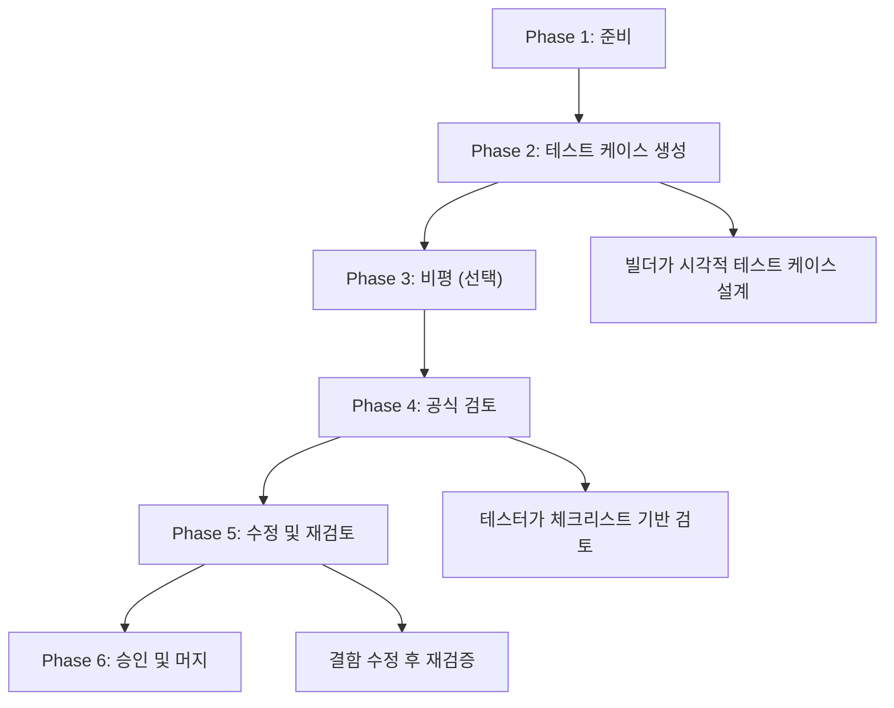

import DevQuickStart from '@site/src/components/DevQuickStart';

<DevQuickStart
  what="Figma 컴포넌트 테스팅의 6단계 워크플로우와 개발자의 역할을 이해합니다."
  learn="Figma 컴포넌트 품질 기준과 코드 구현과의 정합성 검증 방법"
  able="Figma 테스트 결과를 코드 구현에 반영하고 API 일관성을 검증할 수 있습니다."
/>

## 핵심 개념

### 왜 Figma 컴포넌트 테스팅이 필요한가?
- **문제 인식**: Figma 컴포넌트는 복잡하며, 기대대로 작동해야 하고 유효하지 않은 표시를 방지해야 함
- **흔히 발생하는 결함**: 레이블과 함께 커지지 않는 버튼, 누락된 배경색, 하드코딩된 스타일, 잘못된 이름

### 테스팅의 범위 정의

**테스팅이 검증하는 것:**
- 레이어와 속성이 올바르게 명명되었는가?
- 각 구성이 예상된 시각적 결과를 생성하는가?
- 색상이 제대로 적용되었는가?
- 컴포넌트 크기 조정 시 요소가 텍스트를 올바르게 흐르게 하는가?

**테스팅이 검증하지 않는 것:**
- UI 컴포넌트 디자인의 사용성 (최종 사용자 관점)
- Figma 컴포넌트 자체의 사용성 (디자이너 관점)

## 테스팅 워크플로우



## 개발자의 역할

디자이너가 Figma 테스팅을 수행하는 동안, 개발자는 다음 영역에서 협업합니다.

### Figma-Code 정합성 검증 테이블

| Figma 속성 | 코드 대응 | 검증 방법 |
|-----------|----------|----------|
| Layer name: `icon-leading` | `className="icon-leading"` | Storybook에서 시각적 비교 |
| Property: `size = sm / md / lg` | `type Size = 'sm' \| 'md' \| 'lg'` | TypeScript 타입 일치 확인 |
| Auto Layout: horizontal, gap 8 | `display: flex; gap: 8px` | DevTools 검사 |
| Color style: `brand/500` | `var(--color-brand-500)` | 계산된 값 비교 |
| Text style: `heading/sm` | `var(--font-heading-sm)` | 폰트 속성 비교 |
| Variant: `state = hover` | `.btn:hover` | 상태별 스크린샷 비교 |

### API 네이밍 정렬 체크

```tsx
// Figma에서 Button의 Properties:
// - variant: primary | secondary | ghost
// - size: sm | md | lg
// - state: default | hover | active | disabled
// - hasIcon: true | false

// 코드에서의 대응 (정렬 필수):
interface ButtonProps {
  variant: 'primary' | 'secondary' | 'ghost';  // Figma와 동일
  size: 'sm' | 'md' | 'lg';                    // Figma와 동일
  disabled?: boolean;         // Figma 'state=disabled' 대응
  // hasIcon은 children으로 자연스럽게 처리
  leftIcon?: React.ReactNode;
  rightIcon?: React.ReactNode;
}

// 불일치 예시 (피해야 할 것):
// Figma: "size = small"  vs  Code: size = 'sm'  → 약어 규칙 합의 필요
// Figma: "type = primary" vs  Code: variant = 'primary' → 속성명 합의 필요
```

## 테스팅 역할 모델

### Model 1: "빌드하면, 테스트도 해라"
- 적용 상황: 혼자 작업하는 디자이너, 소규모 팀

### Model 2: "빌더가 빌드하고 테스터가 테스트"
- 적용 상황: 전담 역할, 승인 필요, 견습, 역량 부족

### Model 3: "내가 당신 것을 테스트, 당신이 내 것을 테스트"
- 적용 상황: 더 큰 디자인 시스템 팀, 많은 컴포넌트가 병렬로 작업될 때

## 품질 기준의 현실적 설정

**"충분히 좋은" 품질 + 다른 기회:**
- 코드 품질이 Figma 품질보다 더 중요함
- 92% vs 98% 품질의 딜레마: 균형을 잃지 말 것
- 디자인 자산은 끊임없이 변하는 코드로 구축된 프로덕션 경험으로 가는 길의 한 단계

---
*출처: Nathan Curtis (EightShapes)*

---

## Related Articles

import CrossRef from '@site/src/components/CrossRef';

<CrossRef
  related={[
    { path: "/docs/quality-testing/figma-review", label: "Figma 컴포넌트 리뷰 가이드" },
    { path: "/docs/category/03-component-design", label: "Component Design" },
    { path: "/docs/governance-operations/subtask-decomposition", label: "서브태스크 분해 방법론" },
  ]}
/>
