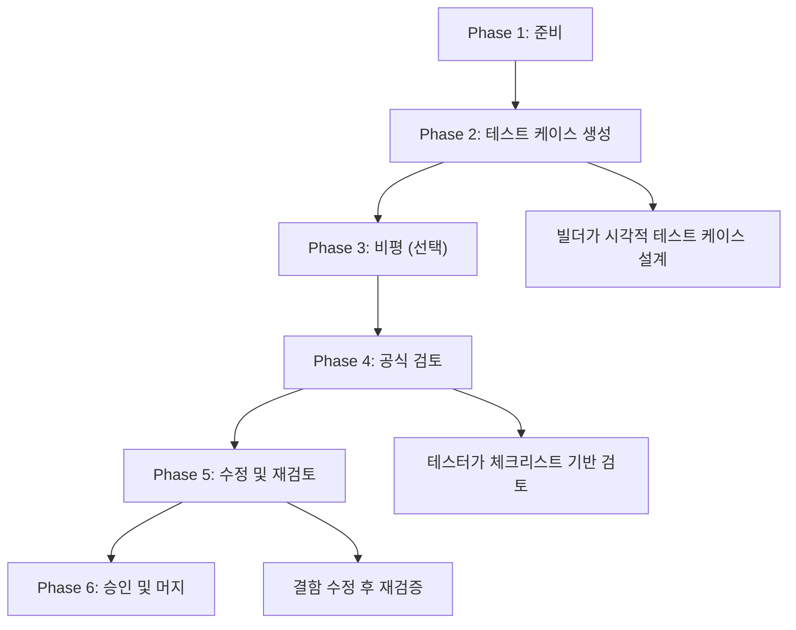
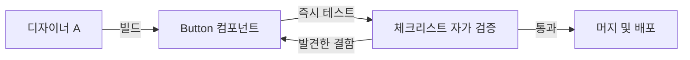
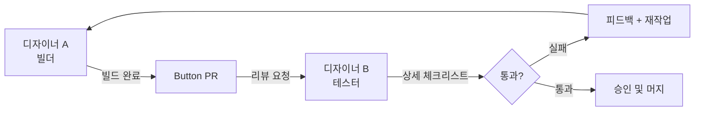
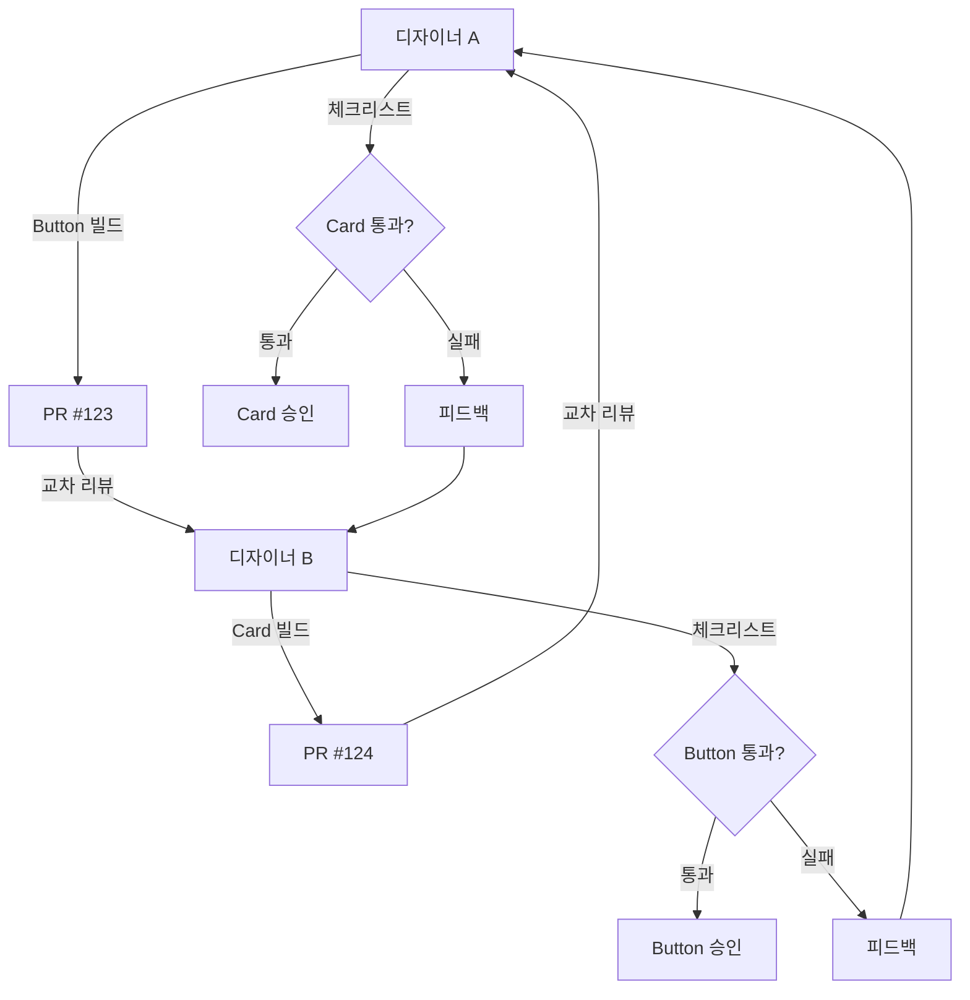

import DevQuickStart from '@site/src/components/DevQuickStart';

<DevQuickStart
  what="Figma 컴포넌트 테스팅의 6단계 워크플로우와 개발자의 역할을 이해합니다."
  learn="Figma 컴포넌트 품질 기준과 코드 구현과의 정합성 검증 방법"
  able="Figma 테스트 결과를 코드 구현에 반영하고 API 일관성을 검증할 수 있습니다."
/>

## 핵심 개념

### 왜 Figma 컴포넌트 테스팅이 필요한가?
- **문제 인식**: Figma 컴포넌트는 복잡하며, 기대대로 작동해야 하고 유효하지 않은 표시를 방지해야 함
- **흔히 발생하는 결함**: 레이블과 함께 커지지 않는 버튼, 누락된 배경색, 하드코딩된 스타일, 잘못된 이름

### 테스팅의 범위 정의

**테스팅이 검증하는 것:**
- 레이어와 속성이 올바르게 명명되었는가?
- 각 구성이 예상된 시각적 결과를 생성하는가?
- 색상이 제대로 적용되었는가?
- 컴포넌트 크기 조정 시 요소가 텍스트를 올바르게 흐르게 하는가?

**테스팅이 검증하지 않는 것:**
- UI 컴포넌트 디자인의 사용성 (최종 사용자 관점)
- Figma 컴포넌트 자체의 사용성 (디자이너 관점)

## 6-Phase 테스트 워크플로우 상세



### Phase 1: 준비 (Preparation)

**목표:** 테스트할 컴포넌트와 검증 기준을 명확히 정의

**디자이너 액션:**
1. 테스트할 컴포넌트 범위 결정 (예: Button의 모든 variant)
2. 기존 체크리스트 검토 및 커스터마이즈
3. 테스트 Figma 파일 생성 (별도 페이지 권장)

**개발자 액션:**
1. Storybook에 해당 컴포넌트의 모든 variant Story 추가
2. 시각적 회귀 테스트 설정 (Chromatic, Percy 등)
3. Props 문서화 확인 (JSDoc, TypeScript 타입)

**산출물:**
- 테스트 계획 문서 (어떤 variant를 어떻게 테스트할 것인가)
- 체크리스트 초안 (Notion, Linear, GitHub Issue)
- Storybook URL (개발자)

### Phase 2: 테스트 케이스 생성 (Test Case Creation)

**목표:** 모든 variant 조합을 시각적으로 나열하여 검증 가능하게 만듦

**디자이너 액션:**
1. Figma에서 "Testing Grid" 프레임 생성
2. 모든 variant 조합을 격자 형태로 배치
   ```
   | size=sm | size=md | size=lg |
   |---------|---------|---------|
   | variant=primary | 🔵 | 🔵 | 🔵 |
   | variant=secondary | ⚪ | ⚪ | ⚪ |
   | variant=ghost | 👻 | 👻 | 👻 |
   ```
3. Edge case 추가 (긴 텍스트, 아이콘 조합, disabled 상태)

**개발자 액션:**
1. Storybook에서 동일한 격자 레이아웃으로 Story 작성
   ```tsx
   export const AllVariants = () => (
     <div style={{ display: 'grid', gridTemplateColumns: 'repeat(3, 1fr)', gap: 16 }}>
       <Button variant="primary" size="sm">Primary SM</Button>
       <Button variant="primary" size="md">Primary MD</Button>
       <Button variant="primary" size="lg">Primary LG</Button>
       {/* ... 모든 조합 */}
     </div>
   );
   ```
2. 각 variant에 대한 Playwright 스크린샷 생성

**산출물:**
- Figma Testing Grid (모든 variant 시각화)
- Storybook "All Variants" Story
- 초기 스크린샷 세트 (Playwright/Chromatic)

### Phase 3: 비평 (Critique) - 선택적

**목표:** 공식 검토 전에 팀 피드백으로 명백한 문제 조기 발견

**디자이너 액션:**
1. 팀 회의에서 Testing Grid 공유
2. "이 조합에서 이상한 점이 보이나요?" 질문
3. 즉각적인 수정 가능 항목은 바로 반영

**개발자 액션:**
1. Storybook URL을 팀 Slack에 공유
2. 브라우저 DevTools로 실제 DOM 구조 설명
3. 디자이너가 발견한 문제를 코드에서 재현 가능한지 확인

**산출물:**
- 비평 회의록 (발견된 문제와 합의된 수정 사항)
- 수정된 Testing Grid (v2)

### Phase 4: 공식 검토 (Formal Review)

**목표:** 체크리스트 기반의 체계적인 품질 검증

**디자이너 액션:**
1. 체크리스트를 한 항목씩 검증
2. 각 항목에 Pass/Fail/NA 표시
3. Fail 항목은 스크린샷과 함께 상세 설명 기록
4. 검토 결과를 문서화 (예: Notion 페이지, GitHub Issue)

**개발자 액션:**
1. 디자이너의 체크리스트와 병렬로 코드 체크리스트 실행
   ```bash
   # 1. 하드코딩된 색상 검사
   rg '#[0-9a-fA-F]{6}' src/components/Button/

   # 2. Props 타입 검증
   npm run type-check

   # 3. 시각적 회귀 테스트
   npm run test:visual
   ```
2. 불일치 항목을 디자이너에게 공유
3. Figma-Code 동기화 스크립트 실행 (`npm run verify:figma`)

**산출물:**
- 완료된 체크리스트 (Pass/Fail 표시)
- 발견된 결함 목록 (우선순위 포함)
- 코드 리뷰 결과 (GitHub PR 코멘트)

### Phase 5: 수정 및 재검토 (Fix and Retest)

**목표:** 발견된 모든 결함을 수정하고 재검증

**디자이너 액션:**
1. 우선순위가 높은 결함부터 수정 (예: 하드코딩된 색상 → 스타일 연결)
2. 수정 후 Testing Grid에서 해당 variant만 재테스트
3. 수정이 다른 variant에 영향을 주지 않았는지 확인 (회귀 테스트)

**개발자 액션:**
1. 디자이너가 수정한 variant에 대응하는 코드 수정
   ```tsx
   // Before (하드코딩)
   background: '#6366f1'

   // After (토큰 사용)
   background: 'var(--color-brand-500)'
   ```
2. 시각적 회귀 테스트 재실행하여 의도하지 않은 변경 없는지 확인
3. 수정된 PR을 디자이너에게 다시 리뷰 요청

**산출물:**
- 수정된 Figma 컴포넌트 (v3)
- 수정된 코드 (PR 업데이트)
- 재검증 체크리스트 (모두 Pass 상태)

### Phase 6: 승인 및 머지 (Approval and Merge)

**목표:** 최종 승인 후 프로덕션에 배포

**디자이너 액션:**
1. 최종 체크리스트 확인 (모든 항목 Pass)
2. Figma 컴포넌트를 메인 라이브러리로 이동
3. 변경 로그 작성 (무엇이 바뀌었는지, 왜 바뀌었는지)
4. Figma Publish 실행

**개발자 액션:**
1. PR 최종 승인 (LGTM)
2. CI/CD 파이프라인 통과 확인
   ```bash
   # 1. 유닛 테스트
   npm run test

   # 2. 시각적 회귀 테스트
   npm run test:visual

   # 3. 번들 사이즈 체크
   npm run build:check
   ```
3. 메인 브랜치에 머지
4. Storybook 배포 및 버전 태그 생성 (`v1.2.0`)
5. 팀 Slack에 배포 알림

**산출물:**
- 배포된 Figma 라이브러리 업데이트
- 배포된 코드 (npm 패키지 또는 monorepo)
- 변경 로그 (CHANGELOG.md, GitHub Release)

### 워크플로우 팁

**빠른 반복을 위한 단축:**
- Phase 3 (비평) 생략 가능 (소규모 변경 시)
- Phase 5에서 여러 번 반복하지 않도록 Phase 2를 충분히 정밀하게 수행

**자동화로 시간 절약:**
- Phase 2: Figma Plugin으로 Testing Grid 자동 생성
- Phase 4: Linting 규칙으로 체크리스트 항목 자동 검증
- Phase 6: CI/CD로 테스트 및 배포 자동화

## 개발자의 역할

디자이너가 Figma 테스팅을 수행하는 동안, 개발자는 다음 영역에서 협업합니다.

### Figma-Code 정합성 검증 테이블

| Figma 속성 | 코드 대응 | 검증 방법 |
|-----------|----------|----------|
| Layer name: `icon-leading` | `className="icon-leading"` | Storybook에서 시각적 비교 |
| Property: `size = sm / md / lg` | `type Size = 'sm' \| 'md' \| 'lg'` | TypeScript 타입 일치 확인 |
| Auto Layout: horizontal, gap 8 | `display: flex; gap: 8px` | DevTools 검사 |
| Color style: `brand/500` | `var(--color-brand-500)` | 계산된 값 비교 |
| Text style: `heading/sm` | `var(--font-heading-sm)` | 폰트 속성 비교 |
| Variant: `state = hover` | `.btn:hover` | 상태별 스크린샷 비교 |

### API 네이밍 정렬 체크

```tsx
// Figma에서 Button의 Properties:
// - variant: primary | secondary | ghost
// - size: sm | md | lg
// - state: default | hover | active | disabled
// - hasIcon: true | false

// 코드에서의 대응 (정렬 필수):
interface ButtonProps {
  variant: 'primary' | 'secondary' | 'ghost';  // Figma와 동일
  size: 'sm' | 'md' | 'lg';                    // Figma와 동일
  disabled?: boolean;         // Figma 'state=disabled' 대응
  // hasIcon은 children으로 자연스럽게 처리
  leftIcon?: React.ReactNode;
  rightIcon?: React.ReactNode;
}

// 불일치 예시 (피해야 할 것):
// Figma: "size = small"  vs  Code: size = 'sm'  → 약어 규칙 합의 필요
// Figma: "type = primary" vs  Code: variant = 'primary' → 속성명 합의 필요
```

### Figma-to-Code 검증 자동화

Figma REST API를 사용하여 컴포넌트 속성과 React props를 자동으로 비교할 수 있습니다.

```typescript
// scripts/verify-figma-code-sync.ts
import { FigmaAPI } from 'figma-api';
import fs from 'fs';
import * as ts from 'typescript';

interface FigmaComponentProperty {
  name: string;
  type: 'VARIANT' | 'INSTANCE_SWAP' | 'TEXT' | 'BOOLEAN';
  variantOptions?: string[];
}

interface ReactPropDefinition {
  name: string;
  type: string;
  required: boolean;
}

/**
 * 1. Figma API로 컴포넌트 속성 추출
 */
async function fetchFigmaComponent(fileKey: string, nodeId: string): Promise<FigmaComponentProperty[]> {
  const api = new FigmaAPI({ personalAccessToken: process.env.FIGMA_TOKEN! });
  const file = await api.getFile(fileKey);

  // 특정 컴포넌트 노드 찾기
  const component = findNodeById(file.document, nodeId);
  if (!component || component.type !== 'COMPONENT_SET') {
    throw new Error('Component set not found');
  }

  const properties: FigmaComponentProperty[] = [];

  // componentPropertyDefinitions 파싱
  for (const [propName, propDef] of Object.entries(component.componentPropertyDefinitions || {})) {
    properties.push({
      name: propName,
      type: propDef.type,
      variantOptions: propDef.type === 'VARIANT' ? propDef.variantOptions : undefined,
    });
  }

  return properties;
}

/**
 * 2. React 컴포넌트에서 prop types 추출
 */
function extractReactProps(filePath: string): ReactPropDefinition[] {
  const sourceCode = fs.readFileSync(filePath, 'utf-8');
  const sourceFile = ts.createSourceFile(filePath, sourceCode, ts.ScriptTarget.Latest, true);

  const props: ReactPropDefinition[] = [];

  // TypeScript AST 순회
  ts.forEachChild(sourceFile, (node) => {
    if (ts.isInterfaceDeclaration(node) && node.name.text.endsWith('Props')) {
      node.members.forEach((member) => {
        if (ts.isPropertySignature(member) && member.name) {
          const propName = member.name.getText();
          const isRequired = !member.questionToken;
          const typeNode = member.type ? member.type.getText() : 'any';

          props.push({
            name: propName,
            type: typeNode,
            required: isRequired,
          });
        }
      });
    }
  });

  return props;
}

/**
 * 3. 비교 및 불일치 리포트
 */
function compareProps(figmaProps: FigmaComponentProperty[], reactProps: ReactPropDefinition[]) {
  const mismatches: string[] = [];

  figmaProps.forEach((figmaProp) => {
    const reactProp = reactProps.find((p) => p.name === figmaProp.name);

    if (!reactProp) {
      mismatches.push(`❌ Missing in code: ${figmaProp.name}`);
      return;
    }

    // VARIANT 타입은 union type이어야 함
    if (figmaProp.type === 'VARIANT' && figmaProp.variantOptions) {
      const expectedType = figmaProp.variantOptions.map((opt) => `'${opt}'`).join(' | ');
      if (reactProp.type !== expectedType) {
        mismatches.push(
          `❌ Type mismatch for "${figmaProp.name}"\n` +
          `   Figma: ${expectedType}\n` +
          `   Code:  ${reactProp.type}`
        );
      }
    }
  });

  // Code에만 있는 props 체크
  reactProps.forEach((reactProp) => {
    if (!figmaProps.find((p) => p.name === reactProp.name)) {
      mismatches.push(`⚠️ Only in code: ${reactProp.name}`);
    }
  });

  return mismatches;
}

/**
 * 실행 예시
 */
async function main() {
  const figmaProps = await fetchFigmaComponent('abc123', '456:789');
  const reactProps = extractReactProps('src/components/Button/Button.tsx');

  const mismatches = compareProps(figmaProps, reactProps);

  if (mismatches.length > 0) {
    console.error('🚨 Figma-Code sync issues found:\n');
    mismatches.forEach((msg) => console.error(msg));
    process.exit(1);
  } else {
    console.log('✅ Figma and Code are in sync!');
  }
}

// 유틸리티 함수
function findNodeById(node: any, id: string): any {
  if (node.id === id) return node;
  if (node.children) {
    for (const child of node.children) {
      const result = findNodeById(child, id);
      if (result) return result;
    }
  }
  return null;
}
```

**사용법:**
```bash
# package.json에 스크립트 추가
"scripts": {
  "verify:figma": "ts-node scripts/verify-figma-code-sync.ts"
}

# CI/CD에서 실행
npm run verify:figma
```

**실전 적용 팁:**
- PR에서 자동 실행하여 디자인-코드 불일치를 조기에 발견
- Figma 파일 키와 노드 ID는 `.env` 파일에서 관리
- 불일치 발견 시 Slack/GitHub Issue로 자동 알림

## 테스팅 역할 모델 상세 비교

Figma 컴포넌트 테스팅은 팀 규모와 성숙도에 따라 다른 역할 모델을 선택해야 합니다.

### 비교 테이블

| 역할 모델 | 팀 규모 | 품질 목표 | 속도 | 학습 곡선 | 장점 | 단점 |
|---------|--------|---------|------|----------|-----|-----|
| **Model 1: Advocate**<br/>(빌더가 직접 테스트) | 1-2명 | 80-85% | ⚡⚡⚡ 빠름 | 낮음 | 빠른 반복, 오버헤드 없음 | 주관적 평가, 놓친 결함 |
| **Model 2: Enabler**<br/>(전담 테스터) | 3-5명 | 90-95% | ⚡⚡ 보통 | 중간 | 객관적 품질, 학습 기회 | 병목 위험, 역할 의존 |
| **Model 3: Enforcer**<br/>(교차 검토) | 5-10명 | 95-98% | ⚡ 느림 | 높음 | 최고 품질, 팀 전문성 향상 | 시간 소요, 조율 복잡 |

### Model 1: "Advocate" - 빌더가 직접 테스트

**언제 사용하는가:**
- 혼자 작업하는 디자이너
- 소규모 스타트업 팀 (1-2명)
- 빠른 프로토타이핑 단계
- 컴포넌트 수가 적을 때 (< 20개)

**워크플로우:**


**체크리스트 예시 (단축판):**
```markdown
- [ ] 모든 variant가 시각적으로 올바른가?
- [ ] 텍스트 오버플로우 시 레이아웃이 깨지지 않는가?
- [ ] Auto Layout이 의도대로 작동하는가?
```

**개발자 액션:**
1. Storybook에서 모든 variant 렌더링 확인
2. 각 variant의 props가 Figma와 일치하는지 수동 비교
3. 시각적 회귀 테스트 스크린샷 업데이트

### Model 2: "Enabler" - 전담 테스터

**언제 사용하는가:**
- 중규모 팀 (3-5명)
- 공식적인 승인 프로세스가 필요할 때
- 견습 디자이너가 학습 중일 때
- 컴포넌트 수가 중간 규모 (20-50개)

**워크플로우:**


**체크리스트 예시 (확장판):**
```markdown
## Metadata
- [ ] 컴포넌트 이름이 네이밍 규칙을 따르는가?
- [ ] Description이 작성되어 있는가?

## Anatomy
- [ ] 모든 레이어 이름이 kebab-case인가?
- [ ] 중첩된 컴포넌트가 올바르게 명명되었는가?

## Properties
- [ ] 모든 property 이름이 camelCase인가?
- [ ] 기본값이 적절히 설정되었는가?

## Visual
- [ ] 모든 variant 조합이 올바르게 렌더링되는가?
- [ ] 텍스트 길이 변경 시 레이아웃이 유지되는가?
```

**개발자 액션:**
1. Figma 리뷰 결과를 받아 코드 리뷰 병행
2. 각 체크리스트 항목에 대응하는 코드 검증 수행
3. 불일치 발견 시 디자이너와 합의하여 수정

### Model 3: "Enforcer" - 교차 검토

**언제 사용하는가:**
- 대규모 디자인 시스템 팀 (5-10명 이상)
- 많은 컴포넌트가 병렬로 개발될 때
- 높은 품질 기준이 필요한 프로덕션 환경
- 컴포넌트 수가 많을 때 (50개 이상)

**워크플로우:**


**체크리스트 예시 (엄격판):**
```markdown
## Phase 1: Pre-Review
- [ ] 빌더가 자가 검증을 완료했는가?
- [ ] 모든 variant가 Figma 파일에 존재하는가?

## Phase 2: Detailed Review
- [ ] Metadata: 9개 항목 검증
- [ ] Anatomy: 12개 항목 검증
- [ ] Properties: 15개 항목 검증
- [ ] Visual: 20개 조합 테스트

## Phase 3: Edge Cases
- [ ] 극단적으로 긴 텍스트 테스트
- [ ] 빈 콘텐츠 테스트
- [ ] 모든 조합에서 접근성 확인
```

**개발자 액션:**
1. 디자이너 A가 디자이너 B의 컴포넌트를 리뷰하는 동안, 개발자 A는 개발자 B의 코드를 리뷰
2. 디자인-코드 불일치를 양측에서 동시에 발견
3. 주간 동기화 회의에서 발견된 패턴을 공유하고 표준 개선

### 선택 가이드

**시작 단계 (0-6개월):**
- Model 1 사용
- 빠른 반복과 학습에 집중
- 체크리스트를 점진적으로 확장

**성장 단계 (6-18개월):**
- Model 2로 전환
- 전담 테스터 역할 도입
- 표준화된 리뷰 프로세스 구축

**성숙 단계 (18개월 이상):**
- Model 3로 전환
- 교차 검토로 팀 전체 전문성 향상
- 자동화 도구로 반복 작업 감소

## 품질 기준의 현실적 설정

**"충분히 좋은" 품질 + 다른 기회:**
- 코드 품질이 Figma 품질보다 더 중요함
- 92% vs 98% 품질의 딜레마: 균형을 잃지 말 것
- 디자인 자산은 끊임없이 변하는 코드로 구축된 프로덕션 경험으로 가는 길의 한 단계

## 실전 체크리스트 확장

개발자와 디자이너가 함께 사용할 수 있는 종합 체크리스트입니다.

### 디자이너 체크리스트

#### Metadata (메타데이터)
- [ ] **Pass Criteria**: 컴포넌트 이름이 `ComponentName` 형식 (PascalCase)
  - ✅ Pass: `Button`, `IconButton`, `AlertDialog`
  - ❌ Fail: `button`, `icon_button`, `alert-dialog`
- [ ] **Pass Criteria**: Description이 1-2문장으로 작성됨
  - ✅ Pass: "Primary action button with icon support"
  - ❌ Fail: 빈 값 또는 "Button"만 작성

#### Anatomy (레이어 구조)
- [ ] **Pass Criteria**: 모든 레이어 이름이 kebab-case
  - ✅ Pass: `icon-leading`, `label-text`, `container-background`
  - ❌ Fail: `iconLeading`, `Label_Text`, `Container Background`
- [ ] **Pass Criteria**: 중첩된 컴포넌트 인스턴스 이름이 역할 표시
  - ✅ Pass: `icon-left`, `icon-right` (역할 명확)
  - ❌ Fail: `Icon`, `Icon 2` (역할 불명확)

#### Color Styles (색상 스타일)
- [ ] **Pass Criteria**: 모든 색상이 color style 연결됨 (하드코딩 0개)
  - ✅ Pass: 모든 fill이 style 아이콘 표시
  - ❌ Fail: HEX 코드 직접 입력된 레이어 존재
- [ ] **Pass Criteria**: Semantic token 사용 (primitive 직접 사용 금지)
  - ✅ Pass: `brand/primary`, `feedback/error`
  - ❌ Fail: `purple/600`, `red/500` (primitive)

#### Properties (속성)
- [ ] **Pass Criteria**: 모든 property 이름이 camelCase
  - ✅ Pass: `variant`, `size`, `hasIcon`
  - ❌ Fail: `Variant`, `Size`, `has_icon`
- [ ] **Pass Criteria**: Boolean property는 `is*` 또는 `has*` prefix
  - ✅ Pass: `isDisabled`, `hasIcon`, `isLoading`
  - ❌ Fail: `disabled`, `icon`, `loading`

#### Spacing (간격)
- [ ] **Pass Criteria**: Auto Layout 간격이 8의 배수 (8px 시스템)
  - ✅ Pass: 8, 16, 24, 32
  - ❌ Fail: 6, 10, 18, 25

#### Layout (레이아웃)
- [ ] **Pass Criteria**: 텍스트 오버플로우 시 레이아웃 유지
  - 테스트: 텍스트를 "Very long button label that might wrap to multiple lines"로 변경
  - ✅ Pass: 버튼이 확장되고 텍스트가 정상 표시
  - ❌ Fail: 텍스트가 잘리거나 레이어 밖으로 넘침

### 개발자 체크리스트

#### Props 정합성
- [ ] **Pass Criteria**: TypeScript interface가 Figma Properties와 1:1 대응
  ```tsx
  // Figma: variant, size, hasIcon
  // Code:
  interface ButtonProps {
    variant: 'primary' | 'secondary' | 'ghost';  // ✅
    size: 'sm' | 'md' | 'lg';                    // ✅
    icon?: React.ReactNode;                       // ✅ (hasIcon 대응)
  }
  ```
- [ ] **Pass Criteria**: 모든 variant 조합이 Storybook Story로 존재
  ```tsx
  export const AllVariants = () => (
    <>
      <Button variant="primary" size="sm">Primary SM</Button>
      <Button variant="primary" size="md">Primary MD</Button>
      {/* ... 모든 조합 */}
    </>
  );
  ```

#### 토큰 사용
- [ ] **Pass Criteria**: 하드코딩된 색상 0개
  - 검증: `rg '#[0-9a-fA-F]{6}' src/components/Button/` 결과 0건
- [ ] **Pass Criteria**: 스페이싱이 토큰 변수 사용
  ```css
  /* ✅ Pass */
  padding: var(--space-2) var(--space-4);

  /* ❌ Fail */
  padding: 8px 16px;
  ```

#### 접근성
- [ ] **Pass Criteria**: 모든 interactive 요소에 focus 스타일
  ```css
  .btn:focus-visible {
    outline: 2px solid var(--color-focus-ring);
    outline-offset: 2px;
  }
  ```
- [ ] **Pass Criteria**: ARIA 속성 올바르게 설정
  ```tsx
  <button aria-disabled={disabled} aria-label={ariaLabel}>
  ```

#### 시각적 회귀 테스트
- [ ] **Pass Criteria**: Chromatic/Percy 스크린샷이 baseline과 일치
  - ✅ Pass: "No visual changes detected"
  - ❌ Fail: Unexpected pixel differences

#### 번들 사이즈
- [ ] **Pass Criteria**: 컴포넌트 번들 사이즈가 임계값 이하
  - 검증: `npm run build:check` 실행
  - ✅ Pass: `Button: 2.3 KB (< 5 KB threshold)`
  - ❌ Fail: `Button: 8.1 KB (> 5 KB threshold)`

### 통합 체크리스트 (디자이너 + 개발자 함께 검증)

#### 시각적 일관성
- [ ] **Pass Criteria**: Figma와 Storybook이 픽셀 단위로 일치
  - 방법: Figma 스크린샷과 Storybook 스크린샷을 겹쳐서 비교
  - 도구: Figma의 "Dev Mode" 또는 Overlay 플러그인

#### 인터랙션 동작
- [ ] **Pass Criteria**: Hover/Focus/Active 상태가 Figma variant와 일치
  ```
  | State | Figma | Code |
  |-------|-------|------|
  | Default | variant=default | .btn:not(:hover):not(:focus) |
  | Hover | variant=hover | .btn:hover |
  | Active | variant=active | .btn:active |
  | Disabled | variant=disabled | .btn:disabled |
  ```

#### 문서화
- [ ] **Pass Criteria**: Figma Description과 Storybook JSDoc이 동일한 설명 포함
  ```tsx
  /**
   * Primary action button with icon support.
   * Use for the main call-to-action on a page.
   */
  export const Button = (props: ButtonProps) => { ... }
  ```

---
*출처: Nathan Curtis (EightShapes)*

---

## Related Articles

import CrossRef from '@site/src/components/CrossRef';

<CrossRef
  related={[
    { path: "/docs/quality-testing/figma-review", label: "Figma 컴포넌트 리뷰 가이드" },
    { path: "/docs/category/03-component-design", label: "Component Design" },
    { path: "/docs/governance-operations/subtask-decomposition", label: "서브태스크 분해 방법론" },
  ]}
/>
