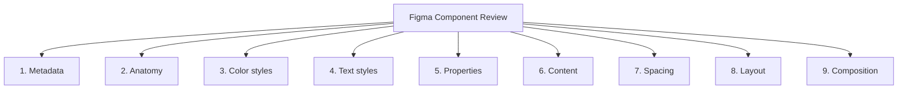

import DevQuickStart from '@site/src/components/DevQuickStart';

<DevQuickStart
  what="Figma 컴포넌트의 9개 검증 카테고리와 개발자 코드 리뷰 병행 체크리스트를 배웁니다."
  learn="Figma 리뷰 결과를 코드 컴포넌트 리뷰와 연결하는 체계적 방법"
  able="디자인-코드 정합성을 체크리스트 기반으로 검증할 수 있습니다."
/>

## 핵심 개념

- **컴포넌트 테스팅의 중요성 증가**: Figma 기능 확장에 따라 효과적이고 오류 없는 적용을 보장하기 위한 투자 확대 필요
- **4단계 사이클**: Prepare, Review, Retest and Resolve, Complete
- **체크리스트 구조**: Pass/Fail/Not checked/Not applicable 상태 관리 시스템
- **9개 검증 영역**: Metadata, Anatomy, Color styles, Text styles, Properties, Content, Spacing, Layout, Composition

## 9개 검증 카테고리



1. **Metadata**: Name, Namespace, Description, Status
2. **Anatomy**: Layer name, Layer format, Nested component names, Default visibility
3. **Color styles**: Color accuracy, Style specificity, Hardcoded colors
4. **Text styles**: Text styles, Non-text style properties
5. **Properties**: Property names/order, Option names/order, Default option
6. **Content**: Wrong/Just right/Too much/Too little/Missing content
7. **Spacing**: Padding, Alignment, Space between items
8. **Layout**: Element layout, Text layout
9. **Composition**: Subcomponent properties/content, Slot resize/content reflow

## 개발자 병행 코드 리뷰 체크리스트

Figma 리뷰와 동시에 코드 컴포넌트도 같은 기준으로 검증하세요.

| Figma 검증 영역 | 코드 대응 체크 |
|----------------|--------------|
| **Metadata**: 이름/설명 | `displayName`, JSDoc 주석, `package.json` name |
| **Anatomy**: 레이어 구조 | DOM 구조가 Figma 레이어 트리와 일치 |
| **Color styles**: 스타일 연결 | CSS 변수만 사용, 하드코딩 색상 없음 |
| **Text styles**: 텍스트 스타일 | 타이포그래피 토큰 사용 |
| **Properties**: props 순서/이름 | TypeScript interface가 Figma props와 일치 |
| **Content**: 콘텐츠 적절성 | Storybook args의 기본값이 현실적 |
| **Spacing**: 패딩/간격 | 스페이싱 토큰 사용, Auto Layout = Flexbox |
| **Layout**: 레이아웃 동작 | 반응형 동작이 Figma 제약조건과 일치 |
| **Composition**: 서브컴포넌트 | compound component 패턴 일치 |

### 코드 리뷰 실행 예시

```tsx
// Figma Review: "Button의 Color style이 brand/500을 사용하는가?"
// Code Review 대응:

// 확인 1: CSS에서 하드코딩 색상 검색
// rg '#[0-9a-fA-F]{3,8}' src/components/Button/

// 확인 2: 토큰만 사용하는지 검증
// .btn--primary {
//   background: var(--color-brand-500);  // OK
//   background: #6366f1;                  // FAIL
// }

// 확인 3: Props가 Figma Properties와 일치하는지 확인
interface ButtonProps {
  variant: 'primary' | 'secondary' | 'ghost';  // Figma: variant 속성
  size: 'sm' | 'md' | 'lg';                    // Figma: size 속성
  disabled?: boolean;                           // Figma: state=disabled
}
```

## 체크리스트 설계 원칙

- **구체성 유지**: "props 테스트" 대신 "각 텍스트 레이어가 정의된 텍스트 스타일과 연결되어 있는가?"
- **사용자 관점 표현**: "As a product designer, I can..." 형식으로 수용 기준 프레임

## 적용 가이드

### 시작 단계
1. 기본 체크리스트 구축 (Metadata, Anatomy, Color, Text부터 시작)
2. Figma 컴포넌트 제작 (Component Review Checklist)
3. 파일럿 테스트 (1-2개 컴포넌트로 워크플로우 테스트)
4. 확장 (Properties, Content, Spacing, Layout, Composition 추가)

### 성공 팁
- **명확한 소유권**: 빌더와 테스터 역할 명확히
- **정기적 업데이트**: Figma 기능 업데이트에 따라 기준 갱신
- **문서화**: 기준의 "왜"를 문서화하여 컨텍스트 제공
- **자동화**: 가능한 경우 Figma 플러그인으로 일부 검사 자동화

---
*출처: Nathan Curtis (EightShapes)*

---

## Related Articles

import CrossRef from '@site/src/components/CrossRef';

<CrossRef
  related={[
    { path: "/docs/quality-testing/figma-testing", label: "Figma 컴포넌트 테스팅 워크플로우" },
    { path: "/docs/quality-testing/specs-plugin", label: "EightShapes Specs Plugin" },
    { path: "/docs/category/04-component-documentation", label: "Component Documentation" },
  ]}
/>
