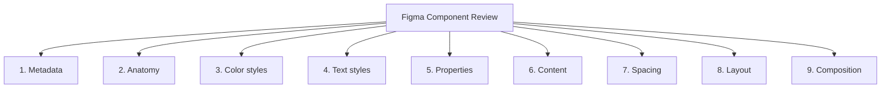

import DevQuickStart from '@site/src/components/DevQuickStart';

<DevQuickStart
  what="Figma 컴포넌트의 9개 검증 카테고리와 개발자 코드 리뷰 병행 체크리스트를 배웁니다."
  learn="Figma 리뷰 결과를 코드 컴포넌트 리뷰와 연결하는 체계적 방법"
  able="디자인-코드 정합성을 체크리스트 기반으로 검증할 수 있습니다."
/>

## 핵심 개념

- **컴포넌트 테스팅의 중요성 증가**: Figma 기능 확장에 따라 효과적이고 오류 없는 적용을 보장하기 위한 투자 확대 필요
- **4단계 사이클**: Prepare, Review, Retest and Resolve, Complete
- **체크리스트 구조**: Pass/Fail/Not checked/Not applicable 상태 관리 시스템
- **9개 검증 영역**: Metadata, Anatomy, Color styles, Text styles, Properties, Content, Spacing, Layout, Composition

## 9개 검증 카테고리 상세



### 1. Metadata (메타데이터)

**검증 항목:**
- Name: 컴포넌트 이름
- Namespace: 컴포넌트 그룹 (예: `forms/Button`)
- Description: 사용 설명
- Status: 개발 상태 (WIP, Ready, Deprecated)

**Pass/Fail 기준:**

| 항목 | Pass | Fail |
|-----|------|------|
| **Name** | PascalCase, 명확한 의미 | snake_case, 약어, 모호한 이름 |
| **Namespace** | 논리적 그룹 (forms, navigation) | 없음 또는 임의 구조 |
| **Description** | 1-2문장, 사용 시점 설명 | 빈 값 또는 이름 반복 |
| **Status** | Ready (배포 가능) | WIP 상태로 머지 시도 |

**코드 검증 예시:**
```tsx
// ✅ Pass: 메타데이터가 JSDoc으로 동기화됨
/**
 * Primary action button with icon support.
 * Use for the main call-to-action on a page.
 *
 * @component
 * @namespace forms
 * @status ready
 */
export const Button = (props: ButtonProps) => { ... }

// ❌ Fail: 문서화 없음
export const Button = (props: ButtonProps) => { ... }
```

### 2. Anatomy (레이어 구조)

**검증 항목:**
- Layer name: 레이어 명명 규칙
- Layer format: Frame vs Group 선택
- Nested component names: 중첩 컴포넌트 인스턴스 이름
- Default visibility: 기본 표시/숨김 상태

**Pass/Fail 기준:**

| 항목 | Pass | Fail |
|-----|------|------|
| **Layer name** | kebab-case, 역할 표시 | camelCase, 공백, 숫자 suffix |
| **Layer format** | Auto Layout Frame | Group (레거시) |
| **Nested names** | 역할 명시 (icon-left, icon-right) | 기본 이름 (Icon, Icon 2) |
| **Visibility** | 적절한 기본값 (필수만 표시) | 모든 레이어 항상 표시 |

**코드 검증 예시:**
```tsx
// ✅ Pass: DOM 구조가 Figma 레이어와 일치
<button className="btn">
  <span className="icon-leading">{leftIcon}</span>
  <span className="label-text">{children}</span>
  <span className="icon-trailing">{rightIcon}</span>
</button>

// ❌ Fail: 레이어 이름과 불일치
<button className="button">
  <span className="iconLeft">{leftIcon}</span>  // camelCase 불일치
  <span className="text">{children}</span>      // 역할 불명확
</button>
```

**자동 검증 스크립트:**
```typescript
// 레이어 이름 규칙 검증
function validateLayerNames(node: any): string[] {
  const errors: string[] = [];
  const kebabRegex = /^[a-z0-9]+(-[a-z0-9]+)*$/;

  if (node.name && !kebabRegex.test(node.name)) {
    errors.push(`❌ Layer "${node.name}" is not kebab-case`);
  }

  if (node.children) {
    node.children.forEach((child: any) => {
      errors.push(...validateLayerNames(child));
    });
  }

  return errors;
}
```

### 3. Color Styles (색상 스타일)

**검증 항목:**
- Color accuracy: 색상이 디자인 토큰과 일치
- Style specificity: Semantic vs Primitive 사용
- Hardcoded colors: 하드코딩된 색상 없음

**Pass/Fail 기준:**

| 항목 | Pass | Fail |
|-----|------|------|
| **Color accuracy** | 모든 fill/stroke가 style 연결 | HEX/RGB 직접 입력 |
| **Specificity** | Semantic token (brand/primary) | Primitive (purple/600) |
| **Hardcoded** | 0개 | 1개 이상 |

**코드 검증 예시:**
```bash
# 하드코딩된 색상 검색 (0건이어야 함)
rg '#[0-9a-fA-F]{3,8}' src/components/Button/ --type css

# ✅ Pass: 0 matches

# ❌ Fail:
# Button.module.css:12:  background: #6366f1;
```

```css
/* ✅ Pass: CSS 변수 사용 */
.btn--primary {
  background: var(--color-brand-primary);
  color: var(--color-on-primary);
}

/* ❌ Fail: 하드코딩 */
.btn--primary {
  background: #6366f1;
  color: #ffffff;
}
```

### 4. Text Styles (텍스트 스타일)

**검증 항목:**
- Text styles: 모든 텍스트 레이어가 style 연결
- Non-text style properties: line-height, letter-spacing 등

**Pass/Fail 기준:**

| 항목 | Pass | Fail |
|-----|------|------|
| **Text styles** | 모든 텍스트가 style 아이콘 표시 | 일부 텍스트만 style 연결 |
| **Properties** | style에 포함된 속성만 사용 | 개별 레이어에 override |

**코드 검증 예시:**
```css
/* ✅ Pass: 타이포그래피 토큰 사용 */
.btn__label {
  font-family: var(--font-family-base);
  font-size: var(--font-size-md);
  font-weight: var(--font-weight-semibold);
  line-height: var(--line-height-tight);
}

/* ❌ Fail: 하드코딩 */
.btn__label {
  font-family: "Inter", sans-serif;
  font-size: 16px;
  font-weight: 600;
  line-height: 1.25;
}
```

### 5. Properties (속성)

**검증 항목:**
- Property names/order: 속성 이름과 순서
- Option names/order: 옵션 값과 순서
- Default option: 기본값 설정

**Pass/Fail 기준:**

| 항목 | Pass | Fail |
|-----|------|------|
| **Property names** | camelCase, 명확한 의미 | PascalCase, 약어, 모호함 |
| **Order** | 중요도 순 (variant, size, state) | 무작위 |
| **Option names** | 일관된 네이밍 (sm/md/lg) | 혼재 (small/medium/large) |
| **Default** | 가장 흔한 사용 케이스 | 엣지 케이스 |

**코드 검증 예시:**
```tsx
// ✅ Pass: Props가 Figma와 완전히 일치
interface ButtonProps {
  variant: 'primary' | 'secondary' | 'ghost';  // Figma: variant 속성
  size: 'sm' | 'md' | 'lg';                    // Figma: size 속성
  disabled?: boolean;                           // Figma: state=disabled
  children: React.ReactNode;
}

// Default props도 Figma와 일치
Button.defaultProps = {
  variant: 'primary',  // Figma default
  size: 'md',          // Figma default
};

// ❌ Fail: 속성명 불일치
interface ButtonProps {
  type: 'primary' | 'secondary';  // Figma는 'variant'
  buttonSize: 'small' | 'medium'; // Figma는 'size', 값도 'sm/md'
}
```

### 6. Content (콘텐츠)

**검증 항목:**
- Wrong: 오타, 잘못된 예시
- Just right: 적절한 샘플 데이터
- Too much: 너무 긴 텍스트
- Too little: 의미 없는 짧은 텍스트
- Missing: 필수 콘텐츠 누락

**Pass/Fail 기준:**

| 항목 | Pass | Fail |
|-----|------|------|
| **Just right** | 현실적 길이 (예: "Save changes") | "Button" 또는 "Lorem ipsum..." |
| **Overflow test** | 긴 텍스트에서 레이아웃 유지 | 텍스트가 레이어 밖으로 넘침 |
| **Empty test** | 빈 콘텐츠 시 대체 UI | 빈 공간 그대로 표시 |

**코드 검증 예시:**
```tsx
// ✅ Pass: Storybook args가 현실적
export const Default: Story = {
  args: {
    children: 'Save changes',  // 실제 사용 예시
  },
};

export const LongText: Story = {
  args: {
    children: 'This is a very long button label that might wrap',
  },
};

// ❌ Fail: 의미 없는 placeholder
export const Default: Story = {
  args: {
    children: 'Button',  // 너무 짧음
  },
};
```

### 7. Spacing (간격)

**검증 항목:**
- Padding: 내부 여백
- Alignment: 정렬
- Space between items: 요소 간 간격

**Pass/Fail 기준:**

| 항목 | Pass | Fail |
|-----|------|------|
| **Padding** | 8의 배수 (8, 16, 24, 32) | 임의 값 (6, 10, 18) |
| **Alignment** | Auto Layout center/start/end | 수동 위치 조정 |
| **Gap** | Auto Layout gap 사용 | 수동 spacing frame |

**코드 검증 예시:**
```css
/* ✅ Pass: 스페이싱 토큰 사용 */
.btn {
  padding: var(--space-2) var(--space-4);  /* 8px 16px */
  gap: var(--space-2);                      /* 8px */
}

/* ❌ Fail: 하드코딩 + 비표준 값 */
.btn {
  padding: 6px 14px;  /* 8의 배수 아님 */
  gap: 10px;          /* 8의 배수 아님 */
}
```

### 8. Layout (레이아웃)

**검증 항목:**
- Element layout: 요소 배치 방식
- Text layout: 텍스트 흐름

**Pass/Fail 기준:**

| 항목 | Pass | Fail |
|-----|------|------|
| **Element layout** | Auto Layout (Flexbox 대응) | Absolute positioning |
| **Text reflow** | 텍스트 길이 변화에 반응 | 고정 너비, 텍스트 잘림 |
| **Responsive** | 제약조건으로 반응형 구현 | 고정 크기 |

**코드 검증 예시:**
```css
/* ✅ Pass: Flexbox로 Auto Layout 재현 */
.btn {
  display: flex;
  align-items: center;
  justify-content: center;
  gap: 8px;
  width: fit-content;  /* 콘텐츠에 맞춰 확장 */
}

/* ❌ Fail: 고정 너비 */
.btn {
  display: block;
  width: 120px;  /* 텍스트 길이 변화 시 문제 */
  text-align: center;
}
```

### 9. Composition (조합)

**검증 항목:**
- Subcomponent properties/content: 하위 컴포넌트 제어
- Slot resize/content reflow: 슬롯 크기 조정 시 동작

**Pass/Fail 기준:**

| 항목 | Pass | Fail |
|-----|------|------|
| **Subcomponent control** | 부모에서 자식 props 노출 | 자식 수정 불가 |
| **Slot behavior** | 슬롯 크기에 맞춰 리플로우 | 고정 크기, overflow |

**코드 검증 예시:**
```tsx
// ✅ Pass: Compound component 패턴
<Card>
  <Card.Header>
    <Card.Title>Title</Card.Title>
  </Card.Header>
  <Card.Content>
    Content here
  </Card.Content>
</Card>

// Figma에서 Card > Header > Title 구조와 일치

// ❌ Fail: Flat structure
<Card
  title="Title"
  content="Content here"
/>
// Figma의 계층 구조를 반영하지 못함
```

## 자동화된 리뷰 스크립트

Figma API를 사용하여 체계적인 리뷰를 자동화할 수 있습니다.

### Script 1: 네이밍 규칙 검증

```typescript
// scripts/figma-lint-naming.ts
import { FigmaAPI } from 'figma-api';

interface LintError {
  category: string;
  severity: 'error' | 'warning';
  message: string;
  nodeId: string;
}

/**
 * 레이어 이름 검증 (kebab-case)
 */
function validateLayerName(node: any): LintError | null {
  const kebabRegex = /^[a-z0-9]+(-[a-z0-9]+)*$/;

  if (node.type !== 'DOCUMENT' && node.type !== 'CANVAS' && node.name) {
    if (!kebabRegex.test(node.name)) {
      return {
        category: 'Anatomy',
        severity: 'error',
        message: `Layer "${node.name}" must be kebab-case`,
        nodeId: node.id,
      };
    }
  }

  return null;
}

/**
 * Property 이름 검증 (camelCase)
 */
function validatePropertyNames(component: any): LintError[] {
  const errors: LintError[] = [];
  const camelRegex = /^[a-z][a-zA-Z0-9]*$/;

  if (component.componentPropertyDefinitions) {
    for (const propName of Object.keys(component.componentPropertyDefinitions)) {
      if (!camelRegex.test(propName)) {
        errors.push({
          category: 'Properties',
          severity: 'error',
          message: `Property "${propName}" must be camelCase`,
          nodeId: component.id,
        });
      }
    }
  }

  return errors;
}

/**
 * Description 누락 검증
 */
function validateDescription(component: any): LintError | null {
  if (!component.description || component.description.trim().length === 0) {
    return {
      category: 'Metadata',
      severity: 'warning',
      message: `Component "${component.name}" is missing description`,
      nodeId: component.id,
    };
  }

  return null;
}

/**
 * 전체 파일 순회 및 검증
 */
async function lintFigmaFile(fileKey: string): Promise<LintError[]> {
  const api = new FigmaAPI({ personalAccessToken: process.env.FIGMA_TOKEN! });
  const file = await api.getFile(fileKey);

  const errors: LintError[] = [];

  function traverse(node: any) {
    // 레이어 이름 검증
    const nameError = validateLayerName(node);
    if (nameError) errors.push(nameError);

    // 컴포넌트 전용 검증
    if (node.type === 'COMPONENT' || node.type === 'COMPONENT_SET') {
      errors.push(...validatePropertyNames(node));

      const descError = validateDescription(node);
      if (descError) errors.push(descError);
    }

    // 자식 노드 재귀
    if (node.children) {
      node.children.forEach(traverse);
    }
  }

  traverse(file.document);

  return errors;
}

/**
 * 실행 및 리포트
 */
async function main() {
  const errors = await lintFigmaFile(process.env.FIGMA_FILE_KEY!);

  if (errors.length === 0) {
    console.log('✅ No naming issues found!');
    return;
  }

  // 카테고리별 그룹화
  const grouped = errors.reduce((acc, error) => {
    if (!acc[error.category]) acc[error.category] = [];
    acc[error.category].push(error);
    return acc;
  }, {} as Record<string, LintError[]>);

  console.error('🚨 Figma Lint Errors:\n');

  for (const [category, categoryErrors] of Object.entries(grouped)) {
    console.error(`\n[${category}]`);
    categoryErrors.forEach((err) => {
      const icon = err.severity === 'error' ? '❌' : '⚠️';
      console.error(`  ${icon} ${err.message}`);
      console.error(`     Node ID: ${err.nodeId}`);
    });
  }

  const errorCount = errors.filter((e) => e.severity === 'error').length;
  const warningCount = errors.filter((e) => e.severity === 'warning').length;

  console.error(`\n${errorCount} errors, ${warningCount} warnings`);

  if (errorCount > 0) {
    process.exit(1);
  }
}

main();
```

### Script 2: 하드코딩된 색상 검증

```typescript
// scripts/figma-lint-colors.ts
import { FigmaAPI } from 'figma-api';

interface HardcodedColor {
  layerName: string;
  nodeId: string;
  color: string;
  suggestion: string;
}

/**
 * RGB를 HEX로 변환
 */
function rgbToHex(r: number, g: number, b: number): string {
  const toHex = (n: number) => {
    const hex = Math.round(n * 255).toString(16);
    return hex.length === 1 ? '0' + hex : hex;
  };
  return `#${toHex(r)}${toHex(g)}${toHex(b)}`;
}

/**
 * 알려진 색상 팔레트와 비교하여 추천
 */
const colorPalette: Record<string, string> = {
  '#6366f1': 'brand/primary',
  '#818cf8': 'brand/secondary',
  '#ef4444': 'feedback/error',
  '#22c55e': 'feedback/success',
  // ... 더 많은 매핑
};

function suggestColorStyle(hex: string): string {
  return colorPalette[hex.toLowerCase()] || 'unknown (add to color styles)';
}

/**
 * 하드코딩된 색상 검출
 */
function detectHardcodedColors(node: any): HardcodedColor[] {
  const hardcoded: HardcodedColor[] = [];

  // Fill 검사
  if (node.fills && Array.isArray(node.fills)) {
    node.fills.forEach((fill: any) => {
      if (fill.type === 'SOLID' && !fill.boundVariable) {
        // boundVariable가 없으면 style 연결 안 됨
        const hex = rgbToHex(fill.color.r, fill.color.g, fill.color.b);
        hardcoded.push({
          layerName: node.name,
          nodeId: node.id,
          color: hex,
          suggestion: suggestColorStyle(hex),
        });
      }
    });
  }

  // Stroke 검사
  if (node.strokes && Array.isArray(node.strokes)) {
    node.strokes.forEach((stroke: any) => {
      if (stroke.type === 'SOLID' && !stroke.boundVariable) {
        const hex = rgbToHex(stroke.color.r, stroke.color.g, stroke.color.b);
        hardcoded.push({
          layerName: node.name,
          nodeId: node.id,
          color: hex,
          suggestion: suggestColorStyle(hex),
        });
      }
    });
  }

  return hardcoded;
}

/**
 * 전체 파일 스캔
 */
async function scanForHardcodedColors(fileKey: string): Promise<HardcodedColor[]> {
  const api = new FigmaAPI({ personalAccessToken: process.env.FIGMA_TOKEN! });
  const file = await api.getFile(fileKey);

  const hardcoded: HardcodedColor[] = [];

  function traverse(node: any) {
    hardcoded.push(...detectHardcodedColors(node));

    if (node.children) {
      node.children.forEach(traverse);
    }
  }

  traverse(file.document);

  return hardcoded;
}

/**
 * 실행
 */
async function main() {
  const hardcoded = await scanForHardcodedColors(process.env.FIGMA_FILE_KEY!);

  if (hardcoded.length === 0) {
    console.log('✅ No hardcoded colors found!');
    return;
  }

  console.error('🚨 Hardcoded colors detected:\n');

  hardcoded.forEach((item) => {
    console.error(`❌ Layer: "${item.layerName}"`);
    console.error(`   Color: ${item.color}`);
    console.error(`   Suggestion: ${item.suggestion}`);
    console.error(`   Node ID: ${item.nodeId}\n`);
  });

  console.error(`Total: ${hardcoded.length} hardcoded colors`);

  process.exit(1);
}

main();
```

### Script 3: 레이어 조직 검증

```typescript
// scripts/figma-lint-layers.ts
import { FigmaAPI } from 'figma-api';

/**
 * Auto Layout 사용 여부 검증
 */
function validateAutoLayout(node: any): string | null {
  // Frame이면서 Auto Layout을 사용하지 않는 경우
  if (node.type === 'FRAME' && !node.layoutMode) {
    return `Layer "${node.name}" is a Frame but not using Auto Layout`;
  }

  // Group을 사용하는 경우 (레거시)
  if (node.type === 'GROUP') {
    return `Layer "${node.name}" uses GROUP (legacy). Use Auto Layout Frame instead`;
  }

  return null;
}

/**
 * 8의 배수 간격 검증
 */
function validateSpacing(node: any): string | null {
  if (node.itemSpacing && node.itemSpacing % 8 !== 0) {
    return `Layer "${node.name}" has non-8px spacing: ${node.itemSpacing}px`;
  }

  if (node.paddingTop && node.paddingTop % 8 !== 0) {
    return `Layer "${node.name}" has non-8px padding-top: ${node.paddingTop}px`;
  }

  // ... 다른 padding도 검증

  return null;
}

async function main() {
  const api = new FigmaAPI({ personalAccessToken: process.env.FIGMA_TOKEN! });
  const file = await api.getFile(process.env.FIGMA_FILE_KEY!);

  const errors: string[] = [];

  function traverse(node: any) {
    const layoutError = validateAutoLayout(node);
    if (layoutError) errors.push(layoutError);

    const spacingError = validateSpacing(node);
    if (spacingError) errors.push(spacingError);

    if (node.children) {
      node.children.forEach(traverse);
    }
  }

  traverse(file.document);

  if (errors.length === 0) {
    console.log('✅ Layer organization is good!');
  } else {
    console.error('🚨 Layer issues:\n');
    errors.forEach((err) => console.error(`  ❌ ${err}`));
    process.exit(1);
  }
}

main();
```

### CI/CD 통합

```yaml
# .github/workflows/figma-lint.yml
name: Figma Lint

on:
  pull_request:
    paths:
      - 'figma.json'  # Figma 파일 참조가 변경될 때

jobs:
  lint:
    runs-on: ubuntu-latest
    steps:
      - uses: actions/checkout@v3

      - name: Setup Node
        uses: actions/setup-node@v3
        with:
          node-version: '18'

      - name: Install dependencies
        run: npm ci

      - name: Run Figma naming lint
        env:
          FIGMA_TOKEN: ${{ secrets.FIGMA_TOKEN }}
          FIGMA_FILE_KEY: ${{ secrets.FIGMA_FILE_KEY }}
        run: npm run figma:lint:naming

      - name: Run Figma color lint
        env:
          FIGMA_TOKEN: ${{ secrets.FIGMA_TOKEN }}
          FIGMA_FILE_KEY: ${{ secrets.FIGMA_FILE_KEY }}
        run: npm run figma:lint:colors

      - name: Run Figma layer lint
        env:
          FIGMA_TOKEN: ${{ secrets.FIGMA_TOKEN }}
          FIGMA_FILE_KEY: ${{ secrets.FIGMA_FILE_KEY }}
        run: npm run figma:lint:layers
```

## 개발자 병행 코드 리뷰 체크리스트

Figma 리뷰와 동시에 코드 컴포넌트도 같은 기준으로 검증하세요.

| Figma 검증 영역 | 코드 대응 체크 |
|----------------|--------------|
| **Metadata**: 이름/설명 | `displayName`, JSDoc 주석, `package.json` name |
| **Anatomy**: 레이어 구조 | DOM 구조가 Figma 레이어 트리와 일치 |
| **Color styles**: 스타일 연결 | CSS 변수만 사용, 하드코딩 색상 없음 |
| **Text styles**: 텍스트 스타일 | 타이포그래피 토큰 사용 |
| **Properties**: props 순서/이름 | TypeScript interface가 Figma props와 일치 |
| **Content**: 콘텐츠 적절성 | Storybook args의 기본값이 현실적 |
| **Spacing**: 패딩/간격 | 스페이싱 토큰 사용, Auto Layout = Flexbox |
| **Layout**: 레이아웃 동작 | 반응형 동작이 Figma 제약조건과 일치 |
| **Composition**: 서브컴포넌트 | compound component 패턴 일치 |

### 코드 리뷰 실행 예시

```tsx
// Figma Review: "Button의 Color style이 brand/500을 사용하는가?"
// Code Review 대응:

// 확인 1: CSS에서 하드코딩 색상 검색
// rg '#[0-9a-fA-F]{3,8}' src/components/Button/

// 확인 2: 토큰만 사용하는지 검증
// .btn--primary {
//   background: var(--color-brand-500);  // OK
//   background: #6366f1;                  // FAIL
// }

// 확인 3: Props가 Figma Properties와 일치하는지 확인
interface ButtonProps {
  variant: 'primary' | 'secondary' | 'ghost';  // Figma: variant 속성
  size: 'sm' | 'md' | 'lg';                    // Figma: size 속성
  disabled?: boolean;                           // Figma: state=disabled
}
```

## 리뷰 시나리오별 가이드 (Good vs Bad)

실전에서 자주 발생하는 3가지 리뷰 시나리오를 "좋은 예"와 "나쁜 예"로 비교합니다.

### 시나리오 1: Naming Convention (네이밍 규칙)

#### ❌ Bad Example (실패)

**Figma 레이어:**
```
Button Component
├── Container
├── Icon 1
├── Label
└── Icon 2
```

**문제점:**
1. "Container"가 역할을 설명하지 않음 (무엇의 container?)
2. "Icon 1", "Icon 2"가 위치/역할을 나타내지 않음
3. PascalCase 사용 (kebab-case가 표준)

**코드에서의 영향:**
```tsx
// 개발자가 DOM 구조를 추측해야 함
<button className="container">  {/* 모호함 */}
  <span className="icon-1">{leftIcon}</span>
  <span className="label">{children}</span>
  <span className="icon-2">{rightIcon}</span>
</button>
```

#### ✅ Good Example (성공)

**Figma 레이어:**
```
Button Component
├── button-container
├── icon-leading
├── label-text
└── icon-trailing
```

**개선 사항:**
1. kebab-case 일관성
2. 역할 명확 (leading/trailing)
3. 레이어명이 즉시 이해 가능

**코드에서의 명확성:**
```tsx
// Figma 레이어와 1:1 대응
<button className="button-container">
  <span className="icon-leading">{leftIcon}</span>
  <span className="label-text">{children}</span>
  <span className="icon-trailing">{rightIcon}</span>
</button>
```

**검증 스크립트:**
```bash
# Figma에서:
# scripts/check-naming.ts → "All layers are kebab-case ✓"

# Code에서:
grep -r "className=" src/components/Button/
# 모든 className이 Figma 레이어명과 일치하는지 확인
```

---

### 시나리오 2: Spacing (간격)

#### ❌ Bad Example (실패)

**Figma Auto Layout 설정:**
```
Horizontal padding: 14px
Vertical padding: 6px
Gap between items: 10px
```

**문제점:**
1. 8의 배수가 아님 (14px, 6px, 10px)
2. 디자인 토큰 시스템과 불일치
3. 개발자가 임의 값 하드코딩해야 함

**코드에서의 영향:**
```css
.btn {
  padding: 6px 14px;  /* 하드코딩, 토큰 없음 */
  gap: 10px;          /* 비표준 값 */
}

/* 문제: 다른 컴포넌트와 일관성 없음 */
.card {
  padding: 8px 16px;  /* 왜 버튼과 다른 기준? */
}
```

#### ✅ Good Example (성공)

**Figma Auto Layout 설정:**
```
Horizontal padding: 16px (space-4)
Vertical padding: 8px (space-2)
Gap between items: 8px (space-2)
```

**개선 사항:**
1. 모든 값이 8의 배수
2. 토큰 참조 (괄호 안 표기)
3. 시스템 전체 일관성

**코드에서의 명확성:**
```css
.btn {
  padding: var(--space-2) var(--space-4);  /* 8px 16px */
  gap: var(--space-2);                      /* 8px */
}

/* 다른 컴포넌트도 같은 토큰 사용 */
.card {
  padding: var(--space-2) var(--space-4);
}
```

**검증 스크립트:**
```typescript
// scripts/validate-spacing.ts
const ALLOWED_SPACING = [0, 4, 8, 12, 16, 24, 32, 40, 48, 64];

function validateSpacing(node: any): boolean {
  return (
    ALLOWED_SPACING.includes(node.paddingTop) &&
    ALLOWED_SPACING.includes(node.paddingLeft) &&
    ALLOWED_SPACING.includes(node.itemSpacing)
  );
}

// ✅ Pass: All spacing values are from the scale
// ❌ Fail: padding-top: 6px is not in the scale
```

**토큰 규칙 문서:**
```markdown
## Spacing Scale (8px base)
- space-0: 0px
- space-1: 4px   (tight)
- space-2: 8px   (default)
- space-3: 12px
- space-4: 16px  (comfortable)
- space-6: 24px
- space-8: 32px
- space-12: 48px
```

---

### 시나리오 3: Component Structure (컴포넌트 구조)

#### ❌ Bad Example (실패)

**Figma Component Set:**
```
Card
├── Properties:
│   ├── hasHeader: true | false
│   ├── hasFooter: true | false
│   └── contentType: text | image | mixed
└── Variants: 8 combinations (2×2×2)
```

**문제점:**
1. Boolean properties로 구조 제어 (확장성 없음)
2. 8개 variant 수동 관리 (조합 폭발)
3. 중첩된 컴포넌트 구조가 없음 (flat)

**코드에서의 영향:**
```tsx
// 조건부 렌더링 지옥
<Card
  hasHeader={true}
  hasFooter={false}
  contentType="text"
>
  {hasHeader && <div className="card-header">...</div>}
  <div className="card-content">...</div>
  {hasFooter && <div className="card-footer">...</div>}
</Card>

// Storybook에서 8개 조합 수동 작성 필요
```

#### ✅ Good Example (성공)

**Figma Component Structure:**
```
Card (base component)
├── Card/Header (nested component)
│   └── Properties: variant: default | prominent
├── Card/Content (nested component)
│   └── Properties: padding: sm | md | lg
└── Card/Footer (nested component)
    └── Properties: align: left | center | right
```

**개선 사항:**
1. 중첩된 컴포넌트로 구조화 (slot 기반)
2. 각 서브컴포넌트가 독립적 properties
3. 조합 수 감소 (2 + 3 + 3 = 8 variants → 실제 필요한 것만)

**코드에서의 명확성:**
```tsx
// Compound component 패턴
<Card>
  <Card.Header variant="prominent">
    <Card.Title>Title</Card.Title>
  </Card.Header>
  <Card.Content padding="md">
    Content here
  </Card.Content>
  <Card.Footer align="right">
    <Button>Action</Button>
  </Card.Footer>
</Card>

// 유연성: 원하는 조합만 사용
<Card>
  <Card.Content>Simple card without header</Card.Content>
</Card>
```

**Figma에서의 사용:**
```
1. Base Card 인스턴스 배치
2. 내부에 Card/Header 인스턴스 swap
3. 내부에 Card/Content 인스턴스 swap
4. 필요시 Card/Footer 추가

→ 디자이너가 자유롭게 조합 가능
```

**검증 스크립트:**
```typescript
// scripts/validate-component-structure.ts
function validateCardStructure(component: any): boolean {
  const requiredSlots = ['Card/Header', 'Card/Content', 'Card/Footer'];

  // 중첩된 컴포넌트가 존재하는지 확인
  const nestedComponents = findNestedComponents(component);

  return requiredSlots.every((slot) =>
    nestedComponents.some((nc) => nc.name === slot)
  );
}

// ✅ Pass: All slots are defined as nested components
// ❌ Fail: Missing Card/Footer component
```

**아키텍처 비교:**

| Approach | Figma Variants | Code Flexibility | Maintenance |
|----------|----------------|------------------|-------------|
| **Bad (Boolean props)** | 2^n 조합 (폭발) | 낮음 (조건문 많음) | 높음 (variant 추가 시 2배) |
| **Good (Nested components)** | n개 독립 component | 높음 (자유 조합) | 낮음 (slot별 독립 관리) |

---

## 실전 체크리스트 확장

### 디자이너용 체크리스트 (상세)

```markdown
## 1. Metadata
- [ ] Component name: PascalCase
- [ ] Description: 1-2 sentences explaining use case
- [ ] Status: Set to "Ready" before publishing

## 2. Anatomy
- [ ] All layers: kebab-case (icon-leading, label-text)
- [ ] No "Layer 1", "Frame 2" default names
- [ ] Nested components: Role-based names

## 3. Color Styles
- [ ] Zero hardcoded colors (check fill/stroke)
- [ ] Semantic tokens (brand/primary, not purple/600)
- [ ] Run Figma plugin: "Color Audit"

## 4. Text Styles
- [ ] All text layers linked to styles
- [ ] No manual font-size/line-height overrides

## 5. Properties
- [ ] Property names: camelCase
- [ ] Boolean props: is*/has* prefix
- [ ] Default option: Most common use case

## 6. Spacing
- [ ] All padding/gap: 8px multiples
- [ ] Run validation: npm run figma:lint:spacing

## 7. Layout
- [ ] Auto Layout (no absolute positioning)
- [ ] Test text overflow (long strings)
- [ ] Test empty content

## 8. Composition
- [ ] Use nested components (not boolean props)
- [ ] Slots are swappable
```

### 개발자용 체크리스트 (상세)

```bash
# 1. Naming sync check
npm run verify:figma -- --component=Button

# 2. Hardcoded values audit
rg '#[0-9a-fA-F]{6}' src/components/Button/ --type css
rg 'padding: \d+px' src/components/Button/ --type css

# 3. Props type check
npm run type-check

# 4. Visual regression
npm run test:visual -- --component=Button

# 5. Accessibility audit
npm run test:a11y -- --component=Button

# 6. Bundle size check
npm run build:check -- --component=Button

# 7. Storybook coverage
# Check that all Figma variants have corresponding stories
npm run storybook:coverage
```

## 체크리스트 설계 원칙

- **구체성 유지**: "props 테스트" 대신 "각 텍스트 레이어가 정의된 텍스트 스타일과 연결되어 있는가?"
- **사용자 관점 표현**: "As a product designer, I can..." 형식으로 수용 기준 프레임

## 적용 가이드

### 시작 단계
1. 기본 체크리스트 구축 (Metadata, Anatomy, Color, Text부터 시작)
2. Figma 컴포넌트 제작 (Component Review Checklist)
3. 파일럿 테스트 (1-2개 컴포넌트로 워크플로우 테스트)
4. 확장 (Properties, Content, Spacing, Layout, Composition 추가)

### 성공 팁
- **명확한 소유권**: 빌더와 테스터 역할 명확히
- **정기적 업데이트**: Figma 기능 업데이트에 따라 기준 갱신
- **문서화**: 기준의 "왜"를 문서화하여 컨텍스트 제공
- **자동화**: 가능한 경우 Figma 플러그인으로 일부 검사 자동화

---
*출처: Nathan Curtis (EightShapes)*

---

## Related Articles

import CrossRef from '@site/src/components/CrossRef';

<CrossRef
  related={[
    { path: "/docs/quality-testing/figma-testing", label: "Figma 컴포넌트 테스팅 워크플로우" },
    { path: "/docs/quality-testing/specs-plugin", label: "EightShapes Specs Plugin" },
    { path: "/docs/category/04-component-documentation", label: "Component Documentation" },
  ]}
/>
