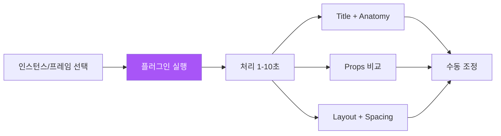

import DevQuickStart from '@site/src/components/DevQuickStart';

<DevQuickStart
  what="EightShapes Specs 플러그인의 자동 생성 기능과 개발자가 이 출력을 소비하는 방법을 배웁니다."
  learn="플러그인이 생성하는 Anatomy/Props/Layout 스펙을 코드로 변환하는 워크플로우"
  able="Specs 플러그인 출력을 받아 CSS 토큰과 TypeScript 인터페이스를 작성할 수 있습니다."
/>

## 핵심 개념

- **자동화 대상**: Anatomy(요소 마킹), Props(변형 비교), Layout and spacing(Autolayout 레드라인)
- **2초 실행**: 단순 컴포넌트 1-2초, 복잡한 컴포넌트 최대 8-10초
- **Output 구조**: Title + Anatomy + Props(인스턴스만) + Layout and spacing(Autolayout 사용 시)
- **Props 자동 비교**: Variant props는 기본값 vs 각 대안 옵션 비교, Boolean props는 영향받는 레이어 하이라이트

## 용어 정리

개발자가 이 문서를 이해하기 위해 알아야 할 디자인 시스템 용어입니다.

| 용어 | 정의 | 개발자 대응 |
|------|------|------------|
| **ESDS** | EightShapes Design System - Nathan Curtis가 만든 디자인 시스템 방법론 | 토큰 네이밍 체계의 출처 |
| **Redline** | 디자인에서 간격, 크기, 색상 등을 주석으로 표시한 것 | CSS에서 padding, margin, gap에 해당 |
| **Anatomy** | 컴포넌트를 구성하는 요소들의 구조 분해 | DOM tree / React component tree |
| **Anatomy Traversal** | 플러그인이 레이어 트리를 순회하며 요소를 탐지하는 과정 | React DevTools에서 컴포넌트 트리 탐색과 유사 |
| **Spec** | 디자인 결정을 명시적으로 문서화한 명세서 | TypeScript interface + CSS tokens |
| **Autolayout** | Figma의 자동 레이아웃 기능 | CSS Flexbox와 1:1 대응 |

## 플러그인 실행 흐름



## 개발자가 플러그인 출력을 소비하는 방법

플러그인이 생성하는 스펙에서 코드에 필요한 정보를 추출하는 워크플로우입니다.

### 1. Anatomy 출력에서 DOM 구조 추출

```
플러그인 출력:
① Container
  ② icon-leading (depends on: Icon)
  ③ label (Text, style: body/md)
  ④ icon-trailing (depends on: Icon)
```

```tsx
// 코드로 변환:
const Button = ({ leftIcon, children, rightIcon }: ButtonProps) => (
  <button className="btn">           {/* ① Container */}
    {leftIcon && (
      <span className="btn__icon-leading">{leftIcon}</span>  {/* ② */}
    )}
    <span className="btn__label">{children}</span>           {/* ③ */}
    {rightIcon && (
      <span className="btn__icon-trailing">{rightIcon}</span> {/* ④ */}
    )}
  </button>
);
```

### 2. Props 출력에서 TypeScript 인터페이스 추출

```
플러그인 출력 (Variant Props):
Section: variant
  [Primary] (default) | [Secondary] | [Ghost] | [Danger]

Section: size
  [Medium] (default) | [Small] | [Large]

Boolean Props:
  isLoading: affects [spinner] layer
  isDisabled: affects [opacity] style
```

```tsx
// 코드로 변환:
interface ButtonProps {
  variant?: 'primary' | 'secondary' | 'ghost' | 'danger'; // default: 'primary'
  size?: 'sm' | 'md' | 'lg';                               // default: 'md'
  loading?: boolean;    // isLoading → loading (코드 컨벤션)
  disabled?: boolean;   // isDisabled → disabled (HTML 네이티브)
}
```

### 3. Layout 출력에서 CSS 추출

```
플러그인 출력 (Redlines):
Container:
  Direction: Horizontal
  Padding: 12px 16px 12px 16px
  Item spacing: 8px

icon-leading:
  Size: 20x20

label:
  Font: Inter, 500, 14px/20px
```

```css
/* 코드로 변환: */
.btn {
  display: flex;
  flex-direction: row;
  align-items: center;
  padding: var(--space-3) var(--space-4);  /* 12px 16px */
  gap: var(--space-2);                      /* 8px */
}

.btn__icon-leading {
  width: 20px;
  height: 20px;
  flex-shrink: 0;
}

.btn__label {
  font-family: var(--font-family-base);
  font-weight: 500;
  font-size: var(--font-size-sm);           /* 14px */
  line-height: var(--line-height-sm);       /* 20px */
}
```

## 실무 노하우

- **Anatomy 순회 중단**: 중첩 컴포넌트(예: Card 안의 CardText) 만나면 순회 멈춤. 별도로 플러그인 재실행 권장
- **Compound Props 수동 조합**: Type + Color mode 같은 복합 속성은 플러그인 2회 실행 후 수동 조합
- **Redline 색상 체계**: Chrome Inspector 색상 매핑 (Orange=margin, Green=padding, Blue=element)
- **Style 커스터마이징**: ESDS Spec 텍스트/색상 스타일이 로컬에 있으면 자동 적용, 없으면 하드코딩

---
> 출처: Nathan Curtis (EightShapes)
> Plugin: EightShapes Specs (Figma Community)

---

## Related Articles

import CrossRef from '@site/src/components/CrossRef';

<CrossRef
  related={[
    { path: "/docs/quality-testing/figma-review", label: "Figma 컴포넌트 리뷰 가이드" },
    { path: "/docs/component-documentation/spec-guide", label: "컴포넌트 명세서 작성 가이드" },
    { path: "/docs/category/01-design-tokens", label: "Design Tokens" },
  ]}
/>
