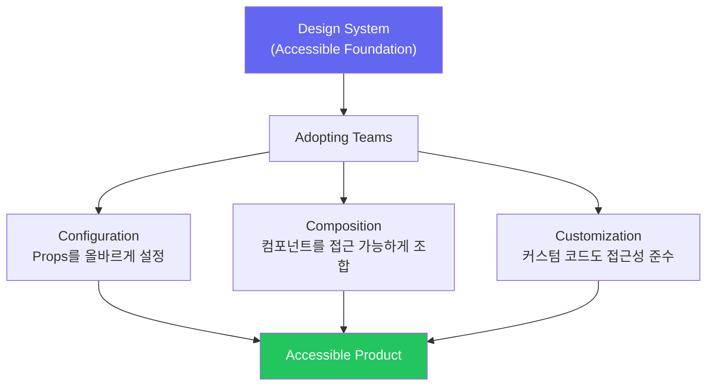

import DevQuickStart from '@site/src/components/DevQuickStart';

<DevQuickStart
  what="디자인 시스템의 접근성 제공 범위와 채택 팀이 추가로 해야 할 접근성 작업을 이해합니다."
  learn="접근 가능한 컴포넌트가 접근 불가능하게 사용되는 3가지 패턴과 그 해결법"
  able="디자인 시스템 너머의 접근성 체크리스트를 작성하고 팀에 적용할 수 있습니다."
/>

## 핵심 개념

- **시스템 접근성 != 제품 접근성**: 디자인 시스템이 접근성을 갖췄다고 해서 그것을 사용하는 제품이 자동으로 접근 가능한 것은 아님
- **채택자의 책임**: 시스템 컴포넌트를 올바르게 구성하고, 여러 컴포넌트를 접근 가능하게 조합하며, 커스텀 컴포넌트도 접근성 기준을 충족해야 함
- **기대치 관리**: 경영진과 리더십이 "시스템 도입 = 접근성 완료"로 오해하지 않도록 명확히 소통
- **기초 vs 완성**: 시스템은 접근 가능한 "기초(foundation)"를 제공하지만, 최종 경험을 접근 가능하게 만드는 것은 각 팀의 몫

## 접근성 책임 구조



## 접근 가능한 컴포넌트의 접근 불가능한 사용: 3가지 패턴

### 패턴 1: 잘못된 Props 구성

디자인 시스템이 접근 가능한 `Select` 컴포넌트를 제공하지만, 채택 팀이 label을 생략합니다.

```tsx
// BAD: label 없이 Select 사용
// 시스템은 접근 가능하지만, 이 사용법은 접근 불가능!
<Select
  options={countries}
  onChange={handleCountryChange}
  placeholder="선택하세요"
/>
// 스크린리더: "콤보박스" (무슨 콤보박스인지 알 수 없음)

// GOOD: label과 함께 사용
<div>
  <label htmlFor="country-select">국가</label>
  <Select
    id="country-select"
    options={countries}
    onChange={handleCountryChange}
    placeholder="국가를 선택하세요"
    aria-label="국가 선택"
  />
</div>
// 스크린리더: "국가, 콤보박스, 국가를 선택하세요"
```

### 패턴 2: 잘못된 컴포넌트 조합

각각 접근 가능한 컴포넌트를 조합할 때 전체 흐름의 접근성이 무너집니다.

```tsx
// BAD: 접근 가능한 컴포넌트들의 접근 불가능한 조합
function CheckoutForm() {
  return (
    <div>
      <Input label="카드 번호" />
      <Input label="만료일" />
      <Input label="CVC" />
      {/* 에러 메시지가 어떤 필드의 에러인지 연결되지 않음 */}
      {errors.length > 0 && (
        <div style={{ color: 'red' }}>
          {errors.map((e) => <p key={e}>{e}</p>)}
        </div>
      )}
      <Button onClick={handleSubmit}>결제하기</Button>
    </div>
  );
}

// GOOD: 접근 가능한 조합
function CheckoutForm() {
  return (
    <form onSubmit={handleSubmit} aria-label="결제 정보">
      <fieldset>
        <legend>카드 정보</legend>

        <Input
          label="카드 번호"
          id="card-number"
          aria-invalid={!!errors.cardNumber}
          aria-describedby={errors.cardNumber ? 'card-error' : undefined}
        />
        {errors.cardNumber && (
          <span id="card-error" role="alert">{errors.cardNumber}</span>
        )}

        <div role="group" aria-label="카드 만료일과 보안코드">
          <Input label="만료일 (MM/YY)" id="expiry" />
          <Input label="CVC" id="cvc" />
        </div>
      </fieldset>

      {/* 전체 폼 에러 요약 */}
      {Object.keys(errors).length > 0 && (
        <Alert severity="error" role="alert">
          <h3>입력 정보를 확인해주세요</h3>
          <ul>
            {Object.values(errors).map((e) => <li key={e}>{e}</li>)}
          </ul>
        </Alert>
      )}

      <Button type="submit">결제하기</Button>
    </form>
  );
}
```

### 패턴 3: 커스텀 코드의 접근성 누락

시스템에 없는 UI를 직접 구현할 때 접근성을 잊습니다.

```tsx
// BAD: 시스템에 없는 커스텀 탭 UI
function CustomTabs({ tabs, activeTab, onChange }) {
  return (
    <div>
      <div style={{ display: 'flex', borderBottom: '1px solid #e5e7eb' }}>
        {tabs.map((tab) => (
          <div
            key={tab.id}
            onClick={() => onChange(tab.id)}
            style={{
              padding: '8px 16px',
              borderBottom: activeTab === tab.id ? '2px solid blue' : 'none',
              cursor: 'pointer',
            }}
          >
            {tab.label}
          </div>
        ))}
      </div>
      <div>{tabs.find((t) => t.id === activeTab)?.content}</div>
    </div>
  );
}

// GOOD: WAI-ARIA Tabs 패턴 준수
function CustomTabs({ tabs, activeTab, onChange }) {
  return (
    <div>
      <div role="tablist" aria-label="콘텐츠 탭">
        {tabs.map((tab) => (
          <button
            key={tab.id}
            role="tab"
            id={`tab-${tab.id}`}
            aria-selected={activeTab === tab.id}
            aria-controls={`panel-${tab.id}`}
            tabIndex={activeTab === tab.id ? 0 : -1}
            onClick={() => onChange(tab.id)}
            onKeyDown={(e) => {
              if (e.key === 'ArrowRight') {
                const next = tabs[(tabs.findIndex((t) => t.id === activeTab) + 1) % tabs.length];
                onChange(next.id);
              }
              if (e.key === 'ArrowLeft') {
                const prev = tabs[(tabs.findIndex((t) => t.id === activeTab) - 1 + tabs.length) % tabs.length];
                onChange(prev.id);
              }
            }}
          >
            {tab.label}
          </button>
        ))}
      </div>
      {tabs.map((tab) => (
        <div
          key={tab.id}
          role="tabpanel"
          id={`panel-${tab.id}`}
          aria-labelledby={`tab-${tab.id}`}
          hidden={activeTab !== tab.id}
          tabIndex={0}
        >
          {tab.content}
        </div>
      ))}
    </div>
  );
}
```

## 개발자 접근성 체크리스트 (디자인 시스템 너머)

디자인 시스템이 제공하는 것 외에 채택 팀이 반드시 확인해야 할 항목입니다.

### 페이지 구조
- [ ] `<main>`, `<nav>`, `<header>`, `<footer>` 랜드마크 사용
- [ ] 제목 레벨이 순서대로 (h1, h2, h3... 건너뛰기 없이)
- [ ] 페이지 제목(`<title>`)이 의미 있고 고유함
- [ ] Skip navigation 링크 존재

### 폼 접근성
- [ ] 모든 입력 필드에 `<label>` 연결
- [ ] 에러 메시지가 `aria-describedby`로 필드에 연결
- [ ] 필수 필드에 `aria-required="true"` 표시
- [ ] 폼 에러 요약이 `role="alert"`로 공지

### 동적 콘텐츠
- [ ] SPA 라우팅 시 포커스 관리 (새 페이지 제목으로 이동)
- [ ] 로딩 상태가 `aria-busy`로 전달
- [ ] 토스트/알림이 `aria-live` region 사용
- [ ] 무한 스크롤에 "더 보기" 버튼 대안 제공

### 미디어 & 색상
- [ ] 이미지에 의미 있는 `alt` 텍스트 (장식 이미지는 `alt=""`)
- [ ] 비디오에 자막 제공
- [ ] 색상만으로 정보를 전달하지 않음 (아이콘, 텍스트 병행)
- [ ] 고대비 모드에서 정상 동작

### 테스트 자동화

```bash
# axe-cli로 빠른 접근성 검사
npx @axe-core/cli https://your-product.com

# 결과 예시:
# 2 violations found:
# - color-contrast: Ensures foreground/background contrast meets WCAG 2 AA (3 nodes)
# - label: Form elements must have labels (1 node)
```

## 주요 인용

> "System Adopters Make an Experience Accessible. And It Takes Work."

> "Beyond the accessibility-ready parts provided, there's more work to do."

---
> 출처: Nathan Curtis (EightShapes), Nov 30, 2018
> 원문: "Accessible" Design Systems Don't Guarantee Accessible Products

---

## Related Articles

import CrossRef from '@site/src/components/CrossRef';

<CrossRef
  related={[
    { path: "/docs/accessibility/wcag-cards", label: "WCAG 2.2 접근성 카드 덱" },
    { path: "/docs/quality-testing/component-qa", label: "Component QA" },
    { path: "/docs/governance-operations/core-principles", label: "Core Principles & Governance" },
  ]}
/>
