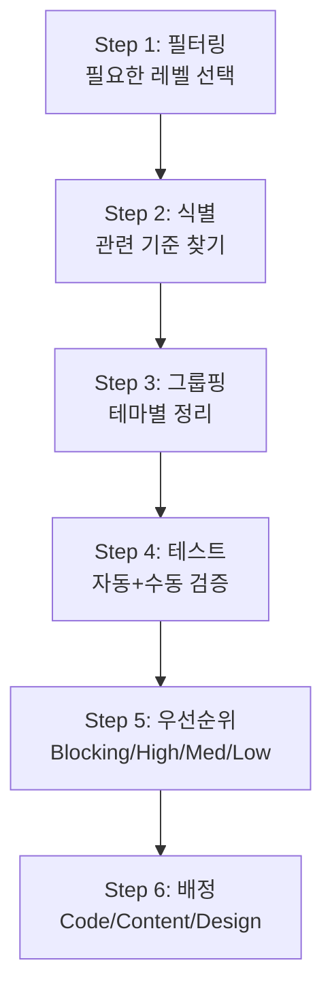

{/* Table of Contents:
  1. 핵심 철학
  2. WCAG 2.2 카드 덱 구조
  3. 실전 적용법: 접근성 감사 워크플로우
  4. 코드 예시 (Contrast, Keyboard, Error, Focus)
  5. 추가 접근성 컴포넌트 패턴 (Modal, Dropdown, Skip Nav)
  6. 디자인 시스템 통합
  7. 활용 팁
  8. 리소스
*/}

import DevQuickStart from '@site/src/components/DevQuickStart';

<DevQuickStart
  what="WCAG 2.2 카드 덱 시스템으로 접근성 감사를 체계화하는 방법을 배웁니다."
  learn="카드 덱 기반 감사 워크플로우와 5가지 접근성 컴포넌트 패턴의 구현 코드"
  able="팀 전체가 참여하는 접근성 감사를 주도하고 발견된 문제를 코드로 수정할 수 있습니다."
/>

---

## 1. 핵심 철학: 접근성은 장애인만을 위한 것이 아니다

### 실전 예시: 문자 인식 게임
- **테스트**: `I0lOl` 이 문자열을 읽어보세요
- **정답**: 대문자 I, 숫자 0, 소문자 l, 대문자 O, 소문자 l
- **실제 상황**: 비밀번호, 쿠폰 코드에서 이런 문자 조합이 나오면?
- **결론**: 콘트라스트, 글꼴 선택은 모든 사용자에게 영향을 미침

### 시각 장애의 다양한 원인
- 낮은 혈당 (저혈당), 음주, 편두통, 피로
- **원인보다 "흐릿한 시야"라는 장애 자체에 집중해야 함**

---

## 2. WCAG 2.2 카드 덱 구조

### 카드 구성 요소

| 영역 | 내용 | 목적 |
|------|------|------|
| **Principles** | WCAG의 4대 원칙 (Perceivable, Operable, Understandable, Robust) | 기준의 철학적 배경 |
| **Number** | 기준 번호 (예: 1.4.3) | 공식 문서와 연결 |
| **Title** | 기준 제목 (예: Contrast) | 한눈에 이해 |
| **Level** | A, AA, AAA | 준수 우선순위 |
| **Short Description** | 단순화된 설명 | Martin Underhill의 WCAG in language I can understand 기반 |
| **QR Code + Short Link** | 공식 문서 연결 | 모바일에서 QR 스캔, 인쇄물에서 짧은 링크 입력 |
| **Related Criteria** | 연관 기준 | 테마별 그룹핑 |
| **Disability Indicators** | 영향받는 장애 유형 | 시각, 청각, 운동, 인지 장애 |
| **Responsibility Indicators** | 담당 역할 | Code, Content, Design |
| **Braille** | 점자 | 시각 장애인과 협업 가능 |

### 테마 분류
- Keyboard (키보드 접근성)
- Sensory (감각 정보)
- Forms (폼 입력)
- Content (콘텐츠 구조)
- Interaction (상호작용)

---

## 3. 실전 적용법: 접근성 감사 워크플로우



### Step 1: 필터링
AA 등급만 준수하려면 Level A, AA 카드만 남김

### Step 2: 식별 (IBM Decision Tree 기반)
- 이 요소에 텍스트가 있는가? -> Yes: 1.4.3 Contrast 체크
- 키보드로 조작 가능해야 하는가? -> Yes: 2.1.1 Keyboard 체크
- 시간 제한이 있는가? -> Yes: 2.2.1 Timing Adjustable 체크

### Step 3: 그룹핑
로그인 폼 감사 시:
- Forms 테마: 3.3.1 Error Identification, 3.3.2 Labels
- Keyboard 테마: 2.1.1 Keyboard, 2.4.7 Focus Visible
- Sensory 테마: 1.4.3 Contrast

### Step 4-6: 테스트, 우선순위, 배정

| 등급 | 기준 | 예시 |
|------|------|------|
| Blocking | 사용 불가능 | 키보드로 폼 전송 버튼 접근 불가 |
| High | 주요 기능에 심각한 영향 | 에러 메시지 색상으로만 표시 |
| Medium | 불편하지만 우회 가능 | Focus 표시가 약함 |
| Low | 미미한 영향 | Alt 텍스트 품질 개선 필요 |

---

## 4. 코드 예시

### 예시 1: 1.4.3 Contrast (Minimum)

```css
/* BAD: Contrast ratio 1.8:1 (AA 기준 4.5:1 미달) */
.button {
  background-color: #999;
  color: #ccc;
}

/* GOOD: Contrast ratio 5.6:1 (AA 통과) */
.button {
  background-color: #0066cc;
  color: #ffffff;
}
```

### 예시 2: 2.1.1 Keyboard

```tsx
// BAD: div는 키보드 접근 불가
<div onClick={() => setOpen(!open)}>Open Menu</div>

// GOOD: button + ARIA 상태
<button
  onClick={() => setOpen(!open)}
  aria-expanded={open}
  aria-haspopup="true"
>
  Open Menu
</button>
```

### 예시 3: 3.3.1 Error Identification

```tsx
// BAD: 색상으로만 에러 표시
<input type="email" style={{ borderColor: hasError ? 'red' : 'gray' }} />

// GOOD: 색상 + 텍스트 + ARIA
<div>
  <label htmlFor="email">이메일</label>
  <input
    id="email"
    type="email"
    aria-invalid={hasError}
    aria-describedby={hasError ? 'email-error' : undefined}
    style={{ borderColor: hasError ? 'red' : 'gray' }}
  />
  {hasError && (
    <span id="email-error" role="alert" style={{ color: 'red' }}>
      유효한 이메일 주소를 입력해주세요.
    </span>
  )}
</div>
```

### 예시 4: 2.4.7 Focus Visible

```css
/* BAD: 포커스 표시 제거 */
*:focus { outline: none; }

/* GOOD: 명확한 포커스 표시 */
*:focus-visible {
  outline: 3px solid #0066cc;
  outline-offset: 2px;
}
```

---

## 5. 추가 접근성 컴포넌트 패턴

### 패턴 1: Modal with Focus Trap

```tsx
// 접근 가능한 모달 컴포넌트
function AccessibleModal({ isOpen, onClose, title, children }) {
  const modalRef = useRef<HTMLDivElement>(null);
  const previousFocus = useRef<HTMLElement | null>(null);

  useEffect(() => {
    if (isOpen) {
      // 열릴 때: 현재 포커스 저장 + 모달로 포커스 이동
      previousFocus.current = document.activeElement as HTMLElement;
      modalRef.current?.focus();

      // body 스크롤 잠금
      document.body.style.overflow = 'hidden';
    }
    return () => {
      // 닫힐 때: 원래 요소로 포커스 복원
      document.body.style.overflow = '';
      previousFocus.current?.focus();
    };
  }, [isOpen]);

  // Focus Trap: Tab 키가 모달 내부에서만 순환
  const handleKeyDown = (e: React.KeyboardEvent) => {
    if (e.key === 'Escape') {
      onClose();
      return;
    }

    if (e.key === 'Tab') {
      const focusable = modalRef.current?.querySelectorAll(
        'button, [href], input, select, textarea, [tabindex]:not([tabindex="-1"])'
      );
      if (!focusable || focusable.length === 0) return;

      const first = focusable[0] as HTMLElement;
      const last = focusable[focusable.length - 1] as HTMLElement;

      if (e.shiftKey && document.activeElement === first) {
        e.preventDefault();
        last.focus();
      } else if (!e.shiftKey && document.activeElement === last) {
        e.preventDefault();
        first.focus();
      }
    }
  };

  if (!isOpen) return null;

  return (
    <>
      {/* Backdrop */}
      <div className="modal-backdrop" onClick={onClose} aria-hidden="true" />

      {/* Modal */}
      <div
        ref={modalRef}
        role="dialog"
        aria-modal="true"
        aria-labelledby="modal-title"
        tabIndex={-1}
        onKeyDown={handleKeyDown}
        className="modal"
      >
        <h2 id="modal-title">{title}</h2>
        {children}
        <button onClick={onClose} aria-label="닫기" className="modal__close">
          X
        </button>
      </div>
    </>
  );
}
```

### 패턴 2: Dropdown with Arrow Key Navigation

```tsx
// 접근 가능한 드롭다운 메뉴
function AccessibleDropdown({ label, items, onSelect }) {
  const [isOpen, setIsOpen] = useState(false);
  const [activeIndex, setActiveIndex] = useState(-1);
  const listRef = useRef<HTMLUListElement>(null);

  const handleKeyDown = (e: React.KeyboardEvent) => {
    switch (e.key) {
      case 'ArrowDown':
        e.preventDefault();
        if (!isOpen) {
          setIsOpen(true);
          setActiveIndex(0);
        } else {
          setActiveIndex((prev) => Math.min(prev + 1, items.length - 1));
        }
        break;
      case 'ArrowUp':
        e.preventDefault();
        setActiveIndex((prev) => Math.max(prev - 1, 0));
        break;
      case 'Enter':
      case ' ':
        e.preventDefault();
        if (isOpen && activeIndex >= 0) {
          onSelect(items[activeIndex]);
          setIsOpen(false);
        } else {
          setIsOpen(true);
          setActiveIndex(0);
        }
        break;
      case 'Escape':
        setIsOpen(false);
        setActiveIndex(-1);
        break;
      case 'Home':
        e.preventDefault();
        setActiveIndex(0);
        break;
      case 'End':
        e.preventDefault();
        setActiveIndex(items.length - 1);
        break;
    }
  };

  return (
    <div onKeyDown={handleKeyDown}>
      <button
        aria-haspopup="listbox"
        aria-expanded={isOpen}
        aria-label={label}
        onClick={() => setIsOpen(!isOpen)}
      >
        {label}
      </button>
      {isOpen && (
        <ul ref={listRef} role="listbox" aria-label={label}>
          {items.map((item, i) => (
            <li
              key={item.id}
              role="option"
              aria-selected={activeIndex === i}
              onClick={() => { onSelect(item); setIsOpen(false); }}
              className={activeIndex === i ? 'active' : ''}
            >
              {item.label}
            </li>
          ))}
        </ul>
      )}
    </div>
  );
}
```

### 패턴 3: Skip Navigation

```tsx
// 페이지 최상단에 위치하는 Skip Navigation
function SkipNav() {
  return (
    <a
      href="#main-content"
      className="skip-nav"
      // CSS: 평소에는 화면 밖, 포커스 시 표시
    >
      메인 콘텐츠로 건너뛰기
    </a>
  );
}
```

```css
.skip-nav {
  position: absolute;
  top: -40px;
  left: 0;
  padding: 8px 16px;
  background: var(--color-brand-500);
  color: white;
  z-index: 100;
  transition: top 0.2s;
}

.skip-nav:focus {
  top: 0;
}
```

---

## 6. 디자인 시스템 통합

### 6.1 컴포넌트 기본값

```tsx
interface ButtonProps {
  variant?: 'primary' | 'secondary' | 'ghost';
  'aria-label'?: string;
}

export function Button({ 'aria-label': ariaLabel, ...props }: ButtonProps) {
  return <button aria-label={ariaLabel} {...props} />;
}
```

### 6.2 색상 토큰

```js
// tailwind.config.js
module.exports = {
  theme: {
    extend: {
      colors: {
        brand: {
          50: '#e6f2ff',  // 배경 틴트 (어두운 텍스트와 함께 사용)
          500: '#0066cc', // 5.6:1 contrast (AA 통과, 흰색 배경 기준)
          700: '#004499', // 9.2:1 contrast (AAA 통과, 흰색 배경 기준)
        },
      },
    },
  },
};
```

### 6.3 ESLint + jsx-a11y

```json
{
  "extends": ["next/core-web-vitals", "plugin:jsx-a11y/recommended"],
  "rules": {
    "jsx-a11y/alt-text": "error",
    "jsx-a11y/aria-props": "error",
    "jsx-a11y/click-events-have-key-events": "error"
  }
}
```

### 6.4 Playwright 접근성 테스트

```ts
import AxeBuilder from '@axe-core/playwright';

test('Homepage accessibility', async ({ page }) => {
  await page.goto('/');
  const results = await new AxeBuilder({ page })
    .withTags(['wcag2a', 'wcag2aa'])
    .analyze();
  expect(results.violations).toEqual([]);
});
```

---

## 7. 활용 팁

### 7.1 팀 온보딩
1. 각 팀원에게 카드 5장 배분
2. 10분 숙지
3. 돌아가며 설명
4. 실제 프로젝트에서 찾기
5. 테마 지도에 배치

### 7.2 코드 리뷰 체크리스트
- [ ] 1.4.3 Contrast: 대비 검증
- [ ] 2.1.1 Keyboard: 키보드 테스트
- [ ] 4.1.2 Name, Role, Value: ARIA 라벨
- [ ] 3.3.1 Error Identification: 에러 명확

---

## 8. 리소스

### 8.1 공식 리소스
- Figma Community: "WCAG Card Deck Johannes"
- GitHub: 번역 파일, JSON export
- Excel: 한국어 포함 다국어 지원

### 8.2 연관 프로젝트
- Andrew Hick's WCAG Map by Theme
- Martin Underhill's WCAG in language I can understand
- Kimberly's Braille Version

### 8.3 테스트 도구

| 도구 | 용도 |
|------|------|
| axe DevTools | 브라우저 확장 자동 스캔 |
| Lighthouse | Chrome DevTools 내장 |
| WebAIM Contrast Checker | 대비 검증 |
| WAVE | 시각적 피드백 |
| NVDA / JAWS | 스크린 리더 |
| Playwright + axe-core | E2E 테스트 |

---

## 핵심 메시지

1. **접근성은 준수가 아닌 품질** - 모든 사용자에게 더 나은 경험
2. **카드 덱은 접근성을 민주화** - 개발자, 디자이너, PM 모두 이해 가능
3. **테마별 그룹핑으로 효율화** - 영역별 집중 테스트
4. **책임 지표로 역할 분담** - Code, Content, Design
5. **커뮤니티 기반 발전** - 오픈소스, Creative Commons

---

## 참고 링크
- WCAG 2.2: https://www.w3.org/WAI/WCAG22/quickref/
- Figma: "WCAG Card Deck" 검색

**Created**: 2026-02-05
**License**: Creative Commons (상업적 사용 가능, 출처 표시)

---

## Related Articles

import CrossRef from '@site/src/components/CrossRef';

<CrossRef
  related={[
    { path: "/docs/accessibility/accessible-systems", label: "Accessible Design Systems Don't Guarantee Accessible Products" },
    { path: "/docs/category/01-design-tokens", label: "Design Tokens" },
    { path: "/docs/quality-testing/testing-plan", label: "컴포넌트 테스팅 계획 수립" },
  ]}
/>
