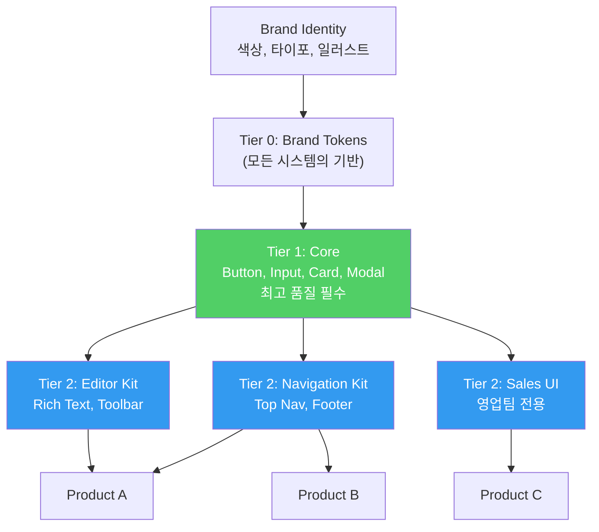

import DevQuickStart from '@site/src/components/DevQuickStart';

<DevQuickStart
  what="디자인 시스템 거버넌스는 코드 품질, 릴리스, 기여 규칙을 체계화하여 시스템의 지속 가능성을 보장합니다"
  learn="8가지 핵심 원칙, Tier 아키텍처 설계, 토큰 파이프라인, 모노레포 구조, 시스템 통합 전략"
  able="디자인 시스템의 거버넌스 모델을 설계하고 Tier별 품질 기준을 코드로 구현할 수 있습니다"
/>

## 8가지 핵심 원칙 (Nathan Curtis, 2017)

### 1. Systematic: 한 번 만들고, 제대로 만들기

버튼은 모든 곳에서 쓰는 원자적 컴포넌트입니다. 각 팀이 따로 만드는 시대는 끝났습니다.

**Etsy 사례**: 10개 제품에서 버튼 중복 제작 = 6자리 비용. 한 번 잘 만들어서 모든 팀 비용 절감.

토큰 파이프라인으로 "한 번 정의, 모든 곳 적용"을 구현합니다:

```json
// tokens/colors.json - 단일 소스에서 모든 플랫폼 값 생성
{
  "color": {
    "primary": {
      "$value": "#6B47DC",
      "$type": "color",
      "$description": "Primary brand color"
    },
    "primary-hover": {
      "$value": "#5B37CC",
      "$type": "color"
    }
  }
}
```

```javascript
// style-dictionary.config.js
module.exports = {
  source: ['tokens/**/*.json'],
  platforms: {
    css: {
      transformGroup: 'css',
      buildPath: 'dist/css/',
      files: [{
        destination: 'variables.css',
        format: 'css/variables',
      }],
    },
    js: {
      transformGroup: 'js',
      buildPath: 'dist/js/',
      files: [{
        destination: 'tokens.js',
        format: 'javascript/es6',
      }],
    },
  },
};
```

```css
/* dist/css/variables.css - 자동 생성 */
:root {
  --color-primary: #6B47DC;
  --color-primary-hover: #5B37CC;
}
```

### 2. Favor Shared Needs Over Personal Preferences

잘 만든 것이 시스템에 포함되어야 하는 것은 아닙니다. 통합/정규화/유지보수 비용 vs 재사용 가치를 비교하여 결정합니다.

### 3. Systems Serve Products, Not Vice Versa

시스템은 제품을 대신 만들거나 명령할 권한이 없습니다. 제품이 채택 여부, 사용 범위, 속도를 선택합니다. 강제보다 **선택의 가치를 증명**해야 합니다.

```tsx
// 좋은 예: 유연한 API - 제품 팀이 필요에 맞게 사용
import { Button } from '@company/core-ui';

// 시스템 컴포넌트 그대로 사용
<Button variant="primary">Submit</Button>

// 시스템 토큰만 사용하고 커스텀 컴포넌트 제작
import { tokens } from '@company/tokens';
<button style={{ backgroundColor: tokens.color.primary }}>
  Custom Button
</button>
```

### 4. Build Community, Not Governance

"Big G" 거버넌스보다 커뮤니티를 우선합니다. Cross-product critique 문화와 세그먼트 가이드(접근성, 모션)를 통해 당근 먼저, 채찍은 나중에.

### 5. Keep the Simple Simple

복잡한 문제를 해결하되, 인터페이스는 단순하게 유지합니다. 기본은 쉽게, 고급은 가능하게.

```tsx
// 단순한 사용 (대부분의 경우)
<Button>Click me</Button>

// 고급 사용 (필요한 경우만)
<Button
  variant="primary"
  size="lg"
  leftIcon={<IconSave />}
  loading={isSubmitting}
  loadingText="Saving..."
  as="a"
  href="/dashboard"
>
  Save Changes
</Button>
```

### 6. Show, Don't Tell

문서화는 시각화와 도구로 합니다. 렌더링된 variations, 복사 가능한 코드, Component explorers, Do & Don't 대비 이미지를 제공합니다.

### 7. Value Is Realized When Products Ship

시스템 가치는 제품이 시스템 부품으로 기능을 출시할 때 실현됩니다.

```bash
# 채택률 측정: 제품별 디자인 시스템 의존성 확인
npm ls @company/core-ui --all 2>/dev/null | head -5

# 버전 분포 확인
for pkg in $(find node_modules -name 'package.json' -path '*/@company/*'); do
  echo "$(jq -r '.name' $pkg): $(jq -r '.version' $pkg)"
done
```

### 8. Never Compromise Quality

시스템 품질은 항상 제품 팀 기준 이상이어야 합니다. 느려도 프로세스를 신뢰하고 높은 품질을 달성합니다.

## 디자인 시스템 Tier 아키텍처



### Tier별 품질 기준을 코드로 구현

```json
// packages/core-ui/package.json (Tier 1 - Core)
{
  "name": "@company/core-ui",
  "scripts": {
    "lint": "eslint src --ext .ts,.tsx",
    "test": "vitest run --coverage",
    "test:a11y": "jest-axe && pa11y-ci",
    "test:visual": "chromatic --project-token=$TOKEN",
    "typecheck": "tsc --noEmit",
    "build": "tsup src/index.ts --format cjs,esm --dts"
  },
  "quality": {
    "tier": 1,
    "requirements": [
      "unit-tests",
      "visual-regression",
      "accessibility-audit",
      "responsive",
      "theming",
      "i18n-rtl",
      "semantic-versioning",
      "changelog"
    ]
  }
}
```

```json
// packages/sales-ui/package.json (Tier 3 - Within Group)
{
  "name": "@company/sales-ui",
  "scripts": {
    "lint": "eslint src --ext .ts,.tsx",
    "test": "vitest run",
    "build": "tsup src/index.ts --format esm"
  },
  "quality": {
    "tier": 3,
    "requirements": [
      "code-linting",
      "browser-testing",
      "core-accessibility",
      "consistent-styling"
    ]
  }
}
```

### Tier별 품질 기준 비교

| 기준 | Tier 3 (Within) | Tier 2 (Across) | Tier 1 (Core) |
|------|-----------------|-----------------|---------------|
| Code Linting | 필수 | 필수 | 필수 |
| Browser Testing | 필수 | 필수 | 필수 |
| Core 접근성 | 필수 | 필수 | 필수 |
| 일관된 스타일 | 필수 | 필수 | 필수 |
| Responsive | - | 필수 | 필수 |
| Semantic Versioning | - | 필수 | 필수 |
| Changelog | - | 필수 | 필수 |
| Unit/Visual Tests | - | 필수 | 필수 |
| 커뮤니티 승인 | - | 필수 | 필수 |
| Sizing (S/M/L) | - | - | 필수 |
| Theming | - | - | 필수 |
| Analytics | - | - | 필수 |
| i18n (RTL) | - | - | 필수 |
| Light/Dark 모드 | - | - | 필수 |
| 종합 접근성 리뷰 | - | - | 필수 |

### Scalable: 모노레포 구조 예시

```
design-system/
  packages/
    tokens/              # @company/tokens (Tier 0)
      src/
        colors.json
        typography.json
      style-dictionary.config.js
      package.json

    core-ui/             # @company/core-ui (Tier 1)
      src/
        Button/
        Card/
        Input/
        Modal/
      package.json

    editor-kit/          # @company/editor-kit (Tier 2)
      src/
        RichTextInput/
        EditorToolbar/
      package.json       # peerDep: @company/core-ui

    navigation-kit/      # @company/nav-kit (Tier 2)
      src/
        TopNav/
        Footer/
      package.json

    sales-ui/            # @company/sales-ui (Tier 3)
      src/
      package.json

  apps/
    docs/                # 문서 사이트
    playground/          # 데모 환경

  turbo.json
  package.json
```

## 시스템 통합 전략

여러 디자인 시스템이 조직 내에 공존할 때, 통합 방법을 선택해야 합니다.

### 4가지 통합 옵션

| 옵션 | 설명 | 비용 | 성공률 |
|------|------|------|--------|
| **1. 유지** | 각 시스템 독립 운영 | 낮음 | - |
| **2. 하위 공유** | 토큰/기반만 공유 | 중간 | 낮음 |
| **3. 새로 시작** | 모두 폐기, 처음부터 | 매우 높음 | 중간 |
| **4. 흡수 (권장)** | 하나 유지, 나머지 기능 이관 | 높음 | 높음 |

### 통합 전 필수 단계


```bash
# 시스템 간 컴포넌트 API 비교 방법

# 방법 1: npm pack으로 패키지 내용 비교
diff <(npm pack @system-a/core --dry-run 2>&1) <(npm pack @system-b/core --dry-run 2>&1)

# 방법 2: exports 비교 (Node.js)
node -e "console.log(Object.keys(require('@system-a/core')))" > system-a-exports.txt
node -e "console.log(Object.keys(require('@system-b/core')))" > system-b-exports.txt
diff system-a-exports.txt system-b-exports.txt

# 방법 3: package.json exports 필드 비교
jq '.exports' node_modules/@system-a/core/package.json > a-exports.json
jq '.exports' node_modules/@system-b/core/package.json > b-exports.json
diff a-exports.json b-exports.json

# codemod로 마이그레이션 자동화
npx jscodeshift -t transforms/system-a-to-b.ts src/**/*.tsx
```

## 통념(Myths) 바로잡기

디자인 시스템에 대한 흔한 오해를 코드와 데이터로 반박합니다.

### Myth 1: "디자인 시스템은 창의성을 죽인다"

시스템은 기본을 자동화하여 진짜 창의적 문제에 집중하게 합니다.

```tsx
// 시스템 컴포넌트로 기본 UI를 빠르게 구축하고...
<Card>
  <CardHeader title="Dashboard" />
  <CardBody>
    {/* ...창의적인 데이터 시각화에 시간을 투자 */}
    <CustomVisualization data={chartData} />
  </CardBody>
</Card>
```

### Myth 2: "한 번 만들면 끝"

시스템은 지속적 진화가 필요한 살아있는 제품입니다.

```bash
# 실제 디자인 시스템의 릴리스 빈도 (예시)
git log --oneline --since="2025-01-01" | wc -l
# → 247 commits in 12 months

npm view @company/core-ui versions --json | jq length
# → 42 versions released
```

### Myth 3: "모든 것을 표준화해야 한다"

80/20 규칙: 핵심만 표준화하고, 나머지는 유연성을 허용합니다.

### Myth 4: "작은 팀에는 필요 없다"

2명 이상이면 일관성 문제가 발생합니다. 규모와 관계없이 가치가 있습니다.

### Myth 5: "Federated 모델이 최고"

중앙 팀 없는 연합 모델은 실패하기 쉽습니다. 80개 이상 조직 컨설팅에서 중앙 전담 인력 없이 성공한 사례는 **0건**입니다.

## 참고 자료

### 핵심 문헌
- [Nathan Curtis - "Principles of Designing Systems"](https://medium.com/eightshapes-llc/principles-of-designing-systems-294ee45dcf81) — 8가지 원칙의 원문
- [Nathan Curtis - "Design System Tiers"](https://medium.com/eightshapes-llc/design-system-tiers-7-layers-of-design-system-7d8f1c7f6e08) — Tier 아키텍처 상세 설명
- [Nathan Curtis - "Consolidating Design Systems"](https://medium.com/eightshapes-llc/consolidating-design-systems-7b06c95e3b9e) — 시스템 통합 4가지 옵션
- [Style Dictionary](https://amzn.github.io/style-dictionary/) — Amazon의 디자인 토큰 파이프라인 도구

### 조직 이론 & 아키텍처
- Melvin Conway, "How Do Committees Invent?" (1968) — **Conway's Law**: 조직 구조가 시스템 아키텍처를 결정함
- Matthew Skelton & Manuel Pais, [Team Topologies](https://teamtopologies.com/) (2019) — 팀 구조와 소프트웨어 경계 정렬
- Eric Evans, "Domain-Driven Design" (2003) — Bounded Context와 Tier 아키텍처의 유사성
- Martin Fowler, ["Inverse Conway Maneuver"](https://www.thoughtworks.com/radar/techniques/inverse-conway-maneuver) — 원하는 아키텍처에 맞춰 조직을 재편성

### 실제 사례
- [Atlassian Design System (ADS)](https://atlassian.design/) — ADG에서 ADS로의 통합 사례 (Option 4)
- [Salesforce Lightning Design System](https://www.lightningdesignsystem.com/) — 다중 Tier 아키텍처 운영
- [IBM Carbon Design System](https://carbondesignsystem.com/) — 모노레포 기반 Tier 관리
- [Shopify Polaris](https://polaris.shopify.com/) — 커뮤니티 중심 거버넌스 모델
- [Microsoft Fluent UI](https://developer.microsoft.com/en-us/fluentui) — 크로스 플랫폼 토큰 파이프라인

### 도구 & 표준
- [Turborepo](https://turbo.build/repo) — 모노레포 빌드 시스템
- [Changesets](https://github.com/changesets/changesets) — 버전 관리 및 CHANGELOG 자동화
- [Semantic Versioning 2.0.0](https://semver.org/) — 버전 관리 표준
- [jscodeshift](https://github.com/facebook/jscodeshift) — 마이그레이션 codemod 도구

## 실무 체크리스트

### 원칙 적용
- [ ] 토큰 파이프라인 구축 (JSON → Style Dictionary → CSS/JS)
- [ ] 컴포넌트 API를 단순하게 유지 (기본 사용 vs 고급 사용 분리)
- [ ] 채택률 측정 자동화 (npm ls, 버전 분포)
- [ ] 거버넌스보다 커뮤니티 우선

### Tier 설계
- [ ] Core 범위 명확히 정의
- [ ] Tier별 품질 기준 코드로 구현 (package.json scripts)
- [ ] 승격 경로 문서화 (Tier 3 → 2 → 1)
- [ ] 네이밍 큐레이션 프로세스 수립

### 통합 고려
- [ ] 생태계 시각화 완료
- [ ] 각 시스템 강점/약점 비교
- [ ] Option 4 (Keep One) 우선 검토
- [ ] 마이그레이션 codemod 준비

---

import CrossRef from '@site/src/components/CrossRef';

<CrossRef related={[
  { path: "/docs/governance-operations/federated-fallacy", label: "07-02. 연합형 디자인 시스템의 오류" },
  { path: "/docs/scaling-architecture/system-tiers", label: "08-01. 디자인 시스템 Tier 상세" },
  { path: "/docs/versioning-releases/versioning", label: "09-01. 버전 관리 전략" },
]} />

*출처: Nathan Curtis (EightShapes) - Principles of Designing Systems, Design System Tiers, Consolidating Design Systems, Design System Myths*
