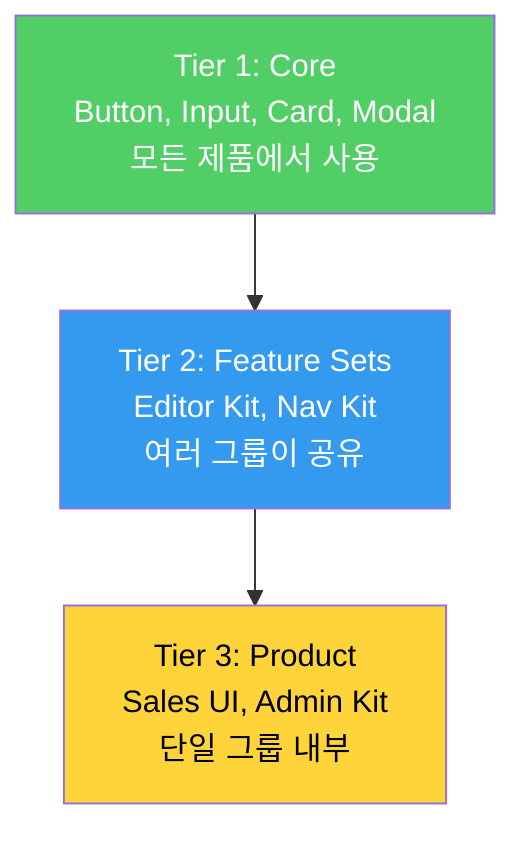
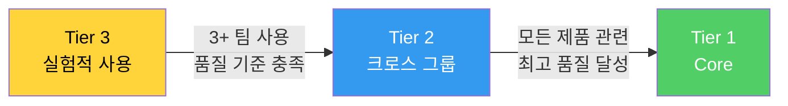

import DevQuickStart from '@site/src/components/DevQuickStart';

<DevQuickStart
  what="디자인 시스템을 Core → Cross-Group → Within-Group 3단계 계층으로 확장하여 품질과 속도를 양립합니다"
  learn="Tier별 package.json 설정, CI 파이프라인 차이, import 패턴, 승격 경로"
  able="Tier별 품질 기준을 CI/CD에 반영하고 컴포넌트 승격 경로를 설계할 수 있습니다"
/>

## 3-Tier 아키텍처

디자인 시스템은 단일 패키지가 아닌 계층적 생태계로 확장됩니다.



## 핵심 개념

- **계층적 시스템 구조**: Core(모두에게 관련) → Tier 2(비즈니스 유닛별/기능별) → Product(개별 제품) 3단계 계층으로 디자인 시스템을 확장
- **유연한 품질 기준**: Core는 최고 품질 필수, 하위 Tier는 점진적 품질 개선 허용 (실험 → 안정화 → 승격)
- **조직 경계를 넘는 공유**: Tier는 비즈니스 유닛 내부(Within Group)뿐만 아니라 유닛 간(Across Groups) 협업도 지원
- **네임스페이스 중앙 관리**: 컴포넌트 이름 충돌 방지를 위해 명명 규칙을 중앙에서 큐레이션
- **승격 경로(Promotion Path)**: 실험적 기능이 품질 기준을 충족하면 상위 Tier로 승격 가능한 명확한 경로 제공

## Tier별 package.json 설정

### Tier 1 - Core (최고 품질)

```json
{
  "name": "@company/core-ui",
  "version": "3.2.1",
  "scripts": {
    "lint": "eslint src --ext .ts,.tsx --max-warnings 0",
    "typecheck": "tsc --noEmit",
    "test": "vitest run --coverage --min-coverage 90",
    "test:a11y": "jest-axe && pa11y-ci --config .pa11yci.json",
    "test:visual": "chromatic --project-token=$CHROMATIC_TOKEN --exit-zero-on-changes",
    "build": "tsup src/index.ts --format cjs,esm --dts --clean",
    "build:storybook": "storybook build",
    "size": "size-limit"
  },
  "peerDependencies": {
    "react": ">=18.0.0",
    "react-dom": ">=18.0.0"
  },
  "size-limit": [
    { "path": "dist/esm/index.js", "limit": "50 kB" }
  ]
}
```

### Tier 2 - Feature Set (그룹간 공유)

```json
{
  "name": "@company/editor-kit",
  "version": "1.5.0",
  "scripts": {
    "lint": "eslint src --ext .ts,.tsx",
    "typecheck": "tsc --noEmit",
    "test": "vitest run --coverage --min-coverage 70",
    "test:a11y": "jest-axe",
    "build": "tsup src/index.ts --format esm --dts"
  },
  "peerDependencies": {
    "react": ">=18.0.0",
    "@company/core-ui": ">=3.0.0"
  }
}
```

### Tier 3 - Within Group (그룹 내부)

```json
{
  "name": "@company/sales-ui",
  "version": "0.8.0",
  "scripts": {
    "lint": "eslint src --ext .ts,.tsx",
    "test": "vitest run",
    "build": "tsup src/index.ts --format esm"
  },
  "peerDependencies": {
    "@company/core-ui": ">=3.0.0"
  }
}
```

## Import 패턴

```tsx
// Tier 1 - Core: 모든 제품에서 직접 import
import { Button, Card, Input, Modal } from '@company/core-ui';

// Tier 2 - Feature Set: 해당 기능이 필요한 제품만
import { RichTextEditor, EditorToolbar } from '@company/editor-kit';
import { TopNav, Footer } from '@company/nav-kit';

// Tier 3 - Product: 해당 그룹 내부에서만
import { SalesCard, DealPipeline } from '@company/sales-ui';
```

## Tier별 CI 파이프라인

```mermaid
flowchart TD
    subgraph "Tier 1 CI (Core)"
        L1["Lint\n(zero warnings)"] --> TC1["TypeCheck"]
        TC1 --> U1["Unit Tests\n(90%+ coverage)"]
        U1 --> A1["A11y Tests\n(axe + pa11y)"]
        A1 --> V1["Visual Regression\n(Chromatic)"]
        V1 --> S1["Bundle Size\n(size-limit)"]
        S1 --> B1["Build\n(CJS + ESM + DTS)"]
    end

    subgraph "Tier 2 CI (Feature Set)"
        L2["Lint"] --> TC2["TypeCheck"]
        TC2 --> U2["Unit Tests\n(70%+ coverage)"]
        U2 --> A2["A11y Tests\n(axe)"]
        A2 --> B2["Build\n(ESM + DTS)"]
    end

    subgraph "Tier 3 CI (Product)"
        L3["Lint"] --> U3["Unit Tests"]
        U3 --> B3["Build\n(ESM)"]
    end

    style L1 fill:#51cf66,color:#fff
    style L2 fill:#339af0,color:#fff
    style L3 fill:#ffd43b,color:#000
```



## 품질 기준 비교

| 기준 | Tier 3 | Tier 2 | Tier 1 |
|------|--------|--------|--------|
| Code Linting | 필수 | 필수 (zero warnings) | 필수 (zero warnings) |
| TypeScript | 권장 | 필수 | 필수 (strict mode) |
| Unit Tests | 기본 | 70%+ coverage | 90%+ coverage |
| A11y Tests | - | axe | axe + pa11y |
| Visual Regression | - | 권장 | 필수 (Chromatic) |
| Bundle Size Limit | - | 권장 | 필수 (size-limit) |
| Semantic Versioning | 권장 | 필수 | 필수 |
| Changelog | - | 필수 | 필수 |
| Responsive | - | 필수 | 필수 |
| Theming / Dark Mode | - | - | 필수 |
| i18n / RTL | - | - | 필수 |

## 승격 경로 (Promotion Path)

Tier 3 컴포넌트가 품질 기준을 충족하면 상위 Tier로 승격할 수 있습니다.



### 승격 체크리스트

```markdown
## Tier 3 → Tier 2 승격 기준
- [ ] 3개 이상 팀에서 사용 중
- [ ] TypeScript strict 모드 통과
- [ ] 테스트 커버리지 70%+
- [ ] 접근성 테스트(axe) 통과
- [ ] Semantic Versioning 적용
- [ ] CHANGELOG 유지

## Tier 2 → Tier 1 승격 기준
- [ ] 모든 adopter에게 관련
- [ ] 테스트 커버리지 90%+
- [ ] 접근성 종합 리뷰 통과 (axe + pa11y + 수동)
- [ ] Responsive (375px ~ 1440px)
- [ ] Theming / Dark Mode 지원
- [ ] i18n / RTL 지원
- [ ] Bundle size limit 설정
- [ ] Visual regression 테스트 통과
```

## 실무 노하우

- **파일럿 먼저 시작**: 전사 확대 전 2-3개 feature set(editor, navigation, social 등)으로 Tier 2 파일럿 운영 → 권한/워크플로우 검증
- **품질 기준을 Tier별로 차별화**: Within Group(기본 린팅/브라우저 테스트), Across Groups(반응형/BEM/semantic versioning), Core(접근성/테마/i18n) 등 단계적 기준 설정
- **권한 모델 설계**: Core는 시스템팀만 편집, Tier 2는 해당 비즈니스 유닛 + 시스템팀 편집, 모든 Tier는 전체에 visible
- **시스템팀은 매칭메이커 역할**: 여러 팀에서 유사한 요구사항(예: rich-text editor) 발견 시 연결해주고 공유 투자 유도
- **문서화에 Tier 노출**: 사용자가 Core vs 실험적 기능을 구분할 수 있도록 문서 사이트 내비게이션/상태 표시에 Tier 정보 반영

## 참고 자료

### 핵심 문헌
- [Nathan Curtis - "Design System Tiers"](https://medium.com/eightshapes-llc/design-system-tiers-7-layers-of-design-system-7d8f1c7f6e08) (Feb 2019) — Tier 아키텍처 원문
- [Brad Frost - "Atomic Design"](https://atomicdesign.bradfrost.com/) (2016) — 컴포넌트 계층 구조 이론 (Atoms → Molecules → Organisms)
- [Martin Fowler - "BoundedContext"](https://martinfowler.com/bliki/BoundedContext.html) — 도메인 경계와 Tier 경계의 유사성

### 품질 계층화 이론
- Michael T. Nygard, ["Release It!"](https://pragprog.com/titles/mnee2/release-it-second-edition/) (2018) — 계층별 안정성 요구사항
- **Dependency Inversion Principle (DIP)** — 상위 Tier가 하위 Tier에 의존하지 않도록 설계
- [The Twelve-Factor App](https://12factor.net/) — 모듈화 및 의존성 관리 원칙

### 실제 사례
- [Atlassian Design System](https://atlassian.design/) — Core + Feature-specific packages (Editor, Navigation)
- [Salesforce Lightning Design System](https://www.lightningdesignsystem.com/) — Base → Components → Blueprints 3단계 구조
- [IBM Carbon](https://carbondesignsystem.com/) — carbon-components (Core) + carbon-addons (Extensions)
- [Shopify Polaris](https://polaris.shopify.com/) — 단일 패키지지만 내부적으로 stable vs experimental 분류

### CI/CD & 모노레포
- [Turborepo Documentation](https://turbo.build/repo/docs) — 모노레포 빌드 캐싱 및 병렬 실행
- [Nx Monorepo Tools](https://nx.dev/) — 대규모 모노레포 관리 (Affected 명령어)
- [Changesets](https://github.com/changesets/changesets) — 독립 버전 관리 도구
- [GitHub Actions - Matrix Strategy](https://docs.github.com/en/actions/using-jobs/using-a-matrix-for-your-jobs) — Tier별 병렬 CI 설정

## 실무 체크리스트

- [ ] 조직에 맞는 Tier 구조 정의 (2-3 Tier 권장)
- [ ] Tier별 `package.json` scripts 차별화
- [ ] CI 파이프라인을 Tier에 맞게 설정
- [ ] 승격 경로와 기준 문서화
- [ ] 네이밍 규칙 중앙 관리 (`@company/core-*`, `@company/*-kit`)
- [ ] 문서 사이트에 Tier 정보 노출 (실험적 vs 안정적)

---

import CrossRef from '@site/src/components/CrossRef';

<CrossRef related={[
  { path: "/docs/governance-operations/core-principles", label: "07-01. 핵심 원칙 & Tier 아키텍처" },
  { path: "/docs/scaling-architecture/system-reach", label: "08-02. 시스템 범위" },
  { path: "/docs/versioning-releases/versioning", label: "09-01. 버전 관리" },
]} />

*출처: Nathan Curtis (EightShapes) - Design System Tiers (Feb 2019)*
