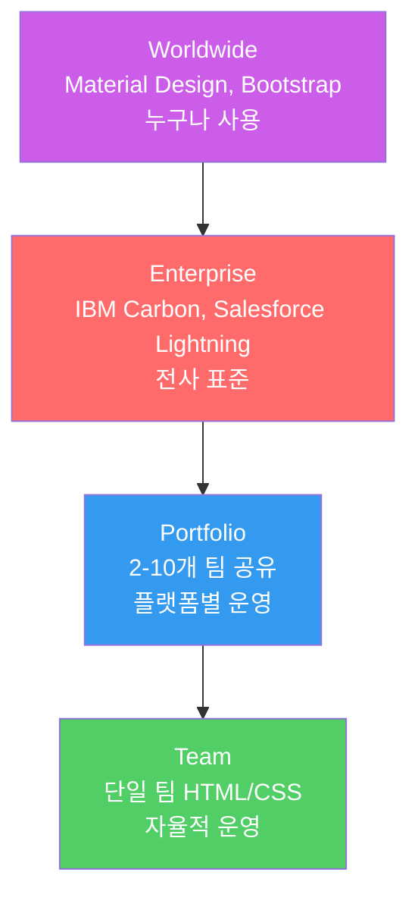
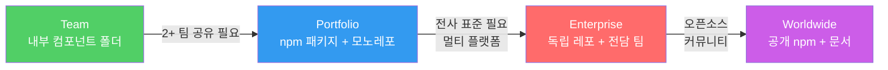

import DevQuickStart from '@site/src/components/DevQuickStart';

<DevQuickStart
  what="디자인 시스템의 범위는 Team → Portfolio → Enterprise → Worldwide 4단계로 나뉘며, 각 단계마다 아키텍처가 다릅니다"
  learn="각 범위 수준의 기술적 차이, 프로젝트 구조 예시, 적절한 투자 규모"
  able="조직 규모에 맞는 디자인 시스템 범위를 선택하고 적절한 아키텍처를 설계할 수 있습니다"
/>

## 시스템 범위의 4단계



## 핵심 개념

- **시스템 범위의 4단계**: Team → Portfolio → Enterprise → Worldwide
- **Team Playbook**: 단일 팀의 HTML/CSS 플레이북, 깊은 문서화 불필요, 완전한 자율성
- **Portfolio Guide**: 2-10개 팀이 공유, 플랫폼별 운영, 소유권/역할/비용 질문 발생
- **Enterprise Language**: 모든 제품에 걸친 통합 디자인 언어, 플랫폼 교차(웹+네이티브), 대규모 투자 필요
- **Worldwide Standard**: 누구나 채택 가능, 오픈소스, Material Design/Bootstrap 수준

## 기술적 차이 비교

| 기준 | Team | Portfolio | Enterprise | Worldwide |
|------|------|-----------|-----------|-----------|
| **패키지 구조** | 단일 패키지 | 모노레포 | 멀티 레포 | npm 공개 |
| **팀 규모** | 1-2명 (파트타임) | 2-5명 | 5-15명 | 15명+ |
| **플랫폼** | Web only | Web + 1-2 | Web + iOS + Android | All |
| **문서화** | README | Storybook | 전용 Doc 사이트 | 전용 사이트 + 튜토리얼 |
| **버전 관리** | Git tags | SemVer | SemVer + Changesets | SemVer + 릴리스 노트 |
| **테스트** | 수동 | Unit + A11y | Unit + Visual + E2E | 전체 자동화 |
| **투자 기간** | 2-3개월 | 6-12개월 | 12-24개월 | 수년 |

## 수준별 프로젝트 구조

### Team Playbook (단일 팀)

```
my-app/
  src/
    components/         # 공유 컴포넌트 (앱 내부)
      Button.tsx
      Card.tsx
      tokens.css        # 디자인 토큰
    pages/
  package.json          # 단일 패키지
  README.md             # 간단한 문서
```

```tsx
// 간단한 import - 별도 패키지 불필요
import { Button } from '../components/Button';
import { Card } from '../components/Card';
```

### Portfolio Guide (2-10개 팀)

```
design-system/
  packages/
    tokens/              # @company/tokens
      package.json
    core-ui/             # @company/core-ui
      src/
        Button/
        Card/
        Input/
      package.json
  apps/
    storybook/           # 문서 사이트
  turbo.json             # 모노레포 관리
  package.json
```

```tsx
// npm 패키지로 설치하여 사용
import { Button, Card } from '@company/core-ui';
```

### Enterprise Language (전사)

```
github.com/company/
  design-tokens/         # @company/tokens (독립 레포)
  core-ui/               # @company/core-ui (독립 레포)
  react-ui/              # @company/react-ui (독립 레포)
  ios-ui/                # company-ios-ui (CocoaPods)
  android-ui/            # company-android-ui (Maven)
  design-docs/           # 전용 문서 사이트
  figma-plugins/         # Figma 자동화
```

```tsx
// 플랫폼별 import
// React
import { Button } from '@company/react-ui';

// iOS (Swift)
import CompanyUI
let button = DSButton(style: .primary)

// Android (Kotlin)
import com.company.ui.Button
Button(variant = ButtonVariant.PRIMARY)
```

## "내 시스템은 어떤 수준인가?" 자가 진단

아래 질문에 답하여 적절한 수준을 파악하세요:

```markdown
## 자가 진단 체크리스트

### 기본 질문
- [ ] 디자인 시스템을 사용하는 제품이 2개 이상인가?
  → 아니오: Team / 예: Portfolio 이상

- [ ] 디자인 시스템을 사용하는 팀이 10개 이상인가?
  → 아니오: Portfolio / 예: Enterprise 이상

- [ ] iOS/Android 네이티브 앱도 지원해야 하는가?
  → 예: Enterprise 이상

- [ ] 외부 개발자(파트너, 오픈소스)도 사용하는가?
  → 예: Worldwide

### 투자 현실 점검
- [ ] 디자인 시스템 전담 인력이 있는가?
  → 아니오: Team 수준에서 시작 권장

- [ ] 분기당 릴리스 주기가 있는가?
  → 아니오: Portfolio 이전

- [ ] CI/CD 파이프라인이 구축되어 있는가?
  → 아니오: Portfolio 이전
```

## 단계적 성장 전략



**핵심 원칙**: 작은 팀이 Enterprise 수준의 시스템을 만들려 하면 실패합니다. 현재 규모에 맞는 수준에서 시작하고 자연스럽게 확장하세요.

## 실무 노하우

- **시작 전 명확화**: "How broadly applicable is this system we are making?" 질문으로 범위 설정
- **적절한 투자 규모**:
  - Team: 2-3개월, 별도 투자 없음 (제품 팀 자체 작업)
  - Portfolio: 6-12개월, 파트타임 다수 또는 소규모 풀타임 팀
  - Enterprise: 12-24개월, 풀타임 전담 팀 필요
  - Worldwide: 수년, 대규모 조직 투자
- **범위에 맞는 기대치**: 작은 팀이 Enterprise 수준의 시스템을 만들려 하면 실패
- **단계적 성장**: Team → Portfolio → Enterprise로 자연스럽게 확장 가능
- **플랫폼 현실**: Portfolio 단계에서 이미 플랫폼별(iOS/Android/Web) 분리가 발생하는 경우 많음

## 실무 체크리스트

- [ ] 자가 진단으로 현재 수준 파악
- [ ] 수준에 맞는 프로젝트 구조 선택
- [ ] 적절한 투자 규모 결정 (인력, 기간)
- [ ] 다음 수준으로의 확장 시점 정의
- [ ] 플랫폼 지원 범위 결정

---

import CrossRef from '@site/src/components/CrossRef';

<CrossRef related={[
  { path: "/docs/scaling-architecture/system-tiers", label: "08-01. 디자인 시스템 Tier" },
  { path: "/docs/scaling-architecture/multiple-libraries", label: "08-03. 다중 코어 라이브러리" },
  { path: "/docs/governance-operations/core-principles", label: "07-01. 핵심 원칙" },
]} />

*출처: Nathan Curtis (EightShapes) - A Design System's Reach (Feb 2016)*
