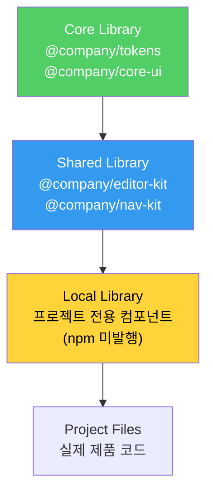
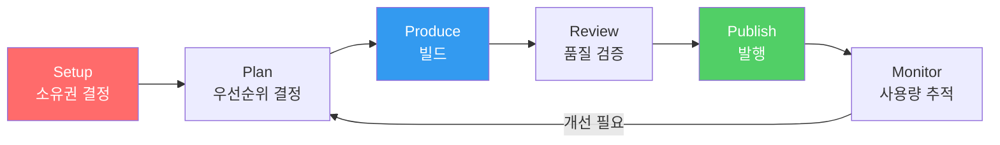

import DevQuickStart from '@site/src/components/DevQuickStart';

<DevQuickStart
  what="Figma 라이브러리는 Core → Shared → Local 계층으로 확장되며, 개발자에게는 npm 패키지 구조와 매핑됩니다"
  learn="Figma 라이브러리 생명주기, Figma Variables → CSS 변환, Style Dictionary 설정, 패키지 구조 매핑"
  able="Figma Variables를 CSS custom properties로 자동 변환하는 파이프라인을 구축할 수 있습니다"
/>

## 라이브러리 계층 구조



### Figma ↔ npm 패키지 매핑

| Figma 라이브러리 | npm 패키지 | 설명 |
|-----------------|-----------|------|
| ESDS Core | `@company/core-ui` | 핵심 컴포넌트 |
| ESDS Tokens | `@company/tokens` | 디자인 토큰 |
| ESDS Editor | `@company/editor-kit` | 에디터 컴포넌트 |
| ESDS Navigation | `@company/nav-kit` | 내비게이션 |
| MyTeam Local | (미발행) | 팀 내부 전용 |

## Developer Bridge: Figma → Code 파이프라인

### Figma Variables → CSS Custom Properties

Figma의 Variables 기능은 디자인 토큰과 직접 매핑됩니다:

```json
// figma-variables-export.json (Figma Variables API에서 추출)
{
  "colors": {
    "primary": { "light": "#6B47DC", "dark": "#9B7DEF" },
    "secondary": { "light": "#339AF0", "dark": "#74C0FC" },
    "background": { "light": "#FFFFFF", "dark": "#1A1A2E" },
    "text": { "light": "#1A1A2E", "dark": "#F8F9FA" }
  },
  "spacing": {
    "xs": "4px",
    "sm": "8px",
    "md": "16px",
    "lg": "24px",
    "xl": "32px"
  },
  "radius": {
    "sm": "4px",
    "md": "8px",
    "lg": "16px",
    "full": "9999px"
  }
}
```

### Style Dictionary 설정 (Figma Token Sync)

```javascript
// style-dictionary.config.js
const StyleDictionary = require('style-dictionary');

module.exports = {
  source: ['tokens/**/*.json'],
  platforms: {
    // CSS Custom Properties
    css: {
      transformGroup: 'css',
      buildPath: 'dist/css/',
      files: [
        {
          destination: 'variables.css',
          format: 'css/variables',
          options: { outputReferences: true },
        },
        {
          destination: 'variables-dark.css',
          format: 'css/variables',
          filter: (token) => token.filePath.includes('dark'),
          options: {
            selector: '[data-theme="dark"]',
          },
        },
      ],
    },
    // JavaScript/TypeScript
    js: {
      transformGroup: 'js',
      buildPath: 'dist/js/',
      files: [
        {
          destination: 'tokens.ts',
          format: 'javascript/es6',
        },
      ],
    },
    // iOS (Swift)
    ios: {
      transformGroup: 'ios-swift',
      buildPath: 'dist/ios/',
      files: [
        {
          destination: 'Tokens.swift',
          format: 'ios-swift/class.swift',
          className: 'DesignTokens',
        },
      ],
    },
  },
};
```

### 생성된 CSS 출력

```css
/* dist/css/variables.css - 자동 생성 */
:root {
  /* Colors */
  --color-primary: #6B47DC;
  --color-secondary: #339AF0;
  --color-background: #FFFFFF;
  --color-text: #1A1A2E;

  /* Spacing */
  --space-xs: 4px;
  --space-sm: 8px;
  --space-md: 16px;
  --space-lg: 24px;
  --space-xl: 32px;

  /* Radius */
  --radius-sm: 4px;
  --radius-md: 8px;
  --radius-lg: 16px;
  --radius-full: 9999px;
}

/* dist/css/variables-dark.css */
[data-theme="dark"] {
  --color-primary: #9B7DEF;
  --color-secondary: #74C0FC;
  --color-background: #1A1A2E;
  --color-text: #F8F9FA;
}
```

### 자동화 파이프라인

```yaml
# .github/workflows/sync-tokens.yml
name: Sync Figma Tokens

on:
  # Figma webhook 또는 수동 실행
  workflow_dispatch:
  schedule:
    - cron: '0 9 * * 1' # 매주 월요일

jobs:
  sync:
    runs-on: ubuntu-latest
    steps:
      - uses: actions/checkout@v4

      - name: Extract Figma Variables
        run: |
          # Figma Variables API로 토큰 추출 (REST API 사용)
          curl -s -H "X-Figma-Token: ${{ secrets.FIGMA_TOKEN }}" \
            "https://api.figma.com/v1/files/${{ secrets.FIGMA_FILE_KEY }}/variables/local" \
            | node scripts/transform-figma-tokens.js > tokens/figma-variables.json

          # 참고: scripts/transform-figma-tokens.js는 Figma API 응답을
          # Style Dictionary 포맷으로 변환하는 커스텀 스크립트입니다

      - name: Build tokens
        run: npx style-dictionary build

      - name: Create PR if changed
        uses: peter-evans/create-pull-request@v6
        with:
          title: 'chore(tokens): sync from Figma Variables'
          body: 'Automated token sync from Figma Variables API'
          branch: chore/sync-figma-tokens
```

## 라이브러리 생명주기



### 6단계 생명주기

#### 1. Setup (설정)
- 누가 라이브러리 생성을 결정하는가?
- Figma 팀, 프로젝트, 파일 소유권은?
- Main Branch의 편집자는?

#### 2. Plan (계획)
- 라이브러리에 들어갈 기능 우선순위 결정
- **우선순위 결정 요소**:
  1. Urgency (긴급성)
  2. Near term shared need (단기 공유 필요)
  3. Long term shared need (장기 공유 필요)
  4. Maker availability (제작자 가용성)
  5. Maintainer availability (유지관리자 가용성)

#### 3. Produce (제작)
- 기능 명명 및 범위 결정
- 기존 패턴 감사 (Audit)
- Figma 컴포넌트 빌드
- **네임스페이스 사용**:
```
ESDS Editor / Button        (공유 라이브러리)
ESDS / Button                (코어 라이브러리)
MyTeam / Button              (로컬 라이브러리)
```

#### 4. Review (검토)
- **Branching 워크플로우 권장**:
  - Main Branch: Maintainer만 작업
  - Feature Branches: 기여자가 작업
- **품질 기준 설정**: "How good must it be?" 워크샵

#### 5. Publish (발행)
- 라이브러리 스타일 및 UI 컴포넌트 발행
- 사용자에게 변경사항 커뮤니케이션
- 공유 라이브러리에서 코어 라이브러리로 승격 (필요시)

#### 6. Monitor & Maintain (모니터링 및 유지)
- Figma 분석을 통한 사용량 모니터링
- 개선 및 수정 요청 대응
- **중요**: "발행 후 선반에 올려두지 마라"

### 역할 및 책임

| 역할 | 수행 가능 작업 |
|------|---------------|
| **Any Contributor** | 디자인, 빌드, 스펙, 문서화 |
| **Library Maintainer** | 승인, 발행, 우선순위 결정 |
| **Core Team** | 명명, 범위 결정, 코어 승격 |

### 네임스페이스 규칙

```
@company/core-ui / Button       → Core 라이브러리
@company/editor-kit / Button    → Shared 라이브러리 (Editor)
@company/sales-ui / Button      → Local 라이브러리 (Sales)
```

## 공유 라이브러리 유형

| 유형 | 예시 | npm 패키지 |
|------|------|-----------|
| **복잡한 기능** | Editor, Navigation | `@company/editor-kit` |
| **플랫폼별** | iOS Nav, Android Components | `@company/ios-nav` |
| **프레임워크별** | React, Vue, Web Components | `@company/react-ui` |

## 실무 노하우

### 라이브러리 생명주기 (6단계)
- **Setup**: 누가 라이브러리 생성을 결정하는가?
- **Plan**: 라이브러리에 들어갈 기능 우선순위 결정
- **Produce**: 기능 명명, 범위 결정, Figma 컴포넌트 빌드
- **Review**: Branching 워크플로우, 품질 기준 설정
- **Publish**: 라이브러리 발행, 커뮤니케이션
- **Monitor & Maintain**: 사용량 모니터링, 요청 대응

### Library Maintainer의 핵심 역할
> "Maintainer는 단순히 만드는 사람이 아니라, **유지관리하고 운영**하는 사람이다."

### 배치 전략: 코로케이션 (Co-location)

**시각적 배치**:
```
Figma 라이브러리 다이얼로그

┌─────────────────────┐
│ ESDS CORE           │ ← 코어 (동일 브랜딩)
│ Tokens              │
└─────────────────────┘

┌─────────────────────┐
│ ESDS SHARED LIBRARY │ ← 공유 (동일 브랜딩 + "SHARED" 표시)
│ Editor              │
└─────────────────────┘

┌─────────────────────┐
│ ESDS SHARED LIBRARY │ ← 공유
│ Help                │
└─────────────────────┘
```

**기대 효과**:
- 기여자와 사용자 모두 공유 라이브러리를 "신뢰할 수 있는 확장"으로 인식
- 합리적인 엄격함과 지원으로 제작되었다는 기대

## 성공의 핵심

> "코어 팀이 모든 것을 만드는 것이 아니라, 다른 사람들이 잘 만들 수 있도록 활성화하는 것"

**최종 조언**:
- 템플릿을 개선하라
- 사람들을 참여시켜라
- 모든 것을 혼자 하지 마라
- 명확한 기대치를 설정하라
- "만들어주기"가 아닌 "활성화"에 집중하라

## 참고 자료

### 핵심 문헌
- Nathan Curtis (EightShapes, 2022-05) — "Figma Shared Libraries" 세미나 자료
- [Figma Variables REST API](https://www.figma.com/developers/api#variables) — 공식 Variables API 문서
- [Figma Best Practices](https://www.figma.com/best-practices/) — 라이브러리 구조화 가이드

### Figma → Code 브릿지
- [Style Dictionary](https://amzn.github.io/style-dictionary/) — Amazon의 토큰 파이프라인 (Figma Tokens 플러그인 연동)
- [Figma Tokens Plugin](https://www.figmatokens.com/) — Figma Variables를 JSON으로 동기화
- [Specify](https://specifyapp.com/) — Figma/Sketch → 코드 자동 변환 서비스
- [Supernova](https://www.supernova.io/) — Figma → 멀티 플랫폼 코드 생성

### 라이브러리 생명주기 관리
- Nathan Curtis, ["Releasing Design Systems"](https://medium.com/eightshapes-llc/releasing-design-systems-57fca91a23f0) — 디자인 에셋 릴리스 전략
- [Figma Branching](https://help.figma.com/hc/en-us/articles/360063144053-Branch-files-and-merge-changes) — Branching & Review 워크플로우
- [Semantic Versioning for Design](https://www.abstract.com/blog/semantic-versioning-design/) — 디자인 에셋 버전 관리

### 실제 사례
- [Shopify Polaris Figma Kit](https://www.figma.com/@shopify) — 3-tier 라이브러리 구조 (Foundations + Components + Patterns)
- [Material Design 3 Figma Kit](https://www.figma.com/community/file/1035203688168086460) — Variables 기반 테마 시스템
- [IBM Carbon Figma Libraries](https://www.figma.com/@ibm) — 플랫폼별 라이브러리 (Web, Mobile, Product)
- [Atlassian Design Figma](https://www.figma.com/@atlassian) — Core + Product-specific libraries

### 도구 & 자동화
- [GitHub Actions for Figma](https://github.com/marketplace?type=actions&query=figma) — Figma API 연동 워크플로우
- [figma-api](https://github.com/figma/figma-api-demo) — 공식 Node.js API 예제
- [Anima](https://www.animaapp.com/) — Figma → React/Vue/HTML 코드 생성

## 실무 체크리스트

- [ ] Figma Variables → JSON 추출 도구 설정
- [ ] Style Dictionary 설정 (CSS + JS + iOS/Android)
- [ ] CI에서 토큰 sync 자동화 (weekly 또는 webhook)
- [ ] Figma 라이브러리와 npm 패키지 1:1 매핑 문서화
- [ ] 네임스페이스 규칙 수립 및 중앙 관리
- [ ] 라이브러리 Maintainer 지정

---

import CrossRef from '@site/src/components/CrossRef';

<CrossRef related={[
  { path: "/docs/scaling-architecture/system-tiers", label: "08-01. Tier 아키텍처" },
  { path: "/docs/scaling-architecture/multiple-libraries", label: "08-03. 다중 코어 라이브러리" },
  { path: "/docs/design-tokens/token-tips", label: "01-01. 디자인 토큰 핵심 팁" },
]} />

*출처: Nathan Curtis (EightShapes), 2022-05*
