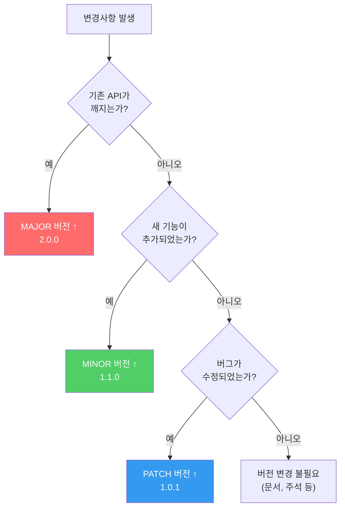
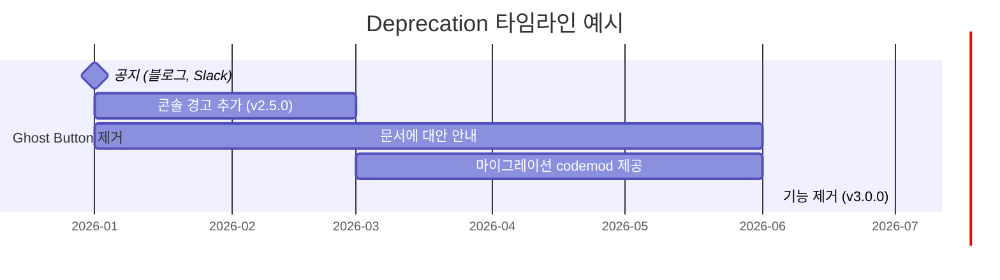
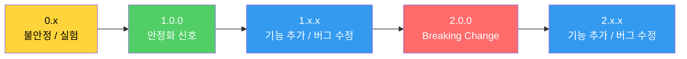

import DevQuickStart from '@site/src/components/DevQuickStart';

<DevQuickStart
  what="디자인 시스템의 버전 관리는 npm 패키지 버전 관리와 동일한 SemVer 규칙을 따릅니다"
  learn="SemVer 규칙, Changesets 워크플로우, CHANGELOG 작성법, deprecation 전략"
  able="디자인 시스템 라이브러리의 버전을 체계적으로 관리하고 Breaking Change를 안전하게 커뮤니케이션할 수 있습니다"
/>

## Semantic Versioning 기본 원칙

**SemVer (Semantic Versioning)** 은 `MAJOR.MINOR.PATCH` 형식으로 변경사항의 성격을 버전 번호에 담습니다.

```bash
# Semver 버전 변경 명령어
npm version patch  # 1.0.0 → 1.0.1 (버그 수정, 하위 호환)
npm version minor  # 1.0.1 → 1.1.0 (새 기능 추가, 하위 호환)
npm version major  # 1.1.0 → 2.0.0 (Breaking Change, 호환성 깨짐)
```

### 언제 어떤 버전을 올려야 할까?



### 디자인 시스템에서의 SemVer 적용 예시

| 변경사항 | 버전 유형 | 예시 |
|---------|----------|------|
| Button의 `variant` prop 삭제 | **MAJOR** | `<Button variant="ghost">` 사용 불가 |
| Button에 `size="xl"` 추가 | **MINOR** | 기존 코드 영향 없음 |
| Button hover 색상 버그 수정 | **PATCH** | 의도대로 동작하게 수정 |
| Card padding 값 변경 | **MAJOR** | 레이아웃이 깨질 수 있음 |
| 새 Icon 컴포넌트 추가 | **MINOR** | 기존 코드 영향 없음 |
| Tooltip 위치 계산 버그 수정 | **PATCH** | 정확한 위치로 수정 |

## 라이브러리 vs 컴포넌트 버전 관리

디자인 시스템은 **라이브러리 전체**를 하나의 버전으로 관리할지, **개별 컴포넌트**마다 독립 버전을 관리할지 선택해야 합니다.

### 라이브러리 단위 (권장)

```json
{
  "name": "@company/design-system",
  "version": "3.2.1",
  "exports": {
    "./button": "./dist/button/index.js",
    "./card": "./dist/card/index.js",
    "./checkbox": "./dist/checkbox/index.js",
    "./modal": "./dist/modal/index.js"
  }
}
```

```tsx
// 소비자 코드 - 하나의 버전으로 모든 컴포넌트 사용
import { Button, Card, Checkbox } from '@company/design-system';
```

### 컴포넌트 단위

```json
// packages/button/package.json
{ "name": "@company/button", "version": "5.3.1" }

// packages/card/package.json
{ "name": "@company/card", "version": "3.7.6" }

// packages/checkbox/package.json
{ "name": "@company/checkbox", "version": "3.1.0" }
```

```tsx
// 소비자 코드 - 각 컴포넌트를 독립적으로 설치/업데이트
import { Button } from '@company/button';
import { Card } from '@company/card';
```

| 기준 | 라이브러리 단위 | 컴포넌트 단위 |
|-----|---------------|-------------|
| **설치 편의성** | 한 번에 설치 | 필요한 것만 설치 |
| **버전 호환성** | 항상 호환 보장 | 호환성 직접 관리 |
| **업데이트 빈도** | 잦은 업데이트 | 필요한 것만 업데이트 |
| **Tree-shaking** | 번들러에 의존 | 자연스럽게 분리 |
| **적합한 규모** | 중소규모 시스템 | 대규모 시스템 (50+ 컴포넌트) |

## Changesets 워크플로우

[Changesets](https://github.com/changesets/changesets)는 모노레포에서 버전 관리를 자동화하는 도구입니다.

### 초기 설정

```bash
# Changesets 설치
npm install -D @changesets/cli @changesets/changelog-github

# 초기화
npx changeset init
```

```json
// .changeset/config.json
{
  "$schema": "https://unpkg.com/@changesets/config@3.0.0/schema.json",
  "changelog": [
    "@changesets/changelog-github",
    { "repo": "your-org/design-system" }
  ],
  "commit": false,
  "fixed": [],
  "linked": [],
  "access": "restricted",
  "baseBranch": "main",
  "updateInternalDependencies": "patch",
  "ignore": []
}
```

### 일상적인 워크플로우

```bash
# 1. 변경사항 작업 후 changeset 생성
npx changeset
# 대화형 프롬프트:
#   ? Which packages would you like to include? @company/button
#   ? Is this a major, minor, or patch change? minor
#   ? Summary: Add size="xl" variant to Button component

# 2. .changeset/ 디렉토리에 마크다운 파일 생성됨
cat .changeset/brave-lions-dance.md
# ---
# "@company/button": minor
# ---
# Add size="xl" variant to Button component

# 3. PR과 함께 changeset 파일 커밋
git add .changeset/brave-lions-dance.md
git commit -m "feat(button): add xl size variant"

# 4. 릴리스 시점에 버전 업데이트 + CHANGELOG 생성
npx changeset version

# 5. npm에 퍼블리시
npx changeset publish
```

### CI에서 자동화 (GitHub Actions)

```yaml
# .github/workflows/release.yml
name: Release

on:
  push:
    branches: [main]

concurrency: ${{ github.workflow }}-${{ github.ref }}

jobs:
  release:
    name: Release
    runs-on: ubuntu-latest
    steps:
      - uses: actions/checkout@v4
      - uses: actions/setup-node@v4
        with:
          node-version: 20
          cache: 'npm'

      - run: npm ci
      - run: npm run build
      - run: npm test

      - name: Create Release PR or Publish
        id: changesets
        uses: changesets/action@v1
        with:
          publish: npx changeset publish
          title: 'chore: version packages'
          commit: 'chore: version packages'
        env:
          GITHUB_TOKEN: ${{ secrets.GITHUB_TOKEN }}
          NPM_TOKEN: ${{ secrets.NPM_TOKEN }}
```

## CHANGELOG 작성법

[Keep a Changelog](https://keepachangelog.com/) 형식을 권장합니다.

```markdown
# Changelog

All notable changes to this project will be documented in this file.

The format is based on [Keep a Changelog](https://keepachangelog.com/),
and this project adheres to [Semantic Versioning](https://semver.org/).

## [Unreleased]

## [3.0.0] - 2026-02-01

### Breaking Changes
- **Button**: `variant="ghost"` removed. Use `variant="text"` instead.
- **Card**: `elevation` prop replaced with `shadow` prop.
- **tokens**: `--color-gray-50` renamed to `--color-neutral-50`.

### Migration Guide
```tsx
// Before (v2.x)
<Button variant="ghost">Click</Button>
<Card elevation={2}>Content</Card>

// After (v3.x)
<Button variant="text">Click</Button>
<Card shadow="md">Content</Card>
```

## [2.4.0] - 2026-01-15

### Added
- **Modal**: New `size="fullscreen"` option.
- **Toast**: Add `position` prop for placement control.

### Fixed
- **Tooltip**: Fix positioning when near viewport edge.
- **Select**: Fix keyboard navigation in grouped options.

## [2.3.1] - 2026-01-08

### Fixed
- **Button**: Fix focus ring not visible in high contrast mode.
```

## Deprecation 전략

기능을 제거하기 전에 충분한 사전 공지가 필요합니다.

### Deprecation 타임라인



### 코드에서의 Deprecation 구현

```tsx
// components/Button.tsx
import { useEffect } from 'react';

interface ButtonProps {
  /** @deprecated Use `variant="text"` instead. Will be removed in v3.0. */
  variant?: 'primary' | 'secondary' | 'ghost' | 'text';
}

export function Button({ variant, ...props }: ButtonProps) {
  useEffect(() => {
    if (variant === 'ghost') {
      console.warn(
        '[DesignSystem] Button: variant="ghost" is deprecated. ' +
        'Use variant="text" instead. ' +
        'This will be removed in v3.0.0. ' +
        'Migration guide: https://design.company.com/migration/v3'
      );
    }
  }, [variant]);

  const resolvedVariant = variant === 'ghost' ? 'text' : variant;
  return <button data-variant={resolvedVariant} {...props} />;
}
```

### npm deprecate 명령어

```bash
# 특정 버전 deprecate
npm deprecate @company/design-system@"< 2.0.0" \
  "v1.x is no longer supported. Please upgrade to v3.x"

# 특정 버전 범위 deprecate
npm deprecate @company/design-system@"2.0.0 - 2.3.0" \
  "Known security issue. Please upgrade to >= 2.3.1"

# 설치 시 경고 메시지 표시됨:
# npm warn deprecated @company/design-system@1.5.0:
#   v1.x is no longer supported. Please upgrade to v3.x
```

### Deprecation 체크리스트

```markdown
## Deprecation 프로세스 (Atlassian 참고)

1. [ ] 정규 채널로 의도 전달 (블로그 포스트 고려)
2. [ ] 타임라인 결정 (최소 3개월, 대규모 시스템은 6-18개월)
3. [ ] 문서에 deprecation 공지 추가
4. [ ] 코드에 console.warn 추가
5. [ ] 마이그레이션 codemod 또는 가이드 제공
6. [ ] 마지막으로 한 번 더 커뮤니케이션
7. [ ] Major 버전에서 코드 삭제
```

## 시스템 생애주기와 버전



**0.x (불안정)**: API가 자주 변경될 수 있음을 의미합니다. 이 시기에 충분히 실험하세요.

**1.0.0 (안정화 신호)**: "이 API를 신뢰해도 된다"는 약속입니다. 이후 Breaking Change는 반드시 MAJOR 버전에서만 발생합니다.

### 출력물 간 버전 동기화

코드가 진실의 원천(Source of Truth)입니다. 다른 출력물의 버전은 코드 버전과 동기화합니다.

| 출력물 | 버전 관리 방법 |
|-------|-------------|
| **코드 라이브러리** | `package.json` version (SSOT) |
| **문서 사이트** | 코드 버전 기준 URL (`/v2.4.0/button`) |
| **디자인 토큰** | 별도 패키지지만 코드와 연동 |
| **Figma 라이브러리** | 라이브러리 이름 또는 설명에 버전 명시 |

```bash
# 문서 사이트에서 과거 버전 제공
https://design.company.com/v3.2.0/components/button
https://design.company.com/v2.8.0/components/button  # 아직 v2 쓰는 팀용
```

## 실무 체크리스트

- [ ] SemVer 규칙을 팀 전체가 이해하고 합의
- [ ] Changesets 또는 유사 도구 도입
- [ ] CHANGELOG 형식 결정 (Keep a Changelog 권장)
- [ ] Deprecation 타임라인 정책 수립 (최소 3개월)
- [ ] 과거 버전 문서 유지 정책 수립
- [ ] CI/CD에서 자동 버전 관리 파이프라인 구축
- [ ] Breaking Change 결정 기준 문서화

---

import CrossRef from '@site/src/components/CrossRef';

<CrossRef related={[
  { path: "/docs/versioning-releases/releasing", label: "09-02. 릴리스 전략 - 출력물, 주기, 버전" },
  { path: "/docs/versioning-releases/visual-breaking-change", label: "09-03. Visual Breaking Change" },
  { path: "/docs/governance-operations/core-principles", label: "07-01. 핵심 원칙 & 거버넌스" },
]} />

*출처: Nathan Curtis (EightShapes) - Releasing Design Systems #3: Versioning*
