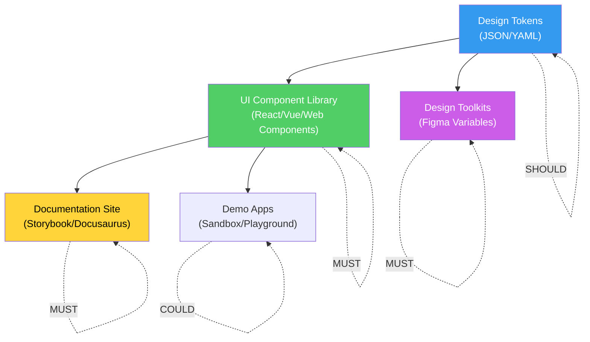
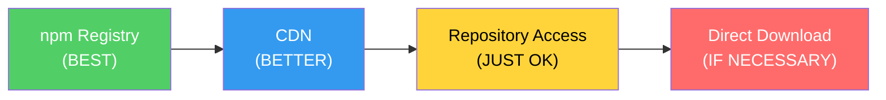

import DevQuickStart from '@site/src/components/DevQuickStart';

<DevQuickStart
  what="디자인 시스템 릴리스는 npm publish만이 아닌 코드, 토큰, 문서, 디자인 에셋의 통합 배포입니다"
  learn="GitHub Actions CI/CD 파이프라인, npm 레지스트리 설정, pre-release 채널 관리, 모노레포 퍼블리싱 전략"
  able="디자인 시스템의 빌드-테스트-퍼블리시 파이프라인을 완전 자동화할 수 있습니다"
/>

## 릴리스 출력물 (Release Outputs)

디자인 시스템의 릴리스는 코드 패키지만이 아닙니다. 여러 출력물이 동기화되어야 합니다.



### 출력물별 우선순위

| 우선순위 | 출력물 | 배포 방법 | 설명 |
|---------|--------|----------|------|
| **MUST** | UI Component Library | npm registry | 핵심 코드 패키지 |
| **MUST** | Documentation Site | Vercel/Netlify | 사용법, API 레퍼런스 |
| **MUST** | Design Toolkits | Figma publish | Figma 컴포넌트/변수 |
| **MUST** | Fonts & Icons | npm + CDN | 시각적 에셋 |
| **SHOULD** | Design Tokens | 별도 npm 패키지 | 스타일 기반값 |
| **COULD** | Demo Apps | hosted URL | 실제 사용 예시 |
| **COULD** | Cross-platform (iOS/Android) | CocoaPods/Maven | 네이티브 라이브러리 |

## CI/CD 파이프라인 구축

### 완전한 GitHub Actions 워크플로우

```yaml
# .github/workflows/release.yml
name: Release Design System

on:
  push:
    branches: [main]
  pull_request:
    branches: [main]

permissions:
  contents: write
  pull-requests: write
  id-token: write

jobs:
  # 1단계: 품질 검증
  quality:
    name: Quality Checks
    runs-on: ubuntu-latest
    steps:
      - uses: actions/checkout@v4
        with:
          fetch-depth: 0

      - uses: actions/setup-node@v4
        with:
          node-version: 20
          cache: 'npm'

      - run: npm ci

      - name: Lint
        run: npm run lint

      - name: Type Check
        run: npx tsc --noEmit

      - name: Unit Tests
        run: npm test -- --coverage

      - name: Build
        run: npm run build

      - name: Visual Regression (Chromatic)
        if: github.event_name == 'pull_request'
        uses: chromaui/action@latest
        with:
          projectToken: ${{ secrets.CHROMATIC_PROJECT_TOKEN }}
          exitOnceUploaded: true

  # 2단계: 릴리스 (main 브랜치만)
  release:
    name: Release
    needs: quality
    if: github.ref == 'refs/heads/main' && github.event_name == 'push'
    runs-on: ubuntu-latest
    steps:
      - uses: actions/checkout@v4
      - uses: actions/setup-node@v4
        with:
          node-version: 20
          cache: 'npm'
          registry-url: 'https://registry.npmjs.org'

      - run: npm ci
      - run: npm run build

      - name: Create Release PR or Publish
        uses: changesets/action@v1
        with:
          publish: npx changeset publish
          title: 'chore(release): version packages'
          commit: 'chore(release): version packages'
        env:
          GITHUB_TOKEN: ${{ secrets.GITHUB_TOKEN }}
          NPM_TOKEN: ${{ secrets.NPM_TOKEN }}
          NODE_AUTH_TOKEN: ${{ secrets.NPM_TOKEN }}

  # 3단계: 문서 사이트 배포
  docs:
    name: Deploy Documentation
    needs: release
    runs-on: ubuntu-latest
    steps:
      - uses: actions/checkout@v4
      - uses: actions/setup-node@v4
        with:
          node-version: 20
          cache: 'npm'

      - run: npm ci
      - run: npm run build:docs

      - name: Deploy to Vercel
        uses: amondnet/vercel-action@v25
        with:
          vercel-token: ${{ secrets.VERCEL_TOKEN }}
          vercel-org-id: ${{ secrets.VERCEL_ORG_ID }}
          vercel-project-id: ${{ secrets.VERCEL_PROJECT_ID }}
          vercel-args: '--prod'
```

### PR 단계 검증 워크플로우

```yaml
# .github/workflows/pr-check.yml
name: PR Checks

on:
  pull_request:
    types: [opened, synchronize]

jobs:
  changeset-check:
    name: Changeset Verification
    runs-on: ubuntu-latest
    steps:
      - uses: actions/checkout@v4
        with:
          fetch-depth: 0

      - uses: actions/setup-node@v4
        with:
          node-version: 20
          cache: 'npm'

      - run: npm ci

      # changeset 파일이 포함되었는지 확인
      - name: Check for changeset
        run: |
          if [ -z "$(ls .changeset/*.md 2>/dev/null | grep -v README)" ]; then
            echo "::warning::No changeset found. If this PR has user-facing changes, run 'npx changeset' to add one."
          fi

  bundle-size:
    name: Bundle Size Check
    runs-on: ubuntu-latest
    steps:
      - uses: actions/checkout@v4
      - uses: actions/setup-node@v4
        with:
          node-version: 20
          cache: 'npm'

      - run: npm ci
      - run: npm run build

      - name: Check bundle size
        uses: andresz1/size-limit-action@v1
        with:
          github_token: ${{ secrets.GITHUB_TOKEN }}
```

## npm 레지스트리 설정

### `.npmrc` 설정

```ini
# .npmrc - 프로젝트 루트에 배치

# 공개 npm 레지스트리 (오픈소스)
registry=https://registry.npmjs.org/

# 비공개 레지스트리 (사내용)
# @company:registry=https://npm.company.com/
# //npm.company.com/:_authToken=${NPM_TOKEN}

# GitHub Packages (GitHub 기반 조직)
# @your-org:registry=https://npm.pkg.github.com/
# //npm.pkg.github.com/:_authToken=${GITHUB_TOKEN}

# 패키지 퍼블리시 설정
access=public
```

### `package.json` 퍼블리시 설정

```json
{
  "name": "@company/design-system",
  "version": "3.2.1",
  "description": "Company Design System - UI component library",
  "main": "./dist/cjs/index.js",
  "module": "./dist/esm/index.js",
  "types": "./dist/types/index.d.ts",
  "exports": {
    ".": {
      "import": "./dist/esm/index.js",
      "require": "./dist/cjs/index.js",
      "types": "./dist/types/index.d.ts"
    },
    "./styles": "./dist/styles/index.css",
    "./tokens": "./dist/tokens/index.js"
  },
  "files": [
    "dist",
    "CHANGELOG.md",
    "README.md"
  ],
  "sideEffects": [
    "**/*.css"
  ],
  "publishConfig": {
    "access": "public",
    "registry": "https://registry.npmjs.org/"
  },
  "repository": {
    "type": "git",
    "url": "https://github.com/company/design-system"
  },
  "keywords": ["design-system", "react", "components", "ui"],
  "license": "MIT"
}
```

### 패키지 내용 확인

```bash
# 퍼블리시 전에 패키지 내용을 확인
npm pack --dry-run

# 출력 예시:
# npm notice === Tarball Contents ===
# npm notice 1.2kB  package.json
# npm notice 3.4kB  README.md
# npm notice 15.6kB CHANGELOG.md
# npm notice 245kB  dist/esm/index.js
# npm notice 238kB  dist/cjs/index.js
# npm notice 12kB   dist/types/index.d.ts
# npm notice 45kB   dist/styles/index.css
# npm notice === Tarball Details ===
# npm notice name:     @company/design-system
# npm notice version:  3.2.1
# npm notice total:    560.2kB

# 실제로 tarball 생성하여 내용 검사
npm pack
tar -tzf company-design-system-3.2.1.tgz | head -20
```

## Pre-release 채널 관리

안정 릴리스 전에 미리 테스트할 수 있는 pre-release 채널을 운영합니다.

### 채널 종류

| 채널 | 용도 | 안정성 | 예시 |
|------|------|--------|------|
| `canary` | 매 커밋마다 자동 배포 | 매우 낮음 | `3.2.1-canary.abc1234` |
| `alpha` | 초기 개발 버전 | 낮음 | `4.0.0-alpha.1` |
| `beta` | 기능 완성, 버그 수정 중 | 중간 | `4.0.0-beta.3` |
| `rc` | 릴리스 후보, 최종 검증 | 높음 | `4.0.0-rc.1` |
| `next` | 다음 major 버전 미리보기 | 중간 | `4.0.0-next.5` |
| `latest` | 안정 릴리스 (기본값) | 높음 | `3.2.1` |

### dist-tag 관리

```bash
# pre-release 버전 퍼블리시 (latest 태그에 영향 없음)
npm publish --tag next
npm publish --tag beta
npm publish --tag canary

# dist-tag 확인
npm dist-tag ls @company/design-system
# latest: 3.2.1
# next: 4.0.0-beta.3
# canary: 3.2.2-canary.abc1234

# dist-tag 수동 변경
npm dist-tag add @company/design-system@4.0.0 latest
npm dist-tag rm @company/design-system next

# 소비자가 특정 채널 설치
npm install @company/design-system@next
npm install @company/design-system@beta
npm install @company/design-system@canary
```

### Canary 릴리스 자동화

```yaml
# .github/workflows/canary.yml
name: Canary Release

on:
  push:
    branches: [develop]

jobs:
  canary:
    runs-on: ubuntu-latest
    steps:
      - uses: actions/checkout@v4
      - uses: actions/setup-node@v4
        with:
          node-version: 20
          cache: 'npm'
          registry-url: 'https://registry.npmjs.org'

      - run: npm ci
      - run: npm run build

      - name: Publish Canary
        run: |
          SHORT_SHA=$(git rev-parse --short HEAD)
          CURRENT_VERSION=$(node -p "require('./package.json').version")
          CANARY_VERSION="${CURRENT_VERSION}-canary.${SHORT_SHA}"

          # 버전 임시 변경
          npm version "$CANARY_VERSION" --no-git-tag-version

          # canary 태그로 퍼블리시
          npm publish --tag canary --provenance
        env:
          NODE_AUTH_TOKEN: ${{ secrets.NPM_TOKEN }}
```

## 모노레포 퍼블리싱 전략

### Changesets + Turborepo

```json
// turbo.json
{
  "$schema": "https://turbo.build/schema.json",
  "tasks": {
    "build": {
      "dependsOn": ["^build"],
      "outputs": ["dist/**"]
    },
    "test": {
      "dependsOn": ["build"]
    },
    "lint": {},
    "typecheck": {
      "dependsOn": ["^build"]
    }
  }
}
```

```
# 모노레포 구조
packages/
  tokens/          # @company/tokens      (v2.1.0)
    package.json
    src/
  core/            # @company/core-ui     (v3.2.1)
    package.json   # depends on @company/tokens
    src/
  icons/           # @company/icons       (v1.5.0)
    package.json
    src/
  react/           # @company/react-ui    (v3.2.1)
    package.json   # depends on @company/core-ui
    src/
apps/
  docs/            # 문서 사이트 (퍼블리시 안 함)
  playground/      # 데모 앱 (퍼블리시 안 함)
```

```json
// .changeset/config.json (모노레포용)
{
  "$schema": "https://unpkg.com/@changesets/config@3.0.0/schema.json",
  "changelog": [
    "@changesets/changelog-github",
    { "repo": "company/design-system" }
  ],
  "commit": false,
  "fixed": [
    ["@company/core-ui", "@company/react-ui"]
  ],
  "linked": [],
  "access": "public",
  "baseBranch": "main",
  "updateInternalDependencies": "patch",
  "ignore": ["docs", "playground"]
}
```

`"fixed"` 배열의 패키지들은 항상 같은 버전으로 릴리스됩니다. 하나가 변경되면 나머지도 함께 버전이 올라갑니다.

### 릴리스 명령어

```bash
# 모노레포 전체 빌드
npx turbo run build

# 모노레포 전체 테스트
npx turbo run test

# changeset 생성 (변경된 패키지 선택)
npx changeset

# 버전 업데이트 (CHANGELOG 자동 생성)
npx changeset version

# 변경된 패키지만 퍼블리시
npx changeset publish
```

## CDN 배포

npm 레지스트리 외에 CDN을 통해서도 배포할 수 있습니다.

```html
<!-- unpkg (npm 기반 CDN) -->
<link rel="stylesheet"
  href="https://unpkg.com/@company/design-system@3.2.1/dist/styles/index.css">
<script type="module"
  src="https://unpkg.com/@company/design-system@3.2.1/dist/esm/index.js"></script>

<!-- jsdelivr (npm 기반 CDN) -->
<link rel="stylesheet"
  href="https://cdn.jsdelivr.net/npm/@company/design-system@3.2.1/dist/styles/index.css">

<!-- 특정 버전 고정 (프로덕션 권장) -->
<script src="https://unpkg.com/@company/design-system@3.2.1/dist/umd/index.js"></script>

<!-- 최신 버전 자동 (개발 환경) -->
<script src="https://unpkg.com/@company/design-system/dist/umd/index.js"></script>
```

### CDN 지원을 위한 UMD 빌드

```json
// package.json에 UMD 엔트리 추가
{
  "unpkg": "./dist/umd/index.js",
  "jsdelivr": "./dist/umd/index.js"
}
```

## 배포 채널 우선순위



| 채널 | 장점 | 단점 | 적합한 경우 |
|------|------|------|-----------|
| **npm Registry** | 버전 관리, dependency resolution | 빌드 도구 필요 | SPA, SSR 앱 |
| **CDN** | 즉시 사용, 캐싱 | 버전 고정 어려움 | 레거시 앱, 프로토타입 |
| **Repository** | 소스 접근 가능 | 빌드 직접 해야 함 | 내부 프로젝트 |
| **Download** | 네트워크 제한 환경 | 업데이트 수동 | 에어갭 환경 |

## 릴리스 주기 (Cadence)

| 유형 | 주기 | 내용 |
|------|------|------|
| **Patch** | 필요 시 (1-2주) | 버그 수정, 문서 수정 |
| **Minor** | 격주 ~ 월간 | 새 컴포넌트, 새 prop |
| **Major** | 분기 ~ 반기 | Breaking Change 모음 |
| **Canary** | 매 커밋 | 자동 빌드, 테스트용 |

### 릴리스 일정 예시

```markdown
## 2026 릴리스 캘린더

| 날짜 | 버전 | 주요 내용 |
|------|------|----------|
| Q1 (1월) | 3.0.0 | Breaking: 토큰 네이밍 변경 |
| Q1 (2월) | 3.1.0 | 새 Accordion, Tabs 컴포넌트 |
| Q1 (3월) | 3.2.0 | DataTable 개선, 접근성 수정 |
| Q2 (4월) | 3.3.0 | 다크모드 개선 |
| Q2 (6월) | 3.4.0 | Chart 컴포넌트 추가 |
| Q3 (7월) | 4.0.0-beta.1 | v4 베타 (React 19 지원) |
| Q3 (9월) | 4.0.0 | Breaking: React 19 전용 |
```

## 참고 자료

### 핵심 문헌
- [Nathan Curtis - "Releasing Design Systems"](https://medium.com/eightshapes-llc/releasing-design-systems-57fca91a23f0) — Outputs, Cadence, Versions 전략
- [npm Publishing Guide](https://docs.npmjs.com/packages-and-modules) — 공식 npm 퍼블리시 문서
- [GitHub Actions Documentation](https://docs.github.com/en/actions) — CI/CD 자동화 가이드

### CI/CD 아키텍처
- [The Twelve-Factor App](https://12factor.net/) — 배포 파이프라인 설계 원칙
- Martin Fowler, ["Continuous Integration"](https://martinfowler.com/articles/continuousIntegration.html) — CI 모범 사례
- [GitLab CI/CD Best Practices](https://docs.gitlab.com/ee/ci/pipelines/pipeline_efficiency.html) — 파이프라인 최적화

### npm 생태계
- [npm dist-tag](https://docs.npmjs.com/cli/v10/commands/npm-dist-tag) — 릴리스 채널 관리 (latest, next, canary)
- [npm Provenance](https://docs.npmjs.com/generating-provenance-statements) — 빌드 출처 증명 (Supply Chain Security)
- [Verdaccio](https://verdaccio.org/) — 사설 npm 레지스트리 (온프레미스)
- [GitHub Packages](https://github.com/features/packages) — GitHub 통합 npm 레지스트리

### 모노레포 도구
- [Turborepo](https://turbo.build/repo) — Vercel의 고속 빌드 시스템
- [Nx](https://nx.dev/) — Nrwl의 엔터프라이즈 모노레포 도구
- [Changesets](https://github.com/changesets/changesets) — 버전 관리 및 CHANGELOG 자동화
- [Rush](https://rushjs.io/) — Microsoft의 대규모 모노레포 관리

### CDN & 배포
- [unpkg](https://unpkg.com/) — npm 기반 CDN (자동 동기화)
- [jsDelivr](https://www.jsdelivr.com/) — 오픈소스 CDN (GitHub/npm 지원)
- [Vercel](https://vercel.com/) — Frontend 배포 플랫폼 (문서 사이트)
- [Netlify](https://www.netlify.com/) — JAMstack 배포 (Storybook 호스팅)

### Visual Regression Testing
- [Chromatic](https://www.chromatic.com/) — Storybook 기반 시각적 테스트 (Storybook 공식)
- [Percy](https://percy.io/) — BrowserStack의 시각적 테스트 플랫폼
- [Playwright Visual Comparisons](https://playwright.dev/docs/test-snapshots) — 스크린샷 비교 테스트
- [BackstopJS](https://github.com/garris/BackstopJS) — 오픈소스 시각적 회귀 테스트

### 실제 사례
- [React Release Process](https://legacy.reactjs.org/docs/implementation-notes.html) — Canary → Next → RC → Stable 채널
- [Material-UI Release Strategy](https://github.com/mui/material-ui/blob/master/CONTRIBUTING.md#release) — Changesets 기반 자동 릴리스
- [Ant Design Release Notes](https://github.com/ant-design/ant-design/releases) — 상세한 릴리스 노트 예시

## 실무 체크리스트

- [ ] CI/CD 파이프라인 구축 (lint, test, build, publish)
- [ ] npm 레지스트리 및 `.npmrc` 설정
- [ ] `package.json`의 `files`, `exports`, `publishConfig` 정확히 설정
- [ ] Pre-release 채널 운영 정책 수립 (alpha/beta/rc/canary)
- [ ] 모노레포 사용 시 Changesets `fixed`/`linked` 설정
- [ ] CDN 배포 필요 여부 결정
- [ ] 릴리스 주기 결정 및 팀에 공유
- [ ] 릴리스 전 `npm pack --dry-run`으로 패키지 내용 검증
- [ ] Visual Regression 테스트 통합 (Chromatic/Percy)

---

import CrossRef from '@site/src/components/CrossRef';

<CrossRef related={[
  { path: "/docs/versioning-releases/versioning", label: "09-01. 버전 관리 - SemVer와 Changesets" },
  { path: "/docs/versioning-releases/visual-breaking-change", label: "09-03. Visual Breaking Change" },
  { path: "/docs/scaling-architecture/multiple-libraries", label: "08-03. 다중 코어 라이브러리 관리" },
]} />

*출처: Nathan Curtis (EightShapes) - Releasing Design Systems: Outputs, Cadence, Versions*
