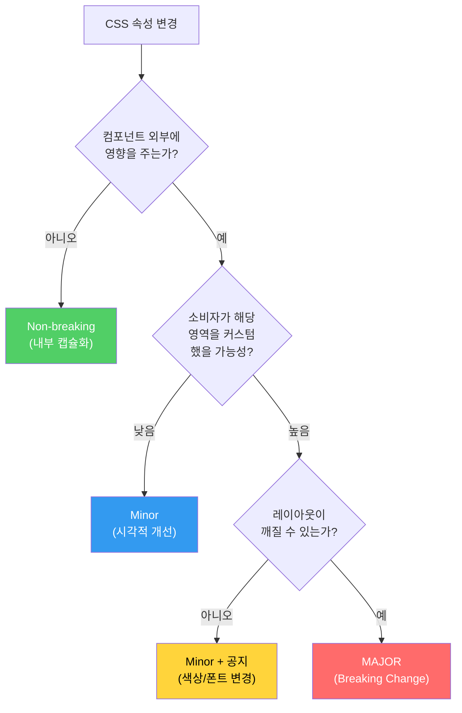
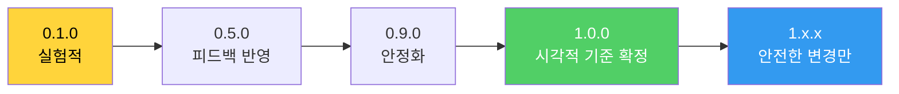

import DevQuickStart from '@site/src/components/DevQuickStart';

<DevQuickStart
  what="CSS 속성 변경이 소비자 UI를 깨뜨릴 수 있으며, 코드 API가 아닌 시각적 변경도 Breaking Change입니다"
  learn="Visual Breaking Change 판단 기준, Visual Regression 테스트 설정, CSS 변경 영향도 분석"
  able="시각적 변경사항이 Breaking인지 Non-breaking인지 판단하고, 자동화된 Visual Regression 테스트를 구축할 수 있습니다"
/>

## Visual Breaking Change란?

코드 API(props, 함수 시그니처)는 SemVer로 명확히 관리되지만, **시각적 스타일 변경**은 기준이 모호합니다. 색상, 타이포그래피, 간격 변경으로 소비자의 UI가 예상치 못하게 깨질 수 있습니다.

### 핵심 원칙

> API Breaking Change는 **컴파일 에러**로 즉시 발견되지만, Visual Breaking Change는 **사용자가 직접 보기 전까지** 발견되지 않을 수 있습니다.

### 이것은 Breaking Change인가?



## 속성별 위험도 분석

### Color 변경

```css
/* Breaking: 시스템 텍스트 색상이 알 수 없는 배경 위에 올라갈 때 */
.ds-button--ghost {
  /* Before: 어두운 배경에서도 보임 */
  color: #333333;

  /* After: 어두운 배경에서 접근성 실패 */
  color: #999999;
}

/* Non-breaking: 완전히 캡슐화된 배경색 변경 */
.ds-button--primary {
  /* 시스템이 배경과 텍스트를 모두 제어 */
  background-color: #6B47DC; /* before: #5B37CC */
  color: #FFFFFF;            /* 대비 충분 */
}
```

**위험 시나리오**: Ghost Button의 텍스트 색상 변경

```tsx
{/* 소비자가 자체 배경색 위에 시스템 Ghost Button을 배치 */}
<div style={{ backgroundColor: '#f0f0f0' }}>
  {/* 시스템이 color를 #999로 변경하면 → 대비 부족 → 접근성 실패 */}
  <Button variant="ghost">Action</Button>
</div>
```

### Typography 변경

```css
/* Breaking: 텍스트 줄바꿈이 발생할 수 있는 변경 */
.ds-tab-label {
  /* Before */
  font-weight: 400;
  letter-spacing: 0;

  /* After: bold + letter-spacing → 고정 폭 컨테이너에서 줄바꿈 */
  font-weight: 600;
  letter-spacing: 0.02em;
}

/* Non-breaking: 시각적 차이가 미미한 변경 */
.ds-body-text {
  /* line-height 미세 조정은 대부분 안전 */
  line-height: 1.5; /* before: 1.45 */
}
```

**위험 시나리오**: Tab 라벨이 bold로 변경

```tsx
{/* 소비자가 고정 폭 탭 레이아웃을 사용 */}
<div style={{ display: 'flex', width: '400px' }}>
  <Tab label="Dashboard" />    {/* bold로 변경 → 텍스트가 넓어짐 */}
  <Tab label="Settings" />
  <Tab label="Notifications" /> {/* → 줄바꿈 또는 잘림 발생! */}
</div>
```

### Space/Size 변경

```css
/* Breaking: 외부 레이아웃에 영향을 주는 변경 */
.ds-card {
  /* Before */
  padding: 16px;

  /* After: padding 증가 → 내부 콘텐츠 영역 축소 → 줄바꿈 */
  padding: 24px;
}

/* Non-breaking: 완전히 캡슐화된 내부 변경 */
.ds-menu-item {
  /* 메뉴 아이템 간 간격 조정 — 메뉴 전체 크기는 변해도 외부 영향 없음 */
  padding: 10px 16px; /* before: 8px 16px */
}
```

## 모니터링할 CSS 속성 목록

팀과 함께 아래 속성 목록을 리뷰하고, 어떤 변경이 Breaking인지 합의하세요.

| 카테고리 | CSS 속성 | Breaking 위험도 |
|---------|---------|---------------|
| **색상** | `color` | 높음 (알 수 없는 배경) |
| | `background-color` | 중간 (캡슐화 여부) |
| | `border-color` | 낮음 |
| **타이포** | `font-family` | 높음 (폭 변화) |
| | `font-weight` | 높음 (폭 변화) |
| | `font-size` | 높음 (줄바꿈) |
| | `letter-spacing` | 중간 |
| | `line-height` | 중간 (높이 변화) |
| **공간** | `margin` (외부) | 높음 |
| | `padding` | 높음 (내부 영역 변화) |
| | `width`, `height` | 높음 |
| | `gap` | 중간 |
| **레이어** | `z-index` | 높음 (겹침) |
| | `opacity` | 낮음 |
| | `box-shadow` | 낮음 |

## Visual Regression 테스트 설정

### Chromatic 설정

```yaml
# .github/workflows/chromatic.yml
name: Visual Regression Tests

on:
  pull_request:
    branches: [main]

jobs:
  chromatic:
    runs-on: ubuntu-latest
    steps:
      - uses: actions/checkout@v4
        with:
          fetch-depth: 0

      - uses: actions/setup-node@v4
        with:
          node-version: 20
          cache: 'npm'

      - run: npm ci

      - name: Run Chromatic
        uses: chromaui/action@latest
        with:
          projectToken: ${{ secrets.CHROMATIC_PROJECT_TOKEN }}
          # PR에서 시각적 변경사항 리뷰 필수
          exitZeroOnChanges: false
          # 컴포넌트 단위 스냅샷
          onlyChanged: true
```

### Storybook 스토리에서 시각적 테스트 활성화

```tsx
// Button.stories.tsx
import type { Meta, StoryObj } from '@storybook/react';
import { Button } from './Button';

const meta: Meta<typeof Button> = {
  title: 'Components/Button',
  component: Button,
  parameters: {
    // Chromatic에 스냅샷 옵션 전달
    chromatic: {
      modes: {
        light: { theme: 'light' },
        dark: { theme: 'dark' },
      },
      viewports: [375, 768, 1280],
    },
  },
};
export default meta;

type Story = StoryObj<typeof Button>;

// 모든 variant를 한 스토리에서 테스트
export const AllVariants: Story = {
  render: () => (
    <div style={{ display: 'flex', flexDirection: 'column', gap: '8px' }}>
      <Button variant="primary">Primary</Button>
      <Button variant="secondary">Secondary</Button>
      <Button variant="text">Text</Button>
      <Button variant="primary" disabled>Disabled</Button>
    </div>
  ),
};

// 접근성 위험 시나리오 테스트
export const OnDarkBackground: Story = {
  render: () => (
    <div style={{ backgroundColor: '#1a1a2e', padding: '24px' }}>
      <Button variant="text">Light text on dark</Button>
    </div>
  ),
  parameters: {
    chromatic: { disableSnapshot: false },
  },
};
```

### CSS 변경 감지 스크립트

```bash
#!/bin/bash
# scripts/check-visual-breaking.sh
# PR에서 CSS 변경사항을 감지하여 경고

BREAKING_PROPS="color|background-color|font-family|font-weight|font-size|letter-spacing|margin|padding|width|height|z-index"

CHANGES=$(git diff origin/main -- '*.css' '*.scss' '*.ts' '*.tsx' \
  | grep -E "^\+.*($BREAKING_PROPS)" \
  | grep -v "^+++" \
  | head -20)

if [ -n "$CHANGES" ]; then
  echo "::warning::Visual Breaking Change detected in CSS properties:"
  echo "$CHANGES"
  echo ""
  echo "Please review if these changes require a MAJOR version bump."
  echo "See: https://design.company.com/docs/visual-breaking-changes"
fi
```

## Accessibility 변경과의 관계

시각적 변경은 접근성에도 영향을 줄 수 있습니다.

```css
/* 접근성 고려 필수 */
@media (prefers-reduced-motion: reduce) {
  .ds-button {
    /* 모션 줄이기 설정 사용자를 위해 */
    transition: none;
  }
}

@media (prefers-contrast: more) {
  .ds-button--ghost {
    /* 고대비 모드에서 색상 변경의 영향이 더 큼 */
    color: #000000;
    border: 2px solid currentColor;
  }
}
```

## CHANGELOG에 Visual Breaking Change 기록하기

```markdown
## [3.0.0] - 2026-02-01

### BREAKING: Visual Changes

> 아래 변경사항은 API 변경 없이 시각적 결과에 영향을 줍니다.
> 커스텀 레이아웃을 사용하는 경우 반드시 확인하세요.

- **Button**: `ghost` variant 텍스트 색상 `#333` → `#666` 변경.
  어두운 배경에서 사용 시 대비 확인 필요.
  ```css
  /* 마이그레이션: 이전 색상이 필요하면 직접 오버라이드 */
  .your-button-override { color: #333333; }
  ```

- **Card**: padding `16px` → `24px` 변경.
  고정 폭 레이아웃에서 내부 콘텐츠 영역이 줄어듭니다.

- **Typography**: `font-weight` 기본값 `400` → `500` 변경.
  고정 폭 컨테이너에서 텍스트 줄바꿈 확인 필요.

### Non-breaking Visual Changes
- **Menu**: 아이템 간 간격 `8px` → `10px` (캡슐화된 변경)
- **Tooltip**: 화살표 크기 미세 조정 (외부 영향 없음)
```

## 1.0.0 전에 실험하기



**1.0.0 이전**: 색상, 타이포, 간격을 자유롭게 실험하세요. 이때 충분히 다양한 제품에서 테스트하여 "기본값"을 확정합니다.

**1.0.0 이후**: 시각적 변경은 반드시 영향도를 평가하고, Breaking Change는 MAJOR 버전에 예약합니다.

## 실무 체크리스트

- [ ] 팀과 CSS 속성별 Breaking 기준 합의 (위 표 기반)
- [ ] Visual Regression 테스트 도구 도입 (Chromatic/Percy)
- [ ] CI에서 시각적 변경 자동 감지 스크립트 설정
- [ ] CHANGELOG에 Visual Breaking Change 섹션 추가
- [ ] 접근성 테스트에 `prefers-reduced-motion`, `prefers-contrast` 포함
- [ ] 1.0.0 전에 시각적 기준 확정
- [ ] 색상 변경 시 접근성 대비 검사 자동화 (axe, contrast-grid)

---

import CrossRef from '@site/src/components/CrossRef';

<CrossRef related={[
  { path: "/docs/versioning-releases/versioning", label: "09-01. 버전 관리 - SemVer와 Changesets" },
  { path: "/docs/versioning-releases/releasing", label: "09-02. 릴리스 전략" },
  { path: "/docs/quality-testing/testing-plan", label: "05-02. 테스트 계획 수립" },
]} />

*출처: Nathan Curtis (EightShapes) - Releasing Design Systems #4: Visual Breaking Change*
