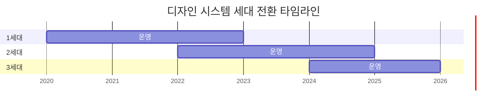

import DevQuickStart from '@site/src/components/DevQuickStart';

<DevQuickStart
  what="Design system generations are large-scale library transitions that affect all assets, docs, tools, and practices"
  learn="How to evaluate whether a change qualifies as a generation shift using the 3-question framework (Cause, Scope, Scale)"
  able="Plan a generation transition with clear scope statements, stakeholder communication, and migration strategy"
/>

## 디자인 시스템 세대(Generation) - 정의 및 전략

### 핵심 개념

- **세대(Generation)**: 안정적이고 충분한 핵심 라이브러리(에셋, 문서, 도구, 실무 관행의 집합체)
- **5가지 특징**: (1) 전체 라이브러리 영향 (2) 업그레이드 노력 필요 (3) 파트너 협업 필수 (4) 백로그 재검토 기회 (5) 기타 작업 둔화
- **세대 전환 트리거**: 처음부터 시작 / 리디자인 / 재설계 / 프레임워크 전환

## 세대 전환 결정의 3가지 질문

### 1. 원인 (Cause): 왜 바꾸는가?

**외부 주도 (Externally Driven)**:
- 예시: 브랜드 시각 아이덴티티 업데이트, IT 표준화
- 장점: 우선순위 소통 쉬움, 반대 어려움
- 단점: 시스템팀 통제권 상실 가능, "테이블에 앉기" 위한 적극적 노력 필요

**내부 주도 (Internally Driven)**:
- 예시: 오래된 시각 언어, 낡은 아키텍처, 새 기능 지원
- 장점: 시스템팀이 주도권 보유
- 단점: 범위/프로세스/혜택 소통에 더 많은 노력, 커뮤니티 옹호자 확보 필요

### 2. 범위 (Scope): 무엇이 바뀌는가?

**보통 기대되는 것**:
- 시각 파운데이션 (토큰 분류법)
- UI 컴포넌트 전체 카탈로그
- UX 패턴, 페이지 레이아웃, 템플릿
- 콘텐츠 표준/관행 (변경 여부 불확실)

**예시 범위 진술**:
> "이번 세대는 모든 컴포넌트를 새로운 색상/타이포그래피로 업데이트하며, 새 디자인 토큰 분류법을 의미합니다. Space/Size는 최소 영향, Shape는 검토 중입니다."

**플랫폼 고려사항**:
- 디자인(Figma)과 코드(React, iOS, Android)를 항상 같이 바꿀 필요는 없음
- 각 청중(디자이너/개발자)에게 필요한 메시지 전달 필수

### 3. 규모 (Scale): 변경이 얼마나 큰가?

**업그레이드가 어려울 때**: 장기 가치 집중
- 효율성, 품질, 일관성 소통
- "문제를 일으키는 족쇄"가 아니라 "가치를 가능하게 하는 솔루션"

**업그레이드가 쉬울 수 있다면**: 그렇게 하고 말하라
- Morningstar 사례: 기술적 Breaking change지만 개발자는 검색/바꾸기로 통합
- Figma Variables 전환: "Update" 클릭만으로 완료
- **핵심**: "내가 얻는 것 vs 변경 난이도"를 간결하고 명확하고 정직하게 소통

## 세대 전환 타임라인



**의미**:
- 세대는 순차적이지만 **중첩** 가능
- 이전 세대와 새 세대가 일정 기간 **공존** (도입팀 업그레이드 기간)

## 세대 탐지 자동화

프로젝트가 어떤 세대를 사용 중인지 자동으로 파악하는 도구가 필요합니다.

```typescript title="scripts/detect-generation.ts"
import { readFileSync, existsSync } from 'fs';
import { resolve } from 'path';

interface GenerationInfo {
  generation: 1 | 2 | 3;
  packages: Record<string, string>;
  migrationNeeded: boolean;
  recommendations: string[];
}

export function detectGeneration(projectPath: string): GenerationInfo {
  const packageJsonPath = resolve(projectPath, 'package.json');

  if (!existsSync(packageJsonPath)) {
    throw new Error(`package.json not found at ${packageJsonPath}`);
  }

  const pkg = JSON.parse(readFileSync(packageJsonPath, 'utf-8'));
  const deps = { ...pkg.dependencies, ...pkg.devDependencies };

  // Gen 3: CSS custom properties + React 18+ + ESM
  if (deps['@company/tokens-v3'] || deps['@company/core-ui']?.startsWith('3.')) {
    return {
      generation: 3,
      packages: deps,
      migrationNeeded: false,
      recommendations: [
        '최신 세대를 사용 중입니다',
        'Design Tokens 3.0 분류법 활용 가능',
        'CSS custom properties로 런타임 테마 전환 가능',
      ],
    };
  }

  // Gen 2: SCSS variables + React 16-17
  if (deps['@company/tokens-v2'] || deps['node-sass'] || deps['sass']) {
    return {
      generation: 2,
      packages: deps,
      migrationNeeded: true,
      recommendations: [
        'Gen 3으로 마이그레이션 권장',
        'SCSS → CSS custom properties 전환 필요',
        'React 18+ 업그레이드 검토',
        'Codemod 도구 사용 가능: npm run migrate:check',
      ],
    };
  }

  // Gen 1: Hardcoded values, no design tokens
  return {
    generation: 1,
    packages: deps,
    migrationNeeded: true,
    recommendations: [
      '긴급 마이그레이션 필요',
      '디자인 토큰 시스템 도입 우선',
      '컴포넌트 라이브러리 업그레이드 필수',
      '마이그레이션 가이드: docs/migration-v1-to-v2.md',
    ],
  };
}

// CLI 사용 예시
if (require.main === module) {
  const info = detectGeneration(process.cwd());
  console.log(`\n🔍 Design System Generation: ${info.generation}`);
  console.log(`\n📦 Key Packages:`);
  Object.entries(info.packages)
    .filter(([name]) => name.includes('@company') || name.includes('design'))
    .forEach(([name, version]) => console.log(`  ${name}: ${version}`));
  console.log(`\n💡 Recommendations:`);
  info.recommendations.forEach(r => console.log(`  - ${r}`));
}
```

**실행 방법**:
```bash
# 현재 프로젝트 세대 확인
npx ts-node scripts/detect-generation.ts

# 특정 프로젝트 경로 지정
npx ts-node scripts/detect-generation.ts /path/to/project
```

## 세대별 package.json 비교

```json title="Gen 1 (Legacy) - package.json"
{
  "dependencies": {
    "react": "^16.14.0",
    "styled-components": "^5.3.0"
  },
  "devDependencies": {
    "node-sass": "^6.0.0"
  }
}
```

```json title="Gen 2 (Current) - package.json"
{
  "dependencies": {
    "react": "^17.0.2",
    "@company/tokens-v2": "^2.5.0",
    "@company/components-v2": "^2.8.0"
  },
  "devDependencies": {
    "sass": "^1.56.0"
  }
}
```

```json title="Gen 3 (Modern) - package.json"
{
  "dependencies": {
    "react": "^18.2.0",
    "@company/tokens": "^3.0.0",
    "@company/core-ui": "^3.0.0"
  },
  "devDependencies": {
    "vite": "^5.0.0"
  }
}
```

## 마이그레이션 설정 코드 예시

세대 전환 시 패키지 버전 관리는 핵심 과제입니다.

```json title="package.json - 세대별 패키지 관리"
{
  "dependencies": {
    "@design-system/tokens-v2": "^2.0.0",
    "@design-system/components-v2": "^2.0.0",
    "@design-system/tokens-v1": "^1.9.0"
  },
  "scripts": {
    "migrate:check": "npx @design-system/migration-cli check",
    "migrate:run": "npx @design-system/migration-cli run --from v1 --to v2",
    "detect:generation": "ts-node scripts/detect-generation.ts"
  }
}
```

```typescript title="codemods/migrate-imports.ts"
// Codemod: v1 → v2 import 경로 자동 변환
import { API, FileInfo } from 'jscodeshift';

export default function transformer(file: FileInfo, api: API) {
  const j = api.jscodeshift;
  return j(file.source)
    .find(j.ImportDeclaration, {
      source: { value: '@design-system/tokens-v1' }
    })
    .forEach(path => {
      path.node.source.value = '@design-system/tokens-v2';
    })
    .toSource();
}
```

## 도구 및 실무 관행 변화

**세대 전환과 함께 오는 것들**:
- 테스트 관행: Figma 테스팅, 자동화된 시각 회귀, 접근성 통합
- 릴리스 파이프라인: 새 퍼블리싱 위치, 알파/베타 단계 관리
- 협업 방식: 시스템 제작자와 도입팀 협업, 도구(Jira, Asana)
- 커뮤니케이션: 이메일 배포 리스트, 플랫폼

**주의점**: 이것들도 "큰 프로젝트 안의 프로젝트" → 처음부터 생각하라 (진행하면서 깨닫지 말고)

## 성공적인 세대 전환 체크리스트

**초기 단계**:
- [ ] 원인(Cause) 명확히 정의
- [ ] 범위(Scope) 경계 설정
- [ ] 규모(Scale) 현실적 평가
- [ ] 외부/내부 주도 파악 → 역할/자세 결정

**계획 단계**:
- [ ] 열망과 시간/리소스/고객 니즈 균형
- [ ] 포트폴리오 확장 기회 파악
- [ ] 새 도구/관행 미리 탐색

**실행 단계**:
- [ ] 도입팀 준비 문서 우선순위 (Getting started, 마이그레이션 가이드)
- [ ] 각 청중에게 맞는 메시지
- [ ] 정기적 소통 (진행 상황, 변경 사항)

## "세대"가 아닌 것들

- 프레임워크 버전 업데이트만
- 파운데이션 일부만 수정
- 접근성 개선, 밀도/사이징 컨트롤 추가 (규모 작음)

**이유**: 롤아웃 특성은 같지만 규모가 훨씬 작음. "다음 세대"의 팡파르는 부족.

## 참고 자료

### 핵심 문헌
- [Nathan Curtis - Design System Generations](https://medium.com/eightshapes-llc/design-system-generations-9f35069892d6) — 디자인 시스템 세대 전환의 개념과 3가지 질문 프레임워크
- Nathan Curtis, "Defining Design System Generations" (EightShapes) — 세대 전환의 원인, 범위, 규모를 평가하는 방법론

### 실제 사례
- [Morningstar Design System](https://designsystem.morningstar.com/) — 검색/바꾸기로 간단한 Breaking change 처리
- [Material Design Evolution](https://m3.material.io/) — Google의 Material Design 1.0 → 3.0 세대 전환 사례

> **실제 사례**: Figma Variables 전환은 "Update" 버튼 클릭만으로 완료되는 쉬운 업그레이드 사례입니다. 기술적으로는 Breaking change지만 사용자 경험은 원활합니다.

---
> 출처: Nathan Curtis (EightShapes) - Design Systems Generations: Defining

---

## Related Articles

import CrossRef from '@site/src/components/CrossRef';

<CrossRef
  related={[
    { path: "/docs/category/08-scaling-architecture", label: "Scaling & Architecture" },
    { path: "/docs/category/07-governance-operations", label: "Governance & Operations" },
    { path: "/docs/category/09-versioning-releases", label: "Versioning & Releases" },
  ]}
/>
