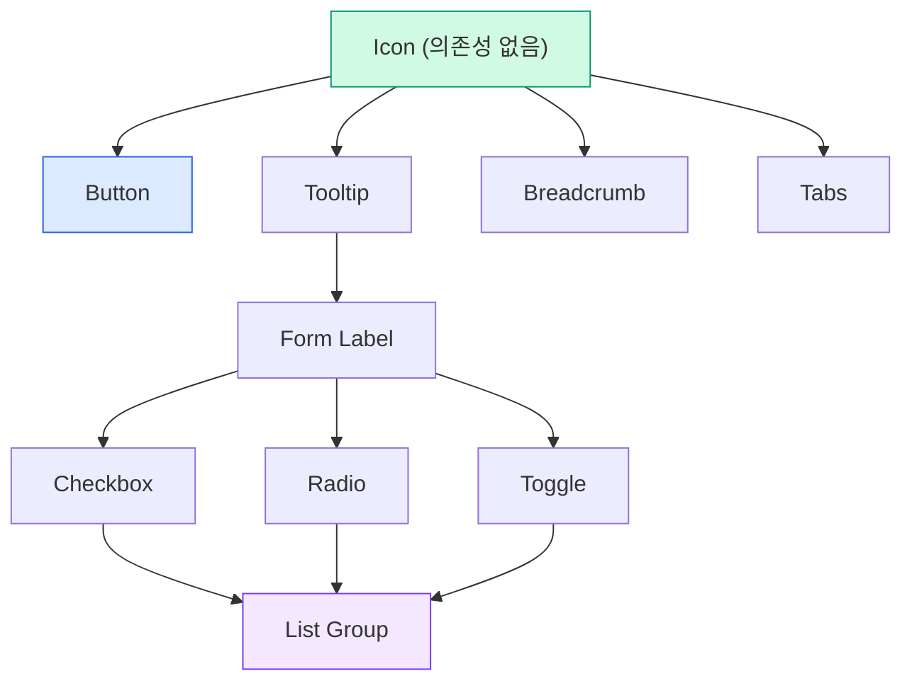
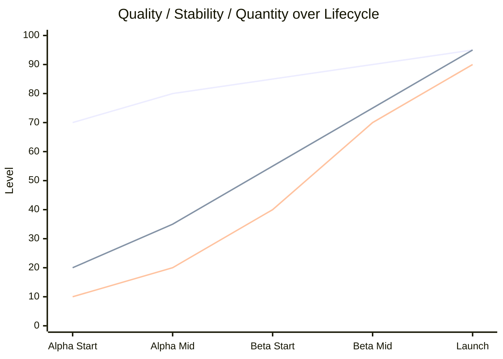

import DevQuickStart from '@site/src/components/DevQuickStart';

<DevQuickStart
  what="Design system generations follow a lifecycle from Strategy through Alpha/Beta to Launch, each with distinct quality expectations"
  learn="How to plan component delivery order using dependency trees and track progress with a completeness matrix"
  able="Create a phased rollout plan with clear milestones, quality gates, and stakeholder communication"
/>

## 디자인 시스템 세대 계획 수립

### 핵심 개념

- **세대(Generation)**: 전체 라이브러리를 재구축하는 대규모 변화 (수개월~1년 이상)
- **생애주기 단계**: Strategy -> Implementation(Alpha -> Beta) -> Launch -> Deprecation -> End of Life
- **4가지 핵심 마일스톤**: Commit -> Launch -> Deprecation -> End of Life
- **작은 것부터 큰 것 순서로**: 의존성 트리 기반 순서 결정 (Icon -> Button -> Form -> Complex)

## 생애주기별 전략

### Strategy 단계 (전략 합의)
- Discovery: 요구사항 수집, 이해관계자 인터뷰
- Exploration: 비주얼 언어 방향 실험, 기술 POC
- Planning: 누가, 무엇을, 어떻게, 언제
- Alignment: 이해관계자 합의 도출 (Commit)

### Implementation 단계 (Alpha/Beta)

**Alpha vs Beta**:
| 구분 | Alpha | Beta |
|------|-------|------|
| 목적 | 작동 방식 증명 | 프로덕션 사용 가능 |
| 품질 | 검증되지 않은 품질 허용 | 프로덕션 수준 필수 |
| 안정성 | API 변경 가능 | 점차 안정화 |
| 사용자 | 내부 팀/초기 파트너 | 얼리 어답터 |

### Launch 단계 (정식 출시)
- 공식 발표, 라이브 데모, 축하 행사
- 교육 심화 과정 (마이그레이션 중심)
- **보증 기간(Warranty Period)**: 출시 후 집중 지원 (4-8주)

## 의존성 기반 순서 결정



**배치 할당 전략**:
- 의존성 커넥터가 팀원 간 최소화 (블로킹 위험 감소)
- 작업량 균등 배분
- 각 디자이너의 전문성/관심사 고려

## 품질-안정성-수량 곡선



**핵심 원칙**:
- **Quality**: 시작부터 높고 계속 높게 (접근성/성능 타협 불가)
- **Stability**: Alpha 불안정 -> Beta 안정화 -> Launch 완전 안정
- **Quantity**: S-커브 (느린 시작 -> 급가속 -> Launch 직전 감속)

## 완성도 매트릭스

| Release | Plan | Design | Spec | Code | Figma | Doc |
|---------|------|--------|------|------|-------|-----|
| Alpha 1 | Done | Done   | Done | Done | Done  | Done |
| Beta 1  | Done | Review | In progress | Not yet | Not yet | Not yet |
| Beta 2  | Ready | Not yet | Not yet | Not yet | Not yet | Not yet |

**활용법**:
- 한눈에 전체 진행 상황 파악
- 병목 지점 식별 (특정 열이 전부 "In progress")
- 릴리스 준비도 평가

## npm 릴리스 채널 관리

Alpha → Beta → RC → Stable 단계별로 릴리스 채널을 분리하여 팀별 도입 속도를 제어합니다.

```bash title="Release Channel 전략"
# Alpha 릴리스 (얼리 어답터용)
npm version 3.0.0-alpha.1
npm publish --tag alpha

# Beta 릴리스 (테스트 팀용)
npm version 3.0.0-beta.1
npm publish --tag beta

# Release Candidate (프로덕션 준비 팀용)
npm version 3.0.0-rc.1
npm publish --tag next

# Stable 릴리스 (전체 사용자)
npm version 3.0.0
npm publish --tag latest
```

**팀별 설치 명령어**:
```bash
# 얼리 어답터 팀
npm install @company/core-ui@alpha

# 테스트 팀
npm install @company/core-ui@beta

# 프로덕션 준비 팀
npm install @company/core-ui@next

# 안정화된 버전만 사용
npm install @company/core-ui@latest
```

## 의존성 트리 시각화

어떤 프로젝트가 어떤 버전을 사용 중인지 자동으로 추적합니다.

```typescript title="scripts/dependency-tree.ts"
import { execSync } from 'child_process';

interface DependencyNode {
  name: string;
  version: string;
  dependents: string[];
}

function getDependencyTree(packageName: string): DependencyNode[] {
  try {
    const output = execSync(
      `npm ls ${packageName} --all --json 2>/dev/null`,
      { encoding: 'utf-8' }
    );
    const tree = JSON.parse(output);
    return extractDependents(tree, packageName);
  } catch (error) {
    console.error(`Failed to get dependency tree for ${packageName}`);
    return [];
  }
}

function extractDependents(tree: any, targetPackage: string): DependencyNode[] {
  const results: DependencyNode[] = [];

  function traverse(node: any, parentPath: string[] = []) {
    if (!node.dependencies) return;

    for (const [name, info] of Object.entries(node.dependencies)) {
      if (name === targetPackage) {
        results.push({
          name: parentPath[0] || 'root',
          version: (info as any).version,
          dependents: parentPath,
        });
      }
      traverse(info, [...parentPath, name]);
    }
  }

  traverse(tree);
  return results;
}

// 사용 예시
const dependents = getDependencyTree('@company/tokens-v2');
console.log(`\n📊 Projects using @company/tokens-v2:\n`);
dependents.forEach(dep => {
  console.log(`  ${dep.name} → v${dep.version}`);
});
```

## Changeset을 활용한 세대 전환 관리

Monorepo에서 여러 패키지를 동시에 업데이트할 때 Changeset의 `fixed` 그룹을 활용합니다.

```json title=".changeset/config.json"
{
  "$schema": "https://unpkg.com/@changesets/config@2.3.0/schema.json",
  "changelog": "@changesets/cli/changelog",
  "commit": false,
  "fixed": [
    ["@company/tokens", "@company/core-ui", "@company/icons"]
  ],
  "linked": [],
  "access": "public",
  "baseBranch": "main",
  "updateInternalDependencies": "patch",
  "ignore": []
}
```

**`fixed` 그룹의 효과**:
- `@company/tokens`를 3.0.0으로 업그레이드하면
- `@company/core-ui`와 `@company/icons`도 자동으로 3.0.0으로 동기화됨
- 세대 전환 시 모든 패키지가 동일한 메이저 버전을 유지

```bash title="Changeset 워크플로우"
# 1. 변경 사항 기록
npx changeset add

# 2. 버전 업데이트 (fixed 그룹 자동 동기화)
npx changeset version

# 3. 릴리스
npx changeset publish --tag beta
```

## 릴리스 스크립트 예시

릴리스 단계별 자동화를 위한 설정:

```json title="package.json - 릴리스 관리 스크립트"
{
  "scripts": {
    "release:alpha": "npm version prerelease --preid=alpha && npm publish --tag alpha",
    "release:beta": "npm version prerelease --preid=beta && npm publish --tag beta",
    "release:stable": "npm version minor && npm publish",
    "deprecate:old": "npm deprecate @design-system/core@\"<2.0.0\" \"Please upgrade to v2\"",
    "migration:check": "npx @design-system/cli check --from v1 --to v2",
    "deps:tree": "ts-node scripts/dependency-tree.ts"
  }
}
```

```typescript title="scripts/release-gate.ts"
// 릴리스 단계별 품질 게이트 검증
interface QualityGate {
  stage: 'alpha' | 'beta' | 'stable';
  requirements: {
    unitTestCoverage: number;
    a11yAuditPass: boolean;
    performanceBudget: boolean;
    documentationComplete: boolean;
  };
}

const GATES: Record<string, QualityGate['requirements']> = {
  alpha: {
    unitTestCoverage: 60,
    a11yAuditPass: false,
    performanceBudget: false,
    documentationComplete: false,
  },
  beta: {
    unitTestCoverage: 80,
    a11yAuditPass: true,
    performanceBudget: true,
    documentationComplete: false,
  },
  stable: {
    unitTestCoverage: 90,
    a11yAuditPass: true,
    performanceBudget: true,
    documentationComplete: true,
  },
};

function canRelease(stage: string, metrics: QualityGate['requirements']): boolean {
  const gate = GATES[stage];
  return (
    metrics.unitTestCoverage >= gate.unitTestCoverage &&
    (!gate.a11yAuditPass || metrics.a11yAuditPass) &&
    (!gate.performanceBudget || metrics.performanceBudget) &&
    (!gate.documentationComplete || metrics.documentationComplete)
  );
}

// 사용 예시
const currentMetrics = {
  unitTestCoverage: 85,
  a11yAuditPass: true,
  performanceBudget: true,
  documentationComplete: false,
};

if (canRelease('beta', currentMetrics)) {
  console.log('✅ Ready for Beta release');
} else {
  console.log('❌ Quality gate not met for Beta');
}
```

## 피해야 할 함정

1. **알파벳 순서로 작업**: 의존성 트리 무시하면 재작업 폭증
2. **완벽주의로 진행 지연**: Alpha는 증명 목적, 완벽 불필요
3. **의존성 무시 병렬 작업**: Checkbox API 변경 -> List group 전부 재작업
4. **커뮤니케이션 부족**: "갑자기 Beta 출시" -> 사용자 준비 안 됨
5. **출시 후 방치**: 지원 없이 방치하면 신뢰 하락

## 성공 체크리스트

**전략 단계**:
- [ ] 요구사항 수집 완료
- [ ] 이해관계자 합의 획득 (Commit)

**구현 단계**:
- [ ] Alpha: 소수 핵심 컴포넌트 완성
- [ ] Beta: 프로덕션 수준 품질 + 충분한 수량
- [ ] Launch: 100% 완성 + 완전 안정 + 전체 문서화

**출시 단계**:
- [ ] 출시 공지 발송 (이메일, Slack)
- [ ] 교육 세션 운영
- [ ] 보증 기간(4-8주) 지원 체계 강화

## 참고 자료

### 핵심 문헌
- [Nathan Curtis - Planning a Generation](https://medium.com/eightshapes-llc/planning-a-design-system-generation-5c08d8b4729a) — Alpha/Beta/Launch 단계별 품질-안정성-수량 곡선 전략
- [Changeset Documentation](https://github.com/changesets/changesets) — Monorepo 세대 전환을 위한 fixed 그룹 활용법

### 실제 사례
- [Salesforce Lightning Design System](https://www.lightningdesignsystem.com/) — 의존성 트리 기반 컴포넌트 배치 전략 사례
- [IBM Carbon Design System Versioning](https://carbondesignsystem.com/migrating/) — 릴리스 채널(alpha/beta/stable) 분리 운영

> **실제 사례**: npm 릴리스 채널을 활용하면 얼리 어답터 팀은 `@alpha`로, 안정화를 원하는 팀은 `@latest`로 설치하여 팀별 도입 속도를 제어할 수 있습니다.

---
> 출처: Nathan Curtis (EightShapes) - Planning a Design System Generation

---

## Related Articles

import CrossRef from '@site/src/components/CrossRef';

<CrossRef
  related={[
    { path: "/docs/category/07-governance-operations", label: "Governance & Operations" },
    { path: "/docs/category/03-component-design", label: "Component Design" },
    { path: "/docs/category/09-versioning-releases", label: "Versioning & Releases" },
  ]}
/>
