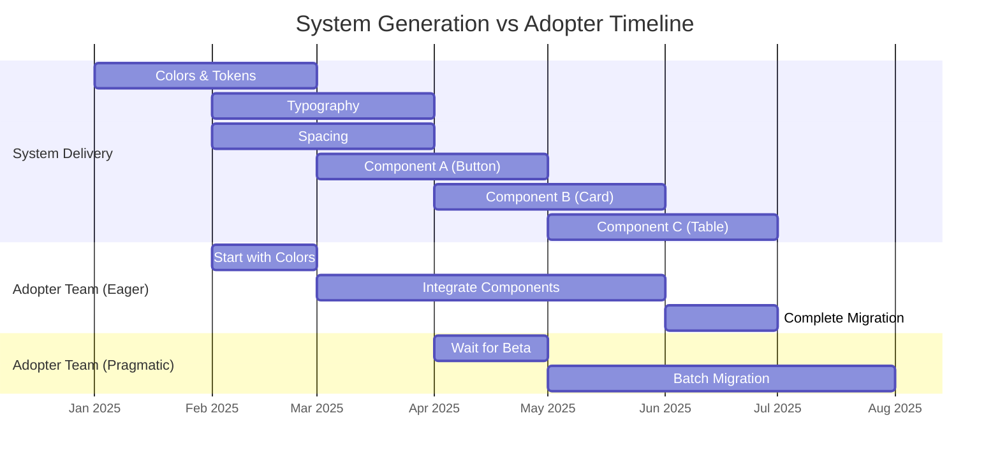

import DevQuickStart from '@site/src/components/DevQuickStart';

<DevQuickStart
  what="Design system generation adoption requires incremental delivery so adopting teams can start before the system is fully complete"
  learn="How to decompose a generation into independently deliverable subsystems and manage four distinct adopter types"
  able="Create an adoption timeline with subsystem milestones, codemod-based migration tooling, and adapters for gradual transition"
/>

## 세대 채택의 핵심 개념

- **Generation = 대규모 변화**: 모든 색상, 타이포그래피, 간격, 컴포넌트 디자인 변경하는 혁명적 업데이트
- **시스템은 의존성(Dependency)**: 단일 의존성이 아닌 여러 하위 시스템과 컴포넌트 부품들의 집합
- **채택자 유형 4가지**:
  - Eager: "언제 시작할 수 있나요?"
  - Pragmatic: "언제까지 끝내야 하나요?"
  - Reluctant: "꼭 해야 하나요? 안 하면 어떻게 되나요?"
  - Individualist: "시스템 안 쓰고 우리가 직접 하면 안 되나요?"
- **점진적 전달(Incremental Delivery)**: 시스템이 완료되기 전에 채택 팀이 시작할 수 있도록 분해

## 점진적 전달 전략

- **DON'T: 단일 의존성으로 포지셔닝**: "시스템 완료될 때까지 기다려야 함"이라는 인식 방지
- **DO: 점진적 전달 강조**:
  - 채택 팀이 시스템 완료 전에 시작하도록 권장
  - 채택 팀이 우선순위 영향을 주도록 허용
  - 채택 팀이 시스템보다 먼저 완료할 수 있음 (모든 기능이 필요하지 않은 경우)
- **명확한 타임라인 소통**: 3개월? 6개월? 12개월? - "나중에 알려드리겠습니다"는 불가
- **의존성 분해**: 색상, 타이포그래피, 간격, 개별 컴포넌트별로 전달 일정 제시
- **기대치 조율**: 각 채택자 유형에 맞는 설명과 지원 전략 수립

## 점진적 전달 타임라인



## 채택자 유형별 대응 전략

| 유형 | 특성 | 대응 전략 | 제공 자료 |
|------|------|-----------|-----------|
| **Eager** | 즉시 시작 원함 | Alpha 접근 권한, Early Adopter 프로그램 | API Preview, Migration Guide |
| **Pragmatic** | 안정성 확인 후 시작 | Beta 릴리스 알림, 완성도 매트릭스 | Changelog, Breaking Changes 목록 |
| **Reluctant** | 불가피할 때만 이동 | Deprecation 일정 명시, 지원 기간 공지 | Codemod 도구, 1:1 지원 |
| **Individualist** | 자체 솔루션 선호 | 가치 제안 강화, 유지보수 비용 비교 | TCO 분석, 일관성 보고서 |

## Challenge: "How long?" 해결책

**문제**: "How long?" → "We'll let you know" (불충분한 답변)

**해결**:
1. 명확한 전체 일정 수립 (3/6/12개월)
2. 하위 시스템별 전달 일정 공개
3. 점진적 통합 옵션 제공
4. 채택 팀 우선순위 반영 메커니즘

## 마이그레이션 도구: Codemod

세대 전환 시 자동화된 코드 변환 도구가 핵심입니다.

```typescript title="codemods/v2-to-v3.ts"
// jscodeshift를 사용한 v2 → v3 완전 자동 변환
import type { API, FileInfo, Options } from 'jscodeshift';

export default function transformer(file: FileInfo, api: API, options: Options) {
  const j = api.jscodeshift;
  const root = j(file.source);

  let hasChanges = false;

  // 1. Import 경로 변경: @company/tokens-v2 → @company/tokens
  root.find(j.ImportDeclaration, {
    source: { value: '@company/tokens-v2' }
  }).forEach(path => {
    path.node.source.value = '@company/tokens';
    hasChanges = true;
  });

  // 2. Component import 경로 변경
  root.find(j.ImportDeclaration, {
    source: { value: '@company/components-v2' }
  }).forEach(path => {
    path.node.source.value = '@company/core-ui';
    hasChanges = true;
  });

  // 3. SCSS 변수 → CSS custom properties
  // $color-primary → var(--color-primary)
  root.find(j.StringLiteral).forEach(path => {
    if (typeof path.node.value === 'string' && path.node.value.startsWith('$')) {
      const varName = path.node.value.slice(1); // $ 제거
      path.node.value = `var(--${varName})`;
      hasChanges = true;
    }
  });

  // 4. Token 이름 매핑 (v2 → v3)
  const TOKEN_MAP: Record<string, string> = {
    'colorPrimary': 'colorBrandPrimary',
    'colorDanger': 'colorAlertError',
    'spacingSm': 'spaceCompact',
    'spacingMd': 'spaceDefault',
    'spacingLg': 'spaceRelaxed',
    'radiusDefault': 'radiusMd',
    'shadowDefault': 'shadowMd',
  };

  Object.entries(TOKEN_MAP).forEach(([oldName, newName]) => {
    root.find(j.Identifier, { name: oldName }).forEach(path => {
      path.node.name = newName;
      hasChanges = true;
    });
  });

  // 5. Component prop 변경 (Breaking API changes)
  // Button: type → variant
  root.find(j.JSXElement, {
    openingElement: { name: { name: 'Button' } }
  }).forEach(path => {
    const attrs = path.node.openingElement.attributes;
    attrs?.forEach((attr: any) => {
      if (attr.type === 'JSXAttribute' && attr.name.name === 'type') {
        attr.name.name = 'variant';
        hasChanges = true;
      }
    });
  });

  return hasChanges ? root.toSource() : null;
}
```

**실행 방법**:
```bash
# Dry-run (미리보기)
npx jscodeshift -t codemods/v2-to-v3.ts src/ --dry --print

# 실제 적용
npx jscodeshift -t codemods/v2-to-v3.ts src/

# 특정 파일만
npx jscodeshift -t codemods/v2-to-v3.ts src/components/Button.tsx
```

## Adapter 패턴: 점진적 전환

한 번에 모든 컴포넌트를 교체하기 어려울 때, Adapter 패턴을 사용합니다.

```tsx title="adapters/GenerationBridge.tsx"
import React from 'react';

interface BridgeProps<T> {
  v2Component: React.ComponentType<T>;
  v3Component: React.ComponentType<T>;
  useV3?: boolean;
  props: T;
}

/**
 * 세대 간 호환성 레이어.
 * Feature flag나 Context로 v2/v3를 동적 전환합니다.
 */
export function GenerationBridge<T extends Record<string, any>>({
  v2Component: V2,
  v3Component: V3,
  useV3 = false,
  props,
}: BridgeProps<T>) {
  const Component = useV3 ? V3 : V2;
  return <Component {...props} />;
}

// 사용 예시
import { Button as ButtonV2 } from '@company/components-v2';
import { Button as ButtonV3 } from '@company/core-ui';

export function MyButton(props: any) {
  return (
    <GenerationBridge
      v2Component={ButtonV2}
      v3Component={ButtonV3}
      useV3={process.env.NEXT_PUBLIC_USE_V3 === 'true'}
      props={props}
    />
  );
}
```

```tsx title="adapters/ButtonAdapter.tsx"
import { Button as ButtonV1 } from '@design-system/components-v1';
import { Button as ButtonV2 } from '@design-system/components-v2';
import { useGenerationContext } from './GenerationContext';

interface AdaptedButtonProps {
  label: string;
  variant?: 'primary' | 'secondary' | 'danger';
  onClick?: () => void;
  disabled?: boolean;
}

/**
 * v1/v2를 자동 전환하는 Adapter.
 * GenerationContext로 전환 시점을 제어합니다.
 */
export function Button({ label, variant = 'primary', onClick, disabled }: AdaptedButtonProps) {
  const { activeGeneration } = useGenerationContext();

  if (activeGeneration === 'v2') {
    return (
      <ButtonV2
        variant={variant}
        onPress={onClick}
        isDisabled={disabled}
      >
        {label}
      </ButtonV2>
    );
  }

  return (
    <ButtonV1
      type={variant}
      onClick={onClick}
      disabled={disabled}
    >
      {label}
    </ButtonV1>
  );
}
```

```tsx title="adapters/GenerationContext.tsx"
import { createContext, useContext, ReactNode } from 'react';

type Generation = 'v1' | 'v2';

const GenerationContext = createContext<{ activeGeneration: Generation }>({
  activeGeneration: 'v1',
});

export function GenerationProvider({
  generation,
  children,
}: {
  generation: Generation;
  children: ReactNode;
}) {
  return (
    <GenerationContext.Provider value={{ activeGeneration: generation }}>
      {children}
    </GenerationContext.Provider>
  );
}

export const useGenerationContext = () => useContext(GenerationContext);
```

## 마이그레이션 진행률 추적

자동으로 v2/v3 사용 현황을 스캔하여 리포트를 생성합니다.

```typescript title="scripts/migration-progress.ts"
import { execSync } from 'child_process';
import { writeFileSync } from 'fs';

interface MigrationStatus {
  component: string;
  v2Usage: number;
  v3Usage: number;
  percentMigrated: number;
}

function scanImports(packageName: string, version: 'v2' | 'v3'): number {
  const pattern = version === 'v2'
    ? '@company/components-v2'
    : '@company/core-ui';

  try {
    const output = execSync(
      `grep -r "from '${pattern}" src/ | wc -l`,
      { encoding: 'utf-8' }
    );
    return parseInt(output.trim(), 10);
  } catch {
    return 0;
  }
}

function generateMigrationReport(): MigrationStatus[] {
  const components = ['Button', 'Card', 'Input', 'Select', 'Modal'];

  return components.map(component => {
    const v2Usage = scanImports(component, 'v2');
    const v3Usage = scanImports(component, 'v3');
    const total = v2Usage + v3Usage;
    const percentMigrated = total > 0 ? Math.round((v3Usage / total) * 100) : 0;

    return { component, v2Usage, v3Usage, percentMigrated };
  });
}

function formatReport(statuses: MigrationStatus[]): string {
  const total = statuses.length;
  const complete = statuses.filter(s => s.percentMigrated === 100).length;
  const overall = Math.round((complete / total) * 100);

  let report = `# Migration Progress Report\n\n`;
  report += `**Overall**: ${complete}/${total} components (${overall}%)\n\n`;
  report += `| Component | v2 Imports | v3 Imports | Status | Progress |\n`;
  report += `|-----------|-----------|-----------|--------|----------|\n`;

  for (const s of statuses) {
    const status = s.percentMigrated === 100 ? '✅ Done' :
                   s.percentMigrated > 0 ? '🔄 In Progress' : '⏳ Not Started';
    const bar = '█'.repeat(s.percentMigrated / 10) + '░'.repeat(10 - s.percentMigrated / 10);
    report += `| ${s.component} | ${s.v2Usage} | ${s.v3Usage} | ${status} | ${bar} ${s.percentMigrated}% |\n`;
  }

  return report;
}

// 실행
const statuses = generateMigrationReport();
const report = formatReport(statuses);
console.log(report);
writeFileSync('migration-status.md', report);
```

**실행 방법**:
```bash
npx ts-node scripts/migration-progress.ts
cat migration-status.md
```

## 마이그레이션 CLI

```json title="package.json"
{
  "scripts": {
    "migrate:check": "npx @design-system/cli check --from v2 --to v3",
    "migrate:run": "npx @design-system/cli migrate --from v2 --to v3 --dry-run",
    "migrate:apply": "npx @design-system/cli migrate --from v2 --to v3",
    "migrate:report": "ts-node scripts/migration-progress.ts",
    "migrate:codemod": "jscodeshift -t codemods/v2-to-v3.ts src/"
  }
}
```

## 성공 체크리스트

**계획 단계**:
- [ ] 하위 시스템별 전달 일정 수립
- [ ] 채택자 유형별 커뮤니케이션 전략 수립
- [ ] Codemod 도구 준비

**실행 단계**:
- [ ] Early Adopter 프로그램 운영
- [ ] 점진적 전달 시작 (Colors → Typography → Components)
- [ ] Adapter 패턴으로 병행 운영

**완료 단계**:
- [ ] 마이그레이션 진행률 대시보드 운영
- [ ] v1 Deprecation 공지 및 일정 확정
- [ ] 지원 기간(Warranty Period) 명시

---
> 출처: Nathan Curtis (EightShapes) - Adopting Design System Generations

---

## Related Articles

import CrossRef from '@site/src/components/CrossRef';

<CrossRef
  related={[
    { path: "/docs/category/08-scaling-architecture", label: "Scaling & Architecture" },
    { path: "/docs/category/07-governance-operations", label: "Governance & Operations" },
    { path: "/docs/category/09-versioning-releases", label: "Versioning & Releases" },
  ]}
/>
