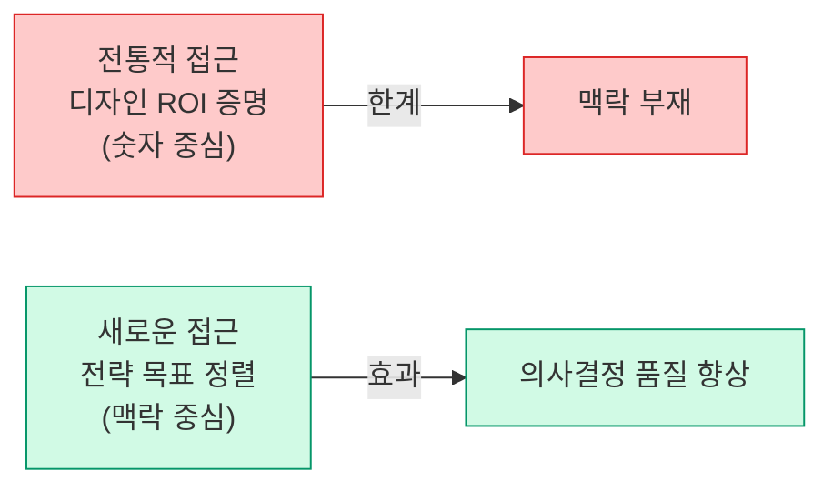
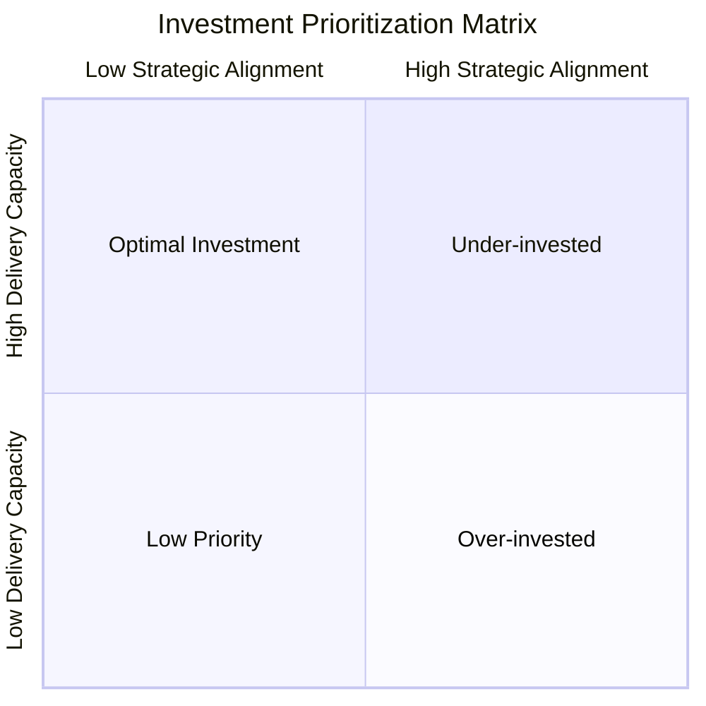
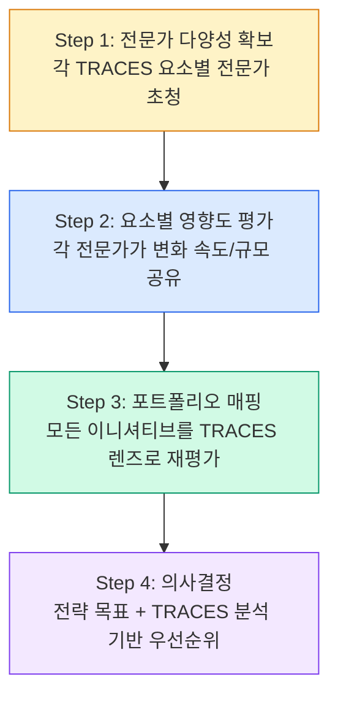
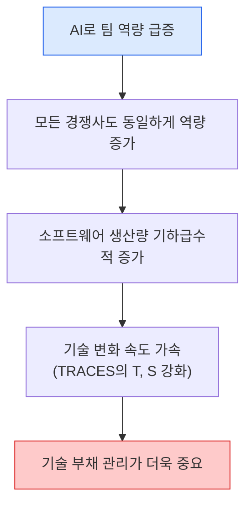

> Original issue: shaun0927/stocktitan-crawler#534

import DevQuickStart from '@site/src/components/DevQuickStart';

<DevQuickStart
  what="Design decisions are physical manifestations of strategy; TRACES framework replaces PESTEL for dynamic tech environments"
  learn="How to run a TRACES workshop that converts 50 ideas into 3 actionable initiatives with clear ownership"
  able="Apply an Investment Prioritization Matrix and integrate technical debt assessment into design strategy discussions"
/>

## 디자인-전략-기술 통합의 3가지 원칙

### 원칙 1: 기술은 이제 선택이 아닌 전제조건

**TRACES 프레임워크에서 Technical Debt를 첫 번째 요소로 배치한 이유**

| 과거 (PESTEL 시대) | 현재 (TRACES 시대) |
|---|---|
| 산업 환경 안정적 | 산업 환경 극도로 동적 |
| 제품 수명 주기 20년+ | 제품 수명 주기 1년 이하 |
| 기술은 여러 요소 중 하나 | 기술이 모든 산업의 핵심 |
| 단일 제품 라인 중심 | 지속적인 모델 업데이트 필수 |

**실전 적용**:
- 모든 전략 회의에서 기술 부채를 첫 번째 체크리스트로
- "우리 시스템이 이 변화를 감당할 수 있는가?"를 먼저 질문
- 기술 전문가를 전략 논의 초기부터 참여시킴

### 원칙 2: 정렬(Alignment)은 숫자 이상의 것



**TRACES 프레임워크 구성**:
- **T**: Technical Debt (기술 부채)
- **R**: Regulatory Changes (규제 변화)
- **A**: Audience Shift (고객 변화)
- **C**: Competition (경쟁 환경)
- **E**: Economic Trends (경제 트렌드)
- **S**: Substitute Technologies (대체 기술)

**기존 PESTEL과의 차이**:
- PESTEL: 정적 스냅샷 (현재 상태만 캡처)
- TRACES: 동적 렌즈 (변화의 속도와 방향 포착)

### 원칙 3: 협업은 도구가 아닌 사고방식

| Figma 이전 | Figma 이후 |
|---|---|
| 워터폴 방식 | 실시간 협업 |
| 디자이너 → 개발자 순차 전달 | 디자이너 + 비디자이너 동시 작업 |
| 완성 후 피드백 | 과정 중 지속적 피드백 |
| 천재 디자이너 신화 | 집단 지성 의사결정 |

**핵심 인사이트**: Figma 사용자의 56%가 비디자이너 (PM, 마케터, 데이터 과학자, 개발자)

---

## 실전 도구: Investment Prioritization Matrix

### 2차원 평가



**의사결정 룰**:
- 과잉투자 영역 발견 시 → 리소스를 최적 투자 영역으로 재배치
- 과소투자 영역 → 전략 목표 재검토 필요
- 저우선순위 → 중단 또는 축소 고려

### TypeScript로 구현하는 우선순위 매트릭스

```typescript title="tools/prioritization-matrix.ts"
interface Initiative {
  name: string;
  strategicAlignment: number; // 0-100
  deliveryCapacity: number;   // 0-100
  traces: TRACESScore;
}

interface TRACESScore {
  technicalDebt: number;      // 0-10
  regulatoryRisk: number;     // 0-10
  audienceShift: number;      // 0-10
  competition: number;        // 0-10
  economicTrend: number;      // 0-10
  substituteTech: number;     // 0-10
}

type Quadrant = 'optimal' | 'under-invested' | 'over-invested' | 'low-priority';

function classifyInitiative(init: Initiative): Quadrant {
  const highAlignment = init.strategicAlignment >= 60;
  const highCapacity = init.deliveryCapacity >= 60;

  if (highAlignment && highCapacity) return 'optimal';
  if (highAlignment && !highCapacity) return 'over-invested';
  if (!highAlignment && highCapacity) return 'under-invested';
  return 'low-priority';
}

function calculateTRACESUrgency(scores: TRACESScore): number {
  const weights = {
    technicalDebt: 0.25,
    regulatoryRisk: 0.20,
    audienceShift: 0.15,
    competition: 0.15,
    economicTrend: 0.10,
    substituteTech: 0.15,
  };

  return Object.entries(weights).reduce(
    (total, [key, weight]) => total + scores[key as keyof TRACESScore] * weight,
    0
  );
}

function prioritize(initiatives: Initiative[]): Initiative[] {
  return initiatives
    .map(init => ({
      ...init,
      score: init.strategicAlignment * 0.4 +
             init.deliveryCapacity * 0.3 +
             calculateTRACESUrgency(init.traces) * 10 * 0.3,
    }))
    .sort((a, b) => b.score - a.score);
}
```

## TRACES Workshop 설계

**목표**: 50개 아이디어 → 실행 가능한 3개 전략 이니셔티브



**핵심 차별점**:
- 브레인스토밍이 아닌 **지식 전달(Knowledge Transfer)** 중심
- 혁신 쇼(Innovation Theater)가 아닌 **의사결정 품질 향상** 중심
- 40번의 1:1 미팅 대신 4시간 워크샵으로 압축

### 워크샵 결과를 코드로 추적

```typescript title="tools/traces-tracker.ts"
interface TRACESAssessment {
  date: string;
  assessor: string;
  element: 'T' | 'R' | 'A' | 'C' | 'E' | 'S';
  description: string;
  velocity: 'slow' | 'moderate' | 'fast' | 'critical';
  impact: number; // 1-10
  initiatives: string[];
}

interface WorkshopOutput {
  date: string;
  participants: string[];
  assessments: TRACESAssessment[];
  selectedInitiatives: {
    name: string;
    owner: string;
    deadline: string;
    tracesJustification: string;
    quadrant: Quadrant;
  }[];
}

function generateWorkshopReport(output: WorkshopOutput): string {
  const { selectedInitiatives, assessments } = output;

  let report = `# TRACES Workshop Report - ${output.date}\n\n`;
  report += `## Participants (${output.participants.length})\n`;
  report += output.participants.map(p => `- ${p}`).join('\n');
  report += `\n\n## Critical TRACES Factors\n`;

  const critical = assessments
    .filter(a => a.velocity === 'critical' || a.impact >= 8)
    .sort((a, b) => b.impact - a.impact);

  for (const a of critical) {
    report += `- **[${a.element}]** ${a.description} (Impact: ${a.impact}/10, Velocity: ${a.velocity})\n`;
  }

  report += `\n## Selected Initiatives (Top ${selectedInitiatives.length})\n`;
  for (const init of selectedInitiatives) {
    report += `\n### ${init.name}\n`;
    report += `- **Owner**: ${init.owner}\n`;
    report += `- **Deadline**: ${init.deadline}\n`;
    report += `- **Quadrant**: ${init.quadrant}\n`;
    report += `- **Justification**: ${init.tracesJustification}\n`;
  }

  return report;
}
```

---

## 조직 구조와 심리적 안전성

### 심리적 안전성 구축 전략

**리더십 관점**:
- DO: 1-2명의 강력한 동맹 확보부터 시작
- DO: Pull 방식 (호기심 있는 사람 중심)
- DON'T: Push 방식 (회의적인 사람 설득 시도)

**개인 기여자 관점**:
- DO: 비판도 참여의 신호로 해석
  - "이거 안 될 것 같은데?" → 대화의 시작점
- DO: 구체적 문제 중심 대화
  - "디자인 가치가 제대로 인정받지 못하고 있다"
  - "우리가 만드는 것이 영향력을 발휘하지 못한다"

---

## AI 시대의 디자인 전략

### Generative AI의 영향



**Figma Make & AI 프로토타이핑 핵심 인사이트**:
- 잘못된 질문: "누가 이 도구를 써야 하는가?"
- 올바른 질문: "좋은 아이디어를 어떻게 더 잘 전달할 수 있는가?"
- 시각화 능력 민주화 = 아이디어 손실 방지

---

## 체크리스트: 디자인-전략-기술 통합 자가진단

### Level 1: 기본 정렬 (모든 팀 필수)
- [ ] 모든 디자인 프로젝트가 명확한 전략 목표와 연결되어 있는가?
- [ ] 기술팀이 디자인 의사결정 초기부터 참여하는가?
- [ ] 비디자이너(PM, 개발자, 마케터)가 디자인 도구에 접근 가능한가?

### Level 2: 동적 환경 대응
- [ ] TRACES 6가지 요소를 정기적으로 모니터링하는가?
- [ ] 기술 부채가 새로운 이니셔티브를 막고 있지 않은가?
- [ ] 경쟁사/대체 기술 변화를 분기별로 리뷰하는가?

### Level 3: 의사결정 품질
- [ ] 워크샵이 브레인스토밍이 아닌 의사결정으로 끝나는가?
- [ ] 투자 우선순위 매트릭스로 리소스 배분을 평가하는가?
- [ ] 다양한 전문성(기술/법무/비즈니스)이 디자인 논의에 참여하는가?

### Level 4: 조직 문화
- [ ] 디자이너가 비즈니스 가치를 언어화할 수 있는가?
- [ ] 비디자이너가 디자인 원칙을 이해하고 존중하는가?
- [ ] 비판적 피드백도 안전하게 공유되는가?

---
> 출처: Gar Wong (The Art of Design Strategy) x Andrew Hogan (Figma Head of Insights)

---

## Related Articles

import CrossRef from '@site/src/components/CrossRef';

<CrossRef
  related={[
    { path: "/docs/category/07-governance-operations", label: "Governance & Operations" },
    { path: "/docs/category/11-figma-tooling", label: "Figma & Tooling" },
    { path: "/docs/category/08-scaling-architecture", label: "Scaling & Architecture" },
  ]}
/>
