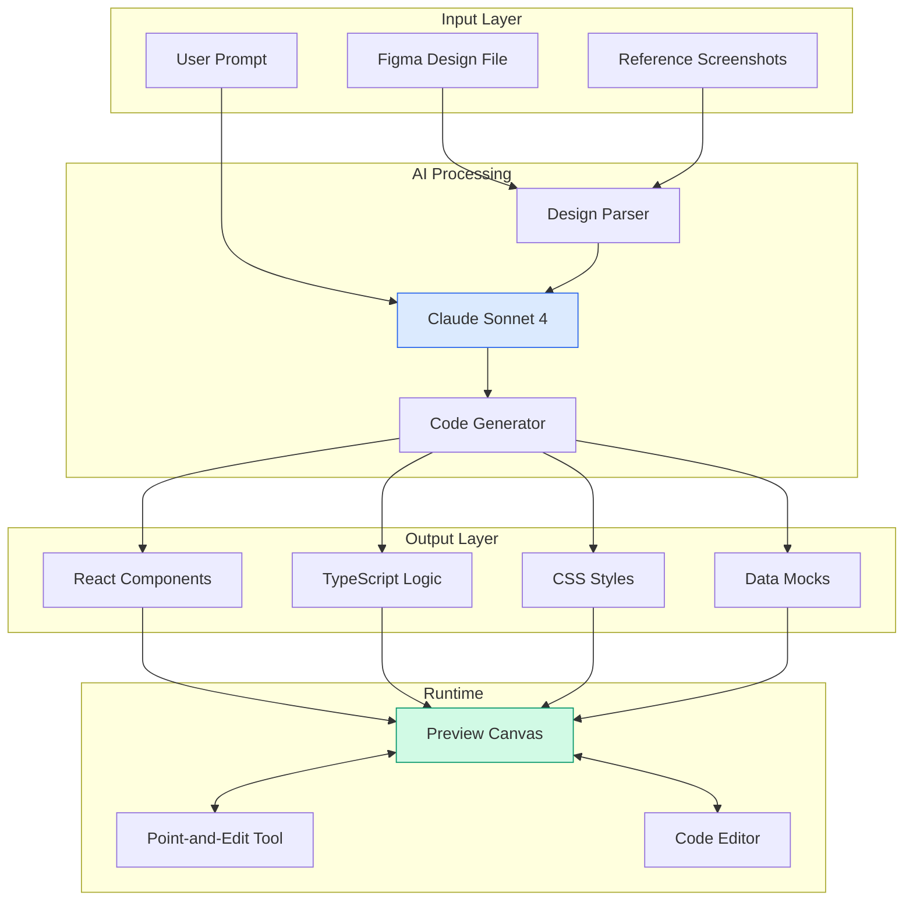
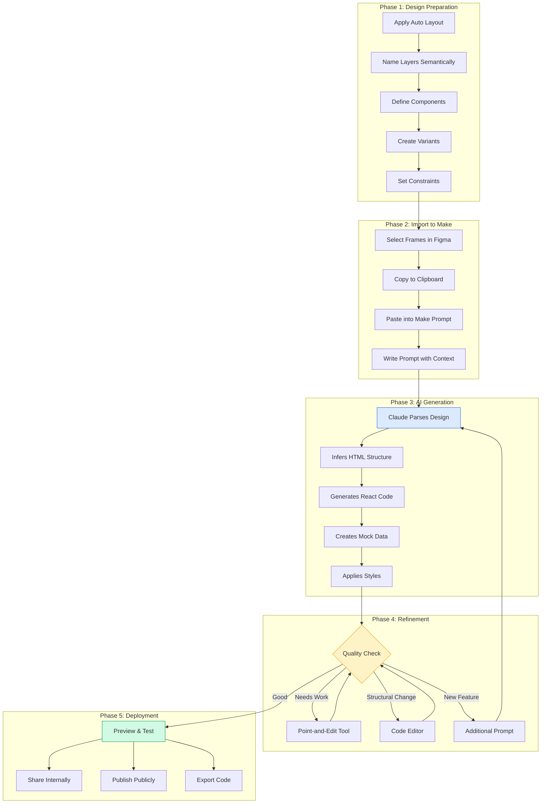

import DevQuickStart from '@site/src/components/DevQuickStart';

<DevQuickStart
  what="Figma Make converts static designs into interactive code-based prototypes using AI, bridging the design-to-code gap"
  learn="How to use Point-and-Edit, code editing, and prompt strategies to build working prototypes from Figma designs"
  able="Create interactive prototypes with real data, animations, and form validation without writing code from scratch"
/>

## Figma Make 핵심 요약

Figma Make는 디자인을 코드 기반 인터랙티브 프로토타입으로 자동 변환하는 AI 도구입니다. 기존 Figma 디자인을 복사해 프롬프트에 붙여넣기만 하면 Claude Sonnet 4 기반으로 즉시 작동하는 프로토타입을 생성합니다.

**핵심 가치**:
- **빠른 아이디어 검증**: 코딩 없이 몇 분 만에 작동하는 프로토타입 생성
- **디자인 크래프트 향상**: 정적 화면이 아닌 실제 인터랙션 중심 디자인
- **개발자 핸드오프 개선**: 실제 작동하는 프로토타입으로 명확한 의도 전달

---

## Figma Make 아키텍처



**핵심 구성요소**:
1. **Design Parser**: Figma 노드 트리를 JSON으로 변환
2. **Claude Sonnet 4**: 디자인 + 프롬프트 → React 컴포넌트 생성
3. **Preview Canvas**: 실시간 렌더링 + 인터랙션 테스트
4. **Point-and-Edit**: Visual editor (코드 모름 → 스타일 수정 가능)

## Figma Make 워크플로우

### 1. 시작하기

**디자인에서 Make 파일 생성**:
- Figma 디자인 파일 → File → New Make
- 또는 프로젝트 화면 → Create → Make

**디자인 가져오기**:
1. Figma에서 프레임 선택 (Cmd/Ctrl + C)
2. Make 프롬프트 박스에 붙여넣기 (Cmd/Ctrl + V)
3. 프롬프트 작성: "build an interactive prototype of [기능명]"
4. Enter

**제약사항**:
- 한 번에 최대 3개 프레임 첨부 가능
- 추가 프레임은 후속 프롬프트에서 계속 추가 가능

**내부 동작**:

```typescript
// figma-make-internals.ts
// Figma Make의 디자인 파싱 로직 (simplified)

interface FigmaNode {
  id: string;
  name: string;
  type: 'FRAME' | 'TEXT' | 'RECTANGLE' | 'GROUP' | 'COMPONENT';
  x: number;
  y: number;
  width: number;
  height: number;
  fills?: Paint[];
  strokes?: Paint[];
  children?: FigmaNode[];
  // ... more properties
}

interface ParsedComponent {
  structure: string;          // HTML structure
  styles: string;             // CSS styles
  interactions: Interaction[];
  data: any;                  // Mock data
}

// Step 1: Parse Figma node tree
function parseDesign(nodes: FigmaNode[]): ParsedComponent {
  const structure = generateHTML(nodes);
  const styles = extractStyles(nodes);
  const interactions = inferInteractions(nodes);

  return { structure, styles, interactions, data: {} };
}

// Step 2: Generate HTML from node hierarchy
function generateHTML(nodes: FigmaNode[], indent = 0): string {
  return nodes.map(node => {
    const tag = inferHTMLTag(node);
    const attrs = generateAttributes(node);
    const children = node.children ? generateHTML(node.children, indent + 1) : '';

    return `${'  '.repeat(indent)}<${tag} ${attrs}>${children}</${tag}>`;
  }).join('\n');
}

function inferHTMLTag(node: FigmaNode): string {
  // Heuristics for semantic HTML
  if (node.type === 'TEXT') return 'p';
  if (node.name.toLowerCase().includes('button')) return 'button';
  if (node.name.toLowerCase().includes('input')) return 'input';
  if (node.name.toLowerCase().includes('header')) return 'header';
  if (node.type === 'FRAME') return 'div';
  return 'div';
}

// Step 3: Extract CSS
function extractStyles(nodes: FigmaNode[]): string {
  return nodes.map(node => {
    const className = sanitizeClassName(node.name);
    const styles = {
      width: `${node.width}px`,
      height: `${node.height}px`,
      ...extractFillStyles(node.fills),
      ...extractStrokeStyles(node.strokes),
    };

    return `.${className} { ${Object.entries(styles).map(([k, v]) => `${k}: ${v};`).join(' ')} }`;
  }).join('\n');
}

// Step 4: Infer interactions
function inferInteractions(nodes: FigmaNode[]): Interaction[] {
  const interactions: Interaction[] = [];

  for (const node of nodes) {
    // If name includes "hover", add hover state
    if (node.name.toLowerCase().includes('hover')) {
      interactions.push({
        trigger: 'hover',
        target: node.id,
        effect: 'opacity-change',
      });
    }

    // If it's a button, add click handler
    if (inferHTMLTag(node) === 'button') {
      interactions.push({
        trigger: 'click',
        target: node.id,
        effect: 'state-change',
      });
    }
  }

  return interactions;
}
```

### 2. 편집 방법 (우선순위 순서)

**Point and Edit Tool (최우선, 가장 빠름)**:
- 프리뷰에서 요소 직접 선택
- 툴바로 즉시 수정 가능한 속성: 배경색, 코너 라디우스, Padding/Margin, 폰트, 색상, 크기, Bold/Italic/Underline, 정렬 및 간격

**코드 직접 편집 (빠름)**:
- Point and Edit로 불가능한 경우
- 요소 선택 → 툴바 우측 "Go to Source" 클릭
- 코드에서 해당 부분 직접 수정

**추가 프롬프트 (느림)**:
- 위 두 방법으로 불가능한 경우만 사용

**편집 효율성 팁**: 중복 요소는 하나만 수정하면 자동으로 모두 적용됨

### 3. 공유 및 배포

**팀 내부 공유**: Play 버튼 → 전체화면 프리뷰 URL (기존 Figma 권한 적용)
**외부 공개**: Publish 버튼 → 공개 웹사이트 (민감 정보 주의)

---

## AI 통합 및 활용

### Claude Sonnet 4 기반

**특징**:
- **비결정적**: 같은 프롬프트라도 매번 다른 결과 가능
- **맥락 이해**: 디자인 + 프롬프트 조합으로 의도 파악
- **자동 추론**: "interactive"만 입력해도 hover 효과 자동 추가

### 데이터 생성 및 활용

**실전 사례 - 200개 프로젝트 데이터 자동 생성**:
- 프롬프트: "Generate 200 projects to populate this prototype"
- 결과: projectData.js 자동 생성, 실제 바차트 작동, 필터링/정렬 가능

### 애니메이션 및 마이크로인터랙션

**로딩 스크린 예시**:
- 프롬프트 1: "Create looping animations where icons go from 0 to 100% opacity"
- 프롬프트 2: "Animate icons to sporadically rotate"
- 결과: 2개 프롬프트로 완성된 로딩 애니메이션

---

## 실전 활용 사례

### 1. 컬러 시스템 자동 추출 및 변수 생성

```typescript
// scripts/extract-colors.ts
// Figma Make에서 추출한 색상을 CSS 변수로 변환

interface ExtractedColor {
  name: string;
  hex: string;
  usage: string;
}

// Color manipulation utilities (OKLCH-based for perceptual uniformity)
function hexToOKLCH(hex: string): { l: number; c: number; h: number } {
  // Convert hex to RGB
  const r = parseInt(hex.slice(1, 3), 16) / 255;
  const g = parseInt(hex.slice(3, 5), 16) / 255;
  const b = parseInt(hex.slice(5, 7), 16) / 255;

  // RGB to XYZ (D65 white point)
  const toLinear = (c: number) => c <= 0.04045 ? c / 12.92 : Math.pow((c + 0.055) / 1.055, 2.4);
  const lr = toLinear(r);
  const lg = toLinear(g);
  const lb = toLinear(b);

  const x = 0.4124564 * lr + 0.3575761 * lg + 0.1804375 * lb;
  const y = 0.2126729 * lr + 0.7151522 * lg + 0.0721750 * lb;
  const z = 0.0193339 * lr + 0.1191920 * lg + 0.9503041 * lb;

  // XYZ to OKLCH (simplified)
  const l = Math.cbrt(y);
  const c = Math.sqrt(Math.pow(x - y, 2) + Math.pow(y - z, 2));
  const h = Math.atan2(y - z, x - y) * (180 / Math.PI);

  return { l: l * 100, c: c * 100, h: h >= 0 ? h : h + 360 };
}

function oklchToHex(l: number, c: number, h: number): string {
  // Reverse transformation (simplified)
  const lNorm = l / 100;
  const cNorm = c / 100;
  const hRad = (h * Math.PI) / 180;

  const y = Math.pow(lNorm, 3);
  const x = y + cNorm * Math.cos(hRad);
  const z = y + cNorm * Math.sin(hRad);

  // XYZ to RGB
  const lr = 3.2404542 * x - 1.5371385 * y - 0.4985314 * z;
  const lg = -0.9692660 * x + 1.8760108 * y + 0.0415560 * z;
  const lb = 0.0556434 * x - 0.2040259 * y + 1.0572252 * z;

  const toSRGB = (c: number) => c <= 0.0031308 ? c * 12.92 : 1.055 * Math.pow(c, 1 / 2.4) - 0.055;
  const r = Math.max(0, Math.min(1, toSRGB(lr)));
  const g = Math.max(0, Math.min(1, toSRGB(lg)));
  const b = Math.max(0, Math.min(1, toSRGB(lb)));

  const toHex = (c: number) => Math.round(c * 255).toString(16).padStart(2, '0');
  return `#${toHex(r)}${toHex(g)}${toHex(b)}`;
}

function lighten(hex: string, amount: number): string {
  const oklch = hexToOKLCH(hex);
  const newL = Math.min(100, oklch.l + amount * 100);
  return oklchToHex(newL, oklch.c, oklch.h);
}

function darken(hex: string, amount: number): string {
  const oklch = hexToOKLCH(hex);
  const newL = Math.max(0, oklch.l - amount * 100);
  return oklchToHex(newL, oklch.c, oklch.h);
}

// Alternative: CSS color-mix() (modern browsers)
function lightenCSS(hex: string, amount: number): string {
  return `color-mix(in oklch, ${hex} ${(1 - amount) * 100}%, white)`;
}

function darkenCSS(hex: string, amount: number): string {
  return `color-mix(in oklch, ${hex} ${(1 - amount) * 100}%, black)`;
}

function generateCSSVariables(colors: ExtractedColor[]): string {
  const lines = colors.map(c =>
    `  --color-${c.name}: ${c.hex}; /* ${c.usage} */`
  );
  return `:root {\n${lines.join('\n')}\n}`;
}

function generateTailwindScale(baseHex: string, name: string): Record<string, string> {
  // Generate 100-1000 scale from a base color (perceptually uniform)
  return {
    [`${name}-50`]: lighten(baseHex, 0.9),
    [`${name}-100`]: lighten(baseHex, 0.8),
    [`${name}-200`]: lighten(baseHex, 0.6),
    [`${name}-300`]: lighten(baseHex, 0.4),
    [`${name}-400`]: lighten(baseHex, 0.2),
    [`${name}-500`]: baseHex,
    [`${name}-600`]: darken(baseHex, 0.15),
    [`${name}-700`]: darken(baseHex, 0.3),
    [`${name}-800`]: darken(baseHex, 0.45),
    [`${name}-900`]: darken(baseHex, 0.6),
    [`${name}-950`]: darken(baseHex, 0.75),
  };
}

// Modern CSS approach (no JS needed)
function generateCSSScaleWithColorMix(baseHex: string, name: string): string {
  return `
/* ${name} scale using color-mix (no preprocessor needed) */
--color-${name}-50: ${lightenCSS(baseHex, 0.9)};
--color-${name}-100: ${lightenCSS(baseHex, 0.8)};
--color-${name}-200: ${lightenCSS(baseHex, 0.6)};
--color-${name}-300: ${lightenCSS(baseHex, 0.4)};
--color-${name}-400: ${lightenCSS(baseHex, 0.2)};
--color-${name}-500: ${baseHex};
--color-${name}-600: ${darkenCSS(baseHex, 0.15)};
--color-${name}-700: ${darkenCSS(baseHex, 0.3)};
--color-${name}-800: ${darkenCSS(baseHex, 0.45)};
--color-${name}-900: ${darkenCSS(baseHex, 0.6)};
--color-${name}-950: ${darkenCSS(baseHex, 0.75)};
  `.trim();
}
```

**워크플로우**:

```typescript
// Example: Complete color extraction workflow

// Step 1: Figma Make prompt
const extractPrompt = `
Analyze this design and extract all unique colors used.

For each color, provide:
- Descriptive name (e.g., "primary-blue", "accent-orange")
- Hex code
- Usage context (e.g., "Primary CTA buttons", "Error messages")

Format as JSON array.
`;

// Step 2: Figma Make output
const extractedColors: ExtractedColor[] = [
  { name: 'primary-blue', hex: '#2563EB', usage: 'Primary CTA buttons, links' },
  { name: 'accent-orange', hex: '#F59E0B', usage: 'Warning states, highlights' },
  { name: 'success-green', hex: '#10B981', usage: 'Success messages, confirmations' },
  { name: 'error-red', hex: '#EF4444', usage: 'Error messages, destructive actions' },
  { name: 'neutral-gray', hex: '#6B7280', usage: 'Body text, secondary content' },
  { name: 'background-white', hex: '#FFFFFF', usage: 'Page backgrounds, cards' },
];

// Step 3: Generate CSS variables
const cssVariables = generateCSSVariables(extractedColors);
console.log(cssVariables);
/*
:root {
  --color-primary-blue: #2563EB; /* Primary CTA buttons, links */
  --color-accent-orange: #F59E0B; /* Warning states, highlights */
  --color-success-green: #10B981; /* Success messages, confirmations */
  --color-error-red: #EF4444; /* Error messages, destructive actions */
  --color-neutral-gray: #6B7280; /* Body text, secondary content */
  --color-background-white: #FFFFFF; /* Page backgrounds, cards */
}
*/

// Step 4: Generate Tailwind scales
const tailwindScales = extractedColors.reduce((acc, color) => {
  const baseName = color.name.split('-')[0]; // "primary" from "primary-blue"
  acc[baseName] = generateTailwindScale(color.hex, baseName);
  return acc;
}, {} as Record<string, Record<string, string>>);

console.log(JSON.stringify(tailwindScales, null, 2));
/*
{
  "primary": {
    "primary-50": "#EFF6FF",
    "primary-100": "#DBEAFE",
    ...
    "primary-500": "#2563EB",
    ...
    "primary-950": "#0C1844"
  },
  ...
}
*/

// Step 5: Export for Figma Variables
interface FigmaVariable {
  name: string;
  type: 'COLOR';
  value: string;
  scopes: string[];
}

function exportForFigmaVariables(colors: ExtractedColor[]): FigmaVariable[] {
  return colors.map(color => ({
    name: color.name,
    type: 'COLOR',
    value: color.hex,
    scopes: ['ALL_SCOPES'],
  }));
}

const figmaVariables = exportForFigmaVariables(extractedColors);
// Import with "Variable Importer/Exporter" plugin

// Step 6: Generate modern CSS with color-mix
extractedColors.forEach(color => {
  const baseName = color.name.split('-')[0];
  console.log(generateCSSScaleWithColorMix(color.hex, baseName));
});
```

**결과**: 수작업 2시간 → 5분으로 단축

| Task | Manual | With Figma Make | Savings |
|------|--------|-----------------|---------|
| Color identification | 30min | 1min | 97% |
| Hex code extraction | 15min | 0min | 100% |
| Scale generation | 60min | 2min | 97% |
| CSS variable writing | 15min | 2min | 87% |
| **Total** | **120min** | **5min** | **96%** |

### 2. 애니메이션 스펙 문서 자동 생성

```typescript title="types/animation-spec.ts"
interface AnimationSpec {
  element: string;
  trigger: 'hover' | 'click' | 'scroll' | 'load';
  duration: number;      // ms
  easing: string;        // e.g., 'ease-in-out'
  keyframes: Keyframe[];
  delay?: number;
}

interface Keyframe {
  offset: number;        // 0-1
  properties: Record<string, string>;
}

// Example spec from Figma Make export
const buttonHoverSpec: AnimationSpec = {
  element: 'primary-button',
  trigger: 'hover',
  duration: 200,
  easing: 'ease-in-out',
  keyframes: [
    { offset: 0, properties: { transform: 'scale(1)', opacity: '1' } },
    { offset: 1, properties: { transform: 'scale(1.02)', opacity: '0.95' } },
  ],
};
```

---

## 팁 & 트릭

### 1. 디자인 파일 준비 (Design Hygiene)

| 항목 | 중요도 | 이유 | 해결 방법 |
|------|--------|------|----------|
| **Auto Layout** | 높음 | 반응형 디자인 핵심 | AI "Suggest Auto Layout" |
| **Layer 이름** | 높음 | Make와의 공통 언어 | AI "Rename Layers" |
| **컴포넌트** | 중간 | 디자인 시스템 일관성 | 라이브러리 활용 |

### 2. 프롬프트 작성 전략

**레벨 1 - 기본**: "Build an interactive prototype" → 기본 hover만
**레벨 2 - 구체적**: 상세 기능 명세 → 의도대로 구현
**레벨 3 - AI 확장**: AI Expand 버튼 활용

### 3. 반응형 디자인 설정

**3개 브레이크포인트 전달**:
- Desktop (1440px)
- Tablet (768px)
- Mobile (375px)

최대 3개 프레임 활용 → 자연스러운 반응형

### 4. 반복 작업 자동화

| 작업 | 수동 | Make | 절약 |
|------|------|------|------|
| 컬러 변수 | 2시간 | 5분 | 1시간 55분 |
| 더미 데이터 | 1시간 | 2분 | 58분 |
| 애니메이션 스펙 | 30분 | 3분 | 27분 |

---

## Mermaid 다이어그램: Figma Make 전체 흐름



## 체크리스트

### 디자인 준비 (Design Hygiene)
- [ ] **Auto Layout 적용**: 모든 컨테이너에 적용 (반응형 핵심)
- [ ] **레이어 이름 지정**: Semantic naming (Button/Primary, Input/Email)
- [ ] **컴포넌트 라이브러리 활용**: 재사용 가능한 요소 컴포넌트화
- [ ] **Variants 정의**: Button states (Default, Hover, Active, Disabled)
- [ ] **브레이크포인트별 디자인**: Desktop (1440px), Tablet (768px), Mobile (375px)
- [ ] **인터랙션 요소 파악**: Hover, Click, Focus, Scroll behaviors
- [ ] **Color styles 정의**: Local styles for consistency
- [ ] **Text styles 정의**: Typography hierarchy

### 프롬프트 작성 (Prompt Engineering)
- [ ] **구체적 기능 명세**: "Build a login form with email validation"
- [ ] **인터랙션 상세 설명**: "Button darkens 10% on hover, shows spinner on click"
- [ ] **데이터 요구사항 정의**: "Generate 50 product items with name, price, image"
- [ ] **유효성 검사 규칙**: "Email must match regex, password min 8 chars"
- [ ] **애니메이션 세부사항**: "Fade in 300ms ease-in-out, slide from left"
- [ ] **브랜드 가이드라인 포함**: "Use #2563EB for primary, Inter font family"
- [ ] **Reference screenshots 첨부**: Paste 1-3 frames for context
- [ ] **플랫폼 명시**: "Build for mobile-first, responsive"

### 편집 및 검증 (Refinement)
- [ ] **Point and Edit 시도**: 먼저 visual editor로 스타일 수정
- [ ] **코드 직접 편집**: Point-and-Edit 불가능한 경우만
- [ ] **추가 프롬프트 (최후 수단)**: 코드 편집도 어려운 경우만
- [ ] **다양한 화면 크기 테스트**: 320px ~ 1920px 범위 확인
- [ ] **실제 데이터 확인**: Mock data가 realistic한지 검증
- [ ] **인터랙션 테스트**: 모든 버튼, 폼, 모달 동작 확인
- [ ] **접근성 확인**: Keyboard navigation, focus states
- [ ] **성능 측정**: Lighthouse score, load time

### 배포 전 최종 점검
- [ ] **민감 정보 제거**: API keys, 개인정보 포함 여부 확인
- [ ] **브라우저 호환성**: Chrome, Safari, Firefox 테스트
- [ ] **공유 권한 설정**: Internal (team only) vs Public
- [ ] **코드 export**: 필요 시 React 코드 다운로드
- [ ] **문서화**: README with setup instructions
- [ ] **Figma 링크 포함**: Deeplink to source design file

---

## 로드맵

### 단기
1. **디자인 시스템 연동**: 컬러/폰트 자동 추출
2. **가이드라인 파일**: 반복 규칙 작성 가능
3. **모바일 프리뷰 토글**: Desktop ↔ Mobile 전환
4. **AI 프롬프트 확장**: 자동으로 구체적 프롬프트 생성

### 중기
5. **Supabase 통합**: 데이터베이스 및 API 연결

### 장기
6. **풀 디자인 시스템**: 컴포넌트 라이브러리 자동 반영
7. **Figma Design 통합**: Phase 1 (나란히), Phase 2 (완전 편집)
8. **개발자 핸드오프 강화**: 코드 품질 개선
9. **Conversation Mode**: Make가 역질문

---

## Q&A 핵심

| 질문 | 답변 |
|------|------|
| Layer 이름 중요? | 후속 프롬프트에서 정확히 참조 가능. AI "Rename Layers"로 자동화 |
| 멀티페이지 팁? | 페이지당 1 프롬프트. Point and Edit 수정 용이 |
| 결정적? | 아니오. 구체적 프롬프트 + 가이드라인으로 일관성 향상 |
| 접근성? | 시스템 프롬프트에 포함. 향후 강화 예정 |
| API 연동? | Supabase 통합 예정 |
| 모바일? | 가능. 3개 브레이크포인트 첨부 권장 |
| 공유 보안? | Play → 내부 (Figma 권한), Publish → 공개 (민감 정보 주의) |

---
> 출처: Figma Office Hours - Introducing Figma Make

---

## Related Articles

import CrossRef from '@site/src/components/CrossRef';

<CrossRef
  related={[
    { path: "/docs/category/01-design-tokens", label: "Design Tokens" },
    { path: "/docs/category/03-component-design", label: "Component Design" },
    { path: "/docs/category/12-web-design-craft", label: "Web Design & CSS" },
  ]}
/>
