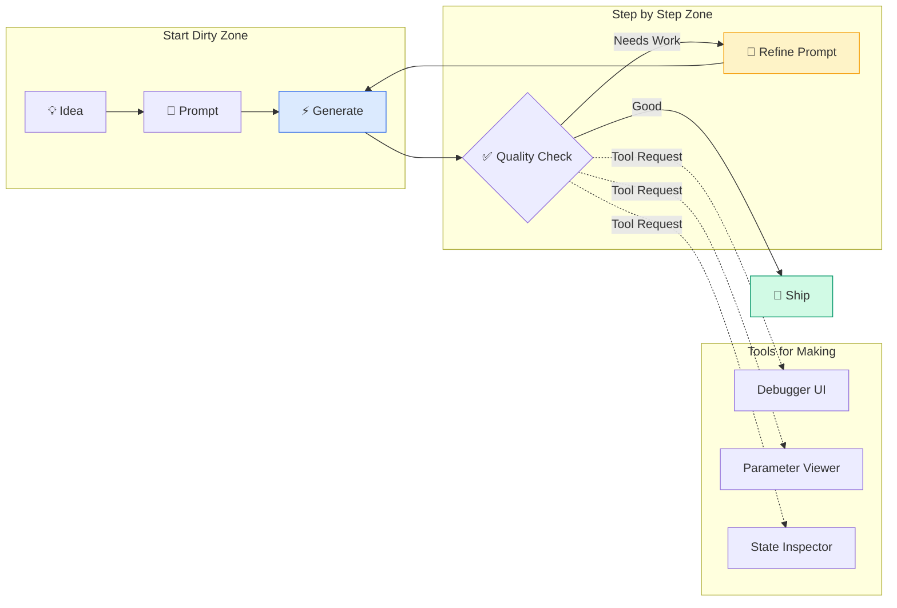

import DevQuickStart from '@site/src/components/DevQuickStart';

<DevQuickStart
  what="Figma Make enables creators to build 3D interactive experiences with 200+ prompt iterations, using AI as a collaborative partner"
  learn="Three creator principles: Start Dirty (rough prototypes first), Step by Step (incremental building), Tools for Making (meta-tools)"
  able="Build interactive prototypes using progressive prompt strategies, GLB imports via GitHub Pages, and debug UIs generated by AI"
/>

## 핵심 인사이트

### 1. Figma Make = 아이디어를 즉시 형태로 만드는 도구
- **기존 프로토타이핑의 한계**: 아이디어 → 프로토타입 제작에 2주~1개월 소요
- **Figma Make의 혁신**: 텍스트 프롬프트만으로 인터랙티브 앱 생성
- **핵심 메시지**: "아이디어의 씨앗 → 제품"까지의 거리를 극적으로 단축

### 2. AI와의 협업 = 상호 존중의 대화
- "후반에는 Figma Make에 **경어**로 말하게 됨" -- AI를 '동료'로 인식하는 순간 생산성 급상승
- "좋은 게 나오면 칭찬하며 진행" -- 점진적 피드백으로 품질 향상

### 3. 제약(Constraint)이 창의성을 높인다
- **자연어로만 제작**하는 제약을 스스로 설정 → AI가 만든 결과를 존중하며 협업
- 한계 발견 시 → **디버거 UI를 AI에게 만들게 해서** 수치로 소통

---

## 3가지 크리에이터 원칙

| 원칙 | 의미 | 적용 예시 |
|------|------|-----------|
| **Start Dirty** | 깔끔하게 시작하지 말고 빠르게 완성형 이미지 확인 | 첫 프롬프트로 거친 프로토타입 → 작업 의욕 상승 |
| **Step by Step** | 한 번에 모든 걸 전달하지 말고 점진적 축적 | 메타버스 기반 → 신발 → 카메라 → 낙엽 순차 구축 |
| **Tools for Making** | 더 나은 제작을 위한 도구를 AI에게 요청 | 디버거, 뷰어 같은 메타 도구로 정밀 제어 |

### Creator Workflow Diagram



---

## 프롬프트 전략

### 초기 단계: Start Dirty 실전

```typescript
// Bad prompt (너무 막연함)
const badPrompt = "3D 낙엽 앱 만들어줘";

// Good prompt (구체적 + 완성형 이미지)
const goodPrompt = `
Create a 3D interactive experience with the following:

## Scene Setup
- 3D space using Three.js
- Low-angle camera (ground-level perspective)
- Colorful autumn leaves as main objects

## Physics & Interaction
- Physics engine (cannon.js or similar) for realistic leaf movement
- Arrow keys control camera position
- Leaves fly upward when camera approaches

## Visual Style
- Vibrant colors: orange (#FF6B35), red (#D32F2F), yellow (#FBC02D), brown (#795548)
- Soft shadows for depth
- Ambient occlusion for realism

## Initial State
- 50-100 leaves scattered on ground
- Slight random rotation for each leaf
- Idle animation: gentle swaying
`;

// Why "Good" works:
// 1. Complete mental model (크리에이터가 완성형 이미지 확인 가능)
// 2. Technical specs (Three.js, cannon.js)
// 3. Visual references (색상 hex 코드)
// 4. Interaction details (arrow keys, upward motion)
```

### 개선 단계: Consultation Mode

```typescript
// Prompt Template 1: Consultation Mode (코드 변경 없이 조언만)
const consultationPrompt = `
⚠️ 이것은 구현 지시가 아닙니다.

현재 상황: 낙엽이 카메라에 반응하지만, 너무 격렬하게 날아갑니다.
원하는 결과: 부드럽게 떠오르는 느낌

질문: 이 효과를 어떻게 전달하면 좋을까요? 프롬프트 예시를 제안해주세요.
`;

// Expected response from Figma Make:
// "물리 엔진의 impulse 값을 조절하거나, easing function을 추가하는 방법이 있습니다.
//  다음과 같이 프롬프트를 작성해보세요:
//  'Reduce leaf upward force to 30% of current, add ease-out-cubic easing for gentle float'"

// Prompt Template 2: Surgical Edit (특정 부분만 수정)
const surgicalPrompt = `
⚠️ 이 부분은 변경하지 말고, 여기만 수정해주세요:

**변경 금지:**
- 카메라 시점
- 낙엽 색상
- 십자키 입력 처리

**변경 요청:**
- 낙엽의 upward force를 현재의 30%로 감소
- ease-out-cubic easing 추가
`;
```

### 핵심 규칙: 1기능 1프롬프트

```typescript
// Anti-pattern: Multiple requests in one prompt (기존 기능 파괴 위험)
const antiPattern = `
낙엽 물리 부드럽게 하고,
카메라 속도 빠르게 하고,
배경에 하늘 그라데이션 추가하고,
신발 3D 모델 불러와줘
`;

// Best practice: Incremental prompts
const incrementalPrompts = [
  // Step 1: Physics tuning
  "Reduce leaf upward impulse to 30%, add ease-out-cubic easing",

  // Step 2: Camera speed (after confirming Step 1 works)
  "Increase arrow key camera movement speed by 50%",

  // Step 3: Background (after confirming Step 2 works)
  "Add sky gradient background: top #87CEEB, bottom #F0F8FF",

  // Step 4: External asset (after confirming Step 3 works)
  "Import shoe.glb from https://example.com/models/shoe.glb, place at origin",
];

// Why incremental works:
// 1. 각 단계에서 QC 가능
// 2. 문제 발생 시 롤백 지점 명확
// 3. AI가 맥락을 점진적으로 축적
```

### Prompt Validation Checklist

```typescript
interface PromptQuality {
  hasCompleteMentalModel: boolean;  // 완성형 이미지 포함?
  hasTechnicalSpecs: boolean;       // 라이브러리/프레임워크 명시?
  hasVisualReferences: boolean;     // 색상, 크기, 레이아웃 구체적?
  isSinglePurpose: boolean;         // 1기능만 요청?
  hasConstraints: boolean;          // 변경 금지 부분 명시?
}

function validatePrompt(prompt: string): PromptQuality {
  return {
    hasCompleteMentalModel: /scene|setup|initial state/i.test(prompt),
    hasTechnicalSpecs: /three\.?js|cannon|react|typescript/i.test(prompt),
    hasVisualReferences: /#[0-9A-F]{6}|px|rem|rgba/i.test(prompt),
    isSinglePurpose: prompt.split('\n').filter(l => l.includes('추가') || l.includes('변경')).length <= 3,
    hasConstraints: /변경하지 말고|keep|don't change/i.test(prompt),
  };
}

// Example usage
const myPrompt = goodPrompt;
const quality = validatePrompt(myPrompt);
console.log(quality);
// { hasCompleteMentalModel: true, hasTechnicalSpecs: true, ... }
```

### Progressive Prompt Strategy (200+ Iterations Example)

```typescript
// Real creator workflow for 3D metaverse project
const progressiveStrategy = {
  // Iteration 1-10: Foundation
  phase1: [
    "Create 3D space with Three.js, basic ground plane",
    "Add camera controls (WASD movement, mouse look)",
    "Import shoe.glb model from [URL]",
    "Add basic lighting (ambient + directional)",
  ],

  // Iteration 11-50: Core mechanic
  phase2: [
    "Add physics to shoe (cannon.js)",
    "Spawn 100 colorful leaves on ground",
    "Leaves react to camera proximity (upward impulse)",
    "Add easing to leaf movement",
  ],

  // Iteration 51-100: Polish
  phase3: [
    "Reduce impulse force to 30%",
    "Add rotation to leaves during flight",
    "Implement fade-out for leaves above 10m height",
    "Optimize: frustum culling for off-screen leaves",
  ],

  // Iteration 101-150: Meta-tools
  phase4: [
    "Create debug UI: show camera position, FPS, active leaves count",
    "Add parameter panel: impulse force slider (0-100)",
    "Add state inspector: show leaf positions in real-time",
    "Export current scene state as JSON",
  ],

  // Iteration 151-200: Refinement with tools
  phase5: [
    "Use debug UI: increase impulse to 45 via slider",
    "Use state inspector: identify leaves stuck at origin → fix spawn logic",
    "Use parameter panel: test different easing curves",
    "Final polish: camera speed, leaf count, colors",
  ],
};

// Key insight: Meta-tools (Phase 4) enable precise control in Phase 5
```

---

## 외부 파일 가져오기 (GLB 예시)

| 방법 | 장단점 | CORS 지원 | 설정 난이도 |
|------|--------|----------|------------|
| **GitHub Pages 호스팅** | 고정 파일을 안정적으로 참조, 풀 패스 접근 가능 | ✅ 완벽 | 낮음 (5분) |
| **Figma Make 내 Importer 생성** | UI 내에서 드래그 드롭 가능 | ✅ 자동 | 중간 (프롬프트 작성) |
| Google Drive | 공개 링크 간편 | ❌ CORS 실패 | - (사용 불가) |
| Dropbox | 공개 링크 간편 | ❌ CORS 실패 | - (사용 불가) |
| **Cloudflare R2** | 무료 10GB, CDN 성능 | ✅ 설정 가능 | 중간 (10분) |

### Option 1: GitHub Pages 호스팅 (권장)

```typescript
// scripts/glb-hosting-setup.ts
// GitHub Pages를 통한 GLB 파일 호스팅 설정
// npm install three @types/three

interface AssetConfig {
  name: string;
  path: string;
  size: number; // bytes
  format: 'glb' | 'gltf' | 'fbx' | 'obj';
}

const GLB_CONFIG = {
  repo: 'your-org/figma-make-assets',
  branch: 'gh-pages',
  basePath: 'https://your-org.github.io/figma-make-assets',
  assets: {
    shoe: {
      name: 'Nike Air Max',
      path: '/models/shoe.glb',
      size: 2_400_000, // 2.4MB
      format: 'glb',
    },
    leaf: {
      name: 'Autumn Leaf',
      path: '/models/leaf.glb',
      size: 85_000, // 85KB
      format: 'glb',
    },
  } as Record<string, AssetConfig>,
};

// Generate full URLs
function getAssetURL(assetKey: keyof typeof GLB_CONFIG.assets): string {
  const asset = GLB_CONFIG.assets[assetKey];
  return `${GLB_CONFIG.basePath}${asset.path}`;
}

// Example usage in Figma Make prompt
const shoeURL = getAssetURL('shoe');
const prompt = `
Load 3D model from this URL: ${shoeURL}
Place at origin (0, 0, 0), scale to 1.5x
`;

console.log(prompt);
// Output: "Load 3D model from this URL: https://your-org.github.io/figma-make-assets/models/shoe.glb
//          Place at origin (0, 0, 0), scale to 1.5x"
```

#### GitHub Pages 설정 단계

```bash
# 1. Create new repo for assets
gh repo create figma-make-assets --public

# 2. Clone and setup
git clone https://github.com/your-org/figma-make-assets.git
cd figma-make-assets

# 3. Create directory structure
mkdir -p models textures audio
git checkout -b gh-pages

# 4. Add your GLB files
cp ~/Downloads/shoe.glb models/
cp ~/Downloads/leaf.glb models/

# 5. Create index.html (optional, for browsing)
cat > index.html <<'EOF'
<!DOCTYPE html>
<html>
<head><title>Figma Make Assets</title></head>
<body>
  <h1>3D Models</h1>
  <ul>
    <li><a href="models/shoe.glb">shoe.glb</a> (2.4MB)</li>
    <li><a href="models/leaf.glb">leaf.glb</a> (85KB)</li>
  </ul>
</body>
</html>
EOF

# 6. Commit and push
git add .
git commit -m "Add 3D models for Figma Make"
git push origin gh-pages

# 7. Enable GitHub Pages (if not auto-enabled)
gh api repos/your-org/figma-make-assets/pages -X POST -f source[branch]=gh-pages

# 8. Test CORS (should return 200 OK)
curl -I https://your-org.github.io/figma-make-assets/models/shoe.glb
```

### Option 2: Figma Make 내 File Importer 생성

```typescript
// Figma Make 프롬프트: AI가 파일 업로더 UI를 생성
const importerPrompt = `
Create a file importer component with the following features:

## UI Layout
- Drag-and-drop zone (300x200px)
- File type filter: .glb, .gltf only
- Preview thumbnail after upload
- "Load into Scene" button

## Functionality
- Parse GLB file using three/examples/jsm/loaders/GLTFLoader
- Display model name and triangle count
- On "Load into Scene": place at origin, scale to fit 5x5x5 bounding box
- Store uploaded file in IndexedDB for persistence

## Visual Style
- Dashed border (#CCCCCC) for drop zone
- Hover state: border color #2563EB
- Success state: green checkmark + preview
- Error state: red X + error message
`;

// Generated component pseudo-code
interface ImporterState {
  file: File | null;
  modelName: string;
  triangleCount: number;
  preview: string; // base64 thumbnail
  status: 'idle' | 'loading' | 'success' | 'error';
  error?: string;
}

function FileImporter() {
  const [state, setState] = useState<ImporterState>({
    file: null,
    modelName: '',
    triangleCount: 0,
    preview: '',
    status: 'idle',
  });

  const handleDrop = async (file: File) => {
    if (!file.name.match(/\.(glb|gltf)$/i)) {
      setState({ ...state, status: 'error', error: 'Invalid file type' });
      return;
    }

    setState({ ...state, status: 'loading' });

    try {
      const loader = new GLTFLoader();
      const gltf = await loader.loadAsync(URL.createObjectURL(file));
      const triangles = countTriangles(gltf.scene);

      setState({
        file,
        modelName: file.name,
        triangleCount: triangles,
        preview: generateThumbnail(gltf.scene),
        status: 'success',
      });

      // Store in IndexedDB for persistence
      await saveToIndexedDB('uploaded-models', file);
    } catch (error) {
      setState({ ...state, status: 'error', error: error.message });
    }
  };

  // ... render drop zone UI
}
```

### Option 3: Cloudflare R2 (프로덕션용)

```typescript
// scripts/r2-upload.ts
// Cloudflare R2 bucket setup for production assets
// npm install @aws-sdk/client-s3

import { S3Client, PutObjectCommand } from '@aws-sdk/client-s3';
import { readFile } from 'fs/promises';

const r2Client = new S3Client({
  region: 'auto',
  endpoint: 'https://YOUR_ACCOUNT_ID.r2.cloudflarestorage.com',
  credentials: {
    accessKeyId: process.env.R2_ACCESS_KEY_ID!,
    secretAccessKey: process.env.R2_SECRET_ACCESS_KEY!,
  },
});

async function uploadToR2(filePath: string, key: string): Promise<string> {
  const fileBuffer = await readFile(filePath);

  await r2Client.send(
    new PutObjectCommand({
      Bucket: 'figma-make-assets',
      Key: key,
      Body: fileBuffer,
      ContentType: 'model/gltf-binary',
      // IMPORTANT: Set CORS headers
      CacheControl: 'public, max-age=31536000', // 1 year
    })
  );

  // R2 custom domain (configured in Cloudflare dashboard)
  return `https://assets.yourcompany.com/${key}`;
}

// Upload all models
const models = [
  { local: './models/shoe.glb', key: 'models/shoe.glb' },
  { local: './models/leaf.glb', key: 'models/leaf.glb' },
];

for (const model of models) {
  const url = await uploadToR2(model.local, model.key);
  console.log(`Uploaded: ${url}`);
}
```

### Asset Validation Workflow

```typescript
// scripts/validate-assets.ts
// npm install three @types/three
import { GLTFLoader } from 'three/examples/jsm/loaders/GLTFLoader';

interface AssetValidation {
  url: string;
  corsEnabled: boolean;
  fileSize: number;
  loadTime: number; // ms
  triangleCount: number;
  textureCount: number;
  status: 'pass' | 'warn' | 'fail';
  issues: string[];
}

async function validateAsset(url: string): Promise<AssetValidation> {
  const issues: string[] = [];
  const startTime = Date.now();

  // 1. Check CORS
  const corsResponse = await fetch(url, { method: 'HEAD' });
  const corsEnabled = corsResponse.headers.get('access-control-allow-origin') !== null;
  if (!corsEnabled) issues.push('CORS not enabled');

  // 2. Check file size
  const fileSize = parseInt(corsResponse.headers.get('content-length') || '0');
  if (fileSize > 5_000_000) issues.push('File size > 5MB (slow loading)');

  // 3. Load and analyze model
  const loader = new GLTFLoader();
  const gltf = await loader.loadAsync(url);
  const loadTime = Date.now() - startTime;

  // 유틸리티 함수 — 프로젝트에 맞게 구현 필요
  const triangleCount = countTriangles(gltf.scene);
  if (triangleCount > 100_000) issues.push('Triangle count > 100k (performance hit)');

  const textureCount = gltf.textures?.length || 0;

  const status = issues.length === 0 ? 'pass' : issues.some(i => i.includes('CORS')) ? 'fail' : 'warn';

  return { url, corsEnabled, fileSize, loadTime, triangleCount, textureCount, status, issues };
}

// Run validation
const results = await Promise.all([
  validateAsset('https://your-org.github.io/figma-make-assets/models/shoe.glb'),
  validateAsset('https://your-org.github.io/figma-make-assets/models/leaf.glb'),
]);

console.table(results);
// ┌─────────┬────────────────────────────┬─────────────┬──────────┬──────────┬───────────────┬──────────────┬────────┬──────────────────┐
// │ (index) │ url                        │ corsEnabled │ fileSize │ loadTime │ triangleCount │ textureCount │ status │ issues           │
// ├─────────┼────────────────────────────┼─────────────┼──────────┼──────────┼───────────────┼──────────────┼────────┼──────────────────┤
// │ 0       │ .../models/shoe.glb        │ true        │ 2400000  │ 450      │ 45000         │ 3            │ 'pass' │ []               │
// │ 1       │ .../models/leaf.glb        │ true        │ 85000    │ 120      │ 800           │ 1            │ 'pass' │ []               │
// └─────────┴────────────────────────────┴─────────────┴──────────┴──────────┴───────────────┴──────────────┴────────┴──────────────────┘
```

---

## Tools for Making: Meta-Tool 생성 전략

"더 나은 제작을 위한 도구를 AI에게 요청"하는 구체적 예시:

### Debugger UI 생성

```typescript
// Figma Make 프롬프트: 디버거 UI 생성 요청
const debuggerPrompt = `
Create a floating debug panel with the following features:

## Layout
- Semi-transparent background (rgba(0,0,0,0.8))
- Top-right corner, 300x400px
- Toggle button (D key) to show/hide
- Draggable by header

## Data Display
- Camera Position: X, Y, Z (2 decimal places)
- FPS Counter: real-time updates
- Active Leaves: current count / max count
- Physics Stats: collision count, active bodies

## Controls
- "Reset Scene" button
- "Export State" button (downloads JSON)
- "Load State" file input

## Visual Style
- Monospace font (Courier New, 12px)
- Green text (#00FF00) on dark background
- Section dividers with dashed lines
`;

// Generated Debugger component
interface DebugState {
  cameraPos: { x: number; y: number; z: number };
  fps: number;
  activeLeaves: number;
  maxLeaves: number;
  collisionCount: number;
  activeBodies: number;
}

function DebugPanel({ scene, camera, physicsWorld }: DebugPanelProps) {
  const [state, setState] = useState<DebugState>({
    cameraPos: { x: 0, y: 0, z: 0 },
    fps: 60,
    activeLeaves: 0,
    maxLeaves: 100,
    collisionCount: 0,
    activeBodies: 0,
  });

  useEffect(() => {
    const interval = setInterval(() => {
      setState({
        cameraPos: {
          x: parseFloat(camera.position.x.toFixed(2)),
          y: parseFloat(camera.position.y.toFixed(2)),
          z: parseFloat(camera.position.z.toFixed(2)),
        },
        fps: Math.round(1000 / deltaTime),
        activeLeaves: scene.children.filter(c => c.userData.isLeaf && c.visible).length,
        maxLeaves: 100,
        collisionCount: physicsWorld.contacts.length,
        activeBodies: physicsWorld.bodies.filter(b => !b.sleepState).length,
      });
    }, 100); // Update every 100ms

    return () => clearInterval(interval);
  }, [scene, camera, physicsWorld]);

  const exportState = () => {
    const stateJSON = JSON.stringify({
      camera: state.cameraPos,
      leaves: scene.children.filter(c => c.userData.isLeaf).map(leaf => ({
        position: leaf.position.toArray(),
        rotation: leaf.rotation.toArray(),
      })),
      timestamp: Date.now(),
    }, null, 2);

    const blob = new Blob([stateJSON], { type: 'application/json' });
    const url = URL.createObjectURL(blob);
    const a = document.createElement('a');
    a.href = url;
    a.download = `scene-state-${Date.now()}.json`;
    a.click();
  };

  // ... render UI
}
```

### Parameter Viewer & Live Tuning

```typescript
// Figma Make 프롬프트: 파라미터 조정 패널
const parameterPanelPrompt = `
Create a parameter tuning panel for real-time adjustments:

## Parameters to Control
- Leaf Impulse Force: slider 0-100, current 30
- Camera Speed: slider 0.1-5.0, current 1.5
- Gravity: slider -20 to 0, current -9.8
- Leaf Count: slider 0-200, current 100
- Rotation Speed: slider 0-10, current 2.5

## UI Features
- Each parameter has: label, current value, slider, reset button
- "Save Preset" button → export current values as JSON
- "Load Preset" file input
- "Apply" button to commit changes (prevent lag during dragging)

## Visual Style
- Same style as debug panel
- Sliders: #2563EB track, #60A5FA thumb
- Reset icons: ↺ character in monospace
`;

// Generated Parameter Panel
interface ParameterValues {
  leafImpulseForce: number;
  cameraSpeed: number;
  gravity: number;
  leafCount: number;
  rotationSpeed: number;
}

const DEFAULT_PARAMS: ParameterValues = {
  leafImpulseForce: 30,
  cameraSpeed: 1.5,
  gravity: -9.8,
  leafCount: 100,
  rotationSpeed: 2.5,
};

function ParameterPanel({ onApply }: { onApply: (params: ParameterValues) => void }) {
  const [params, setParams] = useState<ParameterValues>(DEFAULT_PARAMS);
  const [pendingChanges, setPendingChanges] = useState(false);

  const handleSliderChange = (key: keyof ParameterValues, value: number) => {
    setParams({ ...params, [key]: value });
    setPendingChanges(true);
  };

  const handleApply = () => {
    onApply(params);
    setPendingChanges(false);
  };

  const savePreset = () => {
    const presetJSON = JSON.stringify(params, null, 2);
    // ... download as JSON
  };

  const loadPreset = async (file: File) => {
    const text = await file.text();
    const loadedParams = JSON.parse(text) as ParameterValues;
    setParams(loadedParams);
    setPendingChanges(true);
  };

  // ... render sliders and buttons
}
```

### State Inspector (Advanced)

```typescript
// Figma Make 프롬프트: 상태 인스펙터
const stateInspectorPrompt = `
Create a real-time state inspector showing live scene data:

## Features
- Tree view of scene hierarchy
- Click object → highlight in scene + show properties
- Properties: position, rotation, scale, material, geometry stats
- Filter: show only leaves, show only physics bodies
- Search: filter by name

## Performance
- Update only visible properties (virtualized list)
- Throttle updates to 5 FPS (state changes faster than human perception)

## Visual Style
- VSCode-like tree view
- Expandable/collapsible nodes
- Highlight selected object with #2563EB background
`;

// This enables precise debugging without flooding Figma Make with "show me leaf #47 position" prompts
```

### When to Request Meta-Tools

| Scenario | Traditional Approach | Meta-Tool Approach | Time Saved |
|----------|---------------------|-------------------|------------|
| 낙엽 물리 미세 조정 | 10+ 프롬프트로 반복 테스트 | Parameter Panel 슬라이더 | 80% |
| 특정 오브젝트 디버깅 | "Show leaf #23 position" 프롬프트 | State Inspector 클릭 | 95% |
| 씬 상태 공유 | 스크린샷 + 설명 | Export State JSON | 90% |
| 성능 이슈 파악 | "왜 느려요?" 반복 질문 | Debugger FPS/Collision 확인 | 100% |

---

## 체크리스트

### 프로젝트 시작 전
- [ ] **Dirty Prototype 먼저**: 완벽한 첫 프롬프트보다 빠른 결과물로 동기 부여
- [ ] **AI 가능성 탐색**: 바이어스 없이 "이거 되나?" 시도
- [ ] **제약 설정**: "자연어로만", "이 부분은 변경 금지" 같은 룰 명시
- [ ] **외부 에셋 준비**: GitHub Pages 또는 R2에 GLB 파일 업로드
- [ ] **브랜드 가이드라인 정리**: 색상 hex 코드, 폰트, 레이아웃 규칙 문서화

### 제작 중
- [ ] **1기능 1프롬프트**: 한 번에 여러 요청 → 기존 기능 파괴 위험
- [ ] **상담 모드 활용**: "이건 구현이 아니에요. 어떻게 하면 좋을까요?"
- [ ] **Tools for Making**: 디버거, 뷰어 같은 메타 도구 요청
- [ ] **Prompt Validation**: 완성형 이미지, 기술 스펙, 시각적 참조 포함 확인
- [ ] **Progressive Strategy**: 10-20개 iteration 단위로 phase 구분

### 미세 조정 단계 (50+ iterations)
- [ ] **Meta-Tool 생성**: Debugger, Parameter Panel, State Inspector
- [ ] **도구로 데이터 수집**: FPS, collision count, object positions
- [ ] **수치 기반 조정**: 슬라이더로 파라미터 실험 → 최적값 발견
- [ ] **프리셋 저장**: 최종 파라미터를 JSON으로 백업

### 한계 지점
- [ ] **자연어 한계 인지**: 수치, 파라미터 미세 조정은 전문가 협업 고려
- [ ] **Figma Design 활용**: 구체적 비주얼은 디자인 파일로 전달
- [ ] **코드 개입 시점**: React 컴포넌트 작성 → Figma Make로 재반입 가능
- [ ] **성능 병목**: Triangle count > 100k → 외부 최적화 도구 (Blender, Meshlab)
- [ ] **복잡한 로직**: 상태 머신, 복잡한 알고리즘 → 직접 코딩 후 통합

---
> 출처: Made with Figma Make - 크리에이터가 말하는 제작 프로세스 세션

---

## Related Articles

import CrossRef from '@site/src/components/CrossRef';

<CrossRef
  related={[
    { path: "/docs/category/03-component-design", label: "Component Design" },
    { path: "/docs/category/12-web-design-craft", label: "Web Design & CSS" },
    { path: "/docs/category/02-visual-foundations", label: "Visual Foundations" },
  ]}
/>
