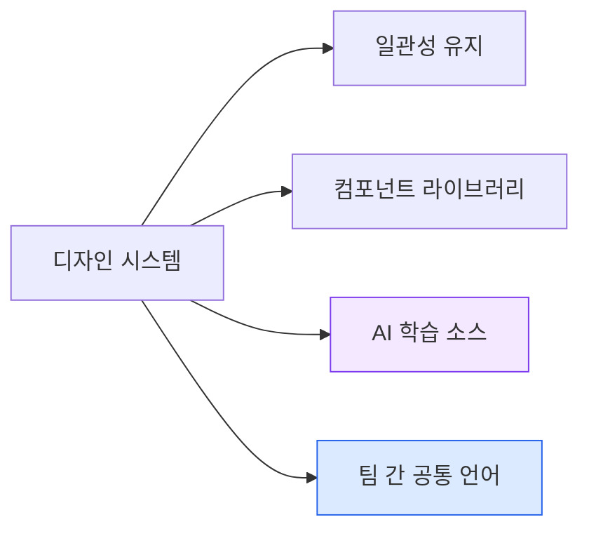
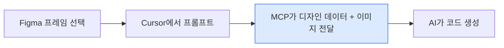
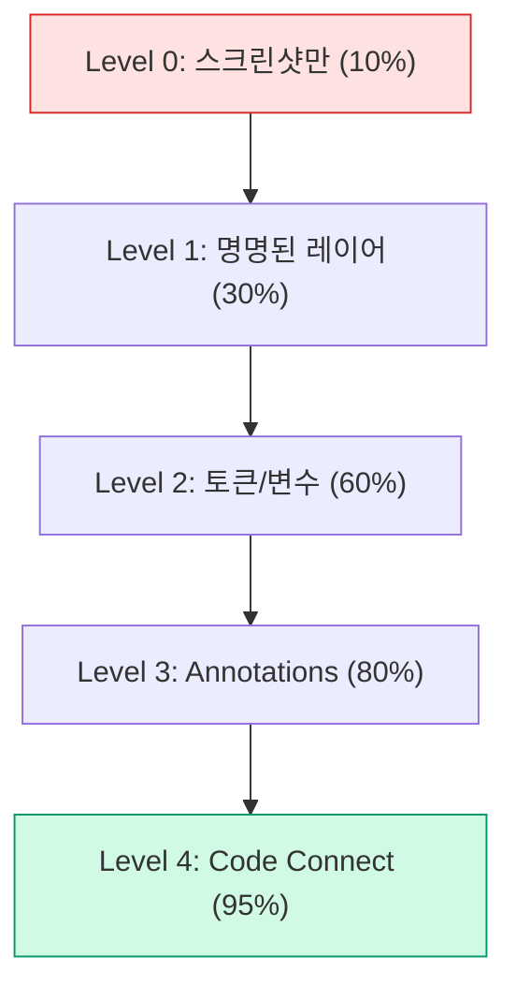

import DevQuickStart from '@site/src/components/DevQuickStart';

<DevQuickStart
  what="Figma Make generates interactive prototypes from text prompts, while Figma MCP lets AI coding tools like Cursor directly reference Figma designs for code generation"
  learn="The 3C prompting framework (Clarity, Context, Constraints), AI context pyramid for design-to-code fidelity, and MCP server configuration"
  able="Set up Figma MCP with Cursor, write optimized prompts for Figma Make, and export custom design systems for AI-assisted prototyping"
/>

## 핵심 철학: Vibe Coding

### 패러다임 전환

| 전통적 접근 | Vibe Coding |
|------------|-------------|
| 픽셀 퍼펙트 구현 | 제품의 "느낌(Feel)"에 집중 |
| 핸드오프 마찰 | AI가 반복 작업 처리 |
| 역할 분리 | PM, QA, 엔지니어 모두 디자인 참여 |

### AI 시대의 디자인 시스템 역할



좋은 파일 구조와 네이밍이 AI에게 더 나은 컨텍스트를 제공하며, 디자인 시스템이 견고할수록 AI 결과물 품질이 향상된다.

---

## Figma Make 핵심 기능

### 기술 스택
- **기본 라이브러리**: Radix UI (shadcn/ui 기반)
- **프레임워크**: React + Tailwind CSS
- **특징**: 모든 인터랙션이 실제 작동 (폼 검증, 상태 관리)

### 디자인 시스템 Export

```typescript title="concepts/figma-make-export.ts"
// Figma Make에서 지원하는 디자인 시스템 연동 구조
interface FigmaMakeExport {
  foundations: {
    colors: Record<string, string>;      // Color tokens
    typography: TypographyScale;          // Type scale
    spacing: number[];                    // Spacing system
    variables: Record<string, string>;    // Figma variables
  };
  components: string[];   // Button, Input, Card 등
  // 제한사항: 라이브러리 업데이트 시 수동 재export 필요
}

// 지원 디자인 시스템
const SUPPORTED_SYSTEMS = [
  'Material Design 3',   // Google
  'Carbon Design System', // IBM
  'shadcn/ui',           // Radix 기반 (기본값)
] as const;
```

### 실시간 데이터 연동
- 카메라/음성 인터페이스
- 외부 API (Spotify, 교통 정보 등)
- 실제 데이터베이스

---

## Figma MCP (Model Context Protocol)

### MCP 서버 설정

```json title=".cursor/mcp.json"
{
  "mcpServers": {
    "figma": {
      "command": "npx",
      "args": ["-y", "@anthropic-ai/mcp-server-figma"],
      "env": {
        "FIGMA_ACCESS_TOKEN": "${FIGMA_ACCESS_TOKEN}"
      }
    }
  }
}
```

### Figma Dev Mode 활성화

```
Figma 로고 → Preferences → Enable Dev Mode MCP Server
```

### 작동 흐름



### MCP 사용 규칙

| 규칙 | 설명 |
|------|------|
| 선택 유지 | Figma에서 프레임 선택 후 AI 작업 완료까지 유지 |
| 단일 프레임 | 한 번에 하나의 프레임만 참조 |
| 레이어 네이밍 | 명확한 이름이 코드 품질 결정 |

---

## 프롬프트 3C 원칙

### Clarity (명확성)

```
// Bad
"회원가입 화면 만들어줘"

// Good
"이메일, 비밀번호, Google 로그인이 포함된 회원가입 폼을 만들어줘"
```

### Context (맥락)

```
브랜드: Nike 스타일
사용자: 20-30대 여성
기능: 운동 기록, 프로필 관리, 소셜 공유
```

### Constraints (제약조건)

```
플랫폼: iOS
디자인 시스템: Material Design 3
접근성: WCAG 2.1 AA 준수
기술 스택: React + shadcn/ui
```

### 프롬프트 품질과 결과

| 프롬프트 품질 | 결과 품질 | 재작업 필요 |
|-------------|----------|-----------|
| 모호한 프롬프트 | 범용 UI, 브랜드 없음 | 50-70% |
| 기본 프롬프트 | 기능 구현, 브랜드 미흡 | 30-40% |
| 3C 최적화 | 브랜드 반영, 바로 사용 가능 | 10-20% |

### 점진적 프롬프트 전략

1기능 1프롬프트 원칙: 한 번에 여러 요청하면 기존 기능 파괴 위험.

```
1단계: "피트니스 앱 메인 화면 만들어줘"
2단계: "운동 시작 버튼 추가, 클릭 시 운동 화면으로 이동"
3단계: "사용자 프로필 페이지 추가"
4단계: "세 화면을 네비게이션으로 연결"
```

---

## AI 컨텍스트 계층 (Context Pyramid)



| Level | AI 이해도 | 추가되는 정보 |
|-------|----------|-------------|
| 0 | 10% | 시각적 레이아웃만 |
| 1 | 30% | 요소 역할 ("header", "cta-button") |
| 2 | 60% | 스타일 시스템 (색상, 폰트, 스페이싱) |
| 3 | 80% | 디자인 의도 ("primary action") |
| 4 | 95% | 실제 코드베이스 연결 |

---

## 파일 구조 최적화

### 레이어 네이밍

```typescript title="concepts/layer-naming.ts"
// Figma Make/MCP가 선호하는 네이밍 패턴
const NAMING_GUIDE = {
  good: {
    header: 'header-navigation',
    search: 'search-input',
    cards: 'product-card-list',
    cta: 'signup-button',
  },
  bad: {
    header: 'Frame 1',
    search: 'Group 23',
    cards: 'div',
    cta: 'Rectangle',
  },
} as const;

// AI 프롬프트 예시
// "make this page interactive. When tapping music-card-1,
//  change the images to most listened songs on Spotify"
// → AI가 정확히 어떤 요소를 조작해야 하는지 인식
```

### 필수 구조 규칙

- 명명된 레이어 (Named Layers) 사용
- Auto Layout 적용
- 그룹 최소화
- 의미 있는 이름 (예: "music-card-1", "add-music-button")
- 중첩된 그룹 제거

---

## Cursor Rules 설정

```markdown title=".cursorrules"
## Design System
- Always use @/components from our design system
- Never use Tailwind gradient utilities
- Use design tokens from @/tokens

## Accessibility
- Minimum touch target: 44x44px
- Include ARIA labels
- Maintain WCAG AA contrast

## Figma Integration
- Preserve layer names as data-testid
- Match spacing exactly from Figma
```

---

## Guidelines (Figma Make)

```typescript title="concepts/figma-make-guidelines.ts"
// Figma Make Coding Panel에서 설정 가능한 Guidelines
const GUIDELINES = {
  colors: [
    'Use design tokens from @/tokens/colors',
    'Never use hardcoded hex values',
    'Avoid Tailwind gradient utilities',
  ],
  accessibility: [
    'Minimum touch target: 44x44px',
    'Maintain WCAG AA contrast (4.5:1)',
    'Include ARIA labels for interactive elements',
  ],
  components: [
    'Use @/components/Button instead of Radix Button',
    'Use @/components/Input instead of Radix Input',
  ],
} as const;
```

---

## 현재 한계

### Figma Make
- 라이브러리 업데이트 시 수동 재export 필요
- 한 번에 하나의 디자인 시스템만 연결 가능
- Make에서 생성한 디자인을 Figma로 가져오기 불가

### MCP
- 신규 프로젝트: 50-70% 완성도 (바로 사용 가능)
- 레거시 프로젝트: 20-30% 참고용 (수동 통합 필요)

---

## 체크리스트

### Figma Make 사용 전
- [ ] 파일 구조 정리 (레이어 명명, Auto Layout)
- [ ] 디자인 시스템 Export (해당 시)
- [ ] 프롬프트 3C 준비 (Clarity, Context, Constraints)
- [ ] 단계적 접근 계획

### MCP + Cursor 사용 전
- [ ] Figma MCP 활성화 (Preferences)
- [ ] `.cursorrules` 파일 설정
- [ ] 작업할 프레임 선택 (선택 유지)

### 결과 검토 시
- [ ] 디자인 시스템 스타일 준수 확인
- [ ] 모든 인터랙션 작동 테스트
- [ ] 접근성 기준 충족 확인

---

## 핵심 인사이트

1. **프롬프트는 스킬**: 3C 연습 필수
2. **파일 구조가 AI 품질 결정**: 명명된 레이어, Auto Layout
3. **단계적 접근**: 1기능 1프롬프트
4. **디자인 시스템을 AI 소스로**: Foundation + Components Export
5. **MCP로 실제 코드 생성**: Cursor 연동 시 개발 속도 2-3배
6. **현실적 기대치**: AI는 "첫 50%"를 해결하는 도구

---
> 출처: Into Design Systems Meetup - Vibe Code with Figma Make and Figma MCP

---

## Related Articles

import CrossRef from '@site/src/components/CrossRef';

<CrossRef
  related={[
    { path: "/docs/category/01-design-tokens", label: "Design Tokens" },
    { path: "/docs/category/03-component-design", label: "Component Design" },
    { path: "/docs/category/04-component-documentation", label: "Component Documentation" },
  ]}
/>
